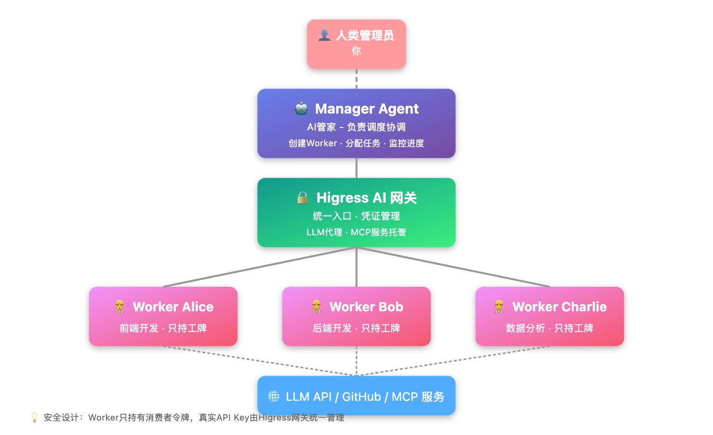

# 终于有人把AI团队协作说明白了：5分钟搭建你的AI管家团队

> 📖 **本文解读内容来源**
>
> - **原始来源**：[HiClaw - GitHub](https://github.com/higress-group/hiclaw)
> - **来源类型**：GitHub 开源项目
> - **作者/团队**：Higress Group（阿里云开源团队）
> - **发布时间**：2026年3月4日
> - **Star 数量**：新项目（刚开源）
> - **主要语言**：Python / Shell / Docker

---

你有没有遇到过这种情况——让AI写个功能，它吭哧吭哧干了半小时，结果方向完全跑偏？或者同时开了三四个AI对话窗口，每个都在处理不同任务，你自己成了那个最忙的"人肉调度器"？

说实话，笔者最近就深陷这种困境。直到发现了 HiClaw，才恍然大悟：**原来AI协作的正确打开方式，是像管理一支团队那样管理它们**。

---

## 这是个啥？一句话说清楚

**HiClaw = 一个AI管家（Manager）+ 一群AI员工（Worker）+ 一个群聊房间（Matrix）**

所谓**多Agent协作（Multi-Agent Collaboration）**，其实就像你当老板——有个Manager帮你招人、派活、盯进度，Worker们各司其职干活，所有沟通都在一个群里，你随时能插话、纠偏、拍板。

```
你 → Manager → Worker Alice（前端开发）
            → Worker Bob（后端开发）
            → Worker Charlie（数据分析）
```

所有对话都在 Matrix 群聊里进行。你看得到一切，随时可以介入——就像在微信群里和团队协作。

---

## 为什么现有方案不够好？

市面上不是没有多Agent方案，但用起来总差点意思：

| 痛点 | 现有方案 | HiClaw 的做法 |
|------|---------|--------------|
| **部署麻烦** | 要配环境、改配置、重启服务 | 一条 `curl \| bash` 命令，5分钟搞定 |
| **安全隐患** | 每个Agent都拿着真实的API Key | Worker只有"工牌"（消费者令牌），真实凭证锁在网关里 |
| **黑盒操作** | Agent之间怎么沟通的，你看不到 | 所有对话都在群聊里，全程透明 |
| **移动端** | 只能在电脑前操作 | 手机装个 Matrix 客户端，随时随地指挥 |

---

## 核心架构：三层安全设计

下面这张图展示了 HiClaw 的整体架构：



整个系统分为三层：

1. **Manager（AI管家）**：基于 OpenClaw 构建，负责 Worker 的全生命周期管理
2. **Higress AI 网关**：统一入口，持有真实的 API Key 和 GitHub PAT，Worker 只能通过网关访问外部服务
3. **Worker（AI员工）**：无状态容器，只持有"工牌"（消费者令牌），即使被攻击也拿不到真实凭证

---

## 5分钟上手：从安装到跑起来

话不多说，直接上代码。

### 第一步：一键安装

```bash
bash <(curl -sSL https://higress.ai/hiclaw/install.sh)
```

脚本会询问你的 LLM API Key，然后自动完成所有配置。安装完成后你会看到：

```
=== HiClaw Manager Started! ===
  打开：http://127.0.0.1:18088
  登录：admin / [自动生成的密码]
  告诉 Manager："帮我创建一个名为 alice 的前端 Worker"
```

### 第二步：创建你的第一个 Worker

在 Element Web 里告诉 Manager：

```
你：帮我创建一个名为 alice 的前端 Worker

Manager：好的，Worker alice 已创建。
         房间：Worker: Alice
         可以直接在房间里给 alice 分配任务了。
```

### 第三步：分配任务

```
你：@alice 帮我用 React 实现一个登录页面

Alice：收到，正在处理……[几分钟后]
       完成了！PR 已提交：https://github.com/xxx/pull/1
```

是不是很简单？

---

## 核心亮点：三个笔者认为最有价值的设计

### 1. 安全模型：Worker 永远不碰真实凭证

这是笔者最欣赏的设计。传统的多Agent方案，每个Agent都要配置API Key，一旦某个Agent被攻击，所有凭证都可能泄露。

HiClaw 的做法是：**Worker 只持有消费者令牌（类似工牌），真实的 API Key 锁在 Higress 网关里**。

```
Worker（工牌）
    → Higress 网关（持有真实凭证）
        → LLM API / GitHub API / MCP 服务
```

即使 Worker 被攻破，攻击者也拿不到任何真实凭证。这种"零信任"的安全模型，在企业级场景下尤为重要。

### 2. 全程可见：没有黑盒，没有暗箱操作

所有通信都发生在 Matrix 群聊房间里。你看得到 Manager 怎么给 Worker 派活，也看得到 Worker 怎么回复进度。

```
Room: "Worker: Alice"
├── 成员：@admin（你）、@manager、@alice
├── Manager 分配任务 → 所有人可见
├── Alice 汇报进度 → 所有人可见
├── 你可以随时介入 → 所有人可见
└── 没有隐藏的 Manager-Worker 私聊
```

这种设计暗合了一个朴素道理：**信任源于透明**。当AI的决策过程完全可见时，你才敢真正放手让它干活。

### 3. 移动端原生支持：随时随地指挥你的AI团队

HiClaw 内置了 Matrix 服务器，不需要申请飞书/钉钉机器人，不需要等待审批。浏览器打开就能用，手机装个 Element 或 FluffyChat 客户端，随时随地都能管理你的 Agent 团队。

这对需要随时响应的场景特别有用——比如你在地铁上收到通知，说某个 Worker 卡住了，你可以立刻打开手机介入处理。

---

## 横向对比：HiClaw vs 其他方案

| 特性 | OpenClaw 原生 | AutoGen | HiClaw |
|------|--------------|---------|--------|
| 部署复杂度 | 中等 | 较高 | **一条命令** |
| 凭证安全 | 各Agent自持 | 各Agent自持 | **网关集中管理** |
| 人工可见性 | 可选 | 有限 | **全程透明** |
| 移动端支持 | 需自行配置 | 需自行配置 | **开箱即用** |
| 监控能力 | 无 | 有限 | **Manager心跳+群聊可见** |

笔者认为，如果你只是想快速体验多Agent协作，HiClaw 是目前门槛最低的选择。如果你需要深度定制，可以考虑在 HiClaw 的基础上进行二次开发。

---

## 局限性：什么情况下它可能不适合你？

坦诚地说，HiClaw 也不是万能的：

1. **资源占用**：目前 Worker 基于 OpenClaw，单 Worker 内存占用约 500MB+。如果要在单机上跑十几个 Worker，建议 4 核 8G 起步。团队正在开发更轻量的运行时（CoPaw、ZeroClaw、NanoClaw），目标是把单 Worker 内存降到 100MB 以下。

2. **功能还在快速迭代**：作为刚开源的项目（2026年3月），一些高级功能还在 Roadmap 上，比如 Team 管理中心、通用 MCP 服务支持等。

3. **依赖 Docker**：如果你在一个完全不能跑容器的环境里，HiClaw 可能不太适合。

---

## 不得不感叹一句：大道至简

回顾 HiClaw 的设计，笔者最大的感受是：**好的架构往往看起来很简单**。

它没有炫技式的复杂设计，只是把"Manager-Worker-群聊"这个最符合人类直觉的协作模式，用技术实现出来了。Worker 不碰真实凭证、所有对话透明可见、一条命令启动——这些设计背后，是对企业级场景痛点的深刻理解。

不得不感叹一句：**安全不是加锁，而是隔离；协作不是调度，而是透明。**

如果你也在探索多Agent协作的方案，不妨花 5 分钟试试 HiClaw。也许你会发现，原来管理一支AI团队，可以像在微信群里@同事那样简单。

---

## 下一步可以做什么？

1. **快速体验**：执行 `bash <(curl -sSL https://higress.ai/hiclaw/install.sh)` 部署你的第一个 AI 团队
2. **阅读文档**：[官方文档](https://github.com/higress-group/hiclaw/tree/main/docs/zh-cn) 有更详细的配置指南
3. **加入社区**：[Discord](https://discord.gg/n6mV8xEYUF) 或钉钉群，和开发者直接交流

希望读者能够有所收获，欢迎在评论区分享你的使用体验！

---

### 参考

- [HiClaw GitHub 仓库](https://github.com/higress-group/hiclaw)
- [HiClaw 架构文档](https://github.com/higress-group/hiclaw/blob/main/docs/architecture.md)
- [HiClaw 中文文档](https://github.com/higress-group/hiclaw/tree/main/docs/zh-cn)
- [OpenClaw 项目](https://github.com/nicepkg/openclaw)
- [Higress AI 网关](https://higress.ai/)
