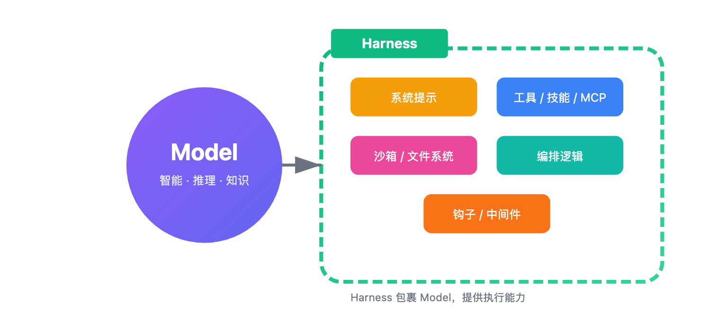
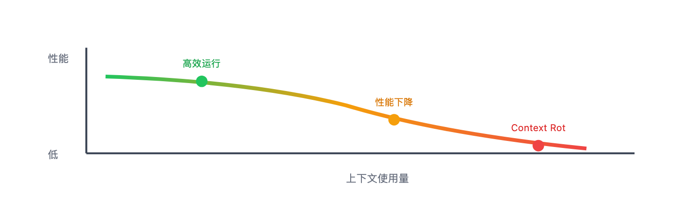
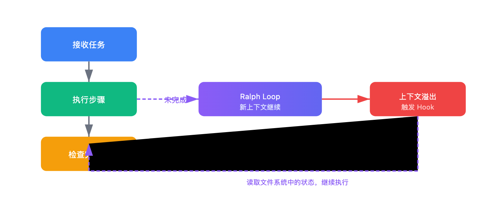

# 终于有人把 AI Agent 的"骨架"讲清楚了——Harness 工程实战解读

> 📖 **本文解读内容来源**
> - **原始来源**：[The Anatomy of an Agent Harness](https://twitter.com/Vtrivedy10/status/1897346251341635844)
> - **来源类型**：技术博客
> - **作者/团队**：Viv (@Vtrivedy10) @ LangChain
> - **发布时间**：2025-03-10

你有没有想过一个问题：为什么同样是 Claude 或 GPT，在 ChatGPT 里只能聊聊天，但在 Claude Code 里却能帮你写代码、跑测试、修 Bug？

答案就两个字：**Harness（框架）**。

说实话，这个问题笔者琢磨了很久。直到看到 LangChain 这篇博客，才恍然大悟：**模型只是大脑，Harness 才是让大脑干活的工具箱**。

## Agent = Model + Harness

作者给出了一个极简公式：

> **Agent = Model + Harness**

用大白话说：**如果你不是模型本身，那你就属于 Harness**。

所谓 **Harness**，就是包裹在模型外面的一切：代码、配置、执行逻辑。

具体来说，包括：
- **系统提示**：告诉模型角色定位、行为规范
- **工具/技能/MCP**：扩展模型能力的"手和脚"
- **基础设施**：文件系统、沙箱、浏览器
- **编排逻辑**：子代理调度、任务路由
- **钩子/中间件**：确定性执行、上下文压缩

光有模型，它只能输出文本。**有了 Harness，模型才能变成 Agent**。

## 为什么模型离不开 Harness？

从模型的角度看，它有三个"先天不足"：

这三个问题，模型自己解决不了。**必须靠 Harness 来补**。

比如最简单的"聊天"功能，就需要 Harness 用一个 while 循环来追踪历史消息、追加用户输入。你以为理所当然的体验，背后都是 Harness 在干活。

## Harness 的六大核心组件

作者从"想要什么行为"反推"需要什么 Harness 设计"，梳理出六大组件：

### 文件系统：持久存储的基石

**想要的行为**：Agent 能读写真实数据、跨会话保存工作、卸载超长上下文。

**Harness 设计**：内置文件系统抽象和操作工具。

文件系统是最基础的 Harness 原语，因为它解锁了三件事：
- Agent 有了"工作台"，能读代码、文档、数据
- 工作可以增量进行，不用把所有东西塞进上下文
- 多个 Agent 和人类可以通过共享文件协作

加上 Git，还能版本控制、回滚错误、分支实验。

### Bash + 代码执行：通用工具

**想要的行为**：Agent 能自主解决问题，不需要人类预先设计每个工具。

**Harness 设计**：提供 Bash 工具，让模型通过写代码、执行命令来解决问题。

这是"给模型一台电脑，让它自己想办法"的思路。模型可以现场设计工具，而不是被限制在固定的工具集里。

### 沙箱环境：安全隔离

**想要的行为**：Agent 能安全执行代码、观察结果、验证工作。

**Harness 设计**：连接沙箱环境，安全隔离执行、按需创建销毁。

沙箱解决了两个问题：
- **安全性**：不在本地跑危险代码
- **可扩展性**：环境可以动态创建、批量分发、用完销毁

好的沙箱还预装了语言运行时、Git CLI、测试框架、浏览器等工具。

### 记忆与搜索：持续学习

**想要的行为**：Agent 能记住见过的东西，获取训练时不存在的新知识。

**Harness 设计**：
- **记忆**：支持 AGENTS.md 等记忆文件，启动时注入上下文
- **搜索**：Web Search、MCP 工具（如 Context7）获取实时信息

这实现了"持续学习"：Agent 把一个会话的知识存下来，下次会话再用。

### 上下文管理：对抗"腐烂"

**想要的行为**：Agent 性能不随对话长度增加而下降。

**Harness 设计**：

这里有个关键概念：**Context Rot（上下文腐烂）**。说的是模型在上下文填满后，推理能力会下降。

Harness 需要三种策略来应对：

| 策略 | 解决的问题 |
|------|-----------|
| **压缩（Compaction）** | 上下文快满了怎么办？智能摘要、卸载旧内容 |
| **工具输出卸载** | 大量工具输出占空间？只保留首尾，完整内容存文件 |
| **技能渐进披露** | 启动时加载太多工具？按需加载，减少初始负担 |

### 长期自主执行：复杂任务的终极目标

**想要的行为**：Agent 能自主完成复杂任务，跨多个上下文窗口正确执行。

**Harness 设计**：组合以上所有原语。

这是最难的场景。作者提到了几个关键模式：

- **文件系统 + Git**：跟踪跨会话的工作进度
- **Ralph Loop**：拦截 Agent 的"退出"尝试，用新上下文重新注入原始任务，强制继续
- **规划与自验证**：分解目标、检查中间结果、失败时反馈重试

## 模型与 Harness 的"纠缠"

这里有个有意思的现象：**今天的 Agent 产品（如 Claude Code、Codex）在训练时，模型和 Harness 是一起参与的**。

这意味着模型会"学习"如何更好地使用特定的 Harness——比如文件操作、Bash 执行、规划拆解。

这形成了一个飞轮：
1. 发现有用的原语 → 加入 Harness
2. 用新 Harness 训练下一代模型
3. 模型在这个 Harness 里更强大
4. 循环继续

但这也带来一个问题：**过度耦合**。

作者举了个例子：Codex-5.3 的 apply_patch 工具逻辑，模型被训练成用特定方式编辑文件。如果你改了工具逻辑，模型性能就会下降。

一个"真正智能"的模型，应该能轻松切换不同的补丁方法。但训练时绑定 Harness，就产生了这种"过拟合"。

**笔者的观点是**：最好的 Harness 不一定是模型训练时用的那个。Terminal Bench 2.0 的排行榜显示，Opus 4.6 在 Claude Code 里得分远低于在其他 Harness 里的得分。**优化 Harness 本身，还有很大空间**。

## Harness 工程的未来方向

作者最后提到了几个正在探索的开放问题：

- **并行编排**：几百个 Agent 同时在共享代码库上工作
- **自我诊断**：Agent 分析自己的执行轨迹，识别和修复 Harness 层的失败
- **动态组装**：根据任务实时组装工具和上下文，而不是预先配置

笔者的判断是：**随着模型越来越强，Harness 不会消失，只会演进**。

就像 Prompt Engineering 到今天依然重要一样，Harness 工程也会持续有价值。原因很简单：好的环境配置、合适的工具、持久的存储、验证循环——这些让任何模型都更高效，无论基础智能多强。

## 结语

这篇文章给笔者最大的启发是：**不要把 Agent 想成一个黑盒，它是模型 + 框架的组合**。

模型负责智能，Harness 负责让智能变得有用。

如果你想构建自己的 Agent，不妨从这个公式出发：先想清楚想要什么行为，再反推需要什么 Harness 组件。

不得不感叹一句：**好的系统设计，是把 1 的智能放大成 10 的生产力**。

### 参考

- [The Anatomy of an Agent Harness - Viv @ LangChain](https://twitter.com/Vtrivedy10/status/1897346251341635844)