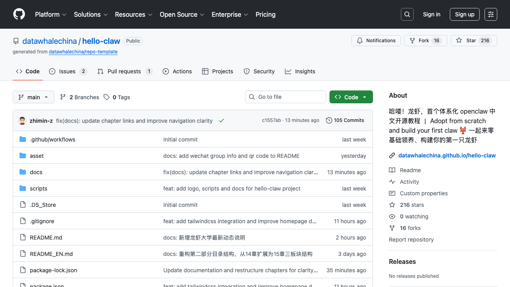

# 2K Star！阿里开源 ReMe：给 AI 智能体装上"长期记忆"，对话不再从零开始

> 导读：AI 智能体总是"记不住"？上下文超限就丢失历史？阿里开源 ReMe 记忆管理框架，让 AI 拥有真正的长期记忆，223K tokens 对话压缩到 1K，压缩率 99.5%。

---

## 01 为什么 AI 总是"记不住"？

你有没有遇到过这样的场景：

和 AI 助手聊了很久，它突然说"上下文超限，无法继续"。

新开一个对话，它完全不记得你之前说过什么。

工具输出太长，直接把整个上下文窗口撑爆。

这就是当前 AI 智能体的两大痛点：

**问题一：上下文窗口有限**

再大的模型也有上限。GPT-4 是 128K，Claude 是 200K，但总有用完的时候。

一旦超限，早期信息就被截断或丢失。

**问题二：会话无状态**

每次新对话，AI 都从零开始。

它记不住你的偏好，记不住历史决策，记不住项目上下文。

这就像一个每次见面都失忆的助手。

现在，阿里开源了一个解决方案。



*图 1：ReMe GitHub 仓库首页，目前已获 2122+ Star*

---

## 02 项目速览：ReMe 是什么

先上核心信息。

**项目名称**：ReMe（Remember Me, Refine Me）

**出品方**：阿里 AgentScope 团队

**项目地址**：https://github.com/agentscope-ai/ReMe

**Stars**：2122+（持续增长中）

**许可证**：Apache-2.0

**核心定位**：面向 AI 智能体的记忆管理框架

**解决的核心问题**：

- 上下文窗口有限（长对话时早期信息被截断或丢失）
- 会话无状态（新对话无法继承历史，每次从零开始）

**你可以用 ReMe 做什么**：

- **个人助理**：为 CoPaw 等智能体提供长期记忆，记住用户偏好和历史对话
- **编程助手**：记录代码风格偏好、项目上下文，跨会话保持一致的开发体验
- **客服机器人**：记录用户问题历史、偏好设置，提供个性化服务
- **任务自动化**：从历史任务中学习成功/失败模式，持续优化执行策略
- **知识问答**：构建可检索的知识库，支持语义搜索和精确匹配
- **多轮对话**：自动压缩长对话，在有限上下文窗口内保留关键信息

**技术特点**：

- 同时提供基于文件系统和基于向量库的记忆系统
- 对话自动浓缩，重要信息持久保存
- 下次对话自动"想起来"

学习建议：开发者可直接进入快速开始部分。

---

## 03 核心观点一：记忆即文件，文件即记忆

这是 ReMe 最核心的设计理念。

传统 AI 记忆系统是什么？是数据库。

存储在向量数据库里，不可见，难修改，难迁移。

ReMe 是什么？是 Markdown 文件。

可读，可编辑，可复制。

看个对比：

```
传统记忆系统          File Based ReMe
🗄️ 数据库存储        📝 Markdown 文件
🔒 不可见            👀 随时可读
❌ 难修改            ✏️ 直接编辑
🚫 难迁移            📦 复制即迁移
```

这个区别看似简单，实则深刻。

它意味着记忆从"黑盒"变成了"白盒"。

### 3.1 文件系统结构

ReMe 的记忆系统长这样：

```
working_dir/
├── MEMORY.md              # 长期记忆：用户偏好等持久信息
├── memory/
│   └── YYYY-MM-DD.md      # 每日日记：对话结束后自动写入
└── tool_result/           # 超长工具输出缓存（自动管理，超期自动清理）
    └── <uuid>.txt
```

**MEMORY.md**：存储用户的长期偏好，比如"喜欢 Python 3.10+"、"使用 VSCode"。

**memory/YYYY-MM-DD.md**：每天一个文件，自动记录当天的对话摘要。

**tool_result/**：缓存超长的工具输出，防止撑爆上下文。

所有文件都是 Markdown 格式。

这意味着什么？

你可以用任何文本编辑器打开它，直接修改，甚至用 Git 管理版本。

### 3.2 数据主权：你的记忆，你做主

这是 ReMe 反复强调的一点。

与 SaaS AI 助手不同，ReMe 运行在你自己的设备上。

敏感数据不离开你的设备。所有记忆存储在本地 Markdown 文件中。

可读、可编辑、可迁移。

这在企业场景中尤为重要。

想象一下：

- 客服机器人的用户偏好数据，完全存储在本地
- 编程助手的项目上下文，可以直接复制给新实例
- 个人助理的记忆，可以导出备份，甚至迁移到另一台机器

这就是"记忆即文件"的力量。

---

## 04 核心观点二：从"失忆"到"过目不忘"

ReMe 的核心能力，可以用一个词概括：

**记忆管理**。

它给 AI 智能体装上了真正的"海马体"。

### 4.1 六大核心能力

| 类别 | 方法 | 功能 | 关键组件 |
|------|------|------|----------|
| 上下文管理 | `check_context` | 📊 检查上下文大小 | ContextChecker |
| 上下文管理 | `compact_memory` | 📦 压缩历史对话为摘要 | Compactor |
| 上下文管理 | `compact_tool_result` | ✂️ 压缩超长工具输出 | ToolResultCompactor |
| 上下文管理 | `pre_reasoning_hook` | 🔄 推理前预处理钩子 | 整合上述组件 |
| 长期记忆 | `summary_memory` | 📝 将重要记忆写入文件 | Summarizer |
| 长期记忆 | `memory_search` | 🔍 语义搜索记忆 | MemorySearch |

这六大能力，构成了完整的记忆管理系统。

### 4.2 对话压缩：223K → 1K，压缩率 99.5%

这是 ReMe 最亮眼的数据。

官方测试显示：

223,838 tokens 的对话，压缩后只剩 1,105 tokens。

压缩率达到 99.5%。

怎么做到的？

ReMe 使用一个 ReActAgent（推理 - 行动智能体），将历史对话压缩为**结构化上下文摘要**。

摘要结构包含 6 个核心检查点：

| 字段 | 说明 |
|------|------|
| `## Goal` | 用户目标 |
| `## Constraints` | 约束和偏好 |
| `## Progress` | 任务进展 |
| `## Key Decisions` | 关键决策 |
| `## Next Steps` | 下一步计划 |
| `## Critical Context` | 文件路径、函数名、错误信息等关键数据 |

这个结构，确保了关键信息不丢失。

### 4.3 增量更新：站在前人的肩膀上

ReMe 支持增量更新。

当你传入 `previous_summary` 时，它会自动将新对话与旧摘要合并。

这意味着什么？

你的 AI 助手可以持续学习，不断积累。

不是每次从零开始，而是站在历史的基础上。

---

## 05 核心观点三：AI 记忆的三种形态

ReMe 不仅提供基于文件的记忆系统，还提供基于向量库的记忆系统。

这对应了 AI 记忆的三种形态：

### 5.1 个人记忆

记录用户偏好、习惯。

比如：

- "用户喜欢使用 Python 3.10+"
- "默认使用 VSCode 编辑器"
- "偏好简洁的代码风格"

这些是长期稳定的信息，存储在 `MEMORY.md` 中。

### 5.2 任务/程序性记忆

记录任务执行经验、成功/失败模式。

比如：

- "上次部署失败是因为端口冲突"
- "使用 pip install -e 安装开发版本"
- "先运行测试再提交代码"

这些是动态积累的经验，存储在 `memory/YYYY-MM-DD.md` 中。

### 5.3 工具记忆

记录工具使用经验、参数优化。

比如：

- "使用 qwen3.5-35b-a3b 模型效果最好"
- "temperature 设为 0.7 适合创意任务"
- "max_tokens 设为 4096 避免截断"

这些是工具调用的最佳实践，可以缓存和复用。

### 5.4 混合检索：向量 + BM25

ReMe 的记忆检索系统，采用了混合检索策略。

**向量检索**（权重 0.7）：语义相似。

比如搜索"Python 版本"，会找到"我喜欢用 Python 3.10"。

**BM25 检索**（权重 0.3）：关键词匹配。

比如搜索"Python 3.10"，会精确匹配到包含这个词的句子。

两者结合，兼顾语义相似和精确匹配。

---

## 06 架构解析：ReMe 如何工作

ReMe 的架构设计，可以用一张图表示：

```
Agent[智能体] -->|每轮推理前 | Hook[pre_reasoning_hook]
Hook --> TC[compact_tool_result<br>压缩工具输出]
TC --> CC[check_context<br>Token 计数]
CC -->|超限 | CM[compact_memory<br>生成摘要]
CC -->|超限 | SM[summary_memory<br>异步持久化]
SM -->|ReAct + FileIO| Files[memory/*.md]
Agent -->|主动调用 | Search[memory_search<br>向量+BM25]
Agent -->|会话内存 | InMem[ReMeInMemoryMemory<br>Token 感知内存]
Files -.->|FileWatcher| Store[(FileStore<br>向量+FTS 索引)]
Search --> Store
```

这个架构的核心，是一个预处理钩子：`pre_reasoning_hook`。

在每轮推理前，它自动执行 4 步操作：

1. **压缩工具输出**：防止工具结果撑爆上下文
2. **检查上下文**：计算剩余空间
3. **生成压缩摘要**：同步生成结构化摘要
4. **持久化记忆**：异步后台写入文件

这个过程，对智能体是透明的。

智能体只需要正常推理，ReMe 会自动管理记忆。

---

## 07 5 分钟快速上手

### 7.1 安装

从源码安装：

```bash
git clone https://github.com/agentscope-ai/ReMe.git
cd ReMe
pip install -e ".[light]"
```

更新到最新版本：

```bash
git pull
pip install -e ".[light]"
```

### 7.2 环境变量配置

ReMe 使用环境变量来配置 LLM 和 Embedding 模型：

| 变量 | 说明 | 示例 |
|------|------|------|
| `LLM_API_KEY` | LLM API key | `sk-xxx` |
| `LLM_BASE_URL` | LLM base URL | `https://dashscope.aliyuncs.com/compatible-mode/v1` |
| `EMBEDDING_API_KEY` | Embedding API key（可选） | `sk-xxx` |
| `EMBEDDING_BASE_URL` | Embedding base URL（可选） | `https://dashscope.aliyuncs.com/compatible-mode/v1` |

可以写在项目根目录的 `.env` 文件中。

### 7.3 Python 使用示例

```python
import asyncio
from reme.reme_light import ReMeLight


async def main():
    # 初始化 ReMeLight
    reme = ReMeLight(
        default_as_llm_config={"model_name": "qwen3.5-35b-a3b"},
        default_file_store_config={"fts_enabled": True, "vector_enabled": False},
    )
    await reme.start()

    messages = [...]  # 对话消息列表

    # 1. 压缩超长工具输出（防止工具结果撑爆上下文）
    messages = await reme.compact_tool_result(messages)

    # 2. 将历史对话压缩为结构化摘要
    summary = await reme.compact_memory(
        messages=messages,
        previous_summary="",
        max_input_length=128000,  # 模型上下文窗口（tokens）
        compact_ratio=0.7,  # 达到 70% 时触发压缩
        language="zh",  # 摘要语言
    )

    # 3. 后台异步提交摘要任务（不阻塞对话）
    reme.add_async_summary_task(messages=messages)

    # 4. 推理前预处理钩子（自动压缩工具结果 + 生成摘要）
    processed_messages, compressed_summary = await reme.pre_reasoning_hook(
        messages=messages,
        system_prompt="你是一个有帮助的 AI 助手。",
        compressed_summary="",
        max_input_length=128000,
        compact_ratio=0.7,
        memory_compact_reserve=10000,
        enable_tool_result_compact=True,
        tool_result_compact_keep_n=3,
    )

    # 5. 语义搜索记忆（向量 + BM25 混合检索）
    result = await reme.memory_search(query="Python 版本偏好", max_results=5)

    # 6. 创建会话内存实例（管理单次对话的上下文）
    from reme.memory.file_based.reme_in_memory_memory import ReMeInMemoryMemory
    memory = ReMeInMemoryMemory()
    for msg in messages:
        await memory.add(msg)
    token_stats = await memory.estimate_tokens(max_input_length=128000)
    print(f"当前上下文使用率：{token_stats['context_usage_ratio']:.1f}%")
    print(f"消息 Token 数：{token_stats['messages_tokens']}")
    print(f"预估总 Token 数：{token_stats['estimated_tokens']}")

    # 7. 关闭前等待后台任务完成
    summary_result = await reme.await_summary_tasks()

    # 关闭 ReMeLight
    await reme.close()


if __name__ == "__main__":
    asyncio.run(main())
```

> 📂 完整示例代码：[test_reme_light.py](tests/light/test_reme_light.py)
> 📋 运行结果示例：[test_reme_light_log.txt](tests/light/test_reme_light_log.txt)

---

## 08 实战场景：ReMe 能做什么

### 8.1 个人助理：记住你的偏好

场景：你有一个 AI 个人助理，每天帮你处理邮件、安排日程。

没有 ReMe：

- 每次新对话，它都问"你喜欢什么时间开会？"
- 它记不住你上周说过的"下午 2 点以后没空"
- 它记不住你的邮件分类规则

有了 ReMe：

- 它记住你的偏好，存储在 `MEMORY.md` 中
- 每天的对话摘要，自动写入 `memory/YYYY-MM-DD.md`
- 下次对话，它自动"想起来"

### 8.2 编程助手：保持项目上下文

场景：你在开发一个 Python 项目，AI 助手帮你写代码。

没有 ReMe：

- 每次新对话，它都要重新了解项目结构
- 它记不住你之前的架构决策
- 工具输出太长（比如测试报告），直接撑爆上下文

有了 ReMe：

- 项目上下文存储在 `MEMORY.md` 中
- 每天的进展，自动写入日记
- 超长工具输出，自动压缩并缓存

### 8.3 客服机器人：个性化服务

场景：你有一个客服机器人，每天处理上百个用户咨询。

没有 ReMe：

- 每个用户都是"新用户"
- 它记不住用户的历史问题
- 它记不住用户的偏好设置

有了 ReMe：

- 每个用户一个记忆文件夹
- 历史问题自动归档
- 偏好设置持久存储

---

## 09 同类项目对比

我们来对比一下类似的 AI 记忆项目：

| 项目 | 出品方 | 记忆存储 | 压缩能力 | 检索方式 |
|------|--------|----------|----------|----------|
| **ReMe** | 阿里 | Markdown 文件 + 向量库 | 99.5% | 向量 + BM25 |
| LangChain Memory | LangChain | 数据库 | 基础 | 向量 |
| LlamaIndex | LlamaIndex | 向量库 | 基础 | 向量 |
| Mem0 | Mem0 | 向量库 + 图数据库 | 中等 | 向量 + 图 |

ReMe 的优势：

- **文件存储**：可读可编辑，数据主权归用户
- **结构化摘要**：6 个核心检查点，确保关键信息不丢失
- **混合检索**：向量 + BM25，兼顾语义和精确匹配
- **异步持久化**：不阻塞对话，性能更好

---

## 10 总结与展望

### 10.1 核心回顾

ReMe 是一个记忆管理框架，给 AI 智能体装上真正的"海马体"。

它的核心理念：

- **记忆即文件**：Markdown 文件存储，可读可编辑
- **对话压缩**：223K → 1K，压缩率 99.5%
- **增量更新**：站在历史的基础上学习
- **混合检索**：向量 + BM25，精准匹配

### 10.2 生态整合

ReMe 已经集成到多个项目中：

- **CoPaw**：阿里开源的 AI 个人助理，使用 ReMe 提供长期记忆
- **AgentScope**：阿里开源的智能体开发框架

未来，ReMe 可能会：

- 支持更多存储后端（Redis、MongoDB 等）
- 提供更丰富的检索策略
- 与更多智能体框架集成

### 10.3 So What？

这对我们意味着什么？

**第一，AI 智能体正在从"失忆"走向"记忆"**。

这是一个质的飞跃。

有了记忆，AI 才能真正理解你，记住你，为你服务。

**第二，数据主权回归用户**。

ReMe 的文件存储设计，让记忆完全掌握在用户手中。

可读、可编辑、可迁移。

这是开源的力量。

**第三，开发者可以构建更强大的智能体**。

有了 ReMe，你不再需要自己实现记忆系统。

专注于业务逻辑，记忆交给 ReMe。

### 10.4 行动呼吁

**项目地址**：https://github.com/agentscope-ai/ReMe

**文档**：https://github.com/agentscope-ai/ReMe/blob/main/README_ZH.md

**安装**：

```bash
git clone https://github.com/agentscope-ai/ReMe.git
cd ReMe
pip install -e ".[light]"
```

**学习路线**：

1. 阅读中文文档
2. 运行快速开始示例
3. 集成到你的智能体项目中
4. 探索高级功能（向量检索、工具记忆等）

---

**参考资料**：

- ReMe GitHub：https://github.com/agentscope-ai/ReMe
- ReMe 中文文档：https://github.com/agentscope-ai/ReMe/blob/main/README_ZH.md
- CoPaw 项目：https://github.com/agentscope-ai/CoPaw
- AgentScope：https://github.com/agentscope-ai/agentscope

---

*本文基于 ReMe 开源项目撰写，项目信息截至 2026-03-11。*
