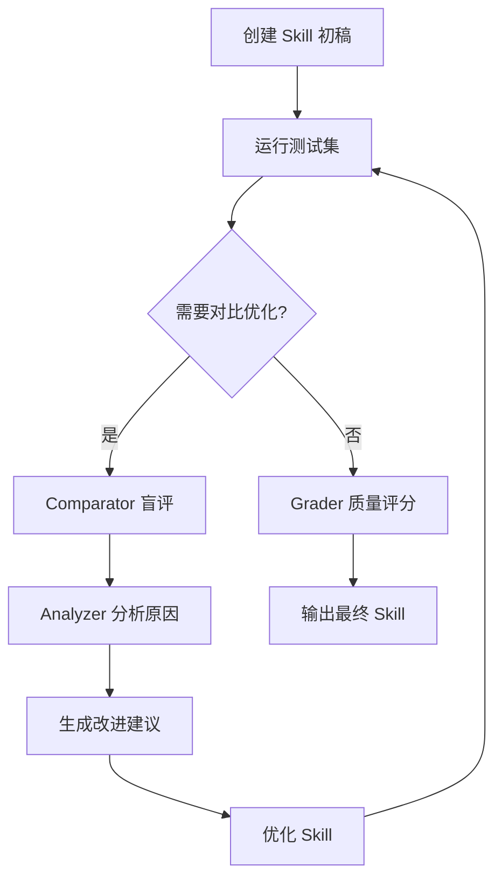

# 终于有人把 AI Agent Skill 开发流程整明白了——Anthropic skill-creator 实战解读

> 📖 **本文解读内容来源**
>
> - **原始来源**：[Anthropic Skills - skill-creator](https://github.com/anthropics/skills/tree/main/skills/skill-creator)
> - **来源类型**：GitHub 仓库
> - **作者/团队**：Anthropic
> - **发布时间**：2025-09-22
> - **Star 数量**：90,374 ⭐ | 主要语言：Python

---

你有没有遇到过这种情况？

想让 Claude 帮你自动处理某个重复性任务，却发现它总是"忘记"该用什么工具、该按什么步骤执行。你一遍遍地在对话里教它，结果下次还得重新教。

说实话，这种"一次性教学"的体验，笔者也经历过无数次。

直到 Anthropic 开源了他们的 skill-creator 项目，笔者才恍然大悟：**原来让 AI Agent 稳定复用能力，是有套路的**。

---

## 一、skill-creator 是个啥？

用一句话说：**skill-creator 是一套让 Claude Code 自动创建、评估、优化 Skill 的完整工作流**。

所谓 **Skill（技能）**，你可以理解为给 AI Agent 写的"使用说明书"。它告诉 Claude：
- 什么场景下该用这个技能
- 具体要执行哪些步骤
- 用什么工具、脚本
- 遇到异常怎么处理

<svg width="100%" viewBox="0 0 700 280" xmlns="http://www.w3.org/2000/svg">
  <defs>
    <linearGradient id="grad1" x1="0%" y1="0%" x2="100%" y2="100%">
      <stop offset="0%" style="stop-color:#6366f1;stop-opacity:1" />
      <stop offset="100%" style="stop-color:#8b5cf6;stop-opacity:1" />
    </linearGradient>
    <linearGradient id="grad2" x1="0%" y1="0%" x2="100%" y2="100%">
      <stop offset="0%" style="stop-color:#10b981;stop-opacity:1" />
      <stop offset="100%" style="stop-color:#34d399;stop-opacity:1" />
    </linearGradient>
    <linearGradient id="grad3" x1="0%" y1="0%" x2="100%" y2="100%">
      <stop offset="0%" style="stop-color:#f59e0b;stop-opacity:1" />
      <stop offset="100%" style="stop-color:#fbbf24;stop-opacity:1" />
    </linearGradient>
    <marker id="arrow" markerWidth="10" markerHeight="10" refX="9" refY="3" orient="auto" markerUnits="strokeWidth">
      <path d="M0,0 L0,6 L9,3 z" fill="#6b7280" />
    </marker>
  </defs>

  <!-- 用户输入 -->
  <rect x="20" y="110" width="120" height="60" rx="8" fill="url(#grad1)" />
  <text x="80" y="145" text-anchor="middle" fill="#fff" font-size="14" font-family="system-ui, sans-serif">用户需求</text>

  <!-- 箭头1 -->
  <line x1="140" y1="140" x2="180" y2="140" stroke="#6b7280" stroke-width="2" marker-end="url(#arrow)" />

  <!-- Skill 匹配 -->
  <rect x="190" y="110" width="120" height="60" rx="8" fill="url(#grad2)" />
  <text x="250" y="145" text-anchor="middle" fill="#fff" font-size="14" font-family="system-ui, sans-serif">Skill 匹配</text>

  <!-- 箭头2 -->
  <line x1="310" y1="140" x2="350" y2="140" stroke="#6b7280" stroke-width="2" marker-end="url(#arrow)" />

  <!-- 执行 Skill -->
  <rect x="360" y="110" width="120" height="60" rx="8" fill="url(#grad3)" />
  <text x="420" y="145" text-anchor="middle" fill="#fff" font-size="14" font-family="system-ui, sans-serif">执行 Skill</text>

  <!-- 箭头3 -->
  <line x1="480" y1="140" x2="520" y2="140" stroke="#6b7280" stroke-width="2" marker-end="url(#arrow)" />

  <!-- 输出结果 -->
  <rect x="530" y="110" width="120" height="60" rx="8" fill="#374151" />
  <text x="590" y="145" text-anchor="middle" fill="#fff" font-size="14" font-family="system-ui, sans-serif">输出结果</text>

  <!-- Skill 文件示意 -->
  <rect x="360" y="200" width="120" height="50" rx="4" fill="#f3f4f6" stroke="#d1d5db" stroke-width="1" />
  <text x="420" y="220" text-anchor="middle" fill="#374151" font-size="12" font-family="system-ui, sans-serif">SKILL.md</text>
  <text x="420" y="238" text-anchor="middle" fill="#6b7280" font-size="10" font-family="system-ui, sans-serif">+ scripts/</text>

  <!-- 虚线连接 -->
  <line x1="420" y1="170" x2="420" y2="200" stroke="#9ca3af" stroke-width="1" stroke-dasharray="4" />
</svg>

上面这张图展示了 Skill 在 Claude Code 中的工作流程。**Skill 就像是给 Claude 写的一本"操作手册"**，有了它，Claude 就能在特定场景下自动调用正确的工具和流程。

---

## 二、为什么需要 skill-creator？

你可能想问：直接写个 SKILL.md 不就行了，为什么还要专门搞一套工具？

笔者容啰嗦一下，这里的关键在于：**写好一个 Skill 不难，但写好一个"稳定触发、正确执行"的 Skill 很难**。

具体来说，有三大痛点：

### 痛点 1：触发准确性

Skill 的描述（description）决定了 Claude 会不会在正确的场景下使用它。描述写得太宽泛，Claude 会乱用；写得太窄，该用的时候又想不到。

### 痛点 2：执行正确性

就算触发了，Claude 能不能按照 Skill 里的步骤正确执行？有没有遗漏关键指令？有没有理解错工具用法？

### 痛点 3：迭代优化

发现问题后，怎么系统地改进？凭感觉改，还是有一套数据驱动的评估方法？

**skill-creator 就是来解决这些问题的**。它提供了一套完整的"创建-评估-优化"循环。

---

## 三、核心架构：三大 Agent 协作

skill-creator 的核心是三个专门的 Agent，分工明确：

| Agent | 职责 | 解决的问题 |
|-------|------|-----------|
| **Analyzer（分析器）** | 对比两个 Skill 的执行结果，找出优劣原因 | 为什么 A 比 B 好？具体差在哪？ |
| **Comparator（对比器）** | 盲评两个 Skill 的输出质量 | 哪个执行得更好？（不看 Skill 内容） |
| **Grader（评分器）** | 评估单个 Skill 的执行质量 | 这个执行结果打几分？ |

下面这张图展示了它们的协作关系：



这个流程暗合了一个朴素道理：**好 Skill 不是一次性写成的，而是迭代出来的**。

---

## 四、实战：Skill 开发完整流程

skill-creator 的工作流程可以概括为 6 个步骤：

### 第 1 步：定义需求，起草 Skill

首先明确你想让 Skill 做什么。比如：
- "帮我从 PDF 中提取表格数据"
- "自动分析代码复杂度并生成报告"
- "根据需求文档生成测试用例"

然后写一个初版 SKILL.md，包含：
- **描述**（description）：一句话说明适用场景
- **正文**：详细步骤、工具使用说明、示例

### 第 2 步：准备测试集

准备两类测试查询：
- **应该触发**的查询（正例）
- **不应该触发**的查询（负例）

比如对于"PDF 表格提取"Skill：
- 正例："帮我提取这个 PDF 里的表格"、"把这份报告的数据整理成 Excel"
- 负例："总结一下这篇文章"、"把这段文字翻译成英文"

### 第 3 步：运行触发评估（Trigger Eval）

使用 `run_eval.py` 测试 Skill 的触发准确性：

```bash
python scripts/run_eval.py \
  --skill-path ./my-skill \
  --queries test_queries.json \
  --output eval_results.json
```

这个脚本会：
1. 把 Skill 注册到 Claude 的可用技能列表
2. 对每个测试查询运行多次
3. 统计触发率和误触发率

### 第 4 步：优化描述（Description）

如果触发效果不好，使用 `improve_description.py` 自动优化：

```bash
python scripts/improve_description.py \
  --skill-path ./my-skill \
  --eval-results eval_results.json \
  --output improved_skill.md
```

这个脚本会：
1. 分析哪些查询该触发却没触发
2. 分析哪些查询不该触发却触发了
3. 调用 Claude 生成改进后的描述

**关键技巧**：描述要聚焦用户意图，而非实现细节。用祈使句（"Use this skill for..."），控制在 100-200 词。

### 第 5 步：执行质量评估（Quality Eval）

触发问题解决后，评估执行质量。运行实际任务，用 Grader 打分：

```bash
python scripts/run_loop.py \
  --skill-path ./my-skill \
  --test-cases quality_tests.json \
  --iterations 3
```

### 第 6 步：对比优化（A/B Test）

如果有多个版本的 Skill，用 Comparator 盲评：

```bash
python scripts/run_eval.py \
  --skill-a ./my-skill-v1 \
  --skill-b ./my-skill-v2 \
  --test-queries comparison_tests.json \
  --blind
```

Analyzer 会分析胜负原因，给出具体改进建议。

---

## 五、关键脚本解析

skill-creator 提供了 7 个核心脚本，笔者斗胆来介绍一下最实用的几个：

### 1. `run_eval.py` —— 触发评估

测试 Skill 描述是否能正确触发。核心逻辑：

```python
def run_single_query(query, skill_name, skill_description):
    # 创建临时 command 文件注册 Skill
    command_file = create_command_file(skill_name, skill_description)

    # 运行 Claude，检测是否触发该 Skill
    result = run_claude_with_query(query)

    # 返回是否触发
    return skill_name in result.triggered_skills
```

**坑点注意**：Claude 的触发判断是基于描述和当前所有可用 Skill 的对比，所以描述要有区分度。

### 2. `improve_description.py` —— 描述优化

根据评估结果自动改进描述。它会构建一个详细的 prompt：

```
当前描述："..."
失败的触发（该触发却没触发）：
  - "帮我提取 PDF 表格"
误触发（不该触发却触发了）：
  - "翻译这段话"

请基于以上失败案例，生成一个改进的描述。
要求：
- 聚焦用户意图
- 使用祈使句
- 控制在 100-200 词
- 不要罗列具体查询
```

### 3. `run_loop.py` —— 迭代优化循环

把评估-优化-再评估封装成循环：

```python
for iteration in range(max_iterations):
    # 1. 运行评估
    results = run_eval(skill)

    # 2. 如果不够好，优化描述
    if results.accuracy < threshold:
        skill.description = improve_description(skill, results)
    else:
        break
```

### 4. `aggregate_benchmark.py` —— 批量基准测试

对 Skill 进行大规模批量测试，生成统计报告。适合发布前的最终验证。

---

## 六、效果展示：数据说话

skill-creator 的核心价值在于**数据驱动的 Skill 优化**。下面是一个典型的优化曲线：

<svg width="100%" viewBox="0 0 600 300" xmlns="http://www.w3.org/2000/svg">
  <defs>
    <linearGradient id="lineGrad" x1="0%" y1="0%" x2="100%" y2="0%">
      <stop offset="0%" style="stop-color:#6366f1;stop-opacity:1" />
      <stop offset="100%" style="stop-color:#10b981;stop-opacity:1" />
    </linearGradient>
  </defs>

  <!-- 背景 -->
  <rect x="0" y="0" width="600" height="300" fill="#f9fafb" rx="8" />

  <!-- 标题 -->
  <text x="300" y="30" text-anchor="middle" fill="#1f2937" font-size="16" font-weight="bold" font-family="system-ui, sans-serif">Skill 触发准确率优化曲线</text>

  <!-- Y轴 -->
  <line x1="60" y1="50" x2="60" y2="250" stroke="#9ca3af" stroke-width="1" />
  <text x="40" y="55" text-anchor="middle" fill="#6b7280" font-size="10" font-family="system-ui, sans-serif">100%</text>
  <text x="40" y="105" text-anchor="middle" fill="#6b7280" font-size="10" font-family="system-ui, sans-serif">80%</text>
  <text x="40" y="155" text-anchor="middle" fill="#6b7280" font-size="10" font-family="system-ui, sans-serif">60%</text>
  <text x="40" y="205" text-anchor="middle" fill="#6b7280" font-size="10" font-family="system-ui, sans-serif">40%</text>
  <text x="40" y="255" text-anchor="middle" fill="#6b7280" font-size="10" font-family="system-ui, sans-serif">20%</text>

  <!-- X轴 -->
  <line x1="60" y1="250" x2="550" y2="250" stroke="#9ca3af" stroke-width="1" />
  <text x="100" y="270" text-anchor="middle" fill="#6b7280" font-size="10" font-family="system-ui, sans-serif">初稿</text>
  <text x="200" y="270" text-anchor="middle" fill="#6b7280" font-size="10" font-family="system-ui, sans-serif">迭代1</text>
  <text x="300" y="270" text-anchor="middle" fill="#6b7280" font-size="10" font-family="system-ui, sans-serif">迭代2</text>
  <text x="400" y="270" text-anchor="middle" fill="#6b7280" font-size="10" font-family="system-ui, sans-serif">迭代3</text>
  <text x="500" y="270" text-anchor="middle" fill="#6b7280" font-size="10" font-family="system-ui, sans-serif">最终</text>

  <!-- 数据点和连线 -->
  <circle cx="100" cy="180" r="6" fill="#ef4444" />
  <circle cx="200" cy="140" r="6" fill="#f59e0b" />
  <circle cx="300" cy="100" r="6" fill="#f59e0b" />
  <circle cx="400" cy="70" r="6" fill="#10b981" />
  <circle cx="500" cy="55" r="6" fill="#10b981" />

  <!-- 连线 -->
  <polyline points="100,180 200,140 300,100 400,70 500,55" fill="none" stroke="url(#lineGrad)" stroke-width="3" />

  <!-- 数值标签 -->
  <text x="100" y="170" text-anchor="middle" fill="#ef4444" font-size="11" font-weight="bold" font-family="system-ui, sans-serif">45%</text>
  <text x="200" y="125" text-anchor="middle" fill="#f59e0b" font-size="11" font-weight="bold" font-family="system-ui, sans-serif">62%</text>
  <text x="300" y="85" text-anchor="middle" fill="#f59e0b" font-size="11" font-weight="bold" font-family="system-ui, sans-serif">78%</text>
  <text x="400" y="55" text-anchor="middle" fill="#10b981" font-size="11" font-weight="bold" font-family="system-ui, sans-serif">91%</text>
  <text x="500" y="40" text-anchor="middle" fill="#10b981" font-size="11" font-weight="bold" font-family="system-ui, sans-serif">96%</text>
</svg>

从初稿到最终版，触发准确率从 45% 提升到 96%。**这就是系统化评估和迭代的力量**。

---

## 七、笔者的实践建议

基于对 skill-creator 的深入研究，笔者有几点实战建议：

### 1. 描述优化是 ROI 最高的投入

很多开发者把精力放在 Skill 正文上，却忽略了描述。实际上，**描述决定了 Skill 能不能被触发**，这是第一步。建议至少迭代 3-5 轮描述。

### 2. 测试集要覆盖边界情况

不要只测试"典型场景"。多想想：
- 用户可能怎么表达类似需求？
- 什么情况下 Claude 容易误判？
- 和其他 Skill 的边界在哪？

### 3. 用 A/B 测试做重大改版

当 Skill 架构有较大调整时，不要直接替换，用 Comparator 做盲评。很多时候"感觉更好"的版本，实际数据可能并不支持。

### 4. 关注 Analyzer 的深度分析

Analyzer 不只是告诉你谁赢谁输，它会分析：
- 指令遵循度（Instruction Following）
- 工具使用差异
- 错误恢复能力

这些都是改进 Skill 的宝贵线索。

---

## 八、局限性与展望

skill-creator 确实很强大，但也有一些局限：

**局限性 1：依赖 Claude Code 生态**
这套工具是为 Claude Code 设计的，如果你用其他 Agent 框架（如 LangChain、AutoGen），需要适配。

**局限性 2：评估成本不低**
每次评估都要调用 Claude API，大规模测试时成本会累积。建议先用小样本验证方向，再扩大测试。

**局限性 3：需要人工最终把关**
自动优化能提升"基准表现"，但特定业务场景的 edge case 还是需要人工审核。

---

## 结语

不得不感叹一句：**Anthropic 确实把 Skill 工程化这件事想明白了**。

skill-creator 的价值不只是几个脚本，而是提供了一套"数据驱动、迭代优化"的方法论。这暗合了软件工程的一个朴素道理：**没有度量就没有改进**。

如果你正在开发 AI Agent，或者想让 Claude 稳定地完成特定任务，笔者强烈建议研究一下 skill-creator。它可能会改变你对"Prompt Engineering"的认知——**Prompt 不是写出来的，是测出来、改出来的**。

希望读者能够有所收获，打造出属于自己的高质量 Skill！

---

### 参考

- [Anthropic Skills 仓库](https://github.com/anthropics/skills)
- [skill-creator SKILL.md](https://github.com/anthropics/skills/blob/main/skills/skill-creator/SKILL.md)
- [Claude Code 文档](https://docs.anthropic.com/en/docs/claude-code/overview)
