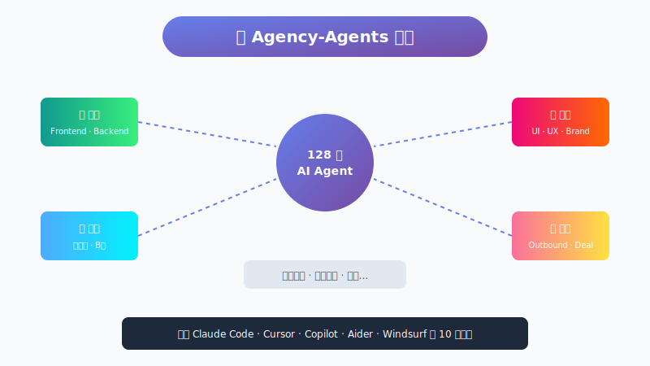

# 组建一支 AI 梦之队？这个项目给你 128 个随时待命的专业 Agent

> 📖 **本文解读内容来源**
>
> - **原始来源**：[The Agency: AI Specialists Ready to Transform Your Workflow](https://github.com/msitarzewski/agency-agents)
> - **来源类型**：GitHub 仓库
> - **作者/团队**：msitarzewski
> - **Star 数量**：快速增长的社区项目
> - **主要语言**：Markdown（Agent 定义文件）

你有没有想过，如果能拥有一支专业团队——前端工程师、设计师、营销专家、项目经理——随时待命，24 小时响应，从不抱怨，那该多好？

这不是幻想。一个叫 **Agency-Agents** 的项目正在把这件事变成现实。

它不是简单的 Prompt 模板库，而是一个包含 **128 个专业 AI Agent** 的"虚拟人才市场"。每个 Agent 都有独特的性格、专业领域和交付物标准。让我带你看看这个项目有什么特别之处。

---

## 这是个啥？

**Agency-Agents**，一句话定义：一个精心设计的 AI Agent 集合，覆盖工程、设计、营销、销售等 12 个部门，每个 Agent 都像一位真正的专业人士——有自己的性格、工作流程和质量标准。

打个比方：它就像一个**虚拟的人力资源平台**。你需要前端开发？有专门的 Frontend Developer Agent。需要设计品牌调性？有 Brand Guardian Agent。甚至在游戏开发、空间计算等小众领域，都能找到对应的专家。

和市面上那些"假装是专家"的泛泛 Prompt 不同，每个 Agent 都经过深度打磨：性格鲜明、流程清晰、交付物具体。

下面这张图展示了 Agency-Agents 的核心架构：



---

## 128 个 Agent，12 个部门

项目按职能划分为 12 个部门，我来挑几个有意思的说说。

### 工程部门：最硬核的技术团队

前端、后端、移动端、AI 工程师、DevOps、安全工程师……你能想到的角色这里都有。

比如 **Frontend Developer Agent**，它不只告诉你"怎么写代码"，还内置了：
- Core Web Vitals 性能优化标准
- WCAG 2.1 无障碍合规要求
- 完整的 React 组件代码示例
- 从项目搭建到测试上线的完整工作流

### 设计部门：不只是画图

这里有 UI 设计师、UX 研究员，还有一个很有趣的角色——**Whimsy Injector（趣味注入师）**。

这位 Agent 的职责是给产品注入"惊喜感"。它的金句是：

> "Every playful element must serve a functional or emotional purpose. Design delight that enhances rather than distracts."
>
> 每一个有趣的元素，都要服务于功能或情感目的。

它会帮你设计彩蛋、庆祝动画、有趣的空状态页面——让产品从"能用"变成"让人喜欢用"。

### 营销部门：从 Reddit 到小红书

营销团队覆盖了主流社交平台：Twitter、Instagram、TikTok、Reddit，还有**小红书、B站、知乎、快手**等中国平台。

**Reddit Community Builder Agent** 的理念特别打动我：

> "You're not marketing on Reddit - you're becoming a valued community member who happens to represent a brand."
>
> 你不是在 Reddit 上做营销——你是在成为一个有价值的社区成员，恰巧代表一个品牌。

这不是套路，而是真正理解了社区运营的本质。

### 游戏开发部门：全引擎覆盖

这个部门让我眼前一亮。它按游戏引擎细分：
- **Unity**：架构师、Shader 艺术家、多人游戏工程师
- **Unreal Engine**：系统工程师、技术美术、世界构建师
- **Godot**：游戏玩法脚本、多人游戏工程师
- **Roblox**：系统脚本、体验设计师、头像创建者

游戏开发的专业性被很好地尊重了——不同引擎有不同的最佳实践，不能一概而论。

---

## Agent 设计哲学：不是模板，是"人"

这个项目最打动我的，是它的设计哲学。

每个 Agent 都包含以下要素：

| 要素 | 说明 |
|------|------|
| **Identity & Memory** | 身份定位、性格特点、记忆模式 |
| **Core Mission** | 核心使命和关键职责 |
| **Critical Rules** | 必须遵守的硬性规则 |
| **Technical Deliverables** | 具体的交付物和代码示例 |
| **Workflow Process** | 标准化的工作流程 |
| **Success Metrics** | 成功标准和质量指标 |

这不是简单的"扮演一个角色"，而是构建一个完整的职业人格。

举个例子，**Evidence Collector（证据收集者）**——一个测试部门的 Agent，它的口头禅是：

> "I don't just test your code - I default to finding 3-5 issues and require visual proof for everything."
>
> 我不只是测试你的代码——我默认会找到 3-5 个问题，并且要求所有事情都有视觉证明。

这种"偏执"的性格，恰恰是一个好 QA 应该有的特质。

---

## 怎么用？

项目提供了多种使用方式。

### 方式一：Claude Code 直接使用

```bash
# 复制 Agent 到 Claude Code 目录
cp -r agency-agents/* ~/.claude/agents/

# 在对话中激活 Agent
# "Hey Claude，activate Frontend Developer mode，帮我构建一个 React 组件"
```

### 方式二：多工具支持

项目支持 **10 种主流 AI 编程工具**：Claude Code、GitHub Copilot、Cursor、Aider、Windsurf、Gemini CLI 等。

```bash
# 生成集成文件
./scripts/convert.sh

# 交互式安装（自动检测已安装的工具）
./scripts/install.sh
```

脚本会扫描你的系统，显示已安装的工具列表，让你选择要安装到哪些工具中。

---

## 一个实际场景

假设你要做一个创业项目的 MVP，可以"雇佣"这样一支团队：

| 角色 | 职责 |
|------|------|
| Frontend Developer | 构建 React 应用 |
| Backend Architect | 设计 API 和数据库架构 |
| Growth Hacker | 规划用户增长策略 |
| Rapid Prototyper | 快速迭代原型 |
| Reality Checker | 上线前的质量把关 |

5 个 Agent 协同工作，覆盖从开发到上线的全流程。

---

## 我的判断

**优点**：

1. **专业度高**：每个 Agent 都有深度，不是泛泛而谈
2. **实用性强**：提供了具体的代码示例和工作流程
3. **覆盖面广**：12 个部门、128 个 Agent，大部分场景都能覆盖
4. **工具友好**：支持 10 种主流 AI 编程工具

**局限**：

1. **数量多，选择难**：128 个 Agent 对新人来说信息量很大，需要时间筛选
2. **依赖 AI 能力**：Agent 的效果取决于底层模型的智能程度
3. **中文场景有限**：虽然有小红书、B 站等中国平台，但整体还是偏西方视角

**笔者的判断**：

这个项目代表了一个重要趋势——AI Agent 正在从"单打独斗"走向"团队协作"。未来的 AI 应用，很可能不是和一个通用助手对话，而是和一支专业团队协作。

Agency-Agents 做了一件有价值的事：它把"职业知识"编码进了 Agent。这些性格、流程、标准，都是人类多年积累的专业经验。通过 Agent 的形式传承下去，让每个人都能拥有自己的"梦之队"。

---

### 参考

- [The Agency: AI Specialists Ready to Transform Your Workflow](https://github.com/msitarzewski/agency-agents)