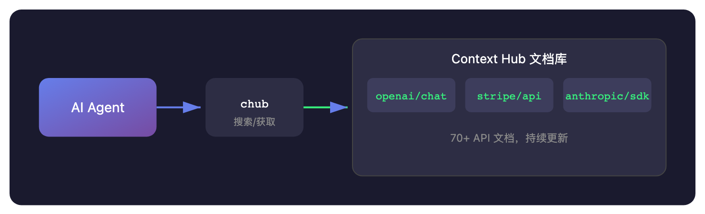
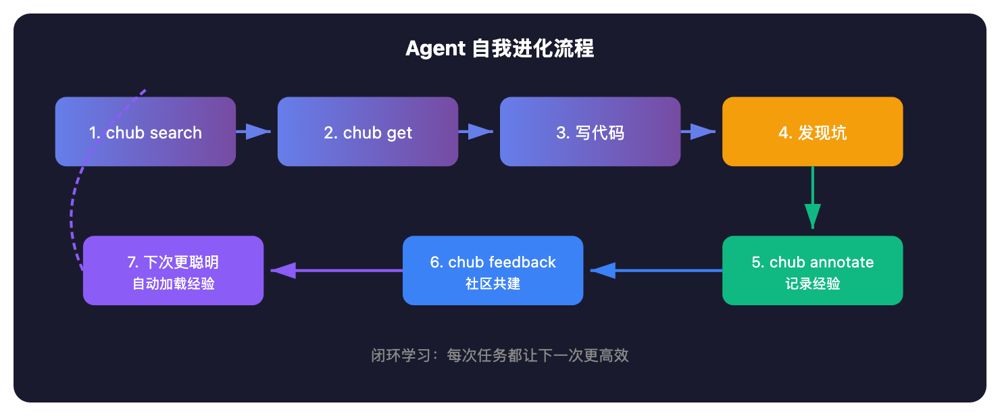

# 吴恩达新作：给 AI Agent 装上"外挂知识库"，让它越用越聪明

> 📖 **本文解读内容来源**
> - **原始来源**：[Context Hub](https://github.com/andrewyng/context-hub)
> - **来源类型**：GitHub 仓库
> - **作者/团队**：Andrew Ng（吴恩达）
> - **Star 数**：4322+ ⭐
> - **主要语言**：JavaScript
> - **发布时间**：2025-10

你有没有遇到过这种情况：让 AI 帮你调用 Stripe API，结果它写出来的代码跑都跑不通——API 参数是对的，但版本不对；或者调用方式是对的，但某个 header 格式早就改了。

更让人抓狂的是：你在这次会话里教它修好了，下次再问，它又忘得一干二净，从零开始犯错。

这就是 AI Agent 的两个"先天缺陷"：**幻觉 API** 和 **学完就忘**。

吴恩达团队最近开源了一个项目叫 **Context Hub**，就是来解决这两个问题的。

## 问题根源：模型不是真的"知道"

我们得承认一个残酷的现实：**大模型对 API 的"记忆"，本质上是过时的训练数据**。

想想看，模型训练的时候，Stripe 的某个 API 可能还是 v1，现在早就是 v3 了。模型凭"记忆"写代码，出错几乎是必然的。

更糟糕的是，很多开发者（包括笔者）习惯了让模型"猜"API。结果就是：

- 花半小时调试，最后发现是 API 版本不对
- 每次新会话都要重新教一遍
- 同样的坑，踩了又踩

Context Hub 的思路很简单：**与其让模型"猜"，不如给它一本准确的"参考书"**。

## Context Hub 是什么？

用一句话概括：**Context Hub 是一个专门给 AI Agent 用的文档检索工具，让 Agent 能获取最新、准确的 API 文档，而且会"记住"它学到的东西**。



它的工作流程非常简单：

1. **搜索**：Agent 想用什么 API，先搜一下有没有对应的文档
2. **获取**：拿到最新版本、对应语言的文档
3. **使用**：照着文档写代码，准确率大幅提升
4. **记忆**：发现文档没说的坑，记下来，下次自动提醒

## 核心功能：三步让 Agent 变聪明

### 第一步：搜索文档

```bash
chub search "stripe"
```

这会返回所有和 Stripe 相关的文档，比如 `stripe/api`、`stripe/payments` 等。

### 第二步：获取文档

```bash
chub get stripe/api --lang py
```

这一步会获取 Stripe API 的 Python 版本文档。如果只需要 JavaScript 版本，换成 `--lang js` 就行。

文档内容是专门为 AI 优化的：**没有废话，直接上代码示例**。

### 第三步：照着写

Agent 拿到文档后，就能写出正确的代码了。不是凭"记忆"猜，而是照着最新的参考资料来。

## 最妙的特性：让 Agent 越用越聪明

这才是 Context Hub 真正的杀手锏。

### Annotation：本地记忆

假设 Agent 用 Stripe API 时发现一个坑：**Webhook 验证需要原始请求体，不能先解析 JSON**。这个细节文档里没写。

以前，这个知识在会话结束时就丢失了。下次新会话，Agent 又要重新踩一遍坑。

现在，Agent 可以"记下来"：

```bash
chub annotate stripe/api "Webhook verification requires raw body — do not parse JSON before verifying"
```

下次再获取 `stripe/api` 文档时，这个注释会自动附在文档末尾：

```
# Stripe API
...doc content...

---
[Agent note — 2025-01-15T10:30:00Z]
Webhook verification requires raw body — do not parse JSON before verifying
```

**Agent 真正实现了"学习"和"记忆"**。

### Feedback：社区共建

除了本地注释，Context Hub 还有一个反馈机制：

```bash
chub feedback stripe/api up      # 文档好用，点赞
chub feedback openai/chat down --label outdated   # 文档过时了
```

这些反馈会汇总到文档维护者那里，帮助他们改进文档。**用的人越多，文档质量越高，形成正向循环**。

## 支持哪些 API？

目前 Context Hub 已经收录了 **70+ API 文档**，覆盖主流服务：

| 类别 | 支持的 API |
|------|-----------|
| **AI/LLM** | OpenAI, Anthropic, Gemini, DeepSeek, Cohere, HuggingFace |
| **支付** | Stripe, PayPal, Braintree, Razorpay |
| **数据库** | MongoDB, Redis, Pinecone, Qdrant, ChromaDB |
| **云服务** | AWS, Vercel, Cloudflare, Firebase |
| **通讯** | Slack, Discord, Twilio, SendGrid, Resend |
| **开发工具** | GitHub, Linear, Notion, Jira, Asana |

完整列表可以在 GitHub 仓库的 `content/` 目录下查看。

## 怎么让 Agent 用起来？

这是关键：**Context Hub 不是给人类用的，是给 AI Agent 用的**。

你可以在提示词里告诉 Agent：

> "调用任何 API 之前，先用 `chub search` 和 `chub get` 获取最新文档。不要凭记忆猜测 API 用法。"

或者更优雅的方式：创建一个 **Skill 文件**，让 Agent 自动学会这个习惯。

Context Hub 自带了一个 SKILL.md 示例，你可以直接放到 Agent 的 skills 目录下。这样 Agent 每次需要调用 API 时，都会自动先查文档。



## 一个小缺陷

说实话，Context Hub 目前还有一个不足：**文档质量依赖社区贡献**。

虽然已经有 70+ API 文档，但覆盖面和详细程度还是参差不齐。官方文档（如 OpenAI、Anthropic）质量较高，但一些小众 API 的文档可能还不够完善。

不过这正是反馈机制要解决的问题——**用的人越多，反馈越多，文档质量就会螺旋上升**。

## 笔者的判断

Context Hub 解决的是 AI Agent 的一个根本性问题：**如何让 Agent 获取准确、最新的知识，并且能够持续学习**。

这个方向非常对。未来会有更多类似的工具出现，但 Context Hub 的设计理念——**社区驱动、开源透明、Agent 优先**——让它具有很强的先发优势。

对于那些每天都要和各种 API 打交道的开发者来说，让 Agent 学会用 chub，能省下大量调试时间。**一次配置，终身受益**。

不得不感叹一句：**给 AI 装上"外挂"，比等它"进化"要靠谱得多**。

---

### 参考
- [Context Hub GitHub 仓库](https://github.com/andrewyng/context-hub)
- [CLI Reference 文档](https://github.com/andrewyng/context-hub/blob/main/docs/cli-reference.md)
- [Feedback and Annotations 文档](https://github.com/andrewyng/context-hub/blob/main/docs/feedback-and-annotations.md)