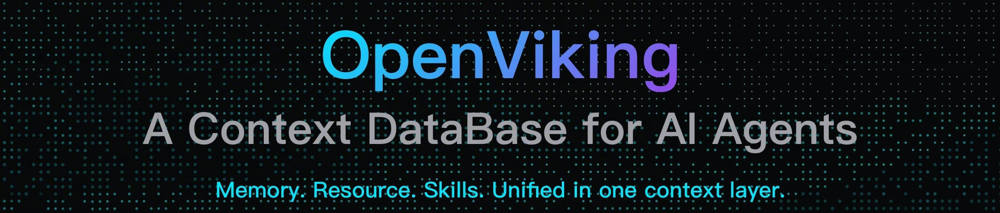
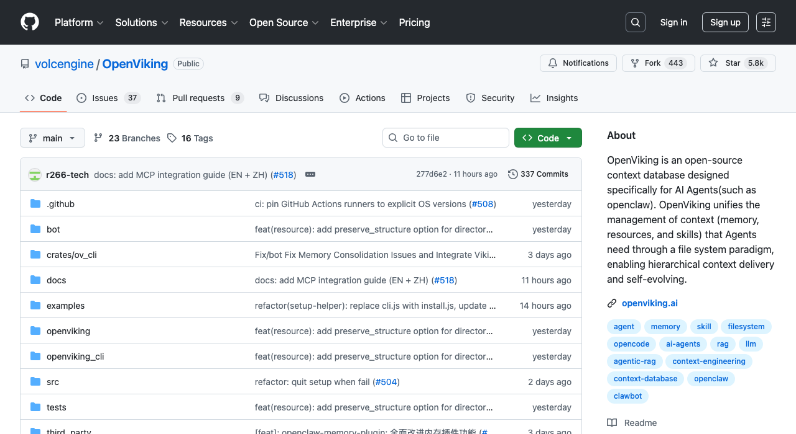

# OpenViking：给 AI Agent 装上"文件系统大脑"

> 📖 **本文解读内容来源**
>
> - **原始来源**：[OpenViking GitHub 仓库](https://github.com/volcengine/OpenViking)
> - **来源类型**：GitHub 仓库
> - **作者/团队**：火山引擎 (volcengine)
> - **Star 数**：5800+
> - **主要语言**：Python



---

你有没有遇到过这种场景：你的 AI Agent 跑着跑着，上下文越来越长，token 消耗像流水一样，最后要么截断丢信息，要么直接爆窗口？

更头疼的是，Agent 的记忆散落在各处——对话记录在数据库，文档资源在向量库，技能配置在代码里。想找点东西，检索结果像开盲盒，不知道为什么搜出这个，也不知道漏了什么。

火山引擎开源的 **OpenViking**，就是要解决这些让 Agent 开发者抓狂的问题。这是一个专为 AI Agent 设计的**上下文数据库**，用一套"文件系统范式"把记忆、资源、技能统一管理起来。

## OpenViking 到底是什么？

用一句话概括：**OpenViking 是 AI Agent 的"文件系统大脑"**。

就像程序员用文件系统组织代码、文档、配置一样，OpenViking 让 Agent 用同样的方式组织它的记忆、资源和技能。每个上下文片段都有唯一的 URI，Agent 可以像 `ls`、`find` 浏览文件一样，精确、可追溯地管理上下文。

这和传统 RAG 有什么区别？

| 对比维度 | 传统 RAG | OpenViking |
|---------|---------|-----------|
| 存储模式 | 扁平向量切片 | 层级文件系统 |
| 检索方式 | 单次向量匹配 | 目录递归检索 |
| 可观察性 | 黑盒检索 | 可视化轨迹 |
| 上下文组织 | 碎片化 | 统一 URI 管理 |
| Token 消耗 | 全量加载 | 分层按需加载 |

传统 RAG 就像把所有文件内容倒进一个池子，检索时靠向量相似度"盲捞"。OpenViking 则是保留了目录结构，先定位目录，再精细检索，既有语义理解，又有结构化定位。

## 核心设计：五大创新解决五大痛点

OpenViking 的设计哲学非常清晰——每个痛点对应一个解决方案。

### 文件系统范式：统一管理碎片化上下文

OpenViking 使用 `viking://` 协议，把所有上下文映射到一个虚拟文件系统：

```
viking://
├── resources/          # 资源：项目文档、代码仓库、网页等
│   └── my_project/
│       ├── docs/
│       └── src/
├── user/               # 用户：个人偏好、习惯等
│   └── memories/
│       └── preferences/
└── agent/              # Agent：技能、指令、任务记忆
    ├── skills/
    └── memories/
```

这种设计让 Agent 可以用标准命令（`ls`、`find`、`tree`）精确操作上下文，不再是模糊的语义匹配，而是可追溯的"文件操作"。

### 分层加载：L0/L1/L2 三级架构

把大段上下文一次性塞进 prompt，既贵又容易超窗口。OpenViking 的分层设计解决了这个问题：

- **L0（摘要层）**：一句话总结，约 100 tokens，用于快速判断相关性
- **L1（概览层）**：核心信息和使用场景，约 2k tokens，供 Agent 规划决策
- **L2（详情层）**：完整原始数据，仅在必要时加载

这就像看书先看目录，再翻章节概要，最后才细读正文。Agent 不需要每次都加载全文，大大降低 token 成本。

### 目录递归检索：先定位再精搜

传统 RAG 的单次向量检索，面对复杂查询意图往往力不从心。OpenViking 的**目录递归检索策略**更智能：

1. **意图分析**：解析查询生成多个检索条件
2. **初始定位**：向量检索快速定位高分目录
3. **精细探索**：在目录内二次检索更新候选集
4. **递归下钻**：对子目录递归执行检索
5. **结果聚合**：返回最相关的上下文

这种"先锁定高分目录，再精细探索内容"的策略，既有语义匹配的灵活性，又有结构化定位的准确性。

### 可视化轨迹：检索过程透明可调试

传统 RAG 的检索链是黑盒，出问题很难排查。OpenViking 保留了完整的检索轨迹——每次检索浏览了哪些目录、定位了哪些文件，全部可追溯。

这意味着你可以清楚看到：为什么搜出这个结果？是不是目录结构有问题？检索逻辑要不要优化？

### 自动会话管理：越用越聪明

OpenViking 内置了记忆自迭代机制。每次会话结束后，系统会异步分析任务执行结果和用户反馈，自动更新到 User 和 Agent 记忆目录：

- **用户记忆更新**：记录用户偏好，让 Agent 响应更贴合需求
- **Agent 经验积累**：提取操作技巧、工具使用经验

这让 Agent 具备了"自我进化"的能力——用得越多，越懂你的需求。

## 实战效果：数据说话

OpenViking 团队用 OpenClaw 做了对比实验，测试数据基于 LoCoMo10 长对话数据集（1540 个测试用例）：

| 实验组 | 任务完成率 | 输入 Token 消耗 |
|-------|----------|---------------|
| OpenClaw 原生 | 35.65% | 24,611,530 |
| OpenClaw + LanceDB | 44.55% | 51,574,530 |
| OpenClaw + OpenViking | 52.08% | 4,264,396 |

结果相当惊人：

- **任务完成率提升 43-49%**（相比原生 OpenClaw）
- **Token 成本降低 83-96%**（相比 LanceDB 方案）

笔者认为，这个数据最有说服力的是**效率与效果的双赢**——通常降成本会牺牲效果，但 OpenViking 反而同时提升了两者。分层加载和精准检索的威力可见一斑。

## 快速上手：三步跑起来

OpenViking 的安装使用非常简单：

```bash
# 1. 安装
pip install openviking --upgrade

# 2. 配置模型服务（创建 ~/.openviking/ov.conf）
# 支持 Volcengine、OpenAI、LiteLLM 等多种模型

# 3. 启动服务
openviking-server
```

然后就可以用 CLI 操作上下文了：

```bash
# 添加资源
ov add-resource https://github.com/volcengine/OpenViking

# 浏览目录
ov ls viking://resources/
ov tree viking://resources/volcengine -L 2

# 语义检索
ov find "what is openviking"
```

值得一提的是，OpenViking 支持多种模型后端：Volcengine（豆包）、OpenAI、以及通过 LiteLLM 接入的 Claude、DeepSeek、Gemini、Qwen、vLLM、Ollama 等。无论你用哪家模型，都能无缝接入。



## 笔者观点：为什么 OpenViking 值得关注？

**观点一：文件系统范式是对传统 RAG 的降维打击**

传统 RAG 的扁平存储，本质上放弃了信息的结构化价值。OpenViking 的文件系统范式，让 Agent 具备了"目录导航"能力，这和人类的知识组织方式更接近。笔者认为，这是一个正确的方向。

**观点二：分层加载是 Agent 工程化的必经之路**

任何严肃的 Agent 应用，都面临着上下文管理的挑战。全量加载不可持续，分层加载是工程上唯一合理的选择。OpenViking 把这个最佳实践产品化了。

**观点三：可视化检索轨迹是调试利器**

Agent 开发最头疼的就是"为什么搜出这个结果"。OpenViking 的检索轨迹让这个问题变得可回答，这对生产环境的调优至关重要。

---

OpenViking 是一个相当务实的项目——它没有发明新概念，而是把文件系统这个经过几十年验证的范式，创造性地应用到 Agent 上下文管理上。大道至简，最朴素的方案往往最有效。

目前 OpenViking 还在快速迭代中，Star 数已突破 5800，社区活跃度很高。如果你正在开发 AI Agent，强烈建议试用一下——也许它能解决你那个"上下文爆炸"的头疼问题。

### 参考

- [OpenViking GitHub 仓库](https://github.com/volcengine/OpenViking)
- [OpenViking 官网](https://www.openviking.ai)
- [OpenViking 文档](https://www.openviking.ai/docs)