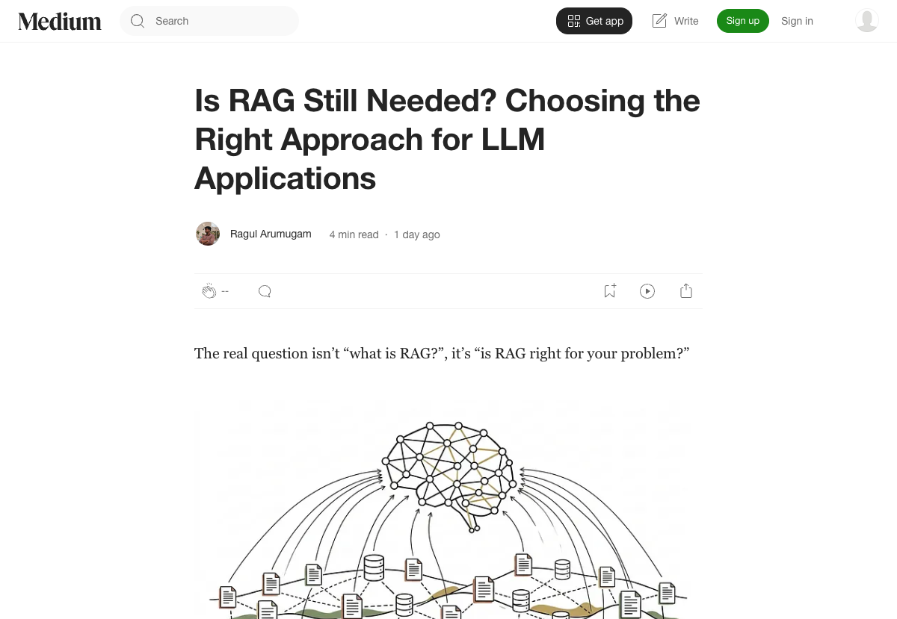

# 大模型上下文窗口狂飙到百万级，RAG 还要不要用？

> 📖 **本文解读内容来源**
>
> - **原始来源**：[Is RAG Still Needed? Choosing the Right Approach for LLM Applications](https://medium.com/@ragularumugam/is-rag-still-needed-choosing-the-right-approach-for-llm-applications-baafb3e9298a)
> - **来源类型**：技术博客
> - **作者**：Ragul Arumugam
> - **发布时间**：2026-03-10

---

最近圈子里的朋友经常问笔者一个问题：**大模型上下文窗口都 200 万 tokens 了，RAG 还要不要用？**

说实话，这个问题笔者也思考了很久。2023 年的时候，大家一窝蜂上 RAG，好像不用 RAG 就做不出合格的 AI 应用。但现在情况变了——GPT-4、Claude 的上下文窗口动辄几十万甚至上百万，推理能力也强了，Agent 框架能让模型自己调工具、自己上网搜。

那 RAG 真的要"退役"了吗？

读完这篇文章后，笔者有了一些新的思考。**核心结论是：问题从来不是"什么是 RAG"，而是"RAG 是不是你问题的正确工具"。**

## 大模型的核心短板：时间冻结

文章开篇就点出了一个笔者深有体会的问题：**无论多强大的 LLM，本质上都是一张"快照"。**

训练结束那一刻，它的知识就定格了。它没法知道：
- 昨天刚发生的新闻
- 你公司的内部文档
- 实时变化的库存数据
- 用户最新的行为记录

这就是为什么即便模型再强，也需要某种"外部知识注入"机制。**问题不是"要不要外部知识"，而是"怎么注入最合适"。**

## 三种方案的选择框架

文章给出了一个很实用的决策框架，把"给模型注入外部知识"分成三条路：

### 方案一：上下文填充（Context Stuffing）

**适合场景**：数据量小、变化频繁、精度要求高

说白了就是把相关内容直接塞进 Prompt 里。比如你做的是"公司 HR 政策问答助手"，全部政策文档加起来也就 50 页，那就直接塞进去，让模型带着"小抄"回答。

**优点**：实现简单、效果稳定、不需要额外的检索系统。

**缺点**：成本高（每 token 都要算钱）、有上下文窗口限制、响应可能变慢。

### 方案二：检索增强生成（RAG）

**适合场景**：数据量大、需要精准溯源、内容持续更新

先从知识库里"搜"出相关片段，再让模型基于这些片段回答。这就是大家最熟悉的 RAG。

**优点**：成本低（只检索相关内容）、可溯源（知道答案从哪来）、知识可动态更新。

**缺点**：系统复杂度增加（要维护向量库、检索策略）、检索质量直接影响最终效果。

### 方案三：微调（Fine-tuning）

**适合场景**：需要特定的输出风格、领域术语要求高、对知识时效性要求低

在领域数据上"再训练"一下模型，让它更懂你的业务。

**优点**：输出风格可控、推理速度快、不需要外部知识库。

**缺点**：**知识还是冻结的**（微调完就不更新了）、训练成本高、需要标注数据。

## 笔者的判断：三个原创观点

读完这篇文章，笔者有三个看法想和大家分享。

### 观点一：RAG 没死，但"无脑 RAG"的时代过去了

2023 年的时候，很多人把 RAG 当成万能钥匙——什么场景都先搭一套 RAG 系统再说。**这种做法确实该结束了。**

如果你的数据量不大（比如几千条 FAQ），直接上下文填充反而更简单、效果更稳定。如果你的核心诉求是"让模型说我们行业的话"，那微调可能更合适。

**RAG 应该是一个"当且仅当需要"才启用的方案**，而不是默认选项。

### 观点二：上下文窗口变大，反而让 RAG 更有价值

这个观点可能有点反直觉。很多人觉得上下文窗口大了，RAG 就没用了。但笔者恰恰认为：**上下文窗口变大，让 RAG 有机会做得更好。**

为什么？因为以前 RAG 受限于上下文窗口，只能检索出 top-3 或 top-5 的片段塞进去，信息可能不够完整。现在上下文窗口大了，可以塞更多检索结果进去，**让模型看到更完整的上下文**，回答质量反而可能提升。

所以上下文窗口的扩大，不是 RAG 的"送终"，而是"升级机会"。

### 观点三：未来更可能是"混合架构"

文章的框架把三种方案分得很清楚，但笔者觉得实际工程中，**最优解往往是混合的**。

比如：
- 热点数据用 RAG（实时检索最新信息）
- 领域术语用微调（让模型更懂专业表达）
- 核心规则用上下文填充（确保关键信息不被遗漏）

**"一把钥匙开一把锁"才是工程师该有的思维。**

## 实战决策清单

最后，给读者一个简化的决策清单，帮你快速判断用哪种方案：

| 你的场景 | 推荐方案 |
|---------|---------|
| 数据量 < 100 页，变化频繁 | 上下文填充 |
| 数据量 > 1000 页，需要溯源 | RAG |
| 需要特定输出风格/术语 | 微调 |
| 需要实时数据 + 领域风格 | RAG + 微调 |
| 数据极其敏感，不能传给模型 | 本地 RAG + 小模型 |

## 写在最后

读完这篇文章，笔者最大的感悟是：**技术没有绝对的"好"与"坏"，只有"适合"与"不适合"。**

RAG 也好，微调也罢，甚至最简单的上下文填充，都是工具箱里的工具。**好的工程师，不是会很多工具的人，而是知道什么场景用什么工具的人。**

不得不感叹一句：**大道至简，合适才是最好的。**

希望这篇文章能帮你在面对"要不要 RAG"这个问题时，多一份从容和判断。

---

### 参考

- [Is RAG Still Needed? Choosing the Right Approach for LLM Applications](https://medium.com/@ragularumugam/is-rag-still-needed-choosing-the-right-approach-for-llm-applications-baafb3e9298a)