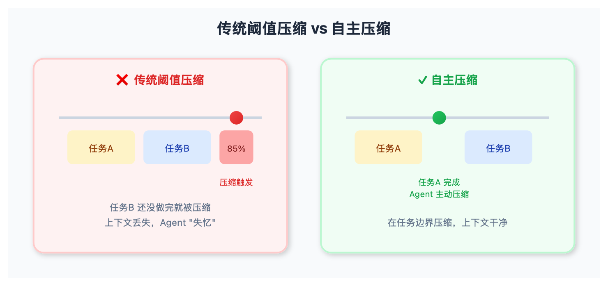
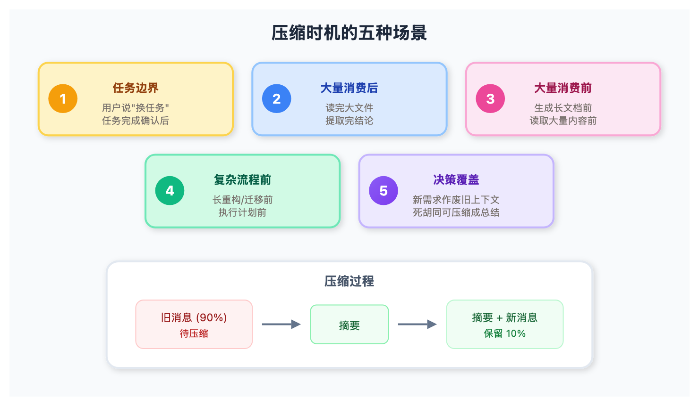

# LangChain 新功能：让 Agent 自己决定何时"清空大脑"

> 📖 **本文解读内容来源**
> - **原始来源**：[Autonomous context compression](https://blog.langchain.com/autonomous-context-compression/) - LangChain 博客
> - **来源类型**：技术博客
> - **作者/团队**：Mason Daugherty (LangChain)
> - **发布时间**：2026-03-12

你有没有遇到过这种情况：和 AI 聊着聊着，它突然开始"失忆"——忘了之前说过什么，甚至把几轮对话前的结论推翻重来。

这不是 AI 智商不够，而是**上下文窗口爆了**。

最近 LangChain 在 Deep Agents SDK 里加了个有意思的功能：**让 Agent 自己决定什么时候压缩上下文**。不是被动等到 token 阈值触发，而是主动选择合适的时机。

这事儿看似小，实则指向 Agent 设计的一个大方向。

## 问题：固定阈值压缩太"傻"

传统 Agent 框架是怎么处理上下文的？简单粗暴——设个阈值，比如上下文用到 85% 就自动压缩。

问题来了：**压缩时机不对，后果很严重**。

举个例子：
- Agent 正在做一个复杂的代码重构，改了十几个文件，马上要收尾了
- 这时候触发压缩，之前的上下文被压缩成几句摘要
- Agent 忘了改了什么、为什么这么改，开始胡乱操作

这就是典型的"在错误的时间做了正确的事"。

相反，有些时机压缩是合理的：
- 用户说"好了，换下一个任务"——旧任务上下文可以清了
- Agent 刚读完一个大文件，提取出关键结论——文件内容不需要了
- Agent 要开始一个长流程，需要干净的上下文空间

LangChain 的思路是：**把这些判断交给 Agent 自己**。



## 方案：给 Agent 一个"清空大脑"的工具

Deep Agents SDK 新增了一个中间件 `create_summarization_tool_middleware`，给 Agent 暴露一个工具，让它自主触发上下文压缩。

```python
from deepagents import create_deep_agent
from deepagents.backends import StateBackend
from deepagents.middleware.summarization import (
    create_summarization_tool_middleware,
)

backend = StateBackend

model = "openai:gpt-5.4"
agent = create_deep_agent(
    model=model,
    middleware=[
        create_summarization_tool_middleware(model, backend),
    ],
)
```

Agent 拿到这个工具后，可以在它认为合适的时机主动调用。

## 什么时候该压缩？

LangChain 给出了一些指导场景：

**在清晰的任务边界**：
- 用户说"开始新任务"，旧上下文无关了
- Agent 完成交付物，用户确认任务结束

**大量上下文消费后**：
- Agent 做完研究任务，从大量材料中提取出结论
- 读完一个大文件，获得了需要的信息

**大量上下文消费前**：
- Agent 准备生成一份长文档
- 要读取大量新内容

**进入复杂多步骤流程前**：
- 要开始长重构、迁移、多文件编辑
- 做完计划，准备执行步骤

**决策覆盖旧上下文**：
- 新需求出现，旧上下文作废
- 有很多死胡同和试错，可以压缩成总结



## 压缩时发生了什么？

当 Agent 调用压缩工具时：
1. 保留最近的消息（约 10% 的上下文）
2. 之前的内容压缩成摘要
3. 压缩工具的调用和响应保留在近期上下文里

Deep Agents 有个贴心的设计：所有对话历史都保存在虚拟文件系统里。万一压缩错了，还能恢复。

## 实测效果：Agent 挺保守

LangChain 团队测试了这个功能：
- 自定义评估套件：测试 Agent 在应该/不应该压缩的场景下的表现
- Terminal-bench-2：没有观察到任何自主压缩
- 团队自己的编程任务：Agent 很保守，但压缩时机都选得不错

**保守是对的**。压缩是不可逆的操作（虽然有恢复机制），错了很打断工作流。Agent 宁可多等一会儿，也不乱压缩。

## 笔者怎么看？

这个功能看似小，但指向一个有意思的方向：**让 Agent 更多地掌控自己的行为**。

传统的 Agent 框架是"线束"（Harness）——用各种规则把 Agent 框住：token 阈值压缩、固定工具调用流程、人工干预点……这些都是开发者的手工调优。

但"苦涩的教训"（The Bitter Lesson）告诉我们：**很多时候，让模型自己学，比人工调规则更有效**。

上下文管理就是一个例子：
- 开发者调规则：设 85% 阈值，有时候太早有时候太晚
- 模型自己判断：能感知任务边界、上下文重要性，选对时机

LangChain 团队把这个叫做 "get out of the way"——框架少干预，让模型自己发挥。

当然，这个功能目前还比较早期。压缩粒度、恢复机制、多轮压缩的累积误差，这些问题都需要更多实践来回答。但方向是对的：**把控制权还给 Agent**。

如果你的场景涉及长对话、复杂任务，不妨试试 Deep Agents SDK 或 CLI，感受一下"让 AI 自己管理自己"是什么体验。

---

### 参考
- [Autonomous context compression - LangChain 博客](https://blog.langchain.com/autonomous-context-compression/)
- [Deep Agents SDK - GitHub](https://github.com/langchain-ai/deepagents)
- [Deep Agents 文档](https://docs.langchain.com/oss/python/deepagents/overview)