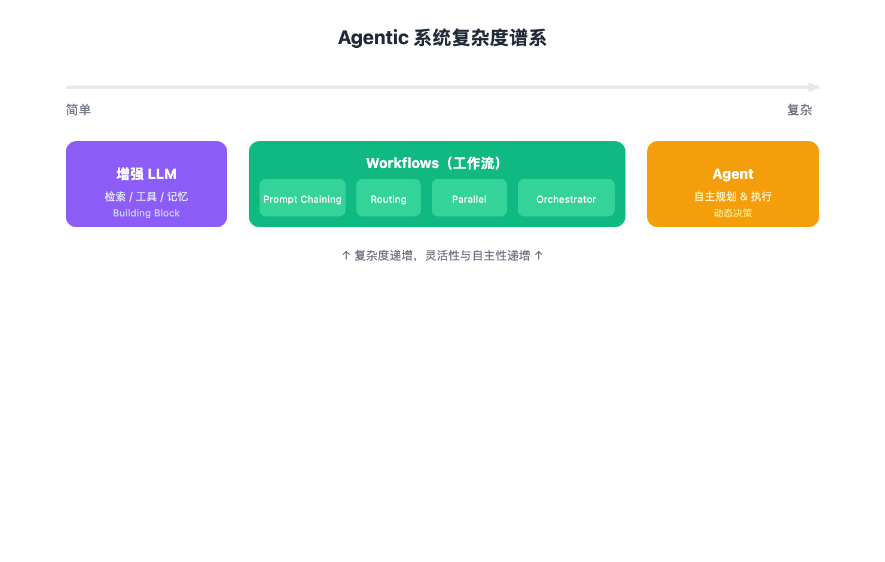
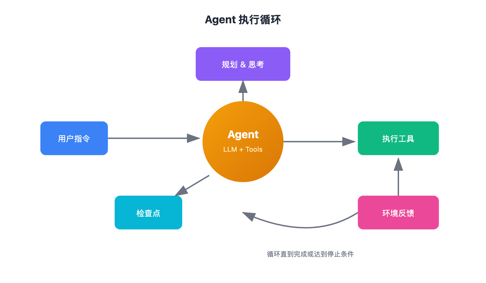

# Anthropic 官方：如何构建真正有效的 AI Agent

> 📖 **本文解读内容来源**
> - **原始来源**：[Building Effective Agents](https://www.anthropic.com/engineering/building-effective-agents)
> - **来源类型**：技术博客
> - **作者/团队**：Erik Schluntz & Barry Zhang @ Anthropic
> - **发布时间**：2024-12-19

过去一年，Anthropic 团队和数十个团队一起搭建 LLM Agent，覆盖各行各业。他们发现一个规律：最成功的实现，往往不用复杂框架，而是用简单、可组合的模式。这篇文章就是他们踩坑经验的结晶。

## 什么是 Agent？

"Agent"这个词被用得太泛了。有人用它指代完全自主的系统，长期独立运行、调用各种工具完成复杂任务；也有人用它指代按预设流程执行的实现。

Anthropic 给了一个更清晰的划分：把所有这些都叫 **Agentic Systems（智能体系统）**，但要做个关键区分：

- **Workflow（工作流）**：LLM 和工具按预设代码路径编排
- **Agent（智能体）**：LLM 动态决定自己的流程和工具使用，保持对任务完成方式的控制

Workflow 就像流水线，每个工位干什么都是规定好的；Agent 就像一个能自主判断的熟练工，给他一个目标，他自己决定怎么做。

## 什么时候该用 Agent？

Anthropic 给了一个很实在的建议：先用最简单的方案，只有当简单方案不够用时，再增加复杂度。

这可能意味着根本不需要 Agent。

Agent 系统通常用延迟和成本换取更好的任务表现。你得想清楚这个交换值不值得。很多应用场景，单次 LLM 调用加上检索和上下文示例，就够了。

如果确实需要更复杂的方案：
- 任务明确、需要可预测性和一致性 → 选 Workflow
- 需要灵活性、模型驱动决策、规模较大 → 选 Agent

## 框架怎么用？

市面上有很多框架：Claude Agent SDK、AWS Strands Agents SDK、Rivet、Vellum 等。它们能简化底层工作：调用 LLM、定义和解析工具、链式调用。

但框架也会带来问题：多一层抽象，底层 prompt 和响应就被藏起来了，调试起来更困难。而且有了框架，很容易忍不住加复杂度，其实简单配置就够用。

Anthropic 的建议是先直接用 LLM API，很多模式几行代码就能实现。如果用框架，一定要搞懂底层代码在干什么。

## 从基础组件到完整 Agent

下面这张图展示了 Agentic 系统的完整谱系，从最基础的增强 LLM 开始，逐步增加复杂度。

### 基础组件：增强 LLM

一切的基础是一个增强了检索、工具、记忆能力的 LLM。现在的模型可以主动使用这些能力：生成搜索查询、选择合适的工具、决定保留什么信息。

实现上有两个关键：根据具体场景定制这些能力，以及提供清晰、文档完善的接口。Anthropic 新出的 Model Context Protocol（MCP）就是一种实现方式，让开发者可以用简单的客户端实现接入日益丰富的第三方工具生态。

### Workflow 1：Prompt Chaining（提示链）

把任务拆成一系列步骤，每个 LLM 调用处理上一个的输出。可以在中间步骤加程序检查，确保流程没跑偏。

适用场景：任务可以清晰地拆分成固定子任务，愿意用延迟换取更高准确率。

典型例子：
- 先生成营销文案，再翻译成其他语言
- 先写文档大纲，检查大纲是否符合要求，再根据大纲写正文

### Workflow 2：Routing（路由）

对输入进行分类，引导到专门的处理流程。这样可以分离关注点，构建更专业的 prompt。

适用场景：复杂任务有明显分类，不同类型最好分开处理，且分类可以准确完成。

典型例子：
- 客服问题分类：一般问题、退款请求、技术支持，分别导向不同流程
- 简单问题用便宜模型（Haiku），复杂问题用强力模型（Sonnet）

### Workflow 3：Parallelization（并行化）

让多个 LLM 同时工作，输出汇总。两种变体：
- 分片：把任务拆成独立子任务并行执行
- 投票：同一任务执行多次，获得多样输出

适用场景：子任务可以并行加速，或需要多视角、多次尝试来提高置信度。

典型例子：
- 一个模型处理用户查询，另一个筛查不当内容，比同一个 LLM 同时做两件事效果好
- 代码漏洞审查，用多个不同 prompt 各自检查，有问题就标记

### Workflow 4：Orchestrator-Workers（协调者-执行者）

一个中心 LLM 动态拆分任务、分配给工作 LLM、汇总结果。

适用场景：复杂任务，无法预知需要什么子任务。比如改代码，要改几个文件、每个文件怎么改，取决于具体任务。和并行化的关键区别是灵活性，子任务由协调者根据输入动态决定。

典型例子：
- 编程产品，每次修改多个文件
- 搜索任务，从多个来源收集分析信息

### Workflow 5：Evaluator-Optimizer（评估者-优化者）

一个 LLM 生成响应，另一个提供评估反馈，循环迭代。

适用场景：有明确评估标准，迭代优化能带来可衡量的价值。两个信号表明适合这个模式：一是人类给出反馈后，LLM 响应明显改善；二是 LLM 能提供这样的反馈。这就像人类写作者反复打磨文档的过程。

典型例子：
- 文学翻译，有些细微之处翻译模型一开始可能抓不住，但评估模型能给出有用批评
- 复杂搜索任务，需要多轮搜索分析，评估者决定是否继续搜索

### Agent：自主智能体

随着 LLM 在关键能力上成熟（理解复杂输入、推理规划、可靠使用工具、从错误中恢复），Agent 开始在生产环境中落地。

Agent 从人类用户的命令或交互讨论开始。任务明确后，Agent 规划并独立执行，可能在过程中回来找人类要更多信息或判断。执行过程中，Agent 在每一步从环境获取"真实信息"（如工具调用结果或代码执行）来评估进展。可以在检查点暂停等待人类反馈，或遇到障碍时暂停。任务通常在完成时终止，也常设置停止条件（如最大迭代次数）来保持控制。

Agent 能处理复杂任务，但实现往往很直接，本质上就是 LLM 在循环中根据环境反馈使用工具。所以关键是把工具集和文档设计得清晰、周到。

适用场景：开放性问题，难以预测需要多少步，无法硬编码固定路径。LLM 可能运行很多轮，需要对其决策有一定信任。Agent 的自主性使它们非常适合在可信环境中规模化任务。

自主性也意味着更高成本和错误累积风险。建议在沙盒环境中充分测试，并设置适当防护。

典型例子（来自 Anthropic 自己的实现）：
- 解决 SWE-bench 任务的编程 Agent，根据任务描述修改多个文件
- "Computer Use" 参考实现，Claude 用电脑完成任务

## 组合与定制

这些模式不是死板的教条，而是常见的模式，开发者可以根据场景组合定制。关键是衡量性能、迭代实现。重复一遍：只有当复杂度能明显改善结果时，才值得添加。

## Anthropic 的三点核心原则

文章最后总结了三个原则：

1. 保持简单：Agent 设计能多简单就多简单
2. 保持透明：明确展示 Agent 的规划步骤
3. 精心设计接口：工具文档和测试要到位

框架能帮你快速上手，但迈向生产时，别犹豫降低抽象层，用基础组件构建。

## 附录：两个最佳实践场景

### 客户支持

客户支持结合了熟悉的聊天机器人界面和增强的工具集成能力，非常适合 Agent 落地：
- 支持交互天然符合对话流程，同时需要访问外部信息和执行操作
- 工具可以集成：客户数据、订单历史、知识库文章
- 退款、更新工单等动作可以程序化处理
- 成功与否可以通过用户定义的解决标准清晰衡量

一些公司已经用按效果付费的定价模型证明了这条路可行，只在成功解决时收费，说明他们对自己 Agent 的效果有信心。

### 编程 Agent

软件开发领域展现了 LLM 能力的潜力，从代码补全进化到自主解决问题：
- 代码方案可以通过自动化测试验证
- Agent 可以用测试结果作为反馈迭代方案
- 问题空间定义清晰、结构化
- 输出质量可以客观衡量

Anthropic 自己的实现中，Agent 现在可以仅根据 PR 描述解决 SWE-bench Verified 基准测试中的真实 GitHub 问题。但自动化测试只能验证功能，人工审查对于确保方案符合更广泛的系统要求仍然至关重要。

---

Anthropic 这篇文章的核心信息很清晰：成功的 Agent 未必是最复杂的，而是最适合需求的。从简单 prompt 开始，用完善评估优化，只有简单方案不够时才上多步骤 Agent 系统。

这和我之前读到的 Harness 那篇文章形成了呼应：模型只是大脑，Harness（或者说这篇文章里的 Workflows 和 Agent 模式）才是让大脑干活的工具箱。而 Anthropic 的实践告诉我们要克制，先用最简单的工具，不够再加。

### 参考

- [Building Effective Agents - Anthropic](https://www.anthropic.com/engineering/building-effective-agents)
- [Model Context Protocol](https://modelcontextprotocol.io/)
- [Claude Agent SDK](https://github.com/anthropics/anthropic-sdk-python)