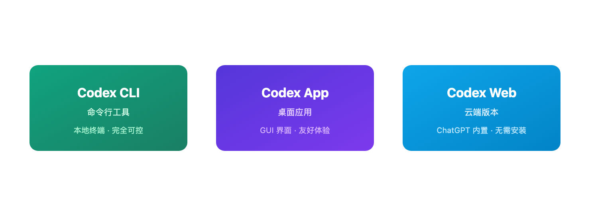
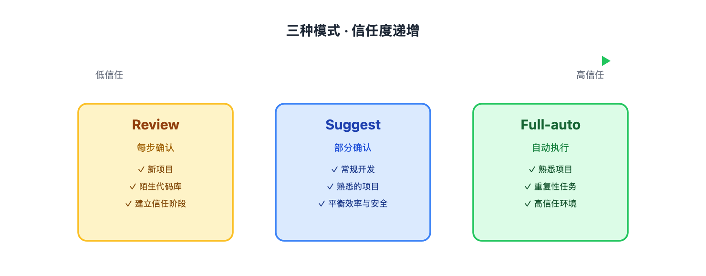

# OpenAI 官方：Codex 使用最佳实践

> 📖 **本文解读内容来源**
> - **原始来源**：[Best practices for Codex](https://developers.openai.com/codex/learn/best-practices/)
> - **来源类型**：技术文档
> - **作者/团队**：OpenAI

用 AI 写代码的工具越来越多，OpenAI 的 Codex 是其中受关注的一款。它是一个能跑在本地的编程 Agent，可以帮你改代码、写测试、甚至执行复杂的多步骤任务。

用好了是帮手，用不好就是个"人工智障"。OpenAI 官方最近发布了 Codex 的最佳实践指南，讲的就是怎么让这个工具真正派上用场。

## Codex 是什么？

简单说，Codex 是一个在终端里跑的 AI 编程助手。你给它一个任务，它会在本地环境里读代码、改代码、跑命令，直到任务完成。

它有三种形态：
- **Codex CLI**：命令行工具，跑在本地终端
- **Codex App**：桌面应用，体验更友好
- **Codex Web**：云端版本，在 ChatGPT 里用

这篇文章主要讲 CLI 的用法，因为 CLI 的可控性最强，也最能体现这些最佳实践的价值。



## 三种运行模式，选对很关键

Codex 有三种运行模式，对应不同的信任程度和场景：

| 模式 | 每一步都要确认 | 适合场景 |
|------|--------------|---------|
| Review | 是 | 新项目、不熟悉的代码库 |
| Suggest | 部分确认 | 常规开发任务 |
| Full-auto | 否 | 熟悉的项目、重复性任务 |

笔者的建议：先用 Review 模式熟悉 Codex 的行为模式，等建立了信任再逐步放开。Full-auto 模式确实爽，但前提是你得知道它在干什么。



## AGENTS.md：给 Agent 写的 README

这是 Codex 最重要的配置文件。你可以把它理解成"给 Agent 看的 README"。

README.md 是给人看的，AGENTS.md 是给 Agent 看的。两者互补，不是替代关系。

一个典型的 AGENTS.md 长这样：

```markdown
# AGENTS.md

## 项目概述
这是一个 Next.js + TypeScript 项目，使用 pnpm 管理依赖。

## 常用命令
- 安装依赖：`pnpm install`
- 启动开发服务器：`pnpm dev`
- 运行测试：`pnpm test`
- 代码检查：`pnpm lint`

## 代码风格
- 使用单引号，不加分号
- 组件放在 `src/components/` 目录
- 测试文件和源文件放在同一目录，后缀 `.test.tsx`

## PR 规范
- 标题格式：`[模块名] 简短描述`
- 提交前必须通过 lint 和 test
```

为什么要写这个？因为 Agent 不知道你项目的约定。它只会"聪明地"瞎猜，然后给你制造惊喜。AGENTS.md 就是把这些约定明确下来，减少惊喜。

大项目可以用多个 AGENTS.md。Codex 会读取离当前文件最近的那个，所以每个子项目都可以有自己的配置。

## PLANS.md：多步骤任务的秘密武器

有些任务不是一句命令能搞定的。比如"把这个 React 项目迁移到 Next.js App Router"，这种任务可能要改几十个文件，跑很多次测试。

PLANS.md 就是用来规划这种复杂任务的。Codex 在执行前会先写一个计划，你确认后再动手。

一个 PLANS.md 示例：

```markdown
# 迁移到 App Router

## 背景
当前使用 Pages Router，需要迁移到 App Router 以支持 Server Components。

## 执行计划
1. 创建 `app/` 目录结构
2. 迁移 `_app.tsx` 和 `_document.tsx`
3. 逐页迁移页面组件
4. 更新 API 路由
5. 移除 `pages/` 目录
6. 更新测试用例
7. 验证构建和运行

## 风险点
- 某些第三方库可能不兼容
- getServerSideProps 需要改为 async 组件

## 回滚方案
如果迁移失败，回退到 `pages/` 目录版本。
```

有了这个计划，Codex 的执行会更有条理，你也更容易追踪进度。如果它跑偏了，你可以及时纠正。

## 安全配置：沙盒模式

让 AI 在本地跑命令是有风险的。Codex 支持沙盒模式，可以把它的操作隔离起来。

沙盒有几种级别：
- **Full sandbox**：完全隔离，不能访问网络和敏感文件
- **Workspace-only**：只能访问当前项目目录
- **No sandbox**：无限制（不推荐）

笔者的做法：新项目用 Full sandbox，熟悉的项目用 Workspace-only。从不使用 No sandbox 模式。

配置方法：在项目根目录创建 `codex.json`：

```json
{
  "sandbox": {
    "mode": "workspace",
    "allowedCommands": ["pnpm", "node", "git"]
  }
}
```

## Prompting 技巧

怎么给 Codex 下指令，效果差别很大。

### 坏例子
```
帮我优化这个代码
```

### 好例子
```
优化 src/utils/date.ts 中的 formatDate 函数：
1. 当前实现用正则解析日期，性能差
2. 改用原生 Date API
3. 保持函数签名不变
4. 添加单元测试覆盖边界情况
```

关键点：
- 明确目标文件
- 说明当前问题和期望方案
- 列出约束条件
- 提醒写测试

Codex 的理解能力有限，指令越具体，结果越靠谱。

## Long-horizon Tasks：让它跑久一点

有些任务需要较长时间才能完成，比如重构、迁移、性能优化。Codex 支持 long-horizon 模式，可以持续运行更长时间。

使用方法：
```bash
codex --full-auto --timeout 30m "重构用户模块，拆分为微服务架构"
```

建议：
- 用 PLANS.md 规划步骤
- 定期检查进度
- 设置合理超时时间
- 准备好回滚方案

## 几个实用技巧

### 1. 让它先读代码再动手
```
先阅读 src/auth/ 目录下的所有文件，理解认证逻辑，然后提出优化建议。
```

### 2. 指定模型版本
不同模型能力不同。简单任务用快模型，复杂任务用强模型。
```bash
codex --model gpt-5.4 "..."
```

### 3. 善用 Agent Skills
Codex 支持 Skills，可以扩展能力。比如 code-review skill 可以在修改后自动做代码审查。

### 4. 检查它的输出
即使是 Full-auto 模式，也要抽查它的修改。`git diff` 是你的朋友。

## 笔者的使用心得

用了几个月 Codex，几点感受：

**它擅长的事**：
- 写样板代码
- 重构和迁移
- 写测试用例
- 代码审查建议

**它不擅长的事**：
- 理解复杂业务逻辑
- 做架构决策
- 处理遗留系统的边界情况

**最佳实践的核心**：
- 配好 AGENTS.md，减少它的猜测
- 用 PLANS.md 规划复杂任务
- 从 Review 模式开始建立信任
- 永远检查它的输出

AI 编程工具不会取代程序员，但会用这些工具的程序员会取代不会用的。Codex 不是银弹，用好了能提升效率，用不好就是给自己找麻烦。

## 参考

- [Best practices for Codex](https://developers.openai.com/codex/learn/best-practices/)
- [Custom instructions with AGENTS.md](https://developers.openai.com/codex/guides/agents-md/)
- [Using PLANS.md for multi-hour problem solving](https://developers.openai.com/cookbook/articles/codex_exec_plans/)
- [Run long horizon tasks with Codex](https://developers.openai.com/blog/run-long-horizon-tasks-with-codex/)
- [AGENTS.md 官网](https://agents.md/)