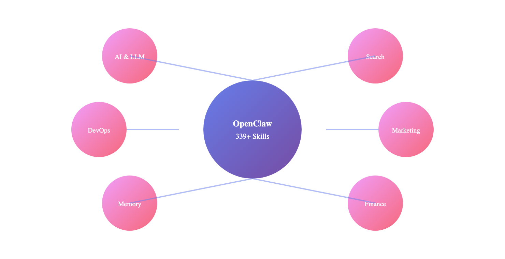
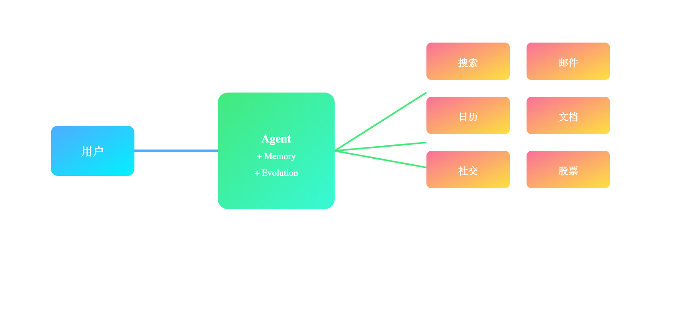

# 终于有人把 AI Agent 技能库整理明白了：带你开箱 OpenClaw 339+ 技能

> 📖 **本文解读内容来源**
> - **原始来源**：[OpenClaw Master Skills](https://github.com/LeoYeAI/openclaw-master-skills) - GitHub 仓库
> - **来源类型**：GitHub 仓库
> - **作者/团队**：MyClaw.ai
> - **技能数量**：339+
> - **更新频率**：每周更新

你有没有遇到过这种情况：想让自己的 AI Agent 干点啥，却发现它"技能不够"——不会搜网页、不会发邮件、不会操作日历……

然后你开始研究各种框架、MCP、工具集成，折腾半天，发现还是差那么点意思。

最近我发现了一个宝藏仓库：**OpenClaw Master Skills**。339 个现成的技能，拿来就能用。从浏览器自动化到邮件发送，从股票分析到智能家居控制，几乎覆盖了你能想到的所有场景。

这不是简单的工具堆砌，而是一套完整的 Agent 能力扩展生态。

## 问题：Agent 能力不够，开发者自己造轮子

现在 AI Agent 框架不少，但大多存在一个痛点：**基础能力缺失**。

你想让 Agent 自动帮你：
- 搜索最新新闻并发邮件汇总
- 分析股票走势并推送到 Slack
- 读取 Notion 文档并生成报告
- 控制 Sonos 音响播放音乐

每个需求都要单独集成 API、写代码、处理错误。一个 Agent 搞下来，80% 的时间在写基础设施，只有 20% 在做业务逻辑。

更坑的是，这些能力没法复用。下一个项目又得从头来一遍。

OpenClaw 的思路是：**把能力封装成 Skill（技能），像装插件一样即插即用**。

## 方案：339 个现成技能，分类清晰

OpenClaw Master Skills 把技能分成了 13 大类：

| 类别 | 数量 | 典型技能 |
|------|------|---------|
| 🤖 AI & LLM Tools | 34 | Gemini、Perplexity、Playwright、Whisper |
| 🔍 Search & Web | 21 | Brave Search、Tavily、百度搜索、Firecrawl |
| 📋 Productivity & Office | 35 | Notion、Obsidian、Excel、PDF、日历 |
| 💻 Development & DevOps | 87 | GitHub、Docker、React、Vue、Python |
| 📈 Marketing & Growth | 32 | SEO 优化、A/B 测试、邮件营销 |
| 🎨 Media & Creative | 10 | YouTube 转录、视频帧提取、艺术生成 |
| 💰 Finance & Trading | 7 | 股票分析、Yahoo Finance、Tushare |
| 💬 Communication | 14 | Slack、Discord、Telegram、飞书 |
| 🏠 Smart Home & IoT | 9 | Sonos、Hue、Home Assistant |
| 🧠 Memory & Agent | 32 | 自我进化、主动代理、记忆管理 |
| 🔒 Security | 3 | 安全审计、技能审查 |
| 📊 Data & Analytics | 2 | 数据分析、可视化 |
| 📱 Social & Content | 12 | Twitter、Reddit、小红书 |

下面这张图展示了技能生态的全貌：



## 安装：一条命令搞定

```bash
# 通过 ClawHub 安装
clawhub install openclaw-master-skills

# 或手动克隆
git clone https://github.com/LeoYeAI/openclaw-master-skills.git
cp -r openclaw-master-skills/skills/<skill-name> ~/.openclaw/workspace/skills/
```

每个技能都是独立的文件夹，里面包含 `SKILL.md`（技能定义）和必要的脚本。

## 几个亮点技能拆解

### 1. Proactive Agent：让 Agent 主动干活

这是笔者认为最有意思的一个技能。

传统 Agent 是"被动响应"——你问它答，不问不动。这个技能让 Agent 变成"主动伙伴"：
- **预判需求**：在你开口之前就想好能帮你做什么
- **反向提问**：主动问你需要什么帮助
- **持续改进**：每次交互后自我反思，越用越懂你

核心架构是三层内存：
- `SESSION-STATE.md`：当前任务状态（每次对话更新）
- `memory/YYYY-MM-DD.md`：每日日志
- `MEMORY.md`：提炼后的长期记忆

还有个 **WAL Protocol（预写日志协议）**，灵感来自数据库。核心思想是：**重要信息先写下来，再回复用户**。

```
用户说："用蓝色主题，不是红色"

错误做法："好的，蓝色！"（觉得太明显了不用记）
正确做法：先写入 SESSION-STATE.md → 再回复
```

这样可以防止上下文压缩后丢失关键信息。

### 2. Capability Evolver：自我进化引擎

这个技能让 Agent 能**分析自己的运行历史，发现问题并自动改进**。

```bash
# 自动模式
node index.js

# 人工审核模式
node index.js --review

# 持续循环模式
node index.js --loop
```

它会扫描你的对话记录和日志，找出：
- 重复的错误
- 效率低下的模式
- 可以优化的流程

然后生成改进建议，甚至直接修改自己的配置。

### 3. Self-Improving：自我反思 + 自我学习

这个技能让 Agent 能够：
1. **从纠正中学习**：用户指出错误后记住教训
2. **自我反思**：完成任务后评估做得好不好
3. **分层记忆**：热门知识常驻，冷门知识归档

记忆分为三层：

| 层级 | 位置 | 大小限制 | 行为 |
|------|------|----------|------|
| HOT | memory.md | ≤100 行 | 始终加载 |
| WARM | projects/, domains/ | ≤200 行/文件 | 按需加载 |
| COLD | archive/ | 无限制 | 显式查询时加载 |

**自动晋升/降级规则**：
- 7 天内使用 3 次 → 晋升到 HOT
- 30 天未使用 → 降级到 WARM
- 90 天未使用 → 归档到 COLD

### 4. 实用技能示例

**搜索类**：
- `brave-search`：Brave 搜索 API
- `tavily`：AI 优化的网络搜索
- `baidu-search`：百度 AI 搜索

**生产力类**：
- `notion`：Notion API 操作
- `apple-notes`：macOS 备忘录管理
- `google-calendar`：Google 日历集成

**开发类**：
- `github`：GitHub CLI 操作
- `playwright`：浏览器自动化
- `docker-essentials`：Docker 命令封装

**营销类**：
- `seo-audit`：网站 SEO 审计
- `tiktok-viral-predictor`：TikTok 爆款预测
- `copywriting`：营销文案撰写

下面这张图展示了这些技能如何协同工作：



## 笔者怎么看？

这个项目看似只是"技能集合"，实则指向一个重要方向：**Agent 能力的标准化和模块化**。

**核心价值**：
- 避免重复造轮子：339 个现成技能，覆盖绝大多数场景
- 质量有保障：每个技能都经过社区验证
- 持续更新：每周新增，紧跟技术发展

**但也有需要注意的点**：
- 安全审查：安装前建议检查 SKILL.md 中的敏感命令
- 兼容性：部分技能依赖特定的 CLI 工具
- 学习成本：技能越多，组合使用越复杂

**我的判断**：这类"技能市场"会成为 Agent 开发的标配。就像 npm 之于 Node.js、pip 之于 Python，未来的 Agent 开发者会说"装个搜索技能、装个邮件技能"，而不是"集成搜索 API、集成邮件 SDK"。

不得不感叹一句：**标准化才是生产力**。当大家不再纠结于基础设施，才能把精力花在真正有价值的事情上。

希望读者能够有所收获，去试试看这些技能，让你的 Agent 变得更强大。

---

### 参考
- [OpenClaw Master Skills - GitHub](https://github.com/LeoYeAI/openclaw-master-skills)
- [MyClaw.ai 官网](https://myclaw.ai)
- [ClawHub 技能市场](https://clawhub.com)