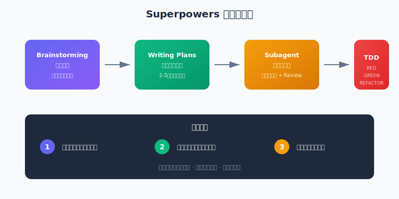

# 给你的 AI 编程助手装上"操作系统"

> 📖 **本文解读内容来源**
>
> - **原始来源**：[Superpowers: An agentic skills framework & software development methodology](https://github.com/obra/superpowers)
> - **来源类型**：GitHub 仓库
> - **作者**：Jesse Vincent（Keyboardio 创始人，知名开源贡献者）
> - **Star 数量**：79,595（快速增长中）
> - **主要语言**：Shell

你有没有发现，AI 编程助手有时候聪明得像 senior engineer，有时候又蠢得让人想砸键盘？

同一个 Claude，上一秒还在优雅地重构代码，下一秒就开始"我先写个 demo 看看"，完全没有测试，全是硬编码，代码跑起来就算成功。你说它不懂工程？它其实懂。但没人告诉它"什么时候该做什么"。

**Superpowers** 这个项目，就是在解决这个问题。它不是教 AI 怎么写代码，而是教 AI **什么时候该做什么**——像一个隐形的 tech lead，在恰当的时刻提醒恰当的方法论。

---

## 这是个啥？

一句话定义：**一套为 AI 编程代理设计的"操作系统"**，包含 14 个可组合的技能模块，覆盖从需求澄清到代码上线的完整开发流程。

打个比方：如果说 AI 编程能力是"CPU"，那 Superpowers 就是"操作系统"——它不提升计算能力，但决定了资源如何调度、任务如何编排、错误如何处理。

和市面上那些 "Act as a senior developer..." 的 prompt 模板不同，Superpowers 是一套**强制性的工作流约束**：



| 对比维度 | 普通 Prompt 模板 | Superpowers |
|---------|-----------------|-------------|
| 触发方式 | 手动粘贴 | 自动识别场景 |
| 执行强度 | 建议性质 | 强制性工作流 |
| 覆盖范围 | 单一场景 | 完整开发周期 |
| 质量保障 | 依赖模型自觉 | 多阶段 Review |

---

## 核心工作流：从"直接开干"到"先想清楚"

Superpowers 定义了一条清晰的工作流管道：

### 阶段一：头脑风暴（Brainstorming）

这是整个系统最关键的设计之一：**AI 不被允许直接写代码**。

当你提出一个需求，比如"帮我做一个用户认证系统"，AI 的第一反应不是打开编辑器，而是开始提问：

- 这个认证系统要支持哪些登录方式？
- 用户量大概多少？需要考虑分布式 session 吗？
- 有现有的用户表吗，还是要从头设计？

**硬规则**：在得到设计确认之前，禁止调用任何实现相关的 skill。

这解决了一个常见的痛点：AI 经常在需求不清晰的情况下就开始写代码，写完才发现方向错了。

### 阶段二：编写计划（Writing Plans）

需求确认后，AI 会写一份详细的实施计划。这个计划不是"实现用户认证"这种模糊描述，而是精确到：

- 每一步操作什么文件
- 每一步写什么测试
- 每一步用什么命令验证
- 每一步 commit 信息写什么

任务的粒度被控制在 **2-5 分钟一个动作**。比如：

```
- [ ] Step 1: 写失败的测试用例
- [ ] Step 2: 运行测试确认失败
- [ ] Step 3: 写最小实现代码
- [ ] Step 4: 运行测试确认通过
- [ ] Step 5: Commit
```

### 阶段三：子代理驱动开发（Subagent-Driven Development）

这是 Superpowers 最硬核的部分。

计划写好后，主代理不会亲自执行，而是**派发子代理**逐个任务完成。每个子代理：

- 只知道自己那一个任务的上下文
- 完成后会被销毁（上下文隔离）
- 结果经过两轮 review：先检查是否满足 spec，再检查代码质量

为什么要这样设计？因为**上下文污染是 AI 出错的主要来源**。一个子代理如果继承了整个会话的历史，很容易被之前的"假设"带偏。隔离上下文，反而能提高质量。

### 阶段四：测试驱动开发（TDD）

Superpowers 对 TDD 的执念近乎偏执。

它的核心规则是：

> **NO PRODUCTION CODE WITHOUT A FAILING TEST FIRST**

如果你在测试之前写了代码？删除，重新来。不是"补充测试"，是**删除代码，从测试开始**。

更绝的是，它要求你**亲眼看着测试失败**：

```
RED: 写测试 → 运行 → 确认失败原因正确
GREEN: 写最小代码 → 运行 → 确认通过
REFACTOR: 重构 → 运行 → 确认仍然通过
```

为什么这么强调"看着测试失败"？因为**只有确认测试真的能捕获错误，你才能相信测试**。有时候测试通过了不是因为代码正确，而是因为测试本身写错了。

---

## 14 个技能模块一览

Superpowers 把方法论拆成了 14 个独立的 skill：

**开发流程类**：
- `brainstorming` - 需求澄清与设计
- `writing-plans` - 编写实施计划
- `subagent-driven-development` - 子代理并行执行
- `executing-plans` - 批量执行与检查点
- `test-driven-development` - TDD 循环

**调试与质量类**：
- `systematic-debugging` - 四阶段根因调查
- `verification-before-completion` - 完成前验证
- `requesting-code-review` - 请求代码审查
- `receiving-code-review` - 响应审查反馈

**协作与分支管理**：
- `using-git-worktrees` - 并行开发分支管理
- `finishing-a-development-branch` - 分支收尾流程
- `dispatching-parallel-agents` - 并行子代理调度

**元技能**：
- `writing-skills` - 编写新的 skill
- `using-superpowers` - 系统使用指南

每个 skill 都有明确的触发条件。比如 `systematic-debugging` 的触发条件是"遇到任何 bug、测试失败或意外行为时"。AI 会自动识别场景，不需要你手动触发。

---

## 系统化调试：不猜，而是找

`systematic-debugging` 这个 skill 体现了 Superpowers 的核心理念：**系统性优于即兴猜测**。

当遇到 bug 时，它定义了四个严格的阶段：

**Phase 1: 根因调查**
- 仔细阅读错误信息
- 可靠地复现问题
- 检查最近的改动
- 在多组件系统中添加诊断日志

**Phase 2: 模式分析**
- 找到能工作的类似代码
- 对比工作版本和故障版本
- 识别所有差异

**Phase 3: 假设与测试**
- 形成单一假设
- 做最小改动验证假设
- 一次只改一个变量

**Phase 4: 实施**
- 先写失败的测试用例
- 修复根因（不是症状）
- 验证修复有效

**铁律**：在完成 Phase 1 之前，禁止提出任何修复方案。

这解决了一个常见的反模式：**"猜着修"**。很多人（包括 AI）看到报错就开始改代码，改了不行再改，结果引入更多 bug。Superpowers 强制你先找到根因，再动手。

---

## 笔者的三个判断

### 判断一：这是 AI 编程从"玩具"走向"工程"的关键一步

目前的 AI 编程工具有两种模式：

1. **Copilot 模式**：你写，它补全。很聪明，但碎片化。
2. **Agent 模式**：你说需求，它直接产出。很炫，但质量不稳定。

Superpowers 做的是把 Agent 模式**工程化**。它定义的不是"代码怎么写"，而是"流程怎么走"。这比教 AI 写代码更难，但价值也更大。

### 判断二：Subagent 架构代表了 Agent 协作的方向

"一个 AI 干所有事"是过渡形态。未来一定是**多 Agent 协作**：有的负责任务拆解，有的负责执行，有的负责审查。Superpowers 的子代理架构，就是这个方向的早期实践。

不过目前这套机制对底层平台有要求（需要支持 subagent），在 Claude Code 上效果最好，其他平台还在适配中。

### 判断三：这套方法论对人类同样有价值

仔细读 Superpowers 的 skill 文档，你会发现它讲的不仅是"怎么让 AI 干活"，更是"怎么正确地干活"。TDD、系统化调试、需求澄清……这些是软件工程几十年沉淀下来的最佳实践。

**Superpowers 本质上是把软件工程方法论编码成了可执行的形式**。即使你不用 AI 编程，这套方法论也值得学习。

---

## 如何开始使用

Superpowers 支持多个平台：

**Claude Code（推荐）**：
```bash
/plugin install superpowers@claude-plugins-official
```

**Cursor**：
```
/add-plugin superpowers
```

**Codex / OpenCode**：
需要手动配置，按照仓库文档操作。

安装后，在新会话中提一个需求试试。如果 AI 开始问你澄清问题而不是直接写代码，说明 Superpowers 生效了。

---

## 结语

不得不感叹一句：**软件工程的本质，从来不是"怎么写代码"，而是"什么时候该做什么"**。

Superpowers 把这个朴素道理变成了可执行的规则集。它不提升 AI 的代码生成能力，但提升了 AI **使用能力的方式**——就像一个顶级运动员，配上一个顶级教练，才能把天赋完全释放出来。

如果你想认真用 AI 做软件开发，而不是让它"写个 demo 试试"，Superpowers 值得一试。毕竟，近 8 万 star 的社区选择，不会太离谱。

---

### 参考

- [Superpowers GitHub 仓库](https://github.com/obra/superpowers)
- [作者博客：Superpowers for Claude Code](https://blog.fsck.com/2025/10/09/superpowers/)