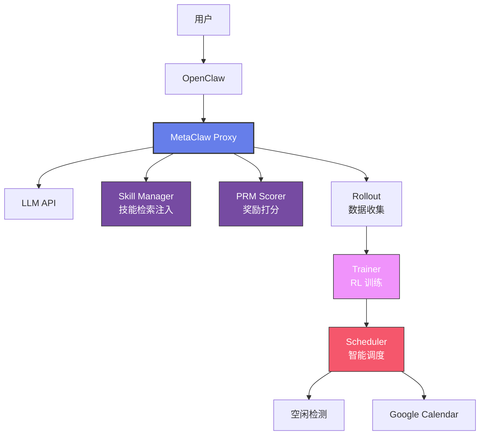

# 让 AI Agent 学会自我进化——MetaClaw 实战

> 📖 **本文解读内容来源**
>
> - **原始来源**：[MetaClaw GitHub 仓库](https://github.com/aiming-lab/MetaClaw)
> - **来源类型**：GitHub 仓库
> - **作者/团队**：aiming-lab
> - **发布时间**：2026 年 3 月
> - **Stars**：1,044+ | **主要语言**：Python

---

## 这是个啥

如果你的 AI Agent 能像人一样，从每次对话里学习进化，那会怎样？

不用收集数据，不用训练模型，不用 GPU 集群。你只管跟它聊天，它自己就会越来越聪明。

这不是幻想。MetaClaw 做到了。

**一句话定义**：MetaClaw 是一个能在真实场景中元学习并持续进化的 AI Agent 框架。它受人类大脑学习方式启发，让 Agent 从每一次真实对话中学习，无需离线训练。

下面这张图展示了 MetaClaw 的核心架构：


---

## 核心原理

### 它是怎么做到的

MetaClaw 的核心思路其实就三步：

1. **技能注入**：每次对话前，从技能库里挑出最相关的技能，悄悄塞给 LLM
2. **奖励打分**：对话结束后，用另一个 LLM 给回答质量打分
3. **后台进化**：分数低的回答送去训练，分数高的变成新技能

你可能会想——这不就是强化学习吗？

好问题。MetaClaw 的特别之处在于**元学习调度器**。

### MadMax 模式：智能调度器

默认运行的 MadMax 模式，会在三种情况下才触发权重更新：

- **睡眠时间**：你睡觉的时候（比如 23:00-07:00）
- **系统空闲**：键盘鼠标 30 分钟没动静
- **开会时间**：Google Calendar 显示你在开会

状态机设计是这样的：

```
IDLE_WAIT → WINDOW_OPEN → UPDATING → PAUSING → IDLE_WAIT
```

说白了就是：趁你不用，偷偷变强。

---

## 三种运行模式

| 模式 | 功能 | 需要 GPU 吗 |
|------|------|-----------|
| **skills_only** | 技能注入 + 自动总结 | 不需要 |
| **rl** | Skills + RL 训练 (GRPO) | 需要 |
| **madmax** (默认) | Skills + RL + 智能调度 | 需要 |

**笔者的建议**：

- 如果你只是想快速体验，用 `skills_only` 就够了
- 如果你有 GPU 且想深度定制，上 `madmax`
- `rl` 模式适合中间态，能训练但没有智能调度

---

## 代码实战

### 第一步：安装

```bash
# 基础安装（仅技能模式）
pip install -e .

# 完整安装（推荐）
pip install -e ".[rl,evolve,scheduler]"
```

### 第二步：配置

```bash
# 首次配置（交互式向导）
metaclaw setup
```

配置文件在 `~/.metaclaw/config.yaml`，长这样：

```yaml
mode: madmax

llm:
  provider: kimi
  model_id: moonshotai/Kimi-K2.5
  api_base: https://api.moonshot.cn/v1
  api_key: sk-...

skills:
  enabled: true
  dir: ~/.metaclaw/skills
  retrieval_mode: template
  top_k: 6
  auto_evolve: true

rl:
  enabled: false
  backend: auto
  model: moonshotai/Kimi-K2.5
  lora_rank: 32
  batch_size: 4

scheduler:
  sleep_start: "23:00"
  sleep_end: "07:00"
  idle_threshold_minutes: 30
  calendar:
    enabled: false
```

### 第三步：启动

```bash
# 默认 madmax 模式
metaclaw start

# 或者指定模式
metaclaw start --mode rl
metaclaw start --mode skills_only
```

### 第四步：连接 OpenClaw

MetaClaw 是一个 Proxy，需要配合 OpenClaw 使用：

```bash
# 启动 OpenClaw（另开一个终端）
openclaw start

# 然后在 OpenClaw 里正常对话
# MetaClaw 会在后台拦截对话，注入技能，收集训练数据
```

---

## 技能长什么样

MetaClaw 预置了 40+ 个技能，涵盖编码、安全、Agent 任务等。

这是一个技能文件的格式（Markdown）：

```markdown
---
name: task-decomposition
description: Use this skill when a user presents a large, vague goal...
category: productivity
---

# Task Decomposition

Before starting a large goal, decompose it.

**Steps:**
1. Restate the end goal in one sentence.
2. List the concrete sub-tasks needed to reach it, in order.
3. For each sub-task, estimate effort (S/M/L).
4. Propose a timeline with milestones.
```

预置技能包括：

- `task-decomposition`：任务分解
- `codebase-navigation`：代码库导航
- `git-workflow`：Git 工作流
- `secrets-management`：密钥管理
- `structured-logging-and-observability`：结构化日志
- `test-before-ship`：发布前测试
- `verify-before-irreversible-action`：不可逆操作前验证

---

## 效果展示

从 GitHub 的 Demo 视频可以看到：

1. **技能自动注入**：用户问"帮我部署这个服务"，Agent 自动调用 `test-before-ship` 技能，先测试再部署
2. **失败案例总结**：某次回答得分低，系统自动提取新技能"部署前先检查环境变量"
3. **权重热更新**：训练完成后，无需重启服务，新权重立即生效


从结果来看，Agent 的行为确实越来越符合用户习惯了。

---

## 核心架构

下面这张图展示了 MetaClaw 的组件关系：



---

## 深度思考

### 这个技术的独特价值在哪

笔者认为，MetaClaw 的核心价值不在于"能学习"，而在于**学习时机智能**。

很多 Agent 框架也能强化学习，但问题是：

- 训练打断服务
- 用户无感知，不知道 Agent 在变强
- 资源竞争，推理和训练抢 GPU

MetaClaw 的调度器解决了这个问题：**趁你不用，偷偷进化**。

### 和同类方案相比

| 方案 | 学习方式 | 需要训练吗 | 打断服务吗 |
|------|---------|-----------|-----------|
| **MetaClaw** | 元学习 + RL | 可选 | 不打断 |
| 传统微调 | 离线训练 | 必须 | 是 |
| Prompt 工程 | 人工优化 | 不需要 | - |
| RAG | 检索增强 | 不需要 | - |

如果你的场景是**个人 Assistant**，MetaClaw 很合适。

如果你的场景是**企业级服务**，且对稳定性要求极高，`skills_only` 模式更稳妥。

### 局限性坦诚

MetaClaw 目前还有几个限制：

1. **依赖 OpenClaw**：必须配合 OpenClaw 使用，不是独立 Agent
2. **调度器需要配置**：Google Calendar 集成需要额外授权
3. **RL 训练成本高**：madmax 模式需要 GPU，云端 Tinker 也要钱
4. **技能质量参差不齐**：自动总结的技能有时不够精准

### 笔者的判断

笔者认为，MetaClaw 代表了一个正确方向：**Agent 不应该是一次性部署的死物，而应该是持续进化的活物**。

虽然现在还需要 GPU、需要配置、需要依赖 OpenClaw，但这个思路是对的。

就像人一样，不是在出生时就定型了，而是在每一天的经历里，慢慢变成更好的自己。

---

## 结语

MetaClaw 确实是个很有趣的框架，它把"元学习"这个学术概念，变成了普通人能用的工具。

跨领域类比一下：

> GAN 像梅西和 C 罗，正因对手存在才互相促进。
> MetaClaw 像你的私人教练，你训练它，它也训练你。

不得不感叹一句：真正的智能，不是静态的知识，而是动态的进化能力。

希望读者能够有所收获。如果你的 Agent 也能越用越聪明，那会是种什么体验？

---

### 参考

- [MetaClaw GitHub 仓库](https://github.com/aiming-lab/MetaClaw)
- [OpenClaw 核心框架](https://github.com/openclaw-lab/openclaw)
- [SkillRL 技能增强框架](https://github.com/SkillRL/SkillRL)
- [Tinker 云端 RL 训练](https://github.com/aiming-lab/tinker)
