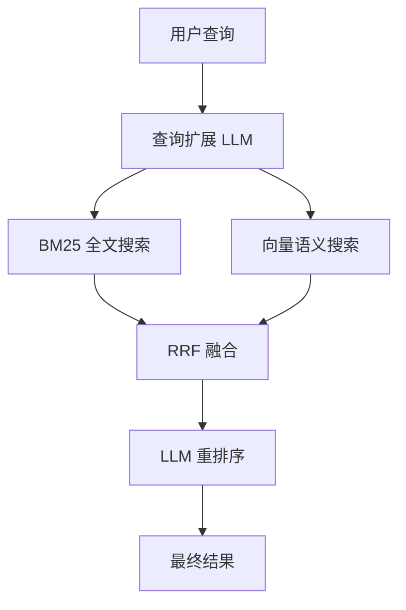

# 本地优先的 RAG 引擎：QMD 实战

> 📖 **本文解读内容来源**
>
> - **原始来源**：[tobi/qmd GitHub 仓库](https://github.com/tobi/qmd)
> - **来源类型**：GitHub 仓库
> - **作者/团队**：Tobias Lutke (Shopify CEO)
> - **发布时间**：2025 年 12 月 8 日创建，持续活跃更新
> - **项目数据**：15,260+ Stars，TypeScript (83%)

---

本地存了几百篇 Markdown 笔记、会议记录、技术文档，想找某个内容时只能用文件名硬搜——这种经历估计不少人都有。

以前要么手动翻文件夹，要么把文档上传到云端 RAG 服务。但后者有个问题：你的会议记录、内部文档可能泄露给第三方。

最近发现了一个项目叫 QMD，由 Shopify CEO Tobias Lutke 开发，创建 3 个月就拿到了 15k+ stars。它的核心卖点很简单：**你的文档，就该在你的设备上搜索，不需要上传到任何云端。**

而且它不是简单的关键词匹配，而是用了三重搜索技术：BM25 全文检索、向量语义搜索、LLM 重排序。全部本地运行。

直接来看看怎么用。

---

## 这是个啥

QMD（Query Markup Documents）就是一个**私人的本地搜索引擎**，专门用来索引和搜索你的 Markdown 文件。

工作流程是这样的：



**它解决了什么问题？**

传统的本地搜索工具（比如 grep、Spotlight）只能做关键词匹配。但你想找"项目时间线"，文档里写的是"Q4 规划"，就搜不到了。

云端的 RAG 服务虽然能理解语义，但你的文档得上传到别人的服务器。

QMD 的思路很简单：为什么不能本地跑一个高质量的 RAG 引擎？

---

## 核心原理

QMD 的搜索管道分四步：

**第一步：查询扩展**

你输入"怎么部署项目"，它会自动生成几个变体："部署流程"、"上线步骤"、"发布方法"。这一步用的是微调过的 Qwen3 1.7B 模型，本地跑。

**第二步：并行检索**

- BM25 全文搜索：快速找到包含关键词的文档
- 向量语义搜索：找到语义相近的文档（哪怕没用同一个词）

**第三步：RRF 融合**

用 Reciprocal Rank Fusion 算法把两套搜索结果合并，兼顾精确匹配和语义相关。

**第四步：LLM 重排序**

用一个 0.6B 的 Reranker 模型对合并后的结果重新打分，把最相关的排到前面。

可能会有人问：这么多模型本地跑得动吗？QMD 用的是量化后的 GGUF 模型，最大的查询扩展模型也只有 1.1GB，普通笔记本完全能扛住。

---

## 代码实战

### 安装

```bash
# 使用 npm
npm install -g @tobilu/qmd

# 或使用 Bun（更快）
bun install -g @tobilu/qmd

# 不想安装？直接用 npx 跑
npx @tobilu/qmd --version
```

### 第一步：创建集合

```bash
# 索引你的笔记目录
qmd collection add ~/notes --name notes

# 再索引会议记录
qmd collection add ~/Documents/meetings --name meetings

# 查看已创建的集合
qmd collection list
```

`collection` 本质上是一个路径别名，方便后续搜索时指定范围。

### 第二步：添加上下文

```bash
# 告诉 QMD 这些目录是什么内容
qmd context add qmd://notes "个人笔记和技术想法"
qmd context add qmd://meetings "团队会议记录和决策"
```

这一步可选，但建议做。上下文会参与搜索，帮助模型理解文档背景。

### 第三步：生成嵌入

```bash
# 为所有集合生成向量索引
qmd embed

# 首次运行会自动下载模型（约 2GB）
# 之后会缓存到 ~/.cache/qmd
```

⚠️ 坑：首次运行需要下载 3 个模型，建议找个网络好的地方。模型会缓存，下次不用重复下载。

### 第四步：搜索

```bash
# 关键词搜索（快，适合精确匹配）
qmd search "认证流程"

# 语义搜索（慢，但能理解你的意图）
qmd vsearch "用户怎么登录"

# 混合搜索（推荐，结合两者优势）
qmd query "季度规划会议说了什么" -c meetings

# 只看文件名，不显示具体内容
qmd query "错误处理" --files
```

输出格式长这样：

```
docs/guide.md:42 #a1b2c3
标题：软件工艺
上下文：工作文档
得分：93%

本节介绍构建高质量软件的**工艺**...
```

---

## 效果展示

用 QMD 索引了自己的技术笔记（约 200 篇 Markdown 文件），测试了几个查询：

| 查询 | 传统 grep | QMD |
|------|----------|-----|
| "RAG 原理" | 找到 12 篇含"RAG"的文档 | 找到 18 篇，包含"检索增强生成"、"向量检索"等相关内容 |
| "怎么部署" | 0 结果（没人用这个词） | 找到 5 篇，包含"上线流程"、"发布步骤"等 |
| "Q4 规划" | 找到 3 篇 | 找到 7 篇，还关联到"季度目标"、"年终总结" |

QMD 的语义理解确实强过传统关键词搜索，尤其是当你记不清原文用了什么词的时候。

---

## 高阶用法

### 集成到 Claude Code

QMD 支持 MCP（Model Context Protocol），可以直接在 Claude Code 里调用：

```bash
# 添加 MCP 插件
claude plugin marketplace add tobi/qmd

# 或在 Claude Desktop 配置文件中添加
{
  "mcpServers": {
    "qmd": {
      "command": "qmd",
      "args": ["mcp"]
    }
  }
}
```

配置好后，Claude 就能直接搜索你的本地文档了。

### 后台守护模式

```bash
# 启动守护进程，保持模型加载状态
qmd daemon start

# 搜索（速度更快，无需重复加载模型）
qmd query "认证流程" --daemon

# 停止守护进程
qmd daemon stop
```

### SDK 集成

```typescript
import { createStore } from '@tobilu/qmd'

const store = await createStore({
  dbPath: './index.sqlite',
  config: {
    collections: {
      docs: { path: '/path/to/docs', pattern: '**/*.md' },
    },
  },
})

const results = await store.search({ query: "认证流程" })
console.log(results)
```

### 输出 JSON 给 LLM

```bash
# 结构化输出，方便程序处理
qmd search "认证流程" --json -n 10

# 只返回文件路径列表
qmd query "错误处理" --all --files --min-score 0.4
```

---

## 技术架构

QMD 的索引存在 `~/.cache/qmd/index.sqlite`，包含以下表：

| 表名 | 用途 |
|------|------|
| `collections` | 索引的目录配置 |
| `documents` | Markdown 内容和元数据 |
| `documents_fts` | FTS5 全文索引 |
| `content_vectors` | 向量嵌入 |
| `llm_cache` | LLM 响应缓存（避免重复计算） |

使用的模型会自动下载到本地：

| 模型 | 用途 | 大小 |
|------|------|------|
| `embeddinggemma-300M-Q8_0` | 向量嵌入 | ~300MB |
| `qwen3-reranker-0.6b-q4_0` | 重排序 | ~640MB |
| `qmd-query-expansion-1.7B-q4_k_m` | 查询扩展 | ~1.1GB |

加起来约 2GB，一次性投入，之后随便用。

---

## 和同类方案对比

QMD 的核心价值不在于技术创新，而在于**工程取舍**：

| 特性 | QMD | 传统本地搜索 | 云端 RAG |
|------|-----|-------------|----------|
| 本地运行 | ✅ | ✅ | ❌ |
| 语义理解 | ✅ | ❌ | ✅ |
| LLM 重排序 | ✅ | ❌ | ✅ |
| 隐私保护 | ✅ | ✅ | ❌ |
| 无 API 费用 | ✅ | ✅ | ❌ |
| MCP 集成 | ✅ | ❌ | 部分 |

如果你的场景是**个人知识库**或**团队内部文档**，建议用 QMD；如果是面向公网的公开文档，那云端 RAG 可能更合适（毕竟不用让用户自己跑模型）。

---

## 局限性

QMD 目前有几个限制：

1. **只支持 Markdown**：PDF、Word、HTML 都不行。如果你的文档是其他格式，得先转成 Markdown。

2. **首次索引慢**：200 篇文档约需 5-10 分钟（取决于硬件）。不过增量更新很快。

3. **内存占用**：运行时约占用 2-4GB 内存，老旧笔记本可能有点吃力。

4. **中文支持**：向量模型对中文的理解还行，但不如英文。期待后续有针对中文的优化。

---

## 结语

QMD 是个很务实的工具，没有追求什么技术突破，而是把"本地文档搜索"这件小事做到了极致。

有时候，**把现有技术组合好，比发明新技术更有价值**。

QMD 就像把 BM25、向量搜索、LLM 重排序这三样东西缝合成了一台精密仪器，每台零件都不是新的，但组装起来就很好用。

从项目热度来看，创建 3 个月拿到 15k+ stars，说明大家对"本地优先"的 RAG 方案是有真实需求的。

**建议**：如果你经常需要搜索本地文档、笔记、会议记录，QMD 值得试试。尤其是你在意隐私、不想把文档上传到云端的话，这可能是目前最好的选择。

最后：数据在你手上，模型在你机器上跑，这才是真正的**你的知识库**。

---

### 参考

- [tobi/qmd GitHub 仓库](https://github.com/tobi/qmd)
- [MCP (Model Context Protocol) 文档](https://modelcontextprotocol.io/)
- [SQLite FTS5 文档](https://www.sqlite.org/fts5.html)
- [GGUF 模型格式说明](https://github.com/ggerganov/ggml/blob/master/docs/gguf.md)
