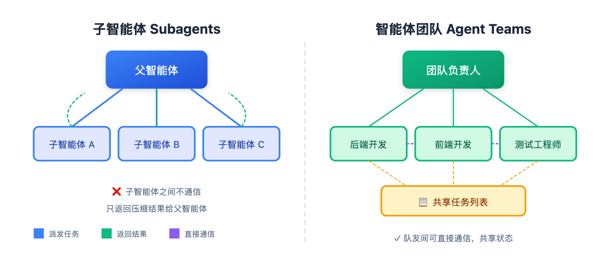

# 多智能体系统不是万能药，Claude 给你两条路

> 📖 **本文解读内容来源**
>
> - **原始来源**：[Claude Subagents vs. Agent Teams, explained](https://medium.com/@akshay_pachaar/claude-subagents-vs-agent-teams-explained-...)
> - **来源类型**：技术博客
> - **作者**：Akshay (@akshay_pachaar)，Daily Dose of Data Science 联合创始人
> - **发布时间**：2026年3月

---

大多数人一看到复杂任务，本能反应就是"上多智能体"。

这个本能往往是错的。

正确的问法不是"要不要用多智能体"，而是"这个任务到底需要什么类型的协调"。答案决定了你的整个架构。

Claude 给了两条截然不同的路：**子智能体（Subagents）** 和 **智能体团队（Agent Teams）**。表面看着像，架构上解决的是完全不同的问题。

## 一句话分清两条路

**子智能体**：你派三个研究员分头查资料，他们各自干完回来汇报，你汇总成报告。

**智能体团队**：你组了一个项目组，前端、后端、测试坐一个屋，随时沟通，互相配合。

前者是"派活收结果"，后者是"组队打配合"。

下面这张图展示了两种架构的核心区别：



## 子智能体：隔离带来的并行

子智能体是一个在独立上下文窗口中运行的专用 Claude 实例。

研究负责人不会亲自读每份原始资料。他派具体问题给研究员，研究员带着提炼好的发现回来，他综合成最终输出。

这就是子智能体做的事。

每个子智能体获得：
- 自己的系统提示词，定义专业领域
- 特定的工具集
- 干净、隔离的上下文窗口
- 一个明确的任务

完成后，只有最终结果返回给父智能体。父智能体拿到的是压缩后的输出，完整推理链和中间步骤都留在子智能体里。

子智能体的核心价值不只是并行，而是**压缩**。你把大量探索蒸馏成干净的信号，不让噪音污染父智能体的上下文。

有硬约束：子智能体不能派生子智能体，也不能互相通信。所有结果都流回父智能体。父智能体是唯一的协调者。

这个约束让系统可预测。你永远知道信息流向哪里、决策在哪里做出。

```python
from claude_agent_sdk import query, ClaudeAgentOptions, AgentDefinition

async def main():
    async for message in query(
        prompt="Review the authentication module for security vulnerabilities",
        options=ClaudeAgentOptions(
            allowed_tools=["Read", "Grep", "Glob", "Agent"],
            agents={
                "security-reviewer": AgentDefinition(
                    description="Security specialist. Use for vulnerability checks.",
                    prompt="You are a security specialist...",
                    tools=["Read", "Grep", "Glob"],
                    model="sonnet",
                ),
                "performance-optimizer": AgentDefinition(
                    description="Performance specialist. Use for latency issues.",
                    prompt="You are a performance engineer...",
                    tools=["Read", "Grep", "Glob"],
                    model="sonnet",
                ),
            },
        ),
    ):
        print(message)
```

`description` 字段告诉父智能体该派发给谁。上面这个例子，提示词提到"security vulnerabilities"，父智能体就派给 security-reviewer，不是 performance-optimizer。如果问的是延迟或瓶颈，就会选另一个。description 是路由信号，要写得具体。

## 智能体团队：通信带来的协调

智能体团队是完全不同的模型。

子智能体是干完活就消失的短期工人，智能体团队是长期运行的实例，持续存在，直接互相通信，通过共享状态协调。

区别就像：雇承包商干孤立任务 vs 组一个团队在同一个房间协作。

智能体团队有三个组成部分：
- **团队负责人**：协调工作、分配任务、综合结果
- **队友**：独立的智能体实例，各有自己的上下文窗口，并行工作
- **共享任务列表**：追踪待办、进行中、已完成，以及任务之间的依赖关系

典型生命周期：

```
Claude (Team Lead):
└── spawnTeam("auth-feature")
    Phase 1 - Planning:
    └── spawn("architect", prompt="Design OAuth flow", plan_mode=true)
    Phase 2 - Implementation (parallel):
    └── spawn("backend-dev", prompt="Implement OAuth controller")
    └── spawn("frontend-dev", prompt="Build login UI")
    └── spawn("test-writer", prompt="Write tests", blockedBy=["backend-dev"])
```

注意 test-writer 的 `blockedBy` 字段。这就是共享任务列表在做真正的协调：测试工程师不会在后端完成前启动，负责人不需要手动管理这个顺序。

和子智能体最大的区别是**直接点对点通信**。队友可以互相发消息、分享发现、暴露阻塞、协商，不需要所有东西都经过负责人。

你也可以直接和单个队友交互，不是所有事情都必须通过负责人。

## 核心区别：一次性派活 vs 持续协调

怎么选？看这个对比：

| 维度 | 子智能体 | 智能体团队 |
|------|---------|-----------|
| 生命周期 | 干完就消失 | 持续存在 |
| 通信方式 | 只和父智能体通信 | 队友间直接通信 |
| 状态管理 | 无共享状态 | 共享任务列表 |
| 适用场景 | 独立任务并行 | 需要协商的协作 |

**用子智能体**：任务是"尴尬并行"的——独立的研究流、代码库探索、查询，父智能体只需要摘要。

**用智能体团队**：任务需要持续协商——智能体需要在推进前协调输出，或者一个线程的发现会改变另一个线程该做什么。

## 从第一性原理设计智能体系统

大多数多智能体设计失败，因为人们按角色分工，忽略了上下文分工。

直觉本能是按角色拆：规划者、实现者、测试者。感觉很整齐。但它创造了一个"传话游戏"，信息在每个交接点衰减。

实现者不知道规划者知道什么。测试者不知道实现者做了什么决定。质量在每个边界下降。

正确的心智模型是**以上下文为中心的分解**。

问：这个子任务真正需要什么上下文？如果两个子任务需要深度重叠的信息，它们可能属于同一个智能体。如果它们可以用真正隔离的信息和干净的接口操作，那就是拆分的地方。

实现功能的智能体应该同时写那个功能的测试。它已经有上下文了。把这两件事拆成两个智能体，交接成本比并行收益更大。

只有当上下文可以真正隔离时，才分开。

## 五种编排模式

不管用哪种范式，这五种模式覆盖大多数实际需求：

1. **提示链**：顺序步骤，每个调用处理上一个输出。顺序重要、步骤依赖时用。

2. **路由**：分类器决定哪个专门处理器接任务。简单问题走便宜快速模型，难题走更强模型。这是控制成本的关键。

3. **并行化**：独立子任务同时运行。要么同一任务跑多次获得多样输出（投票），要么不同子任务同时跑（分段）。

4. **协调者-执行者**：中心智能体拆分任务、派发给执行者、综合结果。这是子智能体和智能体团队的主导架构，也是大多数生产系统实际用的。

5. **评估者-优化者**：一个智能体生成，另一个评估并反馈，循环迭代。质量比速度重要、单次通过不够可靠时用。

## 什么时候不该用多智能体

这是大多数文章跳过的部分。

团队花了数月搭建复杂的多智能体流水线，最后发现：单个智能体配合更好的提示词，效果一样。

从简单开始。只有当你能清楚衡量需要时，才加复杂度。

多智能体系统在三种情况下值得成本：
- **上下文保护**：子任务生成与主任务无关的信息，放在子智能体里防止上下文膨胀
- **真正并行**：独立研究或搜索任务，同时覆盖有收益
- **专业化**：任务需要冲突的系统提示词，或者一个智能体工具太多导致性能下降

不该用的情况：
- 智能体之间频繁需要共享上下文
- 智能体间依赖产生的开销比执行价值还大
- 任务简单到单个好提示词就能搞定

编码有个坑：并行智能体写代码会做出不兼容的假设。合并时，那些隐式决定会以难以调试的方式冲突。编码的子智能体应该回答问题和探索，不要和主智能体同时写代码。

## 多智能体系统怎么失败

三种失败模式反复出现。

**1. 任务描述模糊导致智能体重复工作**

每个智能体需要：明确目标、预期输出格式、用什么工具或来源、明确边界（不覆盖什么）。没有这些，两个智能体会研究同一件事，谁也不会发现。

**2. 验证智能体没验证就宣布成功**

明确、具体的指令不可妥协：运行完整测试套件、覆盖这些具体用例、每个通过前不要标记完成。模糊的验收标准产生假阳性。

**3. Token 成本比你预期增长得更快**

解决方案是智能分层：
- 真正重要的地方用最强模型
- 常规工作路由到更快更便宜的模型
- 内置预算控制，防止成本失控

## 一个设计原则真正重要

围绕上下文边界设计，不是围绕角色或组织架构。

从单个智能体开始。推到它崩溃。那个失败点告诉你下一步该加什么。

只在解决真实、可衡量问题的地方加复杂度。

---

### 参考

- [Building Effective Agents - Anthropic](https://www.anthropic.com/engineering/building-effective-agents)
- [Claude Subagents vs. Agent Teams, explained - Akshay](https://medium.com/@akshay_pachaar)
- [learn-claude-code - GitHub](https://github.com/shareAI-lab/learn-claude-code)