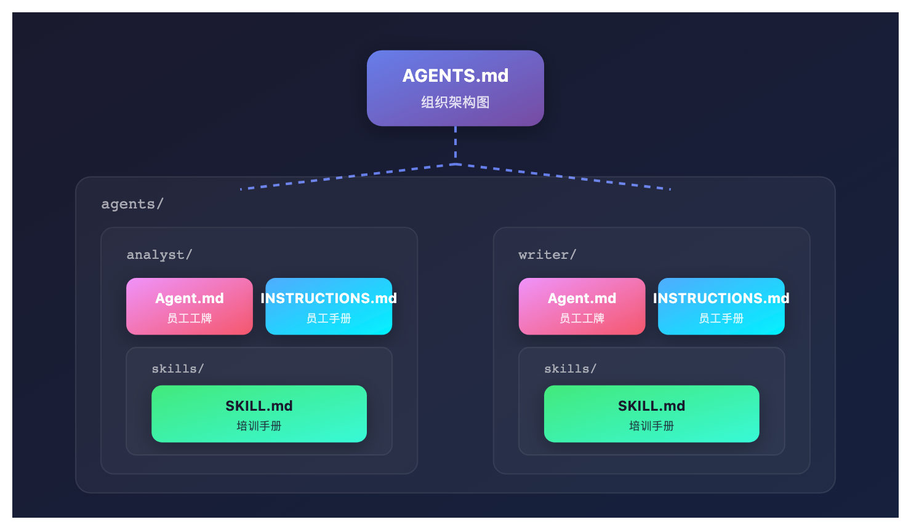

# 为什么你的多智能体系统总失控？四个文件让它乖乖听话

> 📖 **本文解读内容来源**
>
> - **原始来源**：[Instructions.md vs Skills.md vs Agent.md vs Agents.md](https://medium.com/@pvergadia/instructions-md-vs-skills-md-vs-agent-md-vs-agents-md-87d75f4b63c5)
> - **来源类型**：技术博客
> - **作者**：Priyanka Vergadia（微软产品叙事专家，前 Google）
> - **发布时间**：2025年3月

每个做多智能体的工程师都经历过这种崩溃时刻：你搭建了一套看起来很完美的系统——一个研究智能体负责调研，一个分析智能体负责处理数据，一个写作智能体负责输出内容，还有一个编排智能体负责协调。测试环境一切正常，演示时团队惊呼"太强了"，推到生产环境 48 小时内，它开始做一些没人要求的事——分析智能体在写报告，写作智能体在拉数据，编排智能体直接和用户聊天。

技术上一切正常运行，但一切都错了。

笔者经历过这个时刻，每次的根因都一样：没人告诉这些智能体"你是谁、你能干什么、你在哪、你怎么做事"。它们很聪明，但没人管——就像招了一群天才顾问，忘了给职位说明。

解决方案不是新框架，不是更多提示词。是四个 markdown 文件，每个回答一个具体问题。

## 问题出在哪

大多数团队起步的方式相同：给每个智能体写一个巨大的系统提示词——一堵文字墙，描述智能体的性格、工具、规则、角色和输出格式。开始还行，然后开始出怪问题：智能体忽略一半提示词因为太长了；凭空捏造一条不存在的规则；做的事情单独看没问题，但和下游智能体冲突。

根本问题是：一个系统提示词试图同时回答四个本质不同的问题：
- 这个智能体能干什么？
- 它在系统里是谁？
- 它在整个系统里位置在哪？
- 它应该怎么一步一步做事？

当这四个问题挤在同一个文本块里，智能体会把它们同等对待——更糟的是，揉成一团不知所云的东西。解决方案是每个问题一个文件。

## SKILL.md：培训手册

SKILL.md 回答一个问题："这个具体的事情怎么干？"

把它想象成认证文件。你招一个数据工程师，你期望他懂 SQL。SKILL.md 就是这个知识的证明和参考。

看一个真实的例子。假设你在搭建一个网页抓取智能体，它的 SKILL.md 长这样：

```markdown
---
name: web-scraper
description: 用 BeautifulSoup 和 Playwright 从网站提取结构化数据。
  当需要抓取表格、列表或文章时使用。
---

## 什么时候用这个技能
- 用户提供 URL，想要结构化数据
- 页面可能是 JS 渲染的（用 Playwright）或静态的（用 requests + BS4）

## 步骤
1. 检查页面是否 JS 渲染。如果是，用 Playwright 无头模式
2. 优先用语义选择器：<article>、<table>、role= 属性
   避免脆弱的 CSS 路径如 .div > span:nth-child(3)
3. 返回 pandas DataFrame，保存到 /outputs/data.csv

## 错误处理
- 403 或 429：添加 User-Agent header，加 2 秒延迟，重试一次
- 空结果：记录使用的选择器，给用户建议替代方案
```

注意这里有什么：真实的代码模式、明确的步骤、失败场景。最好的 SKILL.md 不只描述"晴天场景"，它告诉智能体出问题时该怎么办。

**最佳实践**：一个能力一个 SKILL.md。不要把"抓取"和"数据库查询"捆到一个文件里。保持技能原子化、可复用——其他智能体应该能直接拿起来用。

## Agent.md：员工工牌

Agent.md 回答："我是谁，我在系统里什么位置？"

这是每个智能体一个的文件。它很短——很少超过 30 行——因为它不是在教智能体什么，而是在给它定位身份。

```markdown
# analyst-agent

## 我是谁
我是数据分析智能体。我接收数据集和问题，
返回结构化的 AnalysisResult 字典。

## 我在系统里的位置
- 由谁启动：orchestrator-agent
- 我交接给：viz-agent 和 writer-agent
- 我从不直接和用户沟通

## 我的能力
- Pandas / NumPy 分析
- 通过 query_database 工具执行 SQL 查询
- 异常检测和趋势识别

## 我不做的事
- 写报告或文字内容（→ writer-agent）
- 做图表或可视化（→ viz-agent）
- 做商业建议（→ 人工审核）
```

最后一部分——"我不做的事"——是任何 Agent.md 最重要的部分。根据笔者经验，智能体行为异常几乎都是因为它填补了一个没有明确关闭的空白。如果不告诉分析智能体它不写报告，它迟早会决定写一篇，因为分析完写报告看起来是自然的下一步。

**最佳实践**：保持 Agent.md 稳定。写好后几乎不用改。如果发现频繁修改，说明智能体的角色定义还不清晰——去修系统设计，不是改文件。

## AGENTS.md：组织架构图

如果 Agent.md 是一个员工的工牌，AGENTS.md 就是公司通讯录。它回答："所有智能体是谁？整个系统怎么连接？"

这是一个放在项目根目录的单文件——不在任何智能体的文件夹里。

```markdown
# 系统架构

## 智能体清单
- **orchestrator-agent**：接收用户请求，分配任务，协调下游
- **analyst-agent**：数据分析，输出 AnalysisResult
- **viz-agent**：生成图表和可视化
- **writer-agent**：撰写报告和文字内容

## 数据流
用户 → orchestrator → analyst → viz + writer → orchestrator → 用户

## 接口约定
- 所有智能体接收 dict，返回 dict
- analyst 输出 AnalysisResult，包含 data、insights、metadata 字段
- writer 接收 AnalysisResult，输出 ReportDocument
```

这产生了一个微妙但强大的效果：它给每个智能体一个整个系统的心理模型，不只是它们自己那点事。当分析智能体知道下游有可视化智能体，它会自然开始考虑输出格式。它不再只为自己优化。

**最佳实践**：把 AGENTS.md 当成架构图。放在项目根目录，提交到版本控制，增删智能体时更新。新工程师加入项目，读这个文件五分钟就能理解整个系统。

## INSTRUCTIONS.md：员工手册

最后一个文件回答："干活的时候，我应该怎么一步一步做事？"

这是四个文件里最操作性的。SKILL.md 说"怎么抓取一个页面"，INSTRUCTIONS.md 说"每次任务到达时你按什么顺序执行"。

```markdown
# Instructions: 数据分析智能体

## 核心行为规则

1. 分析前必须验证数据集
   - 任何列超过 20% 空值？先警告用户再继续
   - 类型与预期 schema 不匹配？报错——不要猜

2. 永远不要捏造统计数据
   如果计算返回 NaN 或失败，明确说出来。
   不要估计，不要凭记忆填数字。

3. 摘要保持简洁，最多三句话
   不要废话，避免"值得注意的是……"这种填充词

## 精确工作流

1. 加载数据集，记录 shape 和列类型
2. 运行数据质量检查（空值、重复、类型不匹配）
3. 只用代码回答分析问题——不猜
4. 填充 AnalysisResult 字典
5. 立即交接给下游智能体
   不要问用户确认

## 硬约束
- 永远不读取 /mnt/user-data/ 以外的文件
- 永远不做外部 HTTP 调用
- 分析超过 30 秒，超时并报告原因
```

这个明确的工作流是好 INSTRUCTIONS.md 和坏 INSTRUCTIONS.md 的区别。散文式的指令会被宽松解读，编号的步骤会被精确执行。当你调试一个行为异常的智能体，编号的工作流给你一个准确的定位：它跳过了哪一步？

**最佳实践**：把行为规则和工作流步骤分开。规则回答"永远/永远不"，工作流回答"先/然后/最后"。混在一起会造成优先级模糊。

## 四个文件怎么配合

下面这张图展示了项目结构：


笔者现在每个多智能体项目都用这个结构。脑中一直回响的类比是：AGENTS.md 是城市地图，Agent.md 是你的公寓地址，INSTRUCTIONS.md 是你的日常行程，SKILL.md 是你的职业培训证书。

城市地图没有公寓地址，大规模下就没用。公寓没有日常行程，会产出混乱。行程没有培训，会产出自信的无能。你需要全部四个。

## 大多数团队跳过的东西

根据笔者的经验，大多数团队写 SKILL.md 和 INSTRUCTIONS.md 写得很自然——它们从提示词工程中涌现出来。团队一致跳过的是 Agent.md 和 AGENTS.md，因为它们感觉像行政工作。"我们知道智能体是谁，"团队会说，"不需要文档化。"

但智能体不知道你知道的。每次新对话开始，每个智能体从零开始。没有 Agent.md，你的分析智能体不知道它是分析智能体。它知道它有 pandas 工具和一些指令。给足够自由度，它会定义自己的角色——那个角色会是给定任务下最自然的选择。有时候没问题。有时候你的分析师开始写 CEO 备忘录。

## 笔者的观点

这套四文件方法论，本质上是在解决一个更深的问题：**智能体没有上下文继承能力**。人类员工入职第一天，带着之前所有的教育和经验；智能体每次对话都是第一天上班，什么都要重新交代。

这不是框架问题，是架构设计问题。四个文件不是一个模板，是一种思维模式：把"身份、能力、流程、系统"拆开，每个维度独立演化。

笔者有几点补充观察：

**第一，这套方法最适合"有明确边界的生产系统"**。如果你的智能体在做开放式探索、创意写作、或者边界模糊的任务，过度结构化反而限制它的能力。结构是为了稳定，稳定有时候是创意的敌人。

**第二，"我不做的事"是文件里最有价值的一句话**。智能体的错误行为，很少是因为能力不足，几乎都是边界不清。写清楚它不应该干什么，比写清楚它应该干什么更重要。

**第三，这套方法不会减少你的提示词工作量，但会让它可控**。你还是会调试、优化、迭代，但调试有明确的锚点：SKILL.md 有问题就改技能，Agent.md 有问题就改角色定义，INSTRUCTIONS.md 有问题就改流程。不再是"改提示词看看会发生什么"。

四个文件。一个给系统，一个给身份，一个给行为，一个给技能。就这么简单。调试了三个月智能体混乱后，这是笔者希望第一天就有人告诉我的东西。

### 参考

- [Instructions.md vs Skills.md vs Agent.md vs Agents.md - Priyanka Vergadia](https://medium.com/@pvergadia/instructions-md-vs-skills-md-vs-agent-md-vs-agents-md-87d75f4b63c5)