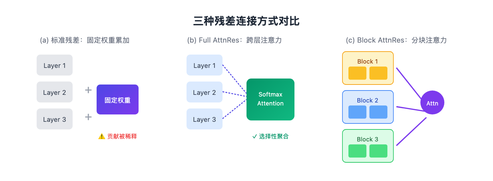
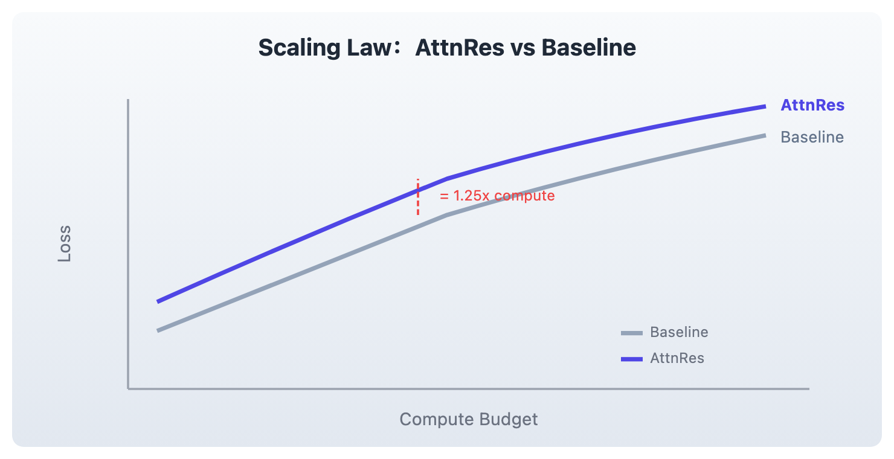
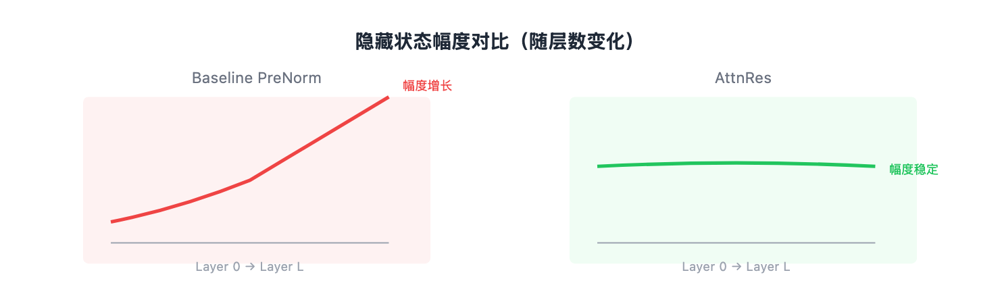

# Transformer 的残差连接还能再优化？月之暗面说能

> 📖 本文解读内容来源
> - 原始来源：[Attention Residuals](https://github.com/MoonshotAI/Attention-Residuals)
> - 来源类型：论文
> - 作者/团队：Moonshot AI（月之暗面）
> - 发布时间：2026 年 3 月

---

你可能用过 Kimi，但你知道它背后的团队刚刚发了一篇什么论文吗？

上周，月之暗面放出了最新论文 Attention Residuals。刚看到标题，我以为是某种 Attention 机制的变体。读完才发现，这篇论文做了一件更"底层"的事——

**重新设计了 Transformer 的残差连接。**

残差连接？2015 年 ResNet 就搞定的东西，还能优化？

论文的回答是：能，而且优化后效果惊人——同等算力下，模型效果相当于用 1.25 倍算力训练出来的 baseline。

---

## 残差连接的"均匀累加"困境

Transformer 的标准残差连接公式：

```
h_l = h_{l-1} + f(h_{l-1})
```

每一层的输出 = 上一层的输出 + 这一层的变换结果。所有的层以固定权重 1 均匀累加。

随着模型深度增加（现在的 LLM 动辄几十层甚至上百层），这种"均匀累加"带来两个隐患：

稀释效应——每一层的贡献被平均分配，越深的层，其独特贡献越容易被"稀释"。

幅度爆炸——随着层数增加，隐藏状态的幅度会无限增长。PreNorm 虽然缓解了梯度消失，但并没有解决幅度增长问题。

下面这张图展示了 AttnRes 的核心思想：



打个比方：标准残差就像是一个"平均主义"的公司，不管你干得好不好，每个人的奖金都一样。时间久了，干活的人就觉得"反正都一样"，积极性就下来了。

---

## 让残差连接学会"挑食"

AttnRes 的核心思想：既然 Transformer 层内部用注意力机制来"选择性"关注 token，为什么残差连接不能也"选择性"地聚合不同层的输出？

公式：

```
h_l = Σ α_{i→l} · v_i
```

权重 `α_{i→l}` 通过一个可学习的 pseudo-query（伪查询向量）计算 softmax 得到。每一层都有一个属于自己的 query 向量，用来"询问"前面所有层的输出应该贡献多少。

几个关键优势：

内容感知聚合——权重是根据实际内容计算的，而非固定不变。模型可以根据当前输入动态调整不同层的重要性。

幅度可控——因为 softmax 天然归一化，输出的幅度不会无限增长。这解决了 PreNorm 的一个潜在隐患。

梯度分布更均匀——实验表明，AttnRes 让梯度在各层之间分布更加均匀，缓解了深层的"梯度饥饿"问题。

---

## Block AttnRes：工程上的妥协

Full AttnRes 有一个实际问题：内存开销。

如果每一层都要"看"前面所有层的输出，内存复杂度会达到 O(Ld)，其中 L 是层数，d 是隐藏维度。对于 100 层的大模型，这笔开销不小。

论文提出了 Block AttnRes：

1. 把层分成 N 个块（比如 8 个块）
2. 块内部用标准残差累积
3. 只在块之间做注意力聚合

内存开销从 O(Ld) 降到 O(Nd)，实验表明 8 个块就能恢复 Full AttnRes 大部分收益。

```python
def block_attn_res(blocks, partial_block, proj, norm):
    """
    块间注意力：对已完成的块表示 + 当前块的部分和做注意力
    blocks: 之前各块的表示 [N, B, T, D]
    partial_block: 当前块内的部分和 [B, T, D]
    """
    V = torch.stack(blocks + [partial_block])  # [N+1, B, T, D]
    K = norm(V)
    # 用可学习的 query 计算 logits
    logits = torch.einsum('d, n b t d -> n b t', proj.weight.squeeze(), K)
    # softmax 加权求和
    h = torch.einsum('n b t, n b t d -> b t d', logits.softmax(0), V)
    return h
```

有点像 Multi-Head Attention 的简化版，只不过"序列"维度变成了"层"维度。

---

## 效果：1.25 倍算力白嫖

论文的实验结果相当硬核。

Scaling Law 实验表明，AttnRes 在所有计算预算下都优于 baseline。Block AttnRes 的损失曲线，相当于用 1.25 倍算力训练的 baseline。



下游任务表现更是一骑绝尘。在 Kimi Linear 48B 模型上（1.4T tokens 训练）：

| 类别 | Benchmark | Baseline | AttnRes | 提升 |
|:---|:---|:---:|:---:|:---:|
| 通用 | MMLU | 73.5 | **74.6** | +1.1 |
| | GPQA-Diamond | 36.9 | **44.4** | **+7.5** |
| | BBH | 76.3 | **78.0** | +1.7 |
| 数学&代码 | Math | 53.5 | **57.1** | +3.6 |
| | HumanEval | 59.1 | **62.2** | +3.1 |
| 中文 | CMMLU | 82.0 | **82.9** | +0.9 |
| | C-Eval | 79.6 | **82.5** | +2.9 |

GPQA-Diamond（研究生级别科学问答）提升了 7.5 分，这是一个需要多步推理的 benchmark，说明 AttnRes 对复杂推理任务特别有效。

---

## 训练动力学分析

论文还做了一个有意思的分析——训练动力学（Training Dynamics）。



Baseline 的隐藏状态幅度随着层数增加而线性增长（红色曲线），AttnRes 则保持稳定（绿色曲线）。

这带来三个好处：

数值稳定性更好——不会出现数值溢出的风险

梯度传播更健康——梯度在各层分布更均匀，不会出现"梯度集中在浅层、深层几乎不更新"的问题

深层更有存在感——每一层的贡献被合理分配，深层不会被"淹没"

---

## 几点想法

读完这篇论文，有几个判断：

残差连接太基础了，基础到很多人觉得"没什么好改的"。但正是这种"理所当然"，让我们错过了改进的机会。AttnRes 的核心思想其实很简单——把注意力机制从 token 维度扩展到 layer 维度。简单的想法往往最有价值。

论文没有一味追求"理论最优"的 Full AttnRes，而是提出了实用的 Block AttnRes。这说明团队真正考虑过大模型训练的实际约束。这种"克制"在学术圈并不多见，但对工业落地至关重要。

就像 LayerNorm 被 RMSNorm 替代、ReLU 被 SwiGLU 替代一样，残差连接可能会成为下一个"基础组件升级"的热点。如果你在做大模型训练，值得认真评估一下 AttnRes。

---

### 参考

- [Attention Residuals - GitHub](https://github.com/MoonshotAI/Attention-Residuals)
- [Attention Residuals - PDF](https://github.com/MoonshotAI/Attention-Residuals/blob/master/Attention_Residuals.pdf)