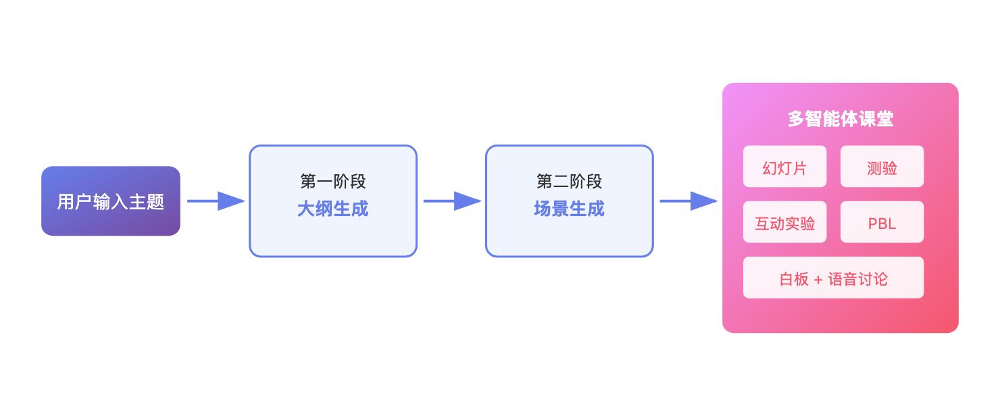

# 清华开源了一只「教学龙虾」：AI 老师带着 AI 同学给你上课

> 📖 **本文解读内容来源**
>
> - **原始来源**：[OpenMAIC GitHub 仓库](https://github.com/THU-MAIC/OpenMAIC)
> - **来源类型**：GitHub 仓库
> - **作者/团队**：清华大学 MAIC 团队
> - **发布时间**：2026 年 3 月
> - **技术栈**：Next.js 16 + React 19 + LangGraph 1.1
> - **Star 数**：开源项目，持续增长中

---

我最近想学点 Python，打开 B 站搜教程——两个小时过去了，我收藏了 17 个视频，一个都没看。

不是我不想学。是那些视频太长了，讲得太慢，而且我没法问问题。

然后我看到清华开源了一个叫 OpenMAIC 的项目。它的卖点是：你输入一个主题，它给你生成一个完整的"课堂"——有 AI 老师讲课，有 AI 同学讨论，有测验，有互动实验。

我试了下。输入"30 分钟教会我 Python 基础"。

五分钟后，我真的在"上课"了。

---

## 这玩意到底是什么

OpenMAIC 的全称是 Open Multi-Agent Interactive Classroom——开放式多智能体交互课堂。

翻译成人话：一个 AI 课堂生成器。

你告诉它想学什么，它自动生成一套完整的教学内容。但跟普通的 AI 问答不一样，它不是"我问你答"的模式，而是真的像在课堂里一样：

- AI 老师在幻灯片上讲课，有语音、有激光笔效果
- AI 同学会举手提问、发表观点
- 你可以随时打断、提问
- 还有白板，AI 会实时画图、写公式

它的核心是多智能体协作。不是一个大模型在那儿自言自语，而是多个 AI 角色各司其职——有的负责讲，有的负责提问，有的负责画图，有的负责组织讨论。

下面这张图展示了它的核心架构：

它的工作流程分两步：先分析你的输入生成课程大纲，然后把每个大纲节点变成具体的"场景"——可能是幻灯片、测验、互动实验，或者是项目制学习任务。

---

## 四种场景，不是只会放 PPT

OpenMAIC 生成的课堂有四种主要场景。

**幻灯片**：AI 老师在幻灯片上讲解，有语音、有聚光灯效果、有激光笔。跟真实的课堂录像差不多，但你可以随时暂停、提问。

**测验**：单选、多选、简答题都有。答完 AI 会给你评分和反馈。这个功能很多教育产品都有，不稀奇。

**互动实验**：这个挺有意思。它会生成可交互的 HTML 页面，比如物理模拟器、流程图、数据可视化。你可以在里面动手操作，边玩边学。

**项目制学习（PBL）**：选择一个角色，跟 AI 协作完成一个项目。有里程碑、有交付物。适合想"实战"的学习场景。

---

## 多智能体协作：不止一个 AI

OpenMAIC 最大的卖点是多智能体协作。

它的课堂里有多个 AI 角色：老师、同学、助教。他们不是在那儿轮流说话，而是真的会互动——老师讲到一半，同学可能会举手提问；你在白板上画了个图，AI 老师会点评、修改。

它用的是 LangGraph 来编排这些智能体。LangGraph 是 LangChain 团队做的多智能体框架，适合这种需要多个 AI 协作、有状态流转的场景。

这个设计让我想起一个问题：为什么教育类 AI 产品大多是"单打独斗"的模式？一个聊天框，一个 AI，你问我答。

但真实的课堂从来不是这样的。有老师、有同学、有讨论、有互动。学习本身就是一种社交行为。

OpenMAIC 的思路是：把这种社交感搬到 AI 课堂里。

---

## 实际体验怎么样

我试了几个场景。

第一个是"教我 Python 基础，30 分钟"。生成的课堂有 8 个场景：从变量讲到函数，每个场景 3-5 分钟。幻灯片做得挺专业，代码示例也能直接运行。测验题的难度适中，反馈也到位。

第二个是"讲解 DeepSeek 最新论文"。它先搜了论文信息，然后生成了一个"研讨会"形式的课堂。几个 AI 同学从不同角度讨论论文的创新点和局限性，还有个 AI 在白板上画架构图。

说实话，比我预想的好。但也有一些问题。

生成速度不算快，一个完整课堂要 3-5 分钟。语音合成是可选的，但开了之后效果更好——就是更慢了。还有，偶尔会出现"幻觉"，比如 AI 老师讲了一个其实不存在的概念。

不过作为一个开源项目，它的完成度已经很高了。

---

## 几个我觉得有意思的细节

**支持导出 PPT**：生成的内容可以导出成 `.pptx` 文件，可以直接拿来用。这个功能对老师很实用。

**OpenClaw 集成**：可以跟 OpenClaw（那个把 AI 助手接到飞书、Slack 的开源项目）配合用。在飞书里跟 AI 说"教我量子物理"，它就帮你生成课堂链接。

**推荐用 Gemini**：项目文档里明确说推荐用 Gemini 3 Flash，性价比最好。这一点挺实在——很多项目只说"支持多模型"，但不说哪个效果最好。

---

## 笔者的判断

OpenMAIC 属于"方向对了"的产品。

AI 教育领域这两年最大的问题不是技术不够强，而是产品形态太单一。绝大多数产品都是"聊天框 + 知识库"的模式，用久了就知道：这玩意儿很难让人坚持学下去。

OpenMAIC 的多智能体课堂，提供了一个新思路：学习需要"仪式感"，需要社交，需要互动。一个 AI 老师讲得再好，也不如一个有老师、有同学、有讨论的课堂让人投入。

当然，它现在还达不到"替代真人课堂"的程度。生成的课件偶尔有错误，互动也还有些机械。但作为一个开源项目，它已经展示了一种可能性：

未来的 AI 教育，可能不是"一个 AI 对一个学生"，而是"一个 AI 团队对一群学生"。

---

## 参考

- [OpenMAIC GitHub 仓库](https://github.com/THU-MAIC/OpenMAIC)
- [OpenMAIC 官网](https://openmaic.chat/)
- [清华团队开源多智能体 AI 互动课堂平台 - 开源中国](https://www.oschina.net/news/411200)
- [OpenMAIC 论文 - JCST 2026](https://jcst.ict.ac.cn/en/article/doi/10.1007/s11390-025-6000-0)