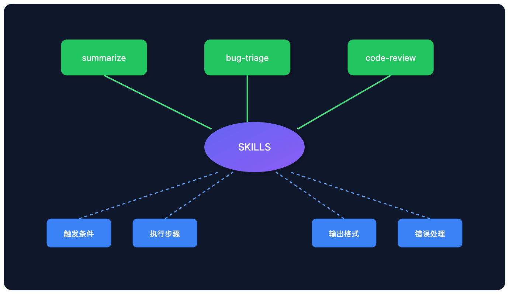
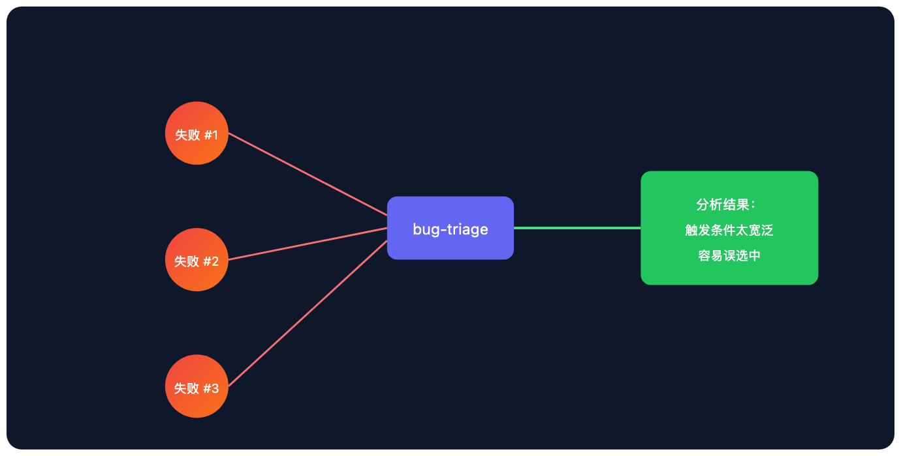
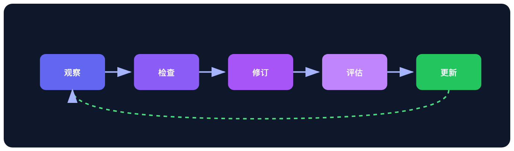

# 你的 SKILL.md 正在悄悄失效：让 Agent 技能自我进化的方法

> 📖 **本文解读内容来源**
>
> - 原始来源：[Self improving skills for agents](https://www.linkedin.com/posts/tricalt_self-improving-skills-for-agents-activity-7312444238484746240-d8jy)
> - 来源类型：技术博客
> - 作者：Vasilije（cognee 核心贡献者）
> - 发布时间：2025年3月

上周我帮一个团队排查多智能体系统的问题，症状很诡异：两个月前写得很好的 SKILL.md，现在莫名其妙开始抽风。不是报错，是"变傻"——选错技能、漏掉步骤、输出格式乱套。

我翻开文件看了看，内容没变。代码没变。Prompt 没变。

问题在哪？**环境变了。**

代码库改了几十次 commit，LLM 升了两个版本，用户问的问题也从"帮我分析数据"变成了"帮我做个竞品报告"。SKILL.md 还是那个 SKILL.md，但它已经和当前世界脱节了。

这篇文章要说的，就是这个问题怎么解。

## 静态技能的死穴

现在大多数人管理 SKILL.md 的方式是这样的：写一个提示词，存到文件夹里，要用的时候调用。

这套流程简单，开始效果也不错。但时间一长，问题就冒出来了：

- 某个技能被选中太频繁，但不知道为什么
- 另一个技能看起来描述很好，实际跑起来总出错
- 某条指令经常失败，但没人知道是哪条
- 工具调用因为环境变化突然崩了

最麻烦的是：**你不知道问题出在哪**——是路由错了、指令写错了，还是工具本身的问题？只能人工排查，逐个文件翻。

我看过太多团队的 skills 文件夹，里面躺着一堆 SKILL.md，没人知道哪些还在正常工作，哪些已经"腐坏"了。

## 一个让技能活起来的系统

cognee 团队提出了一个思路：不要把 SKILL.md 当成静态文件，而是当成**有生命周期的系统组件**。

核心想法很简单：技能执行后记录发生了什么，失败了就分析原因，然后自动提出修改建议。

这不是抽象概念，是一套完整的实现。整个循环分五步。

### 第一步：技能结构化入库

先看看你的 skills 文件夹现在长什么样：

```
my_skills/
├── summarize/
│   └── SKILL.md
├── bug-triage/
│   └── SKILL.md
└── code-review/
    └── SKILL.md
```

cognee 做的第一件事，是把这些技能"吃进去"——不是简单存文件，而是解析成图结构。每个技能的名称、描述、触发条件、步骤，都变成图里的节点和边。

这样做的好处是搜索和关联。当你问"我需要处理代码审查"时，系统不是简单匹配关键词，而是沿着图结构找到语义最相关的技能。

下面是技能图谱的可视化：



这个结构化存储用的是 cognee 的 **DataPoint** 模型。你可以自定义字段，系统会自动处理索引和语义关联。

```python
from cognee.infrastructure.engine import DataPoint

class Skill(DataPoint):
    name: str
    description: str
    trigger_conditions: list[str]
    steps: list[str]
    error_handling: dict
    metadata: dict = {"index_fields": ["name", "description"]}
```

### 第二步：观察与记录

技能执行完，不能就这样结束了。系统需要记录发生了什么：

- 尝试了什么任务？
- 选了哪个技能？
- 成功还是失败？
- 出了什么错？
- 用户给了什么反馈？

这些数据存到图里，作为技能节点的"执行历史"。有了这些记录，失败就从"不知道发生了什么"变成"可以分析的问题"。

```python
# 记录执行结果
await cognee.session.add_feedback(
    session_id="skill_execution",
    qa_id=execution_id,
    feedback_score=1,  # 1-5 分，1 表示失败
    feedback_text="技能选错了，应该是 bug-triage 而不是 summarize",
)
```

### 第三步：检查与分析

当某个技能失败次数积累到一定程度（或者一次严重失败），系统可以检查它的历史记录：过去的运行、用户反馈、工具错误、相关的任务模式。

因为所有数据都在图结构里，系统可以追溯失败的根本原因。



### 第四步：自动修订

这是整个系统最关键的部分。当证据表明某个技能表现不佳时，系统可以**自动提出修改建议**。

修改建议可能包括：

- 收紧触发条件，避免被误选中
- 添加缺失的边界条件处理
- 调整步骤顺序
- 修改输出格式要求

```python
# 应用反馈权重更新图结构
from cognee.memify_pipelines.apply_feedback_weights_pipeline import apply_feedback_weights_pipeline

await apply_feedback_weights_pipeline(
    session_ids=["skill_execution"],
    alpha=0.1,  # 学习率
)
```

这个 .amendify() 过程是可控的：人工审核后应用，或者配置成自动应用。

### 第五步：评估与更新

自动修改听起来很酷，但这里有个陷阱：**你怎么知道改完之后更好了？**

所以完整的循环不是四步，而是五步：

**观察 → 检查 → 修订 → 评估**

如果修改没有带来可测量的改进，系统应该能回滚。因为每次改动都记录了理由和结果，原始指令永远不会丢失。



## 这套系统的价值在哪

我见过不少团队用 SKILL.md，大多数人的痛点是一样的：技能文件写得挺好，但没人维护。

不是不想维护，是**不知道要维护什么**。

这套方案解决的核心问题是：让技能的退化变得可见、可追溯、可修复。你不需要人工翻文件找问题，系统会告诉你哪个技能出了问题、为什么、怎么改。

从工程角度看，这把"维护技能"从一项需要人工判断的工作，变成了一个可以自动化的流程。

## 我的看法

这个方案确实解决了痛点，但我觉得有几个地方需要权衡：

**一是复杂度。** 如果你的系统只有 5 个技能，这套机制可能有点重。但如果你的 skills 文夹里躺着 50 个技能，没有自动化机制就是灾难。

**二是信任问题。** 让系统自动改你的 prompt，你敢不敢放手？我建议先从"人工审核 + 自动应用"的混合模式开始，观察一段时间再决定要不要全自动化。

**三是基础设施成本。** 图数据库、向量数据库、执行历史存储——这些都是额外开销。小团队可能觉得划不来，但如果你的多智能体系统是核心产品，这个投资是值得的。

cognee 已经在 PyPI 上发布了这个功能，GitHub 也有完整的文档。如果你正在被技能维护问题困扰，值得花半天时间试一试。

## 参考

- [Self improving skills for agents - LinkedIn 原文](https://www.linkedin.com/posts/tricalt_self-improving-skills-for-agents-activity-7312444238484746240-d8jy)
- [cognee GitHub 仓库](https://github.com/topoteretes/cognee)
- [cognee PyPI](https://pypi.org/project/cognee/)
- [技能图谱可视化 Demo](https://cognee-graph-skills.vercel.app/)