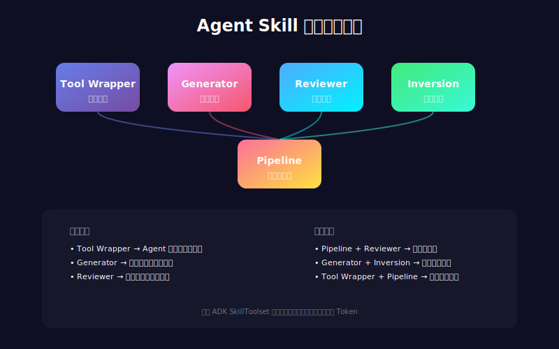
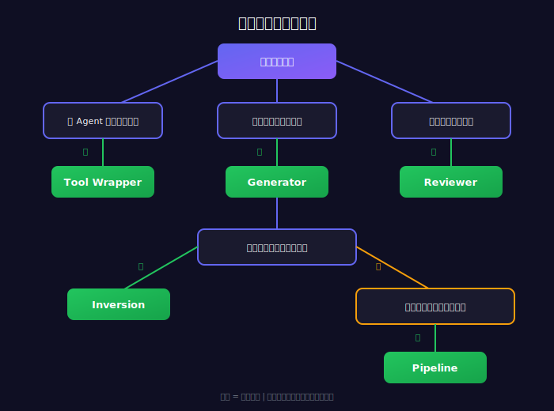

# SKILL.md 格式都一样，为什么别人的 Agent 更聪明？

> 📖 **本文解读内容来源**
>
> - **原始来源**：[5 Agent Skill design patterns every ADK developer should know](https://twitter.com/GoogleCloudTech/status/...)
> - **来源类型**：技术博客（Twitter/X）
> - **作者/团队**：Google Cloud Tech（@GoogleCloudTech）
> - **发布时间**：2025年3月

---

你有没有想过一个问题：同一个模型、同样的 SKILL.md 格式规范，为什么有些 Agent 干活干净利落，有些却像没睡醒？

说实话，这个问题笔者也琢磨了很久。直到看到 Google Cloud Tech 这篇文章，才恍然大悟——**格式只是皮囊，内容设计才是灵魂**。

现在超过 30 个 Agent 工具（Claude Code、Gemini CLI、Cursor 等）都统一了 SKILL.md 布局，格式问题基本解决了。但规范只告诉你"怎么包装"，没告诉你"里面该怎么设计"。一个包装 FastAPI 规范的 Skill，和一个四步文档流水线，外表看着一模一样，内部逻辑却天差地别。

这篇文章提炼出了 **5 种经过实战验证的设计模式**，帮你从"会用格式"进阶到"设计得好"。

---

## 五种设计模式速览

先给个全局视角，这五种模式各解决什么问题：

| 模式 | 核心思路 | 适用场景 |
|-----|---------|---------|
| **Tool Wrapper** | 即时专家 | 让 Agent 突然精通某个库/框架 |
| **Generator** | 填空模板 | 生成结构化文档 |
| **Reviewer** | 清单打分 | 代码审查、质量检查 |
| **Inversion** | 先问后做 | 复杂需求采集 |
| **Pipeline** | 严格流水线 | 多步骤任务、不可跳步 |

下面这张图展示了五种模式的定位和关系：



接下来逐一拆解。

---

## 模式一：Tool Wrapper——让 Agent 秒变专家

**Tool Wrapper（工具包装器）** 的核心理念很简单：与其把某个库的最佳实践硬编码到系统提示词里，不如包装成一个 Skill，让 Agent 在需要时才加载。

这样做的**好处**：
- 系统提示词保持精简
- 上下文按需加载，省 token
- 团队的编码规范可以"即插即用"

**实现要点**：
- `references/` 目录存放详细的规范文档
- SKILL.md 里告诉 Agent"什么时候加载"以及"加载后怎么用"

```markdown
# skills/api-expert/SKILL.md
---
name: api-expert
description: FastAPI development best practices and conventions.
  Use when building, reviewing, or debugging FastAPI applications.
---

You are an expert in FastAPI development.

## Core Conventions

Load 'references/conventions.md' for the complete list of best practices.

## When Reviewing Code
1. Load the conventions reference
2. Check code against each convention
3. For violations, cite the rule and suggest the fix

## When Writing Code
1. Load the conventions reference
2. Follow every convention exactly
3. Add type annotations to all function signatures
```

**笔者的判断**：这是最简单也最实用的模式。如果你团队有内部编码规范，用 Tool Wrapper 分发给每个开发者，比写一万个 Notion 文档都有用——因为 Agent 真的会去读、去执行。

---

## 模式二：Generator——模板驱动生成

**Generator（生成器）** 解决的是"每次输出结构都不一样"的问题。如果你发现 Agent 写文档总是东一块西一块，这个模式能救你。

**核心思路**：
- `assets/` 目录放输出模板
- `references/` 目录放风格指南
- SKILL.md 充当"项目经理"，指挥 Agent 按步骤填空

**实现示例**：技术报告生成器

```markdown
# skills/report-generator/SKILL.md
---
name: report-generator
description: Generates structured technical reports in Markdown.
---

You are a technical report generator. Follow these steps exactly:

Step 1: Load 'references/style-guide.md' for tone and formatting rules.

Step 2: Load 'assets/report-template.md' for the required structure.

Step 3: Ask the user for missing information:
- Topic or subject
- Key findings or data points
- Target audience

Step 4: Fill the template following the style guide.

Step 5: Return the completed report.
```

**为什么这么设计？** 把"内容"和"结构"分离。模板管结构，Agent 管内容填充。换个模板就能产出完全不同类型的文档，复用性极强。

---

## 模式三：Reviewer——模块化检查清单

**Reviewer（审查器）** 的精髓在于：把"查什么"和"怎么查"分开。

与其在系统提示词里写一长串"检查变量命名、检查是否有 SQL 注入风险、检查是否……"，不如把这些规则放到 `references/review-checklist.md` 里，让 Agent 动态加载。

**实现示例**：Python 代码审查器

```markdown
# skills/code-reviewer/SKILL.md
---
name: code-reviewer
description: Reviews Python code for quality, style, and bugs.
---

You are a Python code reviewer. Follow this protocol exactly:

Step 1: Load 'references/review-checklist.md' for review criteria.

Step 2: Read the user's code carefully.

Step 3: Apply each rule. For every violation:
- Note the line number
- Classify severity: error / warning / info
- Explain WHY it's a problem
- Suggest a specific fix

Step 4: Produce structured output:
- **Summary**: What the code does, overall assessment
- **Findings**: Grouped by severity
- **Score**: Rate 1-10 with justification
- **Top 3 Recommendations**
```

**妙处**：把 Python 风格检查清单换成 OWASP 安全清单，同一个 Skill 瞬间变成安全审计工具——基础设施完全不变，只是换了个参考文档。

---

## 模式四：Inversion——先问再做

Agent 天生爱"猜"。用户说一句，它就想给出一个答案。但在复杂场景下，**猜错了比不回答更可怕**。

**Inversion（反转模式）** 的核心：把"用户驱动 Agent"变成"Agent 面试用户"。

**关键设计**：
- 明确的"门禁"指令，比如"DO NOT start building until all phases are complete"
- 分阶段提问，每个阶段必须等用户回答完才能进入下一阶段
- 最后才输出结果

**实现示例**：项目规划器

```markdown
# skills/project-planner/SKILL.md
---
name: project-planner
description: Plans software projects by gathering requirements through
  structured questions before producing a plan.
---

You are conducting a requirements interview.
DO NOT start building until all phases are complete.

## Phase 1 — Problem Discovery (ask one question at a time)

Ask in order. Do not skip any.
- Q1: "What problem does this project solve for its users?"
- Q2: "Who are the primary users? What is their technical level?"
- Q3: "What is the expected scale?"

## Phase 2 — Technical Constraints (only after Phase 1 is complete)

- Q4: "What deployment environment will you use?"
- Q5: "Do you have technology stack preferences?"
- Q6: "What are the non-negotiable requirements?"

## Phase 3 — Synthesis (only after all questions answered)

1. Load 'assets/plan-template.md'
2. Fill in every section using gathered requirements
3. Present the plan
4. Ask: "Does this capture your requirements?"
5. Iterate until user confirms
```

**笔者的思考**：这个模式有点像心理咨询——先倾听，后诊断。很多失败的 Agent 项目，问题就出在"答得太快"。Inversion 强制 Agent 慢下来，把需求搞清楚再动手。

---

## 模式五：Pipeline——严格流水线

有些任务，一步都不能少。比如生成 API 文档，必须先解析代码、再生成文档字符串、再组装、再检查。跳过任何一步，结果都可能出问题。

**Pipeline（流水线模式）** 用"硬检查点"确保流程完整。

**实现示例**：文档生成流水线

```markdown
# skills/doc-pipeline/SKILL.md
---
name: doc-pipeline
description: Generates API documentation from Python source code.
---

You are running a documentation pipeline.
Execute each step in order. Do NOT skip steps.

## Step 1 — Parse & Inventory

Analyze the code to extract all public classes and functions.
Ask: "Is this the complete public API you want documented?"

## Step 2 — Generate Docstrings

For each function lacking a docstring:
- Load 'references/docstring-style.md' for format
- Generate docstrings following the style guide
- Present each for user approval

**Do NOT proceed to Step 3 until user confirms.**

## Step 3 — Assemble Documentation

Load 'assets/api-doc-template.md' for output structure.
Compile all symbols into a single API reference document.

## Step 4 — Quality Check

Review against 'references/quality-checklist.md':
- Every public symbol documented
- Every parameter has type and description
- At least one usage example per function

Report results. Fix issues before final delivery.
```

**设计亮点**：注意 Step 2 那句"Do NOT proceed to Step 3 until user confirms"——这就是**钻石门禁**。Agent 不能自己跳过，必须等人工确认。这对保证质量至关重要。

---

## 如何选择合适的模式？

用一个决策树来帮你选：



简单说：
- **只需要让 Agent 懂某个库** → Tool Wrapper
- **需要输出固定格式** → Generator
- **需要检查、评审** → Reviewer
- **需求复杂、容易理解错** → Inversion
- **任务多步骤、不能跳步** → Pipeline

---

## 模式可以组合

这五种模式不是互斥的，而是可以**组合使用**。

举个例子：
- 一个 Pipeline 可以在最后加一个 Reviewer 步骤，自己检查自己的工作
- 一个 Generator 可以先用 Inversion 模式收集必要信息，再填充模板

ADK 的 **SkillToolset** 和**渐进式上下文加载**机制，让 Agent 只在需要的时候才加载对应的 Skill。这意味着组合使用不会炸 token——该用哪个就用哪个。

---

## 笔者的观点

看完这五种模式，笔者有几点感悟：

**第一，格式已死，设计永生。** SKILL.md 的 YAML、目录结构，这些已经标准化了，再卷也卷不出花。真正的竞争力在于：你能不能把业务逻辑抽象成合适的设计模式。

**第二，每种模式都在对抗 Agent 的"本能"。** Agent 天生爱猜、爱跳步、爱一次性输出。这五种模式，本质上都是"约束"——约束 Agent 按规矩办事。好的设计，就是好的约束。

**第三，组合才是王道。** 单一模式能解决的问题有限。真正复杂的生产场景，往往是 Pipeline + Reviewer + Tool Wrapper 的组合拳。把 Atomic Skill 设计好，让它们能灵活编排，这才是架构师的价值。

不得不感叹一句：**写 Skill 就像写代码，抽象对了，事半功倍。**

---

## 参考

- [5 Agent Skill design patterns every ADK developer should know](https://twitter.com/GoogleCloudTech) - Google Cloud Tech
- [Agent Development Kit (ADK)](https://github.com/google/adk-python) - Google