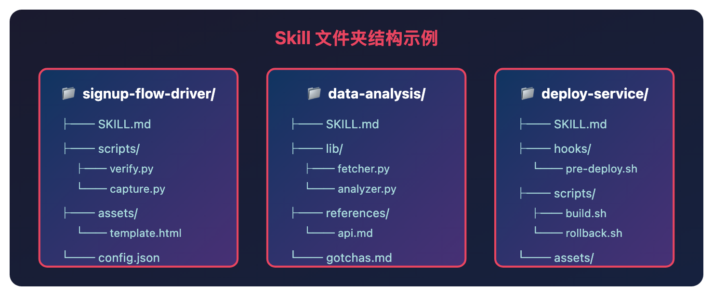

# Anthropic 团队如何用 Skills？这 9 类技能让 AI Agent 真正落地

> 📖 **本文解读内容来源**
>
> - **原始来源**：[Lessons from Building Claude Code: How We Use Skills](https://x.com/trq212/status/...) - Anthropic 官方博客
> - **来源类型**：技术博客
> - **作者/团队**：Thariq（Anthropic Claude Code 团队）
> - **发布时间**：2026 年 3 月

---

你给 AI Agent 一堆指令，它总是"听不懂"。让它帮你跑个测试流程，每次都要重新学习一遍你的项目结构。

问题出在哪？缺一套标准化的"技能包"。

最近 Anthropic 官方分享了他们内部使用 Claude Code Skills 的经验。团队内部有数百个 Skills 在活跃使用。这些 Skills 不只是简单的提示词，而是包含脚本、资源、数据的完整文件夹。

这篇文章有意思的地方在于，它解决了 AI Agent 落地最核心的问题：如何让 AI 真正理解你的业务。

---

## Skills 是什么？

先说一个常见误解：Skills 不只是 markdown 文件。

Skills 是文件夹，可以包含脚本、资源、数据等。Agent 可以发现、探索和操作这些内容。更重要的是，Skills 支持丰富的配置选项，包括注册动态钩子（hooks）。

打个比方：传统提示词是"口头交代"，Skills 是"给 AI 一本带工具的操作手册"。

---

## 9 类 Skills 分类

Anthropic 团队对内部数百个 Skills 做了分类，发现它们天然聚类成 9 种类型。有意思的是，好的 Skills 能干净地归入某一类，糟糕的则跨了好几类。

### 1. Library & API Reference（库与 API 参考）

解释如何正确使用某个库、CLI 或 SDK。通常包含参考代码片段和"坑点列表"。

示例：
- `billing-lib`：内部计费库的边缘情况和踩坑点
- `frontend-design`：让 Claude 更好地理解你的设计系统

### 2. Product Verification（产品验证）

描述如何测试或验证代码是否正常工作。通常配合 Playwright、tmux 等外部工具使用。

示例：
- `signup-flow-driver`：在无头浏览器中跑完注册→邮件验证→新手引导全流程
- `checkout-verifier`：用 Stripe 测试卡驱动结账 UI，验证账单状态

### 3. Data Fetching & Analysis（数据获取与分析）

连接数据源和监控栈，包含凭证库、特定仪表板 ID 等。

示例：
- `funnel-query`：哪些事件需要 JOIN 才能看到"注册→激活→付费"漏斗
- `grafana`：数据源 UID、集群名称、问题→仪表板映射表

### 4. Business Process & Team Automation（业务流程与团队自动化）

把重复性工作流自动化成一条命令。

示例：
- `standup-post`：聚合工单跟踪器、GitHub 活动、历史 Slack，格式化站会报告
- `weekly-recap`：已合并 PR + 已关闭工单 + 部署记录，格式化周报

### 5. Code Scaffolding & Templates（代码脚手架与模板）

为特定框架生成样板代码。

示例：
- `new-migration`：迁移文件模板 + 常见坑点
- `create-app`：预配置好认证、日志、部署的新内部应用

### 6. Code Quality & Review（代码质量与审查）

强制执行代码质量规范，帮助审查代码。

示例：
- `adversarial-review`：生成一个"新鲜视角"子 Agent 进行批评，实现修复，迭代直到问题变成"吹毛求疵"
- `code-style`：强制执行代码风格，尤其是 Claude 默认做不好的部分

### 7. CI/CD & Deployment（持续集成与部署）

帮助获取、推送和部署代码。

示例：
- `babysit-pr`：监控 PR，重试失败的 CI，解决合并冲突，启用自动合并
- `deploy-service`：构建→冒烟测试→渐进流量切换（带错误率对比）→自动回滚

### 8. Runbooks（运维手册）

接收一个症状（如 Slack 线程、告警、错误签名），走完多工具调查流程，生成结构化报告。

示例：
- `service-debugging`：症状 → 工具 → 查询模式映射
- `log-correlator`：给定请求 ID，从每个相关系统拉取匹配日志

### 9. Infrastructure Operations（基础设施运维）

执行例行维护和运维操作，有些涉及需要护栏的破坏性操作。

示例：
- `resource-orphans`：找到孤立 pod/volume，发到 Slack，等待期，用户确认，级联清理
- `cost-investigation`："为什么存储/出口账单飙升"

---

## 制作 Skills 的几个技巧

Anthropic 团队分享了几条实战经验：

### 不要说废话

Claude Code 已经很了解你的代码库，Claude 也很懂编程。如果你要发布一个主要关于知识的 Skill，聚焦在那些能让 Claude 打破常规思维的信息上。

比如 `frontend-design` 这个 Skill，就是工程师通过与客户迭代，让 Claude 的设计品味更好，避免 Inter 字体、紫色渐变等"AI 味"设计。

### Gotchas 章节是灵魂

任何 Skill 中信号最强的内容就是 Gotchas（坑点）章节。这些内容应该从 Claude 使用 Skill 时遇到的常见失败点中积累。理想情况下，你会随着时间更新 Skill 来记录这些坑点。

### 把文件系统当作上下文工程

Skill 是文件夹，不是单个 markdown 文件。把整个文件系统当作一种"上下文工程"和"渐进式披露"的形式。告诉 Claude 你的 Skill 里有哪些文件，它会在合适的时候去读取。

最简单的渐进式披露是指向其他 markdown 文件。比如把详细的函数签名和使用示例拆分到 `references/api.md`。

### 给 Claude 灵活性

Claude 通常会尽量遵守你的指令，而 Skills 又很可复用，所以要小心指令过于具体。给 Claude 它需要的信息，但也要给它适应情况的灵活性。

### Description 字段是给模型看的

Claude Code 启动时会构建所有可用 Skill 的清单，包括描述。Claude 扫描这个清单来决定"这个请求有没有对应的 Skill"。所以 Description 字段是"何时触发这个 Skill"的描述。

---

## 几点想法

**Skills 解决了"AI 不懂业务"的问题。**

传统提示词的问题是一次性的，每次对话都要重新交代背景。而 Skills 把业务知识固化为可复用的"技能包"，让 AI 真正理解你的项目架构、测试流程、部署规范。

**9 类分类法是一个很实用的"体检清单"。**

对照这个清单检查：团队缺哪类 Skills？"产品验证"类空缺，可能意味着测试流程不够自动化；"运维手册"类空缺，可能意味着故障排查还依赖个人经验。

**Gotchas 章节才是 Skill 的灵魂。**

大多数人写 Skill 只写"怎么用"，但真正有价值的是"哪里会踩坑"。Anthropic 的建议是持续更新 Gotchas，这意味着 Skills 是活的文档，需要随着使用不断迭代。

**Skills 的本质是"可执行的知识管理"。**

传统知识管理是"写文档→存起来→没人看"。Skills 则是"写文档→AI 自动读取→执行任务"。知识不再躺在知识库里吃灰，而是直接转化为生产力。

---

## 写在最后

这篇内容的价值在于，它展示了一个已经验证有效的 AI Agent 落地模式。

Skills 的核心理念很简单：不要让 AI 每次都从零开始学习，而是给它一套标准化的"工具箱"。听起来像是常识，但真正把它系统化、工程化的，Anthropic 是第一家。

AI Agent 的竞争，正在从"谁的模型更强"转向"谁的基础设施更完善"。Skills，就是这个基础设施的关键一环。

搭建 AI Agent 的话，可以从这几类 Skills 开始：Library Reference（让 AI 懂你的代码库）、Product Verification（让 AI 能测试自己的输出）、Runbooks（让 AI 能排查问题）。这三个搞定，你的 Agent 就已经比 90% 的"裸奔" Agent 强了。

---

### 参考

- [Lessons from Building Claude Code: How We Use Skills](https://x.com/trq212) - Thariq, Anthropic
- [Claude Code Skills Documentation](https://docs.anthropic.com/claude-code/skills)