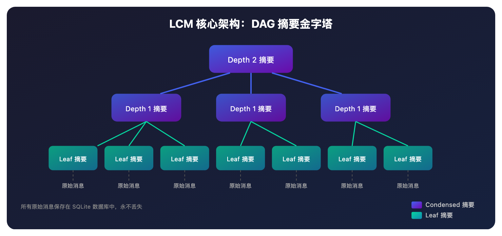

# 为什么你的 AI Agent 总是记不住？Lossless Context Management 来了

> 📖 **本文解读内容来源**
>
> - **原始来源**：[lossless-claw](https://github.com/Martian-Engineering/lossless-claw) - GitHub 仓库
> - **来源类型**：GitHub 仓库 / 开源项目
> - **作者/团队**：Martian Engineering
> - **发布时间**：2026 年 2 月
> - **Star 数**：2500+ ⭐
> - **主要语言**：TypeScript / Go

---

你有没有遇到过这种情况：和一个 AI Agent 聊了很久，讨论了项目架构、定了技术方案、改了十几轮代码，结果聊到后面，它突然问你："你说的那个 bug 是哪个模块的？"

这不是模型不够聪明，而是它的**上下文窗口满了**——旧的消息被截断丢弃了。

说实话，这在 AI Agent 领域是个普遍问题。几乎所有主流 Agent 都采用"滑动窗口"策略：当对话超过模型上下文限制时，直接丢弃最早的消息。

但最近笔者发现了一个叫 **LCM（Lossless Context Management）** 的方案，它的核心理念是：**不丢弃任何消息，而是用 DAG 结构的摘要系统保留所有历史**。听起来有点意思？往下看。

---

## 到底什么是 LCM？

用大白话说：**传统方法是"扔掉旧消息"，LCM 是"压缩旧消息但保留索引"**。

所谓 LCM，其实就像一个超级秘书——它不会扔掉你说过的话，而是把早期的对话整理成"会议纪要"，堆叠成金字塔结构。当你需要回忆某个细节时，它能顺着纪要层层下钻，找回原始记录。



传统滑动窗口和 LCM 的区别：

| 维度 | 滑动窗口 | LCM |
|------|---------|-----|
| 处理方式 | 直接丢弃旧消息 | 摘要压缩 + 保留原始数据 |
| 信息损失 | 100% 丢失 | 0% 丢失（原始数据保留） |
| 可追溯性 | 无法追溯 | 可通过 DAG 层层下钻 |
| 召回工具 | 无 | grep / describe / expand |

---

## 它是怎么做到的？

LCM 的核心是一个**摘要 DAG（有向无环图）**，分为两层节点：

### Leaf Summaries（深度 0）

从原始消息块创建。比如你聊了 50 轮对话，最早的 10 轮会被打包成一个 Leaf 摘要，包含时间线和关键信息。典型的 Leaf 摘要约 800–1200 tokens。

### Condensed Summaries（深度 1+）

当 Leaf 摘要积累到一定数量，它们会被"压缩"成更高层的 Condensed 摘要。层级越高，内容越抽象。比如 Depth 1 的摘要可能是"我们讨论了 OAuth 认证方案的迁移"，Depth 2 可能是"本周完成了认证系统重构"。

### 关键：原始消息从不删除

所有原始消息都存在 SQLite 数据库里。每个摘要都记录了它的"来源消息 ID"，想看细节？随时可以下钻找回。

这就像一本字典：摘要目录告诉你"某页讨论了某个话题"，但原文永远在那里，不会因为你只看了目录就被撕掉。

---

## 上下文组装：模型到底看到了什么？

每个对话轮次开始前，LCM 会组装当前上下文：

```
[摘要₁, 摘要₂, ..., 摘要ₙ, 最近的消息₁, 最近的消息₂, ..., 最近的消息ₘ]
├──── 预算受限部分 ────┤  ├────── 受保护的 Fresh Tail ──────┤
```

**Fresh Tail**（新鲜尾部）是最近 N 条消息（默认 32 条），它们永远不会被压缩，确保模型有足够的当前上下文。

当上下文超过阈值（默认 75%），自动触发压缩：
1. 识别最早的消息块
2. 调用 LLM 生成摘要
3. 将摘要替换原始消息块
4. 如果摘要也积压了，继续向上压缩

### 三级升级策略

压缩不是一次性的。如果 LLM 产出质量不好，LCM 会逐级升级：

1. **Normal 模式**：标准提示词，温度 0.2
2. **Aggressive 模式**：更紧凑的提示词，只保留"持久事实"，温度 0.1
3. **Fallback 模式**：确定性截断到 ~512 tokens

这确保压缩永远能进行，不会因为 LLM 罢工而卡住。

---

## 四个召回工具：让 Agent 能"回忆"

LCM 提供了四个工具，让 Agent 可以从压缩历史中检索信息：

### 1. lcm_grep —— 搜索

用关键词或正则表达式搜索消息和摘要。比如你想找之前讨论的某个配置：

```
lcm_grep(pattern: "database.pool.size", scope: "both")
```

### 2. lcm_describe —— 查看

查看特定摘要的完整内容。比 grep 更详细，但不会触发子代理：

```
lcm_describe(id: "sum_abc123def456")
```

### 3. lcm_expand_query —— 深度召回（杀手锏）

这是 LCM 的杀手锏。当摘要太压缩，你需要的细节被"折叠"了，这个工具会**启动一个子代理，沿着 DAG 向下追溯原始消息**：

```
lcm_expand_query(
  query: "OAuth 认证修复",
  prompt: "根本原因是什么？哪些 commit 修复了它？"
)
```

子代理会：
- 找到相关摘要
- 沿着父链接向下追溯
- 读取原始消息内容
- 返回聚焦答案（默认 ≤ 2000 tokens）

### 4. lcm_expand —— 底层工具

仅供子代理使用，普通 Agent 不需要直接调用。

---

## 实战：如何使用 lossless-claw？

lossless-claw 是 LCM 的 OpenClaw 插件实现。如果你已经在用 OpenClaw，安装很简单：

```bash
openclaw plugins install @martian-engineering/lossless-claw
```

### 关键配置

```json
{
  "plugins": {
    "entries": {
      "lossless-claw": {
        "enabled": true,
        "config": {
          "freshTailCount": 32,
          "contextThreshold": 0.75,
          "incrementalMaxDepth": -1
        }
      }
    }
  }
}
```

**推荐的起步配置**：
- `freshTailCount: 32` —— 保护最近 32 条消息不被压缩
- `contextThreshold: 0.75` —— 上下文用到 75% 时触发压缩
- `incrementalMaxDepth: -1` —— 允许 DAG 无限深度级联

### 大文件处理

如果用户粘贴了大文件（默认 > 25k tokens），LCM 会：
1. 将文件单独存储到 `~/.openclaw/lcm-files/`
2. 生成 200 tokens 的"探索摘要"
3. 在消息中用紧凑引用替换原文件

这样单个大文件不会吃掉整个上下文窗口。

---

## 笔者的判断

说实话，LCM 解决的是 AI Agent 长期记忆的核心痛点。传统滑动窗口就像"健忘症患者"，聊着聊着就忘了前面说过什么。LCM 的 DAG 摘要架构，让 Agent 既能处理无限长的对话，又能随时"回忆"起任何细节。

**优势**：
- 真正的"无损"——原始数据永不丢失
- 自动化——配置好后，用户完全不用管压缩这件事
- 可召回——四个工具让 Agent 能主动检索历史

**局限性**：
- 需要 OpenClaw 作为宿主（不能单独使用）
- 摘要质量依赖 LLM——模型不好，摘要就不好
- 有一定配置门槛，需要理解 DAG 结构

**笔者看好 LCM 的原因**：它把"记忆管理"从模型层移到了架构层。模型只负责理解和生成，存储和检索交给专门的系统。这是正确的分层思想——就像操作系统负责内存管理，应用程序不用操心 page swap。

不得不感叹一句：**好的架构设计，是把复杂的事情变透明**。LCM 让"无限记忆"对用户完全透明——你只管聊，它负责记住。

---

### 参考

- [lossless-claw GitHub 仓库](https://github.com/Martian-Engineering/lossless-claw)
- [LCM Architecture 文档](https://github.com/Martian-Engineering/lossless-claw/blob/main/docs/architecture.md)
- [LCM Agent Tools 文档](https://github.com/Martian-Engineering/lossless-claw/blob/main/docs/agent-tools.md)
- [LCM 官网](https://www.losslesscontext.ai/)