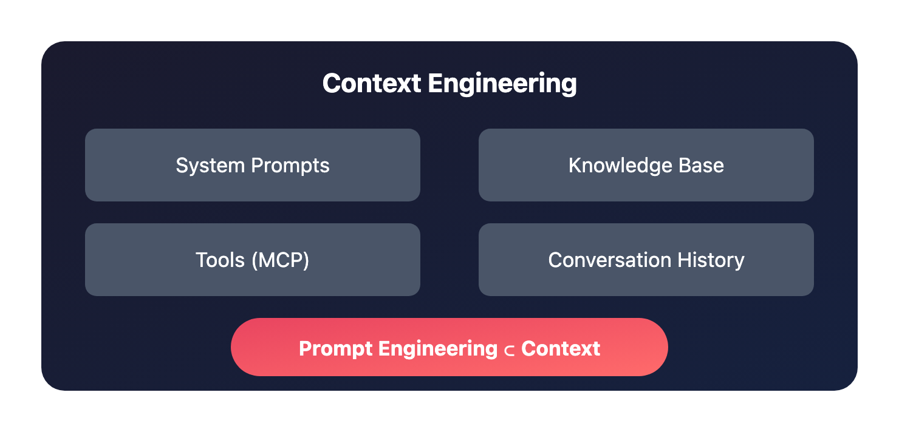

# 别再死磕 Prompt 了，上下文工程才是真正的提效杠杆

> 📖 **本文解读内容来源**
>
> - **原始来源**：[Stop Writing Better Prompts. Start Building Better Context.](https://t.me/witcheergrimoire) - Telegram 频道 @witcheer
> - **来源类型**：技术博客
> - **作者**：witcheer（Yari Finance Head of Growth）
> - **发布时间**：2026 年 3 月

---

你有没有过这种感觉：明明已经很努力地优化 prompt 了，加了例子、调了语气、甚至用 XML 标签把结构弄得漂漂亮亮，但模型的输出质量提升就是不明显？

说实话，这不是你 prompt 写得不够好，而是你一直在"错误的地方"努力。

笔者最近读到一篇来自 witcheer 的文章，作者花了数周时间打磨 prompt，最后发现真正让输出质量跃升的，根本不是 prompt 本身——而是模型在回答问题之前能访问到什么。这个认知转变，有一个名字：**上下文工程（Context Engineering）**。

下面这张图说清楚了 prompt engineering 和 context engineering 的关系：



你看，**Prompt Engineering 只是 Context Engineering 的一个子集**。你可以写出完美的 prompt，但如果模型没有正确的背景信息，你得到的只是一个"精致的通用回答"。

---

## 到底什么是上下文工程？

用大白话说：**Prompt 工程是"怎么问"，上下文工程是"模型回答时能看到什么"**。

Anthropic 官方给出的定义是："什么样的上下文配置最可能产生你想要的行为？"这个配置包括：

- System prompts：行为架构
- Knowledge base：持久化参考材料
- Tools：模型能做什么，而不只是知道什么
- Conversation history：对话历史与记忆

来个具体例子。同一个 prompt，两种不同的上下文：

**Prompt**：写一条给稳定币协议的合作 DM，介绍 Yari 产品。

**空白对话输出**：
> "你好，我想探讨一下我们协议之间的潜在协同效应。我们认为有一个有趣的合作机会。你愿意打个电话聊聊吗？"

**在加载了 Yari 文档、竞品定位、抵押品路线图的 Claude Project 中输出**：
> "你们的代币有可靠的价格预言机和发行人赎回路径，但 [已编辑]。Yari 的 [已编辑] 可以 [已编辑]。很高兴在电话里详细讲解具体机制。"

同一个 prompt，输出质量天差地别。变量只有一个：模型知道什么。

---

## 上下文的四个层次

作者花了几个月时间搭建自己的工作流，把上下文拆成了四个层次。每个层次都有具体的配置方法。

### 层次一：System Prompts——行为架构，不是偏好

这是最容易被误解的一层。很多人写 system prompt 像"许愿"："请帮我，要简洁专业。"太模糊了，根本塑造不了行为。

看看这个糟糕的 system prompt：
> "你是一个有帮助的写作助手。请简洁、专业。"

再看看作者实际用的内容项目指令：

```markdown
第一人称，对话风格。除了专有名词和 'I' 之外全部小写。用数据开头。

展示成功和失败，比如"基础设施能跑，但草稿还不够好"。每篇文章一个金句结尾。

只用英式英语。所有引用必须带 URL 和日期。

永远不要用：'game-changing', 'revolutionary', 'leverage', 'synergy'。

长文结构：有力的钩子 → 带 --- 分隔符的结构化拆解 → 强结尾。文章格式里不要小标题。
```

看出区别了吗？前者告诉模型"要简洁"，后者告诉模型"怎么做才简洁"。**具体性就是行为架构，模糊就是放弃责任。**

### 层次二：Knowledge Base——持久化参考材料

作者的内容项目加载了约 15 个文件：写作风格指南、话题层级、格式模板，以及最近 8 篇已发表文章。

没有这一层，每次对话都从零开始。你上传文档、解释是什么、拿到输出，然后下次再来一遍。有了它，Claude 在几十次对话中推理同一个持久化的知识库，质量会复利增长。

Anthropic 的课程教"few-shot examples"——给模型看好输出的样子。持久化知识库就是 few-shot 的规模化版本。你过去的 8 篇文章就是例子，Claude 不需要你描述写作风格，它自己能看出来。

### 层次三：Tools——模型能做什么，而不只是知道什么

这是大多数人完全跳过的一层。**MCP（Model Context Protocol）** 让 Claude 连接到你的文件系统、GitHub 仓库、数据库、浏览器。作者写过完整的配置指南。

工具访问是一个上下文层，因为它改变模型在对话中能拉取什么信息。没有 MCP，你手动粘贴文件到 Claude。有了 MCP，Claude 直接从你的项目目录读取。模型的有效上下文从"我记得粘贴了什么"扩展到"项目目录里的所有东西"。

### 层次四：Conversation History & Memory——复利层

Anthropic 的上下文工程指南介绍了三种长周期任务技术：

- **Compaction（压缩）**：当接近上下文限制时压缩对话历史，保留架构决策和未解决问题，丢弃冗余输出
- **Structured Note-taking（结构化笔记）**：模型在上下文窗口外写持久化笔记，稍后检索。Claude 玩 Pokémon 的演示就用了这个，在数千步游戏操作中维持精确计数
- **Sub-agent Architectures（子代理架构）**：专门化代理处理聚焦任务，拥有干净的上下文窗口，返回压缩后的摘要（1000-2000 tokens）

实践中，这就是为什么作者在同一个 Claude Project 里开新对话，而不是跑一个无限长的聊天。项目上下文保持完整，对话上下文保持新鲜。

---

## Context Rot：更多不代表更好

更多上下文不一定意味着更好的输出。Anthropic 把这个现象叫"**Context Rot（上下文腐烂）**"——模型从上下文中准确召回信息的能力，会随着 token 数量增加而下降。

技术原因是：Transformer 模型在 token 之间创建 n² 的成对关系。更长的上下文会拉扯模型的注意力容量。不是悬崖式的下跌，是渐进式的。但它是真实存在的。

**别把所有东西都扔进一个项目里然后祈祷。**

作者踩过这个坑。第一个 Claude Project 叫"内容"，里面塞了所有东西。Claude 没法优先处理任何东西，输出不聚焦，从无关文档里抓内容，混搭上下文。

拆分成目的明确的项目、精选特定文档，是单次最大的质量跃升。内容项目里的 15 个针对性文件，每次都打赢 50 个随机文件。

Anthropic 指南说得完美："找到最小的高信号 token 集合，最大化你想要的结果概率。"

---

## 大多数人踩的六个坑

作者总结了最常见的模式：

**1. 把项目当文件夹**
创建叫"工作"和"个人"的项目然后往里扔文件，期待组织上的好处。项目不是关于组织，而是关于专业化。每个都应该有特定目的、特定文档、特定的行为指令。

**2. 写模糊的 system prompt**
比较这两个：
- ❌ "请帮忙和专业"
- ✅ "所有分析结构化为：问题 → 机制 → 为什么重要。引用来源带日期。数据超过 30 天要标注。默认与竞品协议对比。"

第一个什么都没告诉模型，第二个塑造每个输出。

**3. 过载上下文**
更多文档 ≠ 更好输出。如果模型没法优先处理重要内容，它会平均化所有东西。无情地精选。

**4. 忽略工具访问**
如果你还在复制粘贴文件到 Claude，你在手动做 MCP 自动化的事情。

**5. 跳过 Discernment（判断力）**
4D 框架说对了，输出验证是核心能力，不是可选步骤。作者抓到过 Claude 在竞品简报里误读协议机制。每个输出在使用前都要对照原始来源做事实核查。

**6. 从不更新加载的文档**
上下文会过时。如果你的协议演进、路线图变化、竞争格局转移，但你的 Claude Project 里还加载着旧文档，你就是在用过时信息推理。维护是系统的一部分。

---

## 4D 框架：Prompt 工程的元认知

Anthropic 的 AI Fluency 课程引入了一个更底层的框架，叫 **4D Framework**，由 Rick Dakan 和 Joseph Feller 两位教授开发：

| 维度 | 含义 | 常见错误 |
|------|------|----------|
| **Delegation（委托）** | 决定是否、何时、如何让 AI 参与 | 把 AI 不擅长的事交给它 |
| **Description（描述）** | 有效描述你的目标——这就是 prompt engineering | 只关注这一层，忽略其他 |
| **Discernment（判断力）** | 准确评估 AI 输出，捕捉错误、验证声明 | 盲目信任输出 |
| **Diligence（勤勉）** | 对你用 AI 输出做的事负责 | 使用前不验证就发布或发送 |

大多数人只盯着 Description，疯狂优化 prompt。他们跳过了 Delegation（让 AI 做它不擅长的事）、忽略 Discernment（盲目信任输出）、忘记 Diligence（不验证就发布）。

但即使是 4D 框架也少了一层——它告诉你怎么跟 AI 交互，没告诉你交互开始时 AI 知道什么。这就是上下文工程填补的地方。

---

## 可以直接抄的模板

作者分享了几个简化版的 system prompt 模板：

**内容生产**：
```markdown
用我的语气写。第一人称，直接，分析型。用具体数据开头，不要泛泛而谈。

展示过程包括失败。每个声明都要引用来源 URL 和日期。

永远不要用：'game-changing', 'revolutionary', 'leverage', 'synergy', 'at the end of the day'。

匹配知识库中示例文章的语气和结构。
```

**竞品情报**：
```markdown
所有分析结构化为对比简报。

格式：协议名 → 机制概览 → 优势 → 劣势 → 对我们的战略意义。

始终包含数据来源。

单一来源或超过 30 天的数据要标注。

默认与 [列出你的竞品] 对比。
```

**合作外联**：
```markdown
为我指定的每个协议生成合作简报。

格式：他们做什么 → 集成重叠在哪 → 我们产品给他们的用户带来什么具体价值 → 建议的外联角度。

用知识库中的文档作为我们产品机制的事实来源。

要具体——不要泛泛的 'synergy' 语言。
```

**研究综合**：
```markdown
总结我提供的每个来源。

然后跨所有来源交叉引用，识别：共识点、矛盾、覆盖空白、新颖洞见。

输出为结构化简报，不要一整块文字。

标注哪些主张只出现在一个来源中。
```

**代码审查 / 技术文档**：
```markdown
你是一个高级开发者，审查代码的清晰性、正确性和可维护性。

标注潜在 bug，建议改进，解释你的推理。

写文档时，结构为：它做什么 → 怎么工作 → 怎么用 → 已知限制。
```

知识库文件和指令一样重要。加载你过去的工作、你的风格指南、你的参考文档。System prompt 告诉 Claude 怎么想，知识库告诉它想什么。

---

## 笔者的几点判断

说实话，这篇文章读完有种"醍醐灌顶"的感觉。笔者做了一些判断：

**第一，"努力优化 prompt"其实是一种懒惰。** 看起来很忙，但如果没有花时间搭建系统化的上下文环境，你每次对话都在重新发明轮子。真正的高手，是让每次交互都比上一次更好——靠的是持久化的知识库、精心设计的行为指令、工具的深度集成。

**第二，上下文工程把 AI 从"问答工具"变成"协作者"。** 当模型能访问你的文件系统、记住你过去 8 篇文章的风格、理解你的竞品格局——它就不是在"回答问题"，而是在"和你一起工作"。这个转变是质的。

**第三，警惕 Context Rot。** 笔者自己也踩过坑，往一个对话里塞了太多背景材料，结果模型的输出反而变乱了。后来才意识到：精选比堆砌重要。找到最小的高信号 token 集合，比一股脑上传所有文档更有效。

**第四，Discernment 是被严重低估的能力。** 很多人把 AI 输出当"答案"而不是"草稿"。每次使用前都要验证——这个习惯决定了你是 AI 的主人还是 AI 的傀儡。

---

## 结语

Anthropic 的课程教你各个拼图：Prompt 工程教程给你 Description，4D 框架给你 Delegation、Discernment、Diligence。两者都值得花时间。两者都是免费的。

但最大的解锁在于：把拼图组装成一个持久化的上下文层，让每次交互都比上一次更好。定义行为的 System prompts，提供知识的文档，扩展访问能力的工具，复利增长的历史。

这就是上下文工程。写好 prompt 和搭建好上下文之间的差距，就是"用 AI 做事"和"真正用 AI 搞定工作"之间的差距。

从一个项目开始。选你最常见的 workflow。加载那些你发现自己反复分享的文档。写清楚你希望模型怎么运作的自定义指令。

20 分钟搭建，永久复利回报。课程给你基础，上下文工程是你往上盖的东西。

不得不感叹一句：**工具的上限，取决于你给它搭建的环境。**

---

### 参考

- [Anthropic Context Engineering Guide](https://docs.anthropic.com/en/docs/context-engineering)
- [Anthropic Skilljar Course Catalog](https://anthropic.skilljar.com/)
- [Prompt Engineering Interactive Tutorial](https://github.com/anthropics/prompt-eng-interactive-tutorial)
- [4D AI Fluency Framework (Dakan & Feller)](https://www.ai-fluency.org/)
- [原文来源：Telegram @witcheergrimoire](https://t.me/witcheergrimoire)