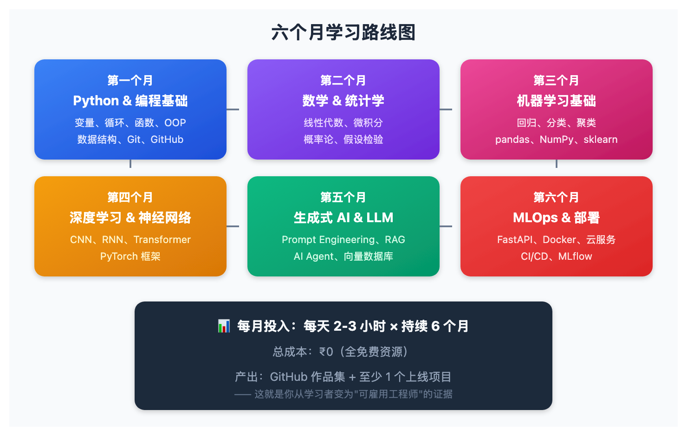
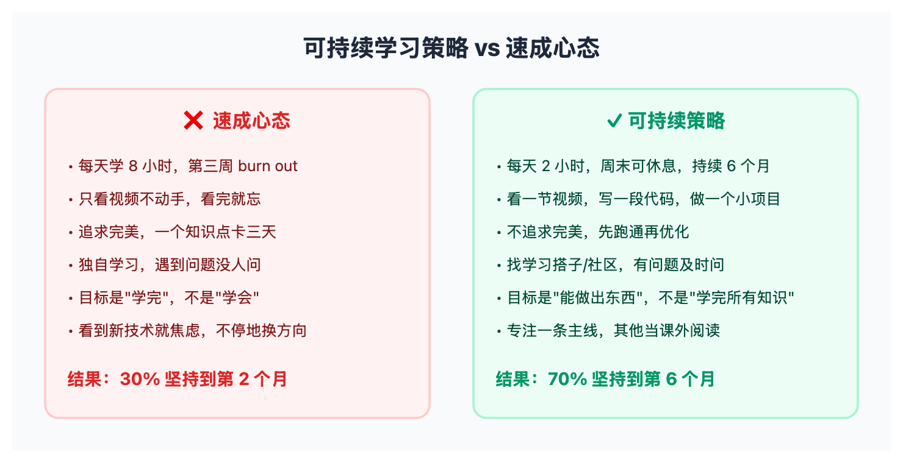

# 六个月成为 AI 工程师：一份零成本路线图，但你真的能做到吗？

> 📖 **本文解读内容来源**
>
> - **原始来源**：[How to Become an AI Engineer in 6 Months (Free Resources)](https://x.com/DivyanshT91162/status/...)
> - **来源类型**：技术推文
> - **作者**：Divyansh Tiwari (@DivyanshT91162)
> - **发布时间**：2026年3月

AI 不再是未来——它就是现在。

打开招聘网站，AI 工程师的岗位数量在爆炸式增长，薪资也水涨船高。而整个科技行业目前最大的缺口，就是**真正能动手构建的人**。

最近 Twitter 上有一篇刷屏的推文，作者 Divyansh Tiwari 整理了一份"六个月零成本成为 AI 工程师"的路线图。笔者仔细看了一遍——资源选得确实扎实，但有些话他没说透。

今天这篇文章，笔者就来拆解一下这份路线图，顺便聊聊那些**被隐藏的真相**。

---

## 这份路线图到底说了什么？

一句话概括：**六个月、六个阶段、零成本，从零到 AI 工程师。**

下面这张图展示了完整的学习路径：

---

## 第一个月：Python 与编程基础

一切 AI 都跑在 Python 上。跳过这一步，后面全崩。

**学习重点：**
- 变量、循环、条件判断
- 函数与面向对象编程（OOP）
- 数据结构（列表、字典、集合）
- 文件操作与错误处理
- Git 与 GitHub 基础

**推荐资源：**
- Python for Everybody（Dr. Chuck）
- CS50P（哈佛）
- Automate the Boring Stuff
- Git & GitHub（freeCodeCamp）

**阶段目标：**能写脚本处理真实数据，GitHub 上有 3 个以上项目。

到月底，你就不再是编程小白了。

---

## 第二个月：数学与统计（只学有用的）

笔者先说一句：**你不需要成为数学家，但你需要数学直觉。**

**学习重点：**
- 线性代数（向量、矩阵）
- 微积分（导数、梯度）
- 概率论（贝叶斯、分布）
- 统计学（均值、方差、假设检验）

**推荐资源：**
- 3Blue1Brown（线性代数 + 微积分）
- Khan Academy（统计）
- MIT 18.06（Gilbert Strang）
- StatQuest

**阶段目标：**理解模型是怎么"学习"的，能用人话解释梯度下降。

到月底，你知道的是"为什么"，而不只是"怎么做"。

---

## 第三个月：机器学习基础

从这里开始，你开始构建真正的智能。

**学习重点：**
- 回归与分类
- 聚类与降维
- 模型评估（准确率、精确率、召回率）
- 过拟合与交叉验证
- 核心库：pandas、NumPy、scikit-learn

**推荐资源：**
- Stanford CS229（Andrew Ng）
- Google ML Crash Course
- Kaggle Learn
- fast.ai

**阶段目标：**训练真实模型，完成 2 个以上 ML 项目。

到月底，你能解决现实中的预测问题了。

---

## 第四个月：深度学习与神经网络

这是 AI 开始变得强大的地方。

**学习重点：**
- 神经网络与反向传播
- CNN（图像）
- RNN/LSTM（序列）
- Transformer（现代 AI 核心）
- 框架：PyTorch

**推荐资源：**
- Stanford CS231n（计算机视觉）
- Stanford CS224n（NLP）
- MIT Deep Learning
- fast.ai
- 3Blue1Brown（神经网络）

**阶段目标：**构建并训练神经网络，概念上理解 Transformer。

到月底，你明白 ChatGPT 这类系统是怎么工作的了。

---

## 第五个月：生成式 AI、LLM 与 Agent

这是目前钱和岗位都在的地方。

**学习重点：**
- LLM 基础（Token、Embedding、Attention）
- Prompt Engineering
- RAG（检索增强生成）
- AI Agent
- API 与向量数据库

**推荐资源：**
- Andrej Karpathy（从头构建 GPT）
- DeepLearning.AI（LangChain + ChatGPT API）
- Hugging Face Course
- LlamaIndex 文档

**阶段目标：**构建一个 RAG 聊天机器人，部署一个 LLM 应用。

到月底，你能构建真正的 AI 产品了。

---

## 第六个月：MLOps、部署与作品集

这是学习者与"可雇用工程师"的分水岭。

**学习重点：**
- API（FastAPI / Flask）
- Docker
- 云服务（AWS / GCP 基础）
- CI/CD
- MLflow 与监控

**推荐资源：**
- Made With ML
- Docker（TechWorld with Nana）
- FastAPI 官方文档
- MLflow
- Full Stack Deep Learning

**阶段目标：**3-5 个完整项目，至少 1 个已上线部署。

到月底，你已经准备好求职了。

---

## 笔者的三个真心话

这份路线图确实优秀——资源选得好、路径设计合理。但笔者得说几句原作者没说透的话。

### 第一个真相：路线图的隐藏假设

**这份路线图有一个巨大的隐藏假设：你有足够的时间和自律。**

每天 2-3 小时、持续 6 个月——听起来不多，但统计数据显示，绝大多数人在第一个月就会放弃。

为什么？

- **没有即时反馈**：前两个月几乎全是"打基础"，看不到任何炫酷效果
- **没有外部约束**：没有老师盯着，没有作业deadline，只有你自己
- **没有学习社区**：遇到问题没人问，卡住了就只能放弃

所以笔者的建议是：**找一个学习搭子，或者加入一个学习社区**。有人一起走，成功率至少翻倍。

### 第二个真相：真正的门槛不是知识

**真正的门槛是项目经验和解决问题的能力。**

看完整份路线图，你会发现一个关键问题：**它教会你"怎么做"，但没教会你"做什么"。**

实际工作中，真正难的不是"怎么训练一个模型"，而是：
- 如何把一个模糊的业务需求，翻译成技术问题
- 如何在资源有限的情况下做取舍
- 如何评估一个方案是否值得投入
- 如何向非技术同事解释你的方案

这些东西，任何课程都教不了你——只能通过**真正的项目**来积累。

所以笔者建议：从第二个月开始，每个月至少做一个**自己的项目**，不是跟着教程走的那种，而是你自己想做什么、解决什么问题。

### 第三个真相：六个月不短，但也不长

**比起"六个月速成"，更重要的是"持续六个月"。**

这个区别很重要。

速成的心态是"熬过这六个月，我就能找到工作了"。这种心态，往往会在第三个月崩盘——因为你看不到尽头，而身边的诱惑太多。

持续的心态是"这六个月我每天进步一点点"。这种心态，反而更容易坚持——因为你能感受到自己的成长。

一个检验标准：**问你自己在第 100 天还想不想继续**。如果答案是"不确定"，那你的动力系统可能需要重新设计。

---

## 你应该怎么用这份路线图？

话说到这里，笔者不是来劝退的——这份路线图依然有价值，但你得用对方式。

下面这张图展示了一个更可持续的学习策略：

笔者的三个具体建议：

**第一，把"学完"改成"做出来"。**

每个月问自己：我这个月做出了什么东西？能在面试里展示的东西？

如果没有，那就说明你在"学习"，而不是在"成长"。

**第二，找到你的"最小可持续单位"。**

有人每天能学 4 小时，有人只有 1 小时。不要跟别人比时间，找到**你能持续六个月的节奏**。

**第三，公开你的学习过程。**

在 Twitter、公众号、小红书上分享你的学习笔记和项目。公开学习有两个好处：
- 倒逼你把知识整理清楚
- 建立你的个人品牌，对求职有帮助

---

## 最后的话

这份路线图，笔者给它 8 分。

扣掉的 2 分是因为：它没有解决"如何坚持"这个更根本的问题。

但资源本身是高质量的——如果你能执行到位，六个月后你确实会有一个不错的起点。

**你不需要运气，不需要人脉，你需要的是持续执行。**

从 Python 开始。第一天。今天。

---

### 参考

- [How to Become an AI Engineer in 6 Months - Divyansh Tiwari](https://x.com/DivyanshT91162/status/...)
- [Python for Everybody - Dr. Chuck](https://www.py4e.com/)
- [Stanford CS229 - Machine Learning](https://cs229.stanford.edu/)
- [Andrej Karpathy - Neural Networks: Zero to Hero](https://karpathy.ai/zero-to-hero.html)