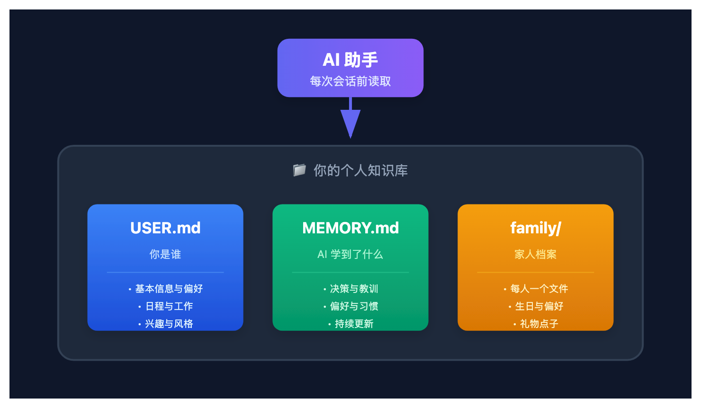
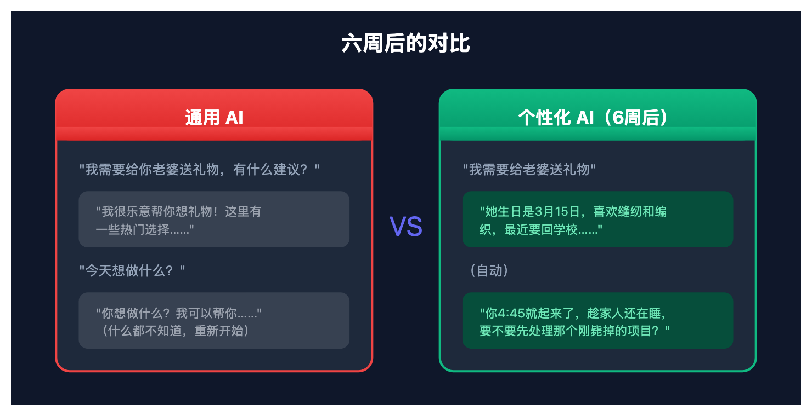

# 让 AI 真正认识你：用三个文件构建超个性化系统

> 📖 **本文解读内容来源**
>
> - **原始来源**：[How I built a hyper-personalization system with AI - Josh Pigford](https://everydayisayear.ai/p/how-i-built-a-hyper-personalization)
> - **来源类型**：技术博客 / Newsletter
> - **作者**：Josh Pigford（@Shpigford）
> - **发布时间**：2026年3月18日

你的 AI 知道你老婆的生日吗？知道你每天早上几点起床、周末爱干什么、最讨厌听什么词吗？

如果你用的是 ChatGPT 或 Claude 的默认记忆功能，答案大概率是：不知道。每次对话，都像第一次见面。

Josh Pigford 是个连续创业者，他做了一件看似"返璞归真"的事——用纯文本文件，让 AI 真正认识他。不是什么黑科技，就是 Markdown 文件。但效果惊人。

## 行业在追错的东西

AI 行业每周都在发新模型。更强的推理能力、更大的上下文窗口、更快的响应速度。

但有一个问题几乎没人解决：**让 AI 认识使用它的人**。

ChatGPT 的记忆功能是个玩具。Claude 的记忆聊胜于无。每次对话，你都得重新介绍自己："我是一个程序员，我喜欢简洁的代码风格，不要写太多注释……"

这不是智能助手，这是失忆症患者。

Josh 的洞察很犀利：**模型已经足够聪明了，它们只是不知道关于你的任何事**。

## 三个文件，解决核心问题

Josh 的系统架构出奇简单：

- **USER.md**：你是谁。姓名、位置、时区、日程、工作背景、家庭概况、兴趣爱好、食物偏好、沟通风格。一切让助手不再像个陌生人的信息。Josh 的文件大约 80 行。
- **MEMORY.md**：AI 学到了什么。不是原始日志，而是提炼过的洞察——你的工作方式、你做的决策、你学到的教训、你表达过的观点。AI 每次会话前读取，学到新东西时更新。
- **brain/family/**：每个家人一个文件。生日、关系、偏好、礼物点子、备注。老婆有、孩子有、连孙女都有。节日、生日、送礼话题来的时候，AI 能直接引用。

三个概念。纯文本。能配合任何支持系统提示词或文件上下文的 AI 工具。

下面这张图展示了整个系统的架构：



## 入职面试：让 AI 了解你

这些文件不会自己写出来。Josh 设计了一个"Onboarding Interview"（入职面试）的提示词。

核心思路：**不是问卷，是对话**。AI 一次问 2-3 个问题，根据你的回答追问有意思的点，你回答简短就不追问。整个过程 10-15 分钟，最后 AI 一次性生成所有文件。

覆盖的领域：
- 身份与基本信息：姓名、称呼、时区、电话
- 日常生活：作息、晨间习惯、最近在看什么
- 工作与项目：做什么、做了多久、工作风格
- 家庭与家人：谁住一起、名字、生日、爱好
- 兴趣爱好：音乐、运动、收藏、旅行偏好
- 沟通偏好：简洁还是详细、语气正式还是随性
- 目标与愿望：当前在追求什么、长期梦想
- 禁忌与边界：讨厌什么、什么话题不该碰

对话结束后，AI 生成 USER.md、MEMORY.md、family/README.md 以及每个家庭成员的独立文件。

## 每日一滴：六周后的质变

入职面试能覆盖 60% 左右。深度来自之后的事。

Josh 设置了一个 cron job：每天早上 9 点，AI 读取现有文件，找一个信息空白，问一个有深度的问题。不是"你最喜欢什么颜色"这种，而是"你提到你女儿在做彩绘玻璃，她是怎么入坑的？"

工作流程：
1. AI 发送一个问题到你的聊天频道
2. 你有空时回答（通常 30 秒）
3. 第二天早上，AI 处理昨天的答案，更新到对应文件，然后问新问题

六周后，这套"每日一滴"积累的上下文比最初的面试还多。它会捕捉到你从没想到要主动说的东西：早晨习惯、咖啡怎么喝、配偶要回学校了、年轻时玩过乐队、在丹佛住过五年所以是雪崩队球迷……

下面这张图展示了六周积累的效果对比：



## 你可以直接用的模板

Josh 公开了他的"入职面试"提示词。复制、修改、用你喜欢的 AI 工具跑：

```markdown
You're getting to know your human for the first time. Your goal is to build
a rich personal profile that will make every future interaction feel personal
and useful.

Run this as a CONVERSATION — not a survey. Ask 2-3 questions at a time,
wait for answers, then ask follow-ups based on what they share. Be genuinely
curious, not clinical. If they give short answers, don't push — you'll learn
more over time.

What to cover (let it flow naturally, don't force the order):

Identity & Basics
- Name, what they prefer to be called, pronouns
- Location, timezone
- Phone number (if they want you to have it)

Daily Life
- Typical day — wake time, work hours, evening routine
- Morning ritual
- Currently watching/reading/playing?
- Food relationship — foodie or fuel?

Work & Projects
- What they do, how long they've been doing it
- Current active projects or businesses
- Work style — planner or builder? Deep focus or context-switching?
- Strengths and energy drains

Family & Household
- Who lives in the house? Partner, kids, pets?
- Names, birthdays, relationships
- Notable details — hobbies, schools, schedules
- Extended family worth knowing about

Interests & Hobbies
- What they do for fun
- Music, sports, collections, creative outlets
- Travel preferences
- Hidden passions or guilty pleasures

Communication Preferences
- Brief or detailed info delivery?
- Tone — formal, casual, snarky, warm?
- When to proactively reach out vs. stay quiet
- What annoys them in an AI assistant
- Quiet hours — when to never message

Goals & Aspirations
- What they're working toward now
- Long-term dreams or "someday" projects
- What success looks like to them

Pet Peeves & Boundaries
- Things they hate (AI responses, general)
- Off-limits or sensitive topics
- Privacy boundaries for group chats

After the conversation, create these files:

USER.md
Compile everything into a clean, scannable format with sections and bullet
points. Include subsections for Daily Life, Interests, Family, Work, etc.
This is the primary reference file the agent reads every session.

brain/family/README.md
Household overview table with names, relationships, birthdays, ages. Include
an "Upcoming Dates" section for the current year listing birthdays and
anniversaries chronologically.

brain/family/{firstname}.md (one per family member)
Use this template for each person mentioned:

  # {Name}
  **Relationship:** {relationship to user}
  **Birthday:** {date}
  ---
  ## Preferences
  (none yet)
  ## Important Dates
  - **Birthday:** {date}
  ## Gift Ideas
  (none yet)
  ## Notes
  (none yet)

Include pets too (simpler format — name, breed/species, any quirks).

MEMORY.md
Start a long-term memory file. Add a "Self-Knowledge" section capturing work
style, core drives, decision-making patterns — the deeper personality
insights that emerged from the conversation. This file grows over time.
```

## 笔者的几个判断

**第一，这不是技术问题，是产品问题。**

模型能力已经足够，真正缺的是让用户"喂"信息的方式。ChatGPT 的记忆是被动记录，Josh 的系统是主动面试。主动和被动，效果差了十倍。

**第二，纯文本是最被低估的技术选型。**

没有数据库、没有向量存储、没有专有格式。Markdown 文件，放哪都能用。换 AI 工具？复制粘贴就行。这就是**可移植性**的力量。越复杂的系统，迁移成本越高。越简单的格式，生命力越强。

**第三，"每日一滴"是个天才设计。**

大多数人没耐心一次性填完一份详细的个人档案。但每天 30 秒回答一个问题？谁都能做到。六周 42 个问题，信息量惊人。这暗合了一个朴素道理：**持续的小投入，比一次性的大投入更可持续**。

**第四，这个方案的局限在于"启动成本"。**

你需要有个能跑 cron job 的环境，需要一个能自动更新文件的 Agent。对普通用户来说，门槛不低。但如果你已经在用 OpenClaw、Claude Code 或类似工具，这就是现成的方案。

## 今天的行动建议

如果你已经在用个人 AI 助手（OpenClaw、Claude Code 等）：

1. 复制上面的提示词
2. 让 AI 面试你 10-15 分钟
3. 让它生成 USER.md、MEMORY.md、family/ 文件
4. 设置一个每日问问题的定时任务

如果你还没开始用个人 AI 助手：这是开始的好理由。OpenClaw 支持在 Mac、PC、Linux 甚至树莓派上运行，接 Discord 或 Telegram，一天之内就能让 AI 认识你。

六周后，你会有一个真正了解你的 AI。它知道你几点起床、收集什么、老婆喜欢什么、上周毙掉了哪个项目想法。

不需要更强的模型。只需要文件和持续。

---

### 参考

- [How I built a hyper-personalization system with AI - Josh Pigford](https://everydayisayear.ai/p/how-i-built-a-hyper-personalization)
- [OpenClaw](https://openclaw.ai) - 开源个人 AI 助手框架