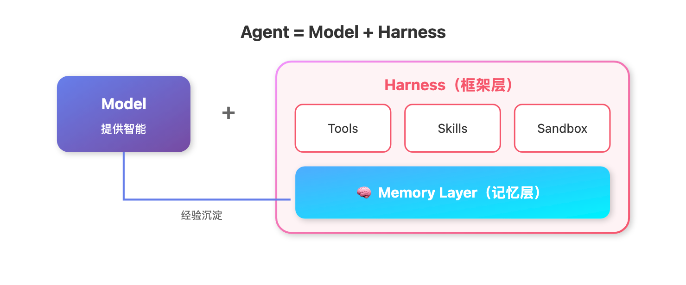
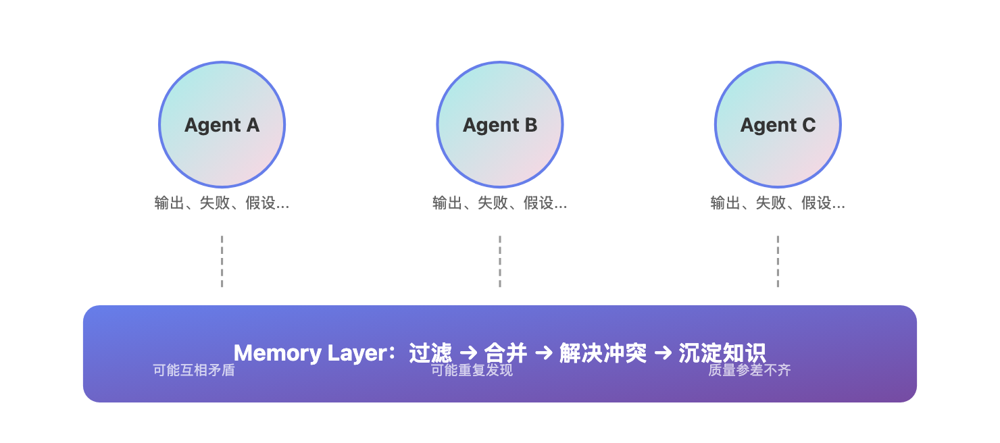

# 为什么你的 Agent 总是「记吃不记打」？Memory Harness 来了

> 📖 **本文解读内容来源**
>
> - **原始来源**：[Memory as a Harness: Turning Execution Into Learning](https://x.com/tricalt/status/...)（Twitter/X 技术长文）
> - **来源类型**：技术博客 / 行业观点
> - **作者/团队**：Vasilije (@tricalt)，cognee.ai 团队成员
> - **发布时间**：2026 年 3 月

你有没有遇到过这种场景：辛辛苦苦调教了一个 AI Agent，它能写代码、能查资料、能自动干活。但第二天你再问它同样的问题，它又从头开始——之前踩过的坑、收到的反馈、学到的经验，统统忘得一干二净。

说实话，这就像雇佣了一个永远记不住教训的员工。你每天都在重复教它同样的事情，而它永远在"第一天上班"。

这就是目前大多数 Agent 的通病：**有智商，没记性**。

最近行业里出了一个新概念——**Harness Engineering（安全带工程）**。它给出了一个简洁的公式：`Agent = Model + Harness`。模型提供智能，Harness 提供框架。而 Harness 中最关键的，就是 Memory Layer（记忆层）。

今天这篇文章，笔者就来聊聊：为什么记忆层是 Agent 真正"成长"的关键，以及如何让你的 Agent 从"记吃不记打"变成"越用越聪明"。

## 这是个啥？为什么值得关注？

所谓 **Harness**，其实就像给赛车手系上的安全带——它不是引擎本身，但没有它，引擎的马力再大也跑不稳。

传统观念里，Agent 的核心是模型。模型够强，Agent 就够强。但现实狠狠打了大家的脸：

- 模型变强了，但 Agent 还是会重复犯错
- Context Window 变大了，但该忘的还是忘了
- 多 Agent 协作起来了，但知识碎片化、互相打架

问题出在哪？**缺的不是智商，是记忆系统**。

用大白话说：

> **Memory Layer 就像是 Agent 的"海马体"——负责把每次交互中的经验、反馈、模式转化为长期知识，让系统真正"学会"而不是"记住"。**

下面这张图展示了 Agent 的核心架构：



从图中可以看到，Agent 由 Model 和 Harness 两部分组成。Model 负责"聪明"，Harness 负责"靠谱"。而 Harness 里的 Memory Layer，正是让 Agent 从"一次性工具"进化为"持续成长系统"的关键。

## 记忆层的三大核心问题

原文作者从 cognee.ai 的实践出发，总结了记忆层需要解决的三大问题：

### 问题一：持续学习（Continual Learning）

"持续学习"这个词听起来很学术，但说白了就是：**Agent 能不能从自己的错误中吸取教训？**

当你不断记录 Agent 的交互历史，你会积累：
- 失败案例
- 用户反馈
- 行为模式

但**存储 ≠ 学习**。存下来只是第一步，真正的问题是：

> 如何把历史记录转化为系统可用的知识？

如果只是把所有东西都存下来，你得到的不是"成长"，而是"噪音"——重复的知识、冲突的信号、过时的假设。

笔者在实践中发现，很多团队的记忆系统最后都变成了"数据坟场"。数据越存越多，但 Agent 越用越笨。因为系统没有能力判断：
- 什么值得保留
- 什么需要合并
- 什么应该遗忘

这就像一个人读了 100 本书但不会总结——读了也是白读。

### 问题二：上下文工程（Context Engineering）

很多人说："Context Window 越来越大了，还要什么记忆层？"

但现实是：
- 模型还是会幻觉
- 模型还是不知道该保留什么
- 账单还是越来越贵

更大的 Context Window 解决不了问题，反而带来了新麻烦：

| 问题 | 描述 |
|------|------|
| **Context Poisoning** | 无用信息污染上下文，模型开始"胡说八道" |
| **Context Confusion** | 信息太多，模型不知道该关注哪个 |
| **Context Distraction** | 关键信息被淹没，模型重复犯错 |

你可能会说："用 LLM 做压缩不就行了？"

但问题是：**压缩的前提是知道什么重要**。这不是一个 LLM 调用能解决的。你需要：
- 对系统的理解（数据、流程、结构）
- 对历史交互的感知
- 对"什么重要"的判断能力

这些都指向同一个解决方案：**一个结构化的记忆层**。

### 问题三：多 Agent 协作（Multi-Agent Setup）

当系统里有多个 Agent 协作时，记忆问题会指数级放大。

每个 Agent 都会产生自己的：
- 输出结果
- 失败记录
- 中间步骤
- 假设前提

如果只是把所有东西都丢进一个共享空间，你得不到"共享大脑"，只会得到"一团乱麻"。

多 Agent 场景下的核心挑战：



多 Agent 场景需要回答的问题是：**如何合并这些部分视角，而不放大噪音？**

## 记忆层的核心能力：让执行变成学习

原文的核心观点是：

> **Memory Layer 的本质，是把"执行"变成"学习"。**

没有记忆层，每次执行都是从零开始。有了记忆层，执行会"复利增长"。

### 传统记忆 vs 学习型记忆

| 传统记忆 | 学习型记忆 |
|---------|-----------|
| 存储所有交互 | 判断什么值得存 |
| 检索时原样返回 | 合并、压缩、更新 |
| 知识会过时 | 知识会演化 |
| 数据越多越慢 | 数据越多越聪明 |

学习型记忆的关键不是"存"，而是"处理"：

1. **Filter（过滤）**：判断什么信息有价值
2. **Merge（合并）**：把新信息与已有知识融合
3. **Resolve（解决冲突）**：处理矛盾的信号
4. **Consolidate（沉淀）**：把经验转化为可复用的知识

cognee.ai 的做法是提供一个简单的接口 `.memify()`，把上述逻辑封装在底层：

```python
import cognee

# 添加交互数据
await cognee.add("用户反馈：Agent 在处理日期时经常出错")

# 触发记忆处理
await cognee.cognify()  # 内部执行：过滤、合并、沉淀

# 搜索时获得的是处理后的知识
results = await cognee.search("日期处理有什么注意事项？")
# 返回：已沉淀的经验和最佳实践
```

## 行业实践：谁在做记忆层？

记忆层赛道正在快速升温。根据调研，几个代表性的项目：

| 项目 | Star 数 | 核心定位 | 差异化特点 |
|------|---------|----------|-----------|
| **mem0** | 50K+ | 通用记忆层 | 支持多种 LLM 框架，易集成 |
| **Letta** | 21K+ | 有状态 Agent 平台 | Agent 自我学习和改进 |
| **cognee** | 14K+ | 知识引擎 | 图+向量混合，知识图谱为核心 |
| **HippoRAG** | 3K+ | 神经启发式 RAG | 模拟人类长期记忆 |

这些项目的共同认知是：**记忆层是 Agent 的护城河**。

原文有一句话笔者很认同：

> "Your data matters, but raw data is not enough. What matters is how you structure it, how you connect it, how you update it, and how you use it during execution."

翻译过来就是：

> 数据很重要，但原始数据不够。关键在于：如何结构化、如何连接、如何更新、如何在执行中使用。

模型会越来越强，推理会越来越便宜，但**你的 Agent 知道什么、如何演化**，这才是真正的壁垒。

## 结语：记忆是 Agent 的"第二大脑"

回顾一下，Memory Layer 要解决的本质问题是：

> **如何让 Agent 从"一次性执行"变成"持续成长"？**

答案不是更大的模型，不是更大的 Context Window，而是一个能思考的记忆系统。

不得不感叹一句：人类花了数百万年进化出海马体，让经验可以转化为长期记忆。AI Agent 的记忆层，某种程度上就是在弥补这个"进化缺失"。

**局限性也要承认**：
- 记忆层的技术栈还不成熟，各有各的方案
- 知识冲突、遗忘机制、隐私边界都是开放问题
- 与业务场景的深度结合需要大量工程实践

但从趋势来看，方向已经清晰：**没有记忆的 Agent，永远只是工具；有了记忆的 Agent，才是真正的伙伴。**

希望这篇文章能让你对 Memory Layer 有更清晰的认识。如果你的 Agent 还在"记吃不记打"，也许是时候给它装一个"海马体"了。

---

### 参考

- [Memory as a Harness: Turning Execution Into Learning](https://x.com/tricalt/status/...) - Vasilije (@tricalt)
- [cognee GitHub](https://github.com/topoteretes/cognee) - Knowledge Engine for AI Agent Memory
- [mem0 GitHub](https://github.com/mem0ai/mem0) - Universal memory layer for AI Agents
- [12-factor-agents](https://github.com/humanlayer/12-factor-agents) - Agent 开发原则