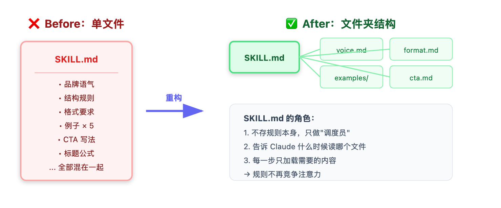
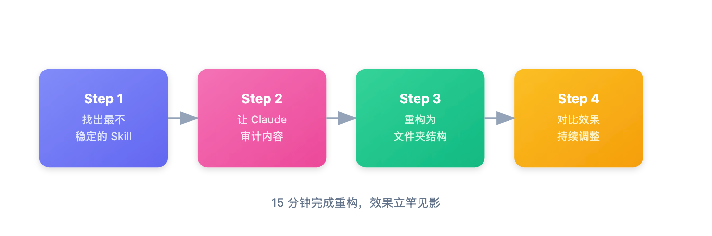

# 为什么你的 Skills 输出总是"看运气"？Anthropic 的答案来了

> 📖 **本文解读内容来源**
>
> - **原始来源**：[How to 10x your Claude Skills (using Anthropic's structuring method)](https://x.com/itsolelehmann/status/...)（Twitter/X 技术长文）
> - **来源类型**：技术博客 / 行业观点
> - **作者/团队**：Ole Lehmann (@itsolelehmann)，AI 工作流专家
> - **发布时间**：2026 年 3 月

你有没有遇到过这种场景：辛辛苦苦写了一个 Skill，第一次跑出来效果惊艳，第二次跑却完全跑偏。你以为是 Claude"心情不好"，实际上是你的 Skill 结构出了问题。

说实话，这种感觉就像在赌——每次运行都是一次"开盲盒"。好的时候真香，差的时候想砸键盘。

这就是目前大多数 Skills 的通病：**规则太多，打架了**。

最近 Anthropic 内部团队公布了一个重要发现：**你的 Skill 应该是一个文件夹，而不是一个文本文件**。这个看起来不起眼的改变，能让输出一致性提升一个档次。

今天这篇文章，笔者就来聊聊：为什么文件夹结构能让 Skills 从"看运气"变成"稳输出"，以及如何用 Anthropic 的方法重构你的 Skills。

## 这是个啥？为什么值得关注？

先解释一下概念。所谓 **Skill**，就是你写给 Claude 的"工作手册"——告诉它怎么写文章、怎么生成代码、怎么做调研。

传统做法是把所有规则写在一个 Markdown 文件里：

```
newsletter_skill.md（200+ 行）
├── 品牌语气规则
├── 文章结构要求
├── 格式规范
├── 好例子 × 3
├── 坏例子 × 2
├── CTA 写法
├── 标题公式
└── ...（各种规则混在一起）
```

Anthropic 团队发现，这种写法有个致命问题：**规则竞争注意力**。

想象一下，你给员工一本 10 页的手册，里面同时塞了公司价值观、着装规范、电话接听流程、投诉处理、邮件模板……他读完整本，开始干活。有些部分做得很好，有些部分完全忘掉。因为信息太多，脑子记不住。

Claude 也是一样。当你的 Skill 文件越来越长，规则之间就开始"打架"：

- 调整了语气规则，格式突然飘了
- 加了更多例子，开头的约束被忽略了
- 每次修改都可能破坏别的东西

Anthropic 的解决方案很简单：**把一个文件拆成一个文件夹**。

## 文件夹结构：给 Claude 一个"档案柜"

所谓 **文件夹结构（Folder Structure）**，其实就是把一个"大部头手册"拆成多个"专项小册子"。Claude 需要什么，就打开什么——不需要同时记住所有内容。

Anthropic 把这种方法称为 **渐进式披露（Progressive Disclosure）**：信息在需要时才加载，而不是一开始就全部塞进去。

下面这张图展示了核心思路：



用大白话说：

> **文件夹结构就像是给 Claude 一个档案柜——每个抽屉里放着专项指南，需要哪个打开哪个，而不是一次性把所有东西堆在桌面上。**

## 为什么单文件会"翻车"？

原文作者 Ole Lehmann 用了一个很形象的比喻：

想象你是新员工，老板给了你一本 10 页的手册，里面同时包含：
- 公司价值观
- 着装规范
- 电话接听流程
- 投诉处理步骤
- 好邮件例子 × 3
- 坏邮件例子 × 2
- 退款政策

你读完整本，开始干活。结果呢？有些部分做得很好，有些部分完全忘掉。因为**信息太多，大脑记不住**。

Claude 也一样。当你的 Skill 文件越来越长，问题就来了：

| 问题 | 表现 |
|------|------|
| **规则竞争注意力** | 语气规则和格式要求互相打架 |
| **修改副作用大** | 改了一处，另一处飘了 |
| **调试困难** | 出问题时不知道是哪条规则的问题 |
| **输出不一致** | 同样的任务，每次跑出来的质量波动大 |

原文有一句话笔者很认同：

> "The more you cram into one document, the harder it is to remember it all."

翻译过来就是：**塞得越多，记住越少**。

## 核心原理：渐进式披露

Anthropic 团队给出的核心解决方案是 **渐进式披露（Progressive Disclosure）**。

用大白话说：**信息在需要时才加载，而不是一开始就全部塞进去**。

### 传统做法 vs Anthropic 做法

| 传统做法 | Anthropic 做法 |
|---------|---------------|
| 一个文件包含所有规则 | SKILL.md 只做"调度员" |
| Claude 一次性读取所有内容 | 每一步只加载需要的内容 |
| 规则竞争注意力 | 规则按需加载，互不干扰 |
| 修改一处可能破坏别处 | 每个文件独立，互不影响 |

### 一个具体的文件夹结构示例

假设你有一个写 Landing Page 的 Skill，文件夹结构可能是这样：

```
landing_page_skill/
├── SKILL.md           # 主控文件：工作流程，不含具体规则
├── voice.md           # 品牌语气规则
├── structure.md       # 页面结构要求
├── format.md          # 格式规范
├── examples/
│   ├── good_example_1.md
│   ├── good_example_2.md
│   └── bad_example_1.md
└── evaluation.md      # 质量评估标准
```

SKILL.md 的内容可能是这样：

```markdown
# Landing Page Skill

## 工作流程

1. **理解需求**
   - 阅读 `structure.md` 了解页面结构要求

2. **确定语气**
   - 阅读 `voice.md` 确保品牌一致性

3. **生成初稿**
   - 参考 `examples/` 中的优秀案例

4. **质量检查**
   - 阅读 `evaluation.md` 进行自查
```

这样，Claude 在写初稿时会优先加载例子，而不会被语气规则"干扰"。每一步都专注于当前任务。

## 如何重构你的 Skills？

原文给出了一个清晰的四步流程。笔者把它翻译成了可以直接用的 Prompt。

### 第一步：找出最不稳定的 Skill

你有没有这样一个 Skill：有时候输出很好，有时候完全跑偏？这种"看运气"的 Skill 就是重构的首选目标。

**不稳定 = 规则太多，竞争注意力**。

### 第二步：让 Claude 审计你的 Skill

把这个 Prompt 发给 Claude：

```
Read my [SKILL NAME] skill and identify every distinct section in the file.

I mean things like: rules, instructions, examples, evaluation criteria, templates, section-specific guidance, formatting requirements.

Anything that could be its own file.

Show me the full audit before you change anything.
```

Claude 会告诉你这个文件里到底塞了多少东西，以及哪些可以拆分出去。

### 第三步：让 Claude 重构

审计完成后，用这个 Prompt：

```
Based on this audit, restructure my skill into a folder.

SKILL.md should be the orchestrator: it should contain no rules itself, just the step-by-step workflow telling you which files to read and when.

Each distinct section from the audit becomes its own file.

Keep examples separate from instructions.
```

Claude 会把审计结果转化成文件夹结构。

### 第四步：对比效果，持续调整

用同样的任务分别跑一遍旧 Skill 和新 Skill，对比输出质量。

如果某个部分还有问题，直接定位到对应文件修改——不需要在一大段文本里翻来翻去。

下面这张图展示了重构的工作流：



## 重构后的效果：Before vs After

原文作者重构了他的 Newsletter Skill，效果对比很有说服力：

### Before：单文件结构

- 语气在开头很正，到中间就飘了
- Hooks 写得不错，但 CTA 忽好忽坏
- 每次输出需要手动修改 40% 左右
- 调试时在 200 行文件里翻来翻去

### After：文件夹结构

- 语气从头到尾保持一致（语气规则单独加载）
- CTA 稳定落地（写 CTA 时才加载相关例子）
- 只需要做"收紧、塑形"级别的编辑
- 出问题时直接定位到对应文件

用作者的话说：

> "The drift is gone."（飘移消失了）

笔者在实践中也有类似感受。以前调试 Skill 像在大海捞针——改了一处，另一处突然出问题。现在每个文件各司其职，修改影响范围清晰可控。

## 结语：结构决定输出

回顾一下，Anthropic 方法的核心思想是：

> **结构决定输出的一致性。**

把一个"大部头"拆成多个"专项小册子"，让 Claude 在需要时才加载——这样规则就不会竞争注意力，输出自然更稳定。

**局限性也要承认**：
- 文件夹结构会增加一些管理成本
- 需要花时间思考如何拆分才是最优的
- 对于简单的 Skill，单文件可能就够了

但从趋势来看，方向已经清晰：**Skill 不是"一个文档"，而是"一套系统"**。随着你的 Skill 越来越复杂，文件夹结构是必然的选择。

不得不感叹一句：人类也是这样学习的。我们不会把所有知识塞在一个笔记本里，而是分门别类、按需查阅。Anthropic 的方法，某种程度上是在复刻人类的认知习惯。

**给你的行动建议**：
1. 找出你最不稳定的那个 Skill
2. 用上面的 Prompt 让 Claude 审计并重构
3. 用同样的任务对比前后效果
4. 15 分钟，你就能看到差异

希望这篇文章能帮你告别"看运气"的 Skills，让每一次输出都稳稳落地。

---

### 参考

- [How to 10x your Claude Skills (using Anthropic's structuring method)](https://x.com/itsolelehmann/status/...) - Ole Lehmann (@itsolelehmann)
- [Anthropic Skills Documentation](https://docs.anthropic.com/) - 官方文档
- [12-factor-agents](https://github.com/humanlayer/12-factor-agents) - Agent 开发原则