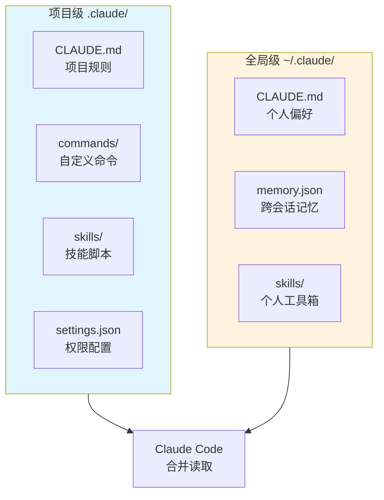
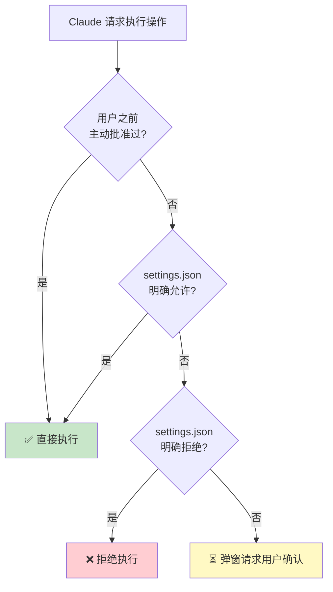

# 被 90% 开发者忽视的宝藏——Claude Code 配置系统完整解剖

> 📖 **本文解读内容来源**
> 原文：[Anatomy of the .claude/ folder](https://twitter.com/akshay_pachaar/status/1902967357308789190)
> 作者：Akshay 🚀 (@akshay_pachaar)
> 本文基于原文进行深度解读、扩展与实践补充

---

你有没有注意过，每次用 Claude Code 的时候，项目根目录下会悄悄冒出一个 `.claude/` 文件夹？

大多数人的反应是：看到了，没管它，反正代码能跑就行。

**这个被忽视的文件夹，其实是 Claude Code 的"大脑"。** 它决定了 Claude 在你的项目里怎么想、怎么做、能干什么、不能干什么。把它当黑盒用，你只发挥了 Claude Code 30% 的能力。

今天笔者带你完整解剖这个配置系统，看完你会有一个全新的认知：原来 Claude Code 可以这么听话。

---

## 两个文件夹，两套规则

在深入之前，先搞清楚一件事：`.claude/` 文件夹其实有**两个**，不是只有一个。

- **项目级 `.claude/`**：放在项目根目录，跟着代码一起提交。团队共享，所有人用同一套规则。
- **全局级 `~/.claude/`**：放在你的用户目录，存的是个人偏好、会话历史、自动记忆。

简单说：项目级管"团队规矩"，全局级管"个人习惯"。两者会叠加生效，Claude 会把它们合并读取。



---

## CLAUDE.md：Claude 的"使用说明书"

这是整个系统里最重要的文件。**没有之一。**

当你启动一个 Claude Code 会话时，第一件事就是读这个文件。它会被直接加载到系统提示词里，Claude 在整个对话过程中都会"记住"它。

**你在 CLAUDE.md 里写的任何话，Claude 都会照做。**

- 让它"写代码前先写测试"？它会照做。
- 告诉它"永远不要用 console.log，用自定义日志模块"？它会遵守。
- 说"TypeScript 严格模式开启，未使用的变量直接报错"？它会注意。

### CLAUDE.md 到底该写什么？

很多人要么写太多（变成冗长的文档），要么写太少（啥都没说清楚）。

**建议写的：**
- 构建、测试、lint 命令（npm run test, make build 等）
- 关键架构决策（"我们用 Turborepo 管理 monorepo"）
- 容易踩的坑（"TypeScript 严格模式开启，未使用变量是错误"）
- 导入规范、命名模式、错误处理风格
- 主要模块的文件和文件夹结构

**不建议写的：**
- linter 或 formatter 配置里已有的规则
- 外部文档的完整拷贝（给链接就行）
- 又臭又长的解释性段落（Claude 不需要你教它基础知识）

### CLAUDE.md 可以有很多个

最常见的是放在项目根目录。但你还可以：
- 在 `~/.claude/CLAUDE.md` 写全局偏好
- 在子目录里放 CLAUDE.md，定义该目录的特殊规则

Claude 会把它们全部读进来，按优先级合并。

---

## Commands：你的自定义指令库

在 `.claude/commands/` 目录下，你可以创建自定义命令。这些命令本质上是**预定义的提示词模板**，用 `/命令名` 就能触发。

举个例子，创建一个文件 `.claude/commands/test.md`：

```markdown
Write comprehensive unit tests for the selected code. Use our testing framework which uses vitest. Make sure to test edge cases.
```

之后在任何时候，只要输入 `/test`，Claude 就会执行这个测试任务。

### 带参数的命令

更强大的用法是支持参数。用 `$ARGUMENTS` 占位符：

```markdown
Review the code in $ARGUMENTS and suggest improvements.
```

调用时：`/review src/auth.ts`，Claude 就会审查 `src/auth.ts` 这个文件。

这玩意儿的本质是：**把你的高频操作固化成模板**，不用每次重复写提示词。

---

## Skills：让 Claude 学会新技能

Skills 是 Claude Code 1.0.50 版本引入的新功能。它让 Claude 能获得"专项能力"。

一个 Skill 由三部分组成：
- `skill.md`：技能描述和使用说明
- `skill.ts` 或 `skill.py`：实现脚本
- `skill.json`（可选）：配置文件

Skill 存放在 `.claude/skills/` 目录下，分为两类：

- **项目级 Skills**：放在项目的 `.claude/skills/`，跟团队共享
- **全局级 Skills**：放在 `~/.claude/skills/`，你个人的工具箱

### 一个实用的 Skill 示例

假设你想让 Claude 能够自动生成 API 文档。创建：

```
.claude/skills/api-docs/
├── skill.md      # 描述：根据代码注释生成 OpenAPI 文档
├── skill.ts      # 实现脚本：解析路由、提取注释、生成 YAML
└── skill.json    # 配置：输出路径、格式选项
```

激活方式：在 Claude 里输入 `/api-docs`，或者让它"用 api-docs skill 生成文档"。

---

## Agents：你的专属子代理

Agents 是更高级的玩法。你可以创建**专门的子代理**来处理特定任务。

场景举例：
- 一个 Agent 专门负责代码审查
- 一个 Agent 专门负责写测试
- 一个 Agent 专门负责查文档

Agent 配置文件长这样：

```markdown
# .claude/agents/code-reviewer.md

You are a code review specialist. When invoked:
1. Read the staged changes
2. Analyze code quality, potential bugs, and performance issues
3. Provide constructive feedback in a structured format
```

调用时：让主 Claude "交给 code-reviewer agent 处理"。

这让你可以**把复杂任务拆分给不同的专家 Agent**，主 Claude 当项目经理，协调各个子代理完成工作。

---

## Permissions：安全边界

`.claude/settings.json` 里的 `permissions` 字段控制着 Claude 能干什么、不能干什么。

典型的权限配置：

```json
{
  "permissions": {
    "allow": [
      "Read(**)",
      "Write(**)",
      "Bash(npm run *)",
      "Bash(git *)"
    ],
    "deny": [
      "Bash(rm -rf /*)",
      "Bash(sudo *)"
    ]
  }
}
```

**权限的优先级**：



1. 用户主动批准的（最高优先级）
2. settings.json 里明确允许的
3. 默认行为（需要用户确认）

**原则**：给 Claude 足够的自由度干活，但要把危险操作关在笼子里。

---

## Memory：跨会话的记忆

Claude Code 有一个自动记忆系统，存储在 `~/.claude/memory.json`。

它会自动记录：
- 你偏好的代码风格
- 项目特定的配置信息
- 你反复强调的规则

这个功能的意义在于：**不需要每次新会话都重新教 Claude 认识你的项目**。

你也可以手动干预记忆，通过 `claude memory` 命令：
- `claude memory list`：查看当前记忆
- `claude memory add "xxx"`：添加记忆
- `claude memory remove "xxx"`：删除记忆

---

## 实战：配置一个"完美听话"的 Claude

看完上面这些组件，我们来搭一个实战配置。

假设你有一个 TypeScript + React 项目，想让 Claude：
1. 写代码前先写测试
2. 遵循团队的代码规范
3. 能自动生成组件文档
4. 不能随意删除文件

最终目标结构：

```
project/
├── .claude/
│   ├── CLAUDE.md          # 项目规则
│   ├── commands/
│   │   └── component.md   # 组件创建命令
│   ├── skills/
│   │   └── api-docs/      # API 文档生成技能
│   └── settings.json      # 权限配置
└── src/
    └── ...
```

### 步骤 1：创建 CLAUDE.md

```markdown
# Project Context

## Tech Stack
- React 18 + TypeScript 5
- Vite for build
- Vitest for testing

## Commands
- `npm run dev` - Start dev server
- `npm run test` - Run tests
- `npm run lint` - Run ESLint
- `npm run build` - Production build

## Coding Standards
- Use functional components with hooks
- Prefer named exports over default exports
- All components must have TypeScript props interface
- Test files should be co-located with source files

## Important Rules
- ALWAYS write tests before implementation (TDD)
- NEVER use console.log in production code, use logger utility
- Component files should be PascalCase: `Button.tsx`
- Hook files should be camelCase: `useAuth.ts`
```

### 步骤 2：创建自定义命令

```.claude/commands/component.md
Create a new React component with:
1. TypeScript props interface
2. Unit tests
3. Storybook story (if applicable)

Component name: $ARGUMENTS
```

### 步骤 3：配置权限

```json
// .claude/settings.json
{
  "permissions": {
    "allow": [
      "Read(**)",
      "Write(src/**)",
      "Bash(npm *)",
      "Bash(git *)"
    ],
    "deny": [
      "Bash(rm -rf *)",
      "Write(.env*)",
      "Write(package.json)"
    ]
  }
}
```

这一套配置下来，Claude 就会：
- 知道你的技术栈和命令
- 遵守你的代码规范
- 通过 `/component` 命令快速创建标准组件
- 不能乱删文件或改环境变量

---

## 笔者的判断：这套配置系统的价值

用了一段时间后，笔者认为 `.claude/` 文件夹的设计是**被严重低估的**。

它解决了一个核心问题：**如何让 AI 编程助手真正理解并遵守你的项目规则**。

传统的 AI 编程工具有两个痛点：
1. 每次对话都要重新"教"它你的项目背景
2. 它经常"忘记"你的偏好和规范

`.claude/` 文件夹通过**声明式配置 + 持久化存储**解决了这两个问题：
- CLAUDE.md 让你把项目规则写下来，Claude 每次都会读
- Memory 系统让 Claude 跨会话记住你的偏好
- Commands 和 Skills 让你固化高频操作

**这套系统的哲学很漂亮：配置即代码，规则即版本控制。**

把 `.claude/` 提交到 Git，整个团队共享同一套"AI 使用说明书"。新人 clone 下来，Claude 就已经知道这个项目该怎么写了。

---

## 行动建议

如果你现在还没有认真对待 `.claude/` 文件夹，建议你：

1. **立刻创建一个 CLAUDE.md**，写下你项目的核心规则
2. **检查是否有 settings.json**，设置合理的权限边界
3. **识别你的高频操作**，把它们固化为 Commands 或 Skills
4. **把 `.claude/` 提交到 Git**，让团队共享配置

一套好的配置，能让 Claude Code 的生产力翻倍。这不是夸张，是笔者的亲身体验。

---

> 💬 **有想法？欢迎在评论区交流你对 Claude Code 配置系统的使用心得，或者分享你的 CLAUDE.md 模板。**