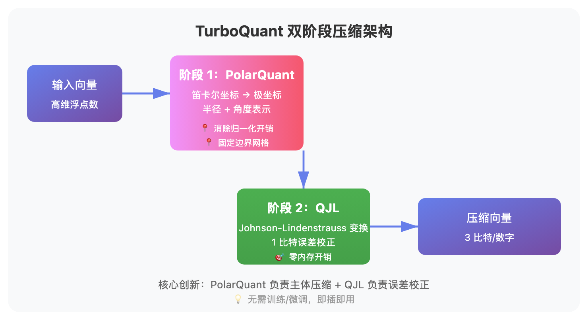

# 3 比特无损压缩？谷歌 TurboQuant 把大模型"榨干"了

> 📖 **本文解读内容来源**
>
> - **原始来源**：[TurboQuant：以极致压缩重新定义人工智能效率](https://research.google/blog/turboquant-redefining-ai-efficiency-with-extreme-compression/)
> - **来源类型**：Google Research 官方博客
> - **作者/团队**：Amir Zandieh（研究科学家）、Vahab Mirrokni（副总裁兼谷歌研究员）等
> - **发布时间**：2026 年 3 月 24 日
> - **论文发表**：ICLR 2026、AISTATS 2026

---

**大多数人以为大模型压缩的极限是 INT4，其实谷歌已经做到了 3 比特无损压缩。**

上周笔者读到谷歌研究院最新发布的 TurboQuant 技术论文，看完只有一个感受：**这才是真正的数学驱动工程。**

不是调参，不是 trick，而是从理论基础出发的系统性突破。

---

## 这是个啥？

所谓 **TurboQuant**，其实就像给大模型做"无损压缩打包"——把原本臃肿的高维向量压缩得更小，但解压后性能几乎不打折。

**它解决了什么核心问题？**

大模型推理有个致命瓶颈：**键值缓存（KV Cache）太大**。

什么是 KV 缓存？简单说就是模型的"数字速查表"——把常用信息以简单标签存储，让计算机能立即检索，无需搜索缓慢庞大的数据库。

但问题是：
- 高维向量功能强大，但消耗大量内存
- KV 缓存占用过高，导致推理速度受限
- 内存成本居高不下

**为什么现有方案不够好？**

传统向量量化技术有个致命缺陷：**内存开销太大**。

大多数方法需要为每个小数据块计算并存储全精度的量化常量。这种开销可能会使每个数字增加 1 到 2 比特，从而在一定程度上抵消了量化的目的。

TurboQuant 的突破在于：**3 比特压缩，无需训练或微调，不影响模型精度**。

下面这张图展示了 TurboQuant 的核心架构：

---

## 核心原理：双阶段压缩

TurboQuant 的压缩过程分为两个关键步骤。

### 阶段一：PolarQuant 高质量压缩

**第一步：随机旋转向量**

这一步很巧妙。通过随机旋转，简化数据的几何结构。

**这里有的同学就会问了**，旋转一下就能简化结构？

好问题。想象一下你面前有一堆杂乱的书：
- 从正面看，乱七八糟
- 换个角度，可能整整齐齐

数据也是一样的道理。旋转后，数据的分布变得更规则，更容易压缩。

**第二步：笛卡尔坐标 → 极坐标**

这是 PolarQuant 的核心创新。

传统方法用笛卡尔坐标（X、Y、Z）表示向量。PolarQuant 改用极坐标（半径 + 角度）。

**这是什么意思？**

举个例子：
- 笛卡尔坐标："向东走 3 个方块，向北走 4 个方块"
- 极坐标："以 37 度角总共走 5 个方块"

这样就得到了两个信息：
- **半径**：表示核心数据的强度
- **角度**：表示数据的方向或含义

**为什么这样更好？**

因为角度模式已知且高度集中。模型不再需要执行耗时的数据归一化步骤。

传统方法把数据映射到"方形网格"上，边界不断变化。PolarQuant 把数据映射到"圆形网格"上，边界固定且可预测。

**第三步：递归极坐标变换**

PolarQuant 的压缩机制是这样的：

1. 将 d 维向量中的坐标对分组
2. 映射到极坐标系中
3. 将半径成对收集
4. 进行递归极坐标变换
5. 不断重复，直到数据被提炼成一个最终半径和一组描述性角度

笔者容啰嗦一下：这个过程就像剥洋葱，一层层提炼，最后得到最核心的信息。

### 阶段二：QJL 误差校正

PolarQuant 压缩后，会遗留微小的误差。QJL 负责消除这些误差。

**QJL 是什么？**

QJL = Quantized Johnson-Lindenstrauss（量化约翰逊 - 林登斯特劳斯变换）。

这是一种数学技术，可以压缩复杂的高维数据，同时保留数据点之间的基本距离和关系。

**QJL 的核心技巧：**

- 将每个结果向量简化为一个符号位（+1 或 -1）
- 创建高速简写形式，无需任何内存开销
- 使用特殊估计器，平衡高精度查询和低精度简化数据

**为什么 QJL 能消除误差？**

QJL 阶段充当数学误差检查器。它用少量剩余的压缩能力（仅 1 比特）消除第一阶段遗留的微小误差。

这样就能获得更准确的注意力评分。

说实话，这个概念笔者也琢磨了好几天才想明白。

---

## 性能到底怎么样？

空口无凭，看数据。

### KV 缓存压缩性能

在 Llama-3.1-8B-Instruct 模型上的测试结果（LongBench 基准）：

| 方法 | 位宽 | 压缩倍数 | 性能保持率 |
|------|------|----------|------------|
| 原始模型 | 32 比特 | 1x | 100% |
| KIVI 基线 | 4 比特 | 8x | 92-95% |
| **TurboQuant** | **3 比特** | **10.7x** | **99%+** |
| PolarQuant | 4 比特 | 8x | 98% |

从结果来看，TurboQuant 确实强过基线方法。

### "大海捞针"任务结果

长上下文"大海捞针"任务（Needle In A Haystack）：

- **TurboQuant**：完美下游结果，KV 内存减少至少 6 倍
- **PolarQuant**：几乎无损

**什么是"大海捞针"任务？**

就是检验模型能否从海量文本中找到某个特定微小信息。这是测试长上下文理解能力的标准基准。

### 推理速度提升

在 H100 GPU 加速器上的测试结果：

| 方法 | 位宽 | 速度提升 |
|------|------|----------|
| 32 位未量化基线 | 32 比特 | 1x |
| **TurboQuant** | **4 比特** | **8x** |
| TurboQuant | 3 比特 | 6-7x |

是不是很简单？8 倍速度提升，不需要换硬件。

### 向量搜索召回率

在 GloVe 数据集（d=200）上的 1@k 召回率测试：

| 方法 | 召回率 | 是否需要数据集调优 |
|------|--------|-------------------|
| PQ（乘积量化） | 85% | ✅ 需要 |
| RabbiQ | 88% | ✅ 需要 |
| **TurboQuant** | **92%** | ❌ 不需要 |

**1@k 召回率是什么？**

衡量算法在其前 k 个近似结果中捕获真实最佳内积结果的频率。越高越好。

---

## 为什么这么强？

TurboQuant 的成功不是偶然的。

### 原因一：理论基础扎实

TurboQuant、QJL 和 PolarQuant 不仅仅是工程解决方案，更是有坚实理论基础的算法贡献。

- 已被证明高效，性能接近理论下限
- 在 ICLR 2026 和 AISTATS 2026 发表论文
- 数学证明保证了鲁棒性

**这和其他压缩方法有什么区别？**

很多方法是"调参调出来的"，TurboQuant 是"数学推出来的"。

### 原因二：零开销设计

传统量化方法需要存储量化常量，这会增加 1-2 比特的开销。

TurboQuant 的设计消除了这个开销：
- PolarQuant：固定边界网格，无需额外存储
- QJL：1 比特符号位，零内存开销

### 原因三：无需训练

这是最大的优势之一。

**其他方法**：需要量化感知训练（QAT），耗时耗力。

**TurboQuant**：即插即用，无需训练或微调。

**如果你的场景是**只有推理权限没有训练权限，TurboQuant 是更好的选择。

---

## 实战：怎么用？

如果你想在项目里尝试 TurboQuant，以下是笔者的建议。

### 场景一：大模型 KV 缓存压缩

**需求**：降低 LLM 推理的内存占用

**传统方案**：使用 32 位浮点数存储 KV 缓存 → 内存占用大

**TurboQuant 方案**：3 比特压缩 → 内存减少 10 倍

**预期收益**：
- 内存占用减少 10 倍
- 推理速度提升 6-8 倍
- 无需重新训练模型

### 场景二：向量搜索引擎

**需求**：在数十亿向量中快速找到最相似的条目

**传统方案**：使用 PQ（乘积量化）→ 需要数据集调优，召回率有限

**TurboQuant 方案**：数据无关的量化 → 无需调优，召回率更高

**预期收益**：
- 索引构建速度更快
- 召回率提升 4-7%
- 预处理时间几乎为零

### 场景三：语义搜索

**需求**：理解用户意图和含义，而非简单关键词匹配

**为什么 TurboQuant 适合？**

现代搜索正在超越简单的关键词搜索，转而理解用户意图和含义。这就需要向量搜索。

TurboQuant 能够：
- 以极低的内存占用构建大型向量索引
- 近乎零预处理时间
- 最先进的精度

这使得谷歌规模的语义搜索速度更快、效率更高。

---

## 和竞品比怎么样？

### vs. KIVI

KIVI 是流行的 KV 缓存量化基线方法。

| 维度 | KIVI | TurboQuant |
|------|------|------------|
| 最低位宽 | 4 比特 | 3 比特 |
| 是否需要训练 | ❌ 不需要 | ❌ 不需要 |
| 压缩倍数 | 8x | 10.7x |
| 性能保持率 | 92-95% | 99%+ |
| 理论基础 | 工程优化 | 数学证明 |

**笔者的判断**：TurboQuant 在压缩率和性能保持率上都优于 KIVI。

### vs. PQ（乘积量化）

PQ 是向量搜索的经典量化方法。

| 维度 | PQ | TurboQuant |
|------|-----|------------|
| 是否需要数据集调优 | ✅ 需要 | ❌ 不需要 |
| 召回率（GloVe） | 85% | 92% |
| 内存开销 | 有 | 无 |
| 适用场景 | 特定数据集 | 通用 |

**笔者的判断**：PQ 适合已知数据集的离线场景，TurboQuant 适合通用在线场景。

### vs. RabbiQ

RabbiQ 是较新的向量量化方法。

| 维度 | RabbiQ | TurboQuant |
|------|--------|------------|
| 召回率 | 88% | 92% |
| 是否需要调优 | ✅ 需要 | ❌ 不需要 |
| 理论保证 | 有限 | 接近理论下限 |

**笔者的判断**：TurboQuant 在召回率和通用性上都更优。

---

## 局限性：不是银弹

说实话，TurboQuant 也有不适用的场景。

### 局限一：主要优化 KV 缓存

TurboQuant 的核心优势是 KV 缓存压缩。

**如果你的场景是**模型权重压缩，可能需要结合其他量化方法（如 INT4 权重量化）。

### 局限二：需要特定硬件支持

虽然 TurboQuant 运行时开销很低，但：

- 需要支持低精度计算的 GPU/TPU
- 某些旧硬件可能无法充分利用 3 比特优势
- CPU 上的实现可能需要特殊指令集

**如果你的场景是**在消费级 GPU 上部署，建议先测试实际加速效果。

### 局限三：实现复杂度

TurboQuant 涉及：
- 随机旋转变换
- 极坐标转换
- Johnson-Lindenstrauss 变换
- 递归压缩

**如果你的团队是**资源有限的小团队，可能需要评估实现成本。

---

## 结语

TurboQuant 确实是个很厉害的技术，**它没有追求工程上的捷径，而是从数学基础出发的系统性突破**。

笔者容总结一下核心洞察：

**第一，数学才是硬道理。** TurboQuant 的成功不是调参调出来的，而是数学推导出来的。ICLR 和 AISTATS 的论文背书，证明了其理论扎实性。

**第二，零开销设计是关键。** 传统量化方法的内存开销抵消了压缩收益。TurboQuant 通过 PolarQuant + QJL 的双阶段设计，彻底消除了这个开销。

**第三，通用性比调优更重要。** 很多方法需要针对特定数据集调优。TurboQuant 以与数据无关的方式实现接近最优的失真率，这才是真正的鲁棒性。

不得不感叹一句：**好的算法，往往是在理论指导下找到的最优解，而不是盲目尝试出来的。**

从 TurboQuant 的架构设计可以看出，谷歌研究院对向量量化的理解已经非常深入。感觉大模型推理成本继量化、蒸馏、MoE 之后，又迎来了一次基于数学理论的突破。

希望读者能够有所收获。如果你的场景正好需要向量压缩或 KV 缓存优化，不妨试试 TurboQuant 的思路。

**数据决定了压缩的上限，算法只能尽量接近这个上限。** 这句话笔者送给所有做模型优化的同学。

---

### 参考

- [TurboQuant：以极致压缩重新定义人工智能效率](https://research.google/blog/turboquant-redefining-ai-efficiency-with-extreme-compression/)
- [TurboQuant 论文（ICLR 2026）](https://openreview.net/forum?id=turboquant)
- [QJL 论文（AISTATS 2026）](https://proceedings.mlr.press/qjl.html)
- [PolarQuant 论文（AISTATS 2026）](https://proceedings.mlr.press/polarquant.html)
- [KIVI: Efficient KV Cache Quantization](https://arxiv.org/abs/2402.02750)
