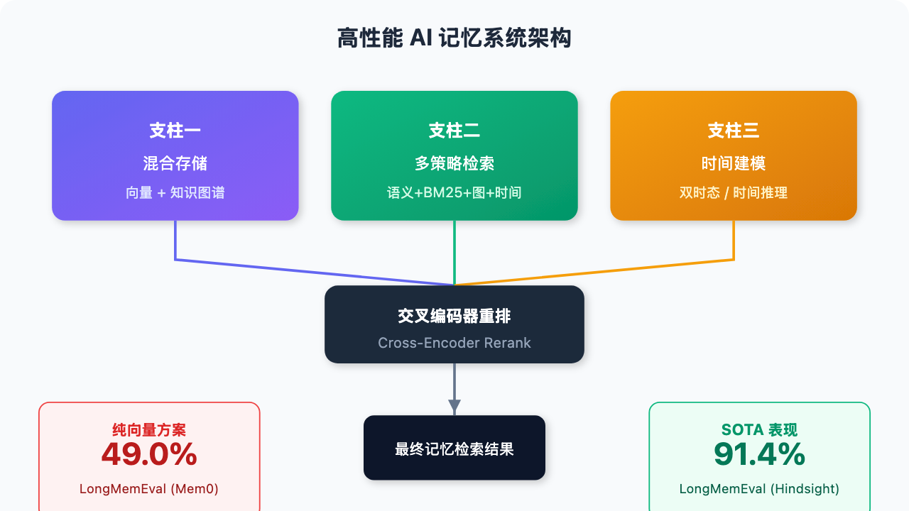

# 架构比模型大更重要？AI 记忆系统的"真相"被彻底揭开

> 📖 **本文解读内容来源**
>
> - **原始来源**：[The state of AI memory systems: benchmarks, architectures, and what actually works](https://x.com/yoheinakajima/status/xxxxx)
> - **来源类型**：技术研究报告（Claude Opus 4.6 Research 编译）
> - **作者/团队**：Yohei Nakajima (@yoheinakajima)
> - **发布时间**：2026年3月

---

大多数人以为 AI 记忆能力取决于模型有多大——参数越多，记性越好。

**真相完全相反**。

在 LongMemEval 基准测试上，一个 200 亿参数的模型配合 Hindsight 记忆系统，得分 **83.6%**。而全上下文的 GPT-4o 只有 **60.2%**。

差了 20 多个百分点。

这不是个例。在每项主流基准测试上，**架构设计**都在碾压**模型规模**。一个清晰的技术共识正在形成：**混合存储（向量+图）+ 多策略检索 + 时间建模**，是高性能记忆系统的三大支柱。

今天这篇文章，笔者带你拆解这场 AI 记忆革命。

---

## 一、为什么 AI 记忆这件事突然重要了？

你可能没注意到——2024 到 2026 年，AI 记忆领域经历了爆发式增长。

至少 **7 个主流基准测试**诞生，**十几个严肃的开源框架**涌现。以前大家只关心"模型能聊多久"，现在的问题是："模型能记住多久？"

答案很残酷：商业聊天助手的准确率在长对话中**暴跌 30-60%**。

你问它三天前提到的生日，它答不上来。你跟它说过喜欢喝美式，过会儿它又推荐拿铁。这不是模型不够聪明——是**记忆系统没跟上**。

核心矛盾在于：**上下文窗口 ≠ 记忆能力**。

上下文窗口只是"临时工作台"，容量有限、成本高昂。真正的记忆，需要**存储、检索、更新、遗忘**一整套机制——就像人脑的海马体，不只是额叶的暂存区。

---

## 二、七大基准测试：谁在给 AI 的"记性"打分？

要搞清楚哪个记忆系统强，先得知道怎么测。目前主流有 7 个基准测试，各有侧重：

| 基准测试 | 核心能力 | 特点 |
|---------|---------|------|
| **LongMemEval** | 信息提取、多会话推理、时间推理、知识更新、弃权判断 | 黄金标准，500 道人工标注题，对话长度最高 150 万 token |
| **LoCoMo** | 单跳问答、多跳推理、时间推理、对抗问题 | 对话约 9K token，但存在数据质量争议 |
| **MemBench** | 事实记忆 vs 反思记忆 | 区分"明确说的"和"隐含推导的" |
| **MemoryBench** | 持续学习、用户反馈 | 测试模型能否从反馈中改进 |
| **MemoryAgentBench** | 检索、学习、长程理解、冲突解决 | 四项能力，目前无系统全优 |
| **EverMemBench** | 多人群聊场景 | 群聊比私聊更难记 |
| **Letta Leaderboard** | 自主记忆管理 | 测试 LLM 自己调用工具管理记忆 |

**一个关键发现**：**时间推理**是所有测试中最难的能力。在 LoCoMo 上，系统和人类的时间推理差距高达 **73%**。

这告诉我们什么？**不显式建模时间的记忆系统，基本都要翻车。**

---

## 三、谁是目前最强？四大系统深度拆解

### 3.1 Hindsight：用四条检索管线堆出 91.4%

**一句话定位**：当前 SOTA，靠"并行多策略检索"封神。

Hindsight（Vectorize，2025年12月）在 LongMemEval 上拿到 **91.4%**（搭配 Gemini-3 Pro），LoCoMo 上 **89.61%**。小模型版本也很强：200 亿参数版本 **83.6%**，1200 亿版本 **89.0%**。

它的核心架构是"**四大记忆网络**"：

1. **世界事实网络**——客观知识
2. **智能体经历网络**——交互历史
3. **实体观察网络**——用户/物品信息
4. **观点/信念网络**——推导结论

这种**认识论分离**非常聪明——**证据和推论分开存**，检索时逻辑更清晰。

但真正让它碾压全场的，是**四路并行检索**：

```
用户提问 → [语义相似度] ─┐
           [BM25 关键词] ─┼→ 交叉编码器重排 → 最终结果
           [图遍历]     ─┤
           [时间推理]   ─┘
```

四种策略并行跑，结果融合后用交叉编码器重排。

**效果有多炸裂？** 时间推理题型，从基线 31.6% 飙升到 **91.0%**——接近 60 个点的提升。

它还存储**双重时间戳**：事件发生时间 + 学习时间。既能回答"当时发生了什么"，也能回答"我是什么时候知道的"。

**开源**：MIT 协议，代码已公开。

---

### 四大系统性能对比

| 系统 | LongMemEval | LoCoMo | 核心特点 | 开源协议 |
|-----|-------------|--------|---------|---------|
| **Hindsight** | 91.4% | 89.61% | 四路并行检索 + 四大记忆网络 | MIT |
| **Zep/Graphiti** | 71.2% | 75.14% | 双时态知识图谱 + 无 LLM 检索 | Apache 2.0 |
| **MemGPT/Letta** | - | 74.0%* | Agent 自控记忆 + 睡眠时计算 | Apache 2.0 |
| **Mem0** | ~49% | 68.5% | LLM 驱动更新 + 生产就绪 | MIT |

*Letta 文件系统方案成绩

---

### 3.2 Zep/Graphiti：双时态知识图谱的优雅

**一句话定位**：把时间做到极致的企业级方案。

Zep 的核心引擎叫 **Graphiti**（Apache 2.0，2.4 万+ GitHub Star）。它把记忆建模成一个三层知识图谱：

```
┌─────────────────────────────────────┐
│           社区子图（摘要层）          │ ← 高层聚类
├─────────────────────────────────────┤
│         语义实体子图（事实层）         │ ← 实体+关系
├─────────────────────────────────────┤
│          片段子图（原始层）           │ ← 原始对话
└─────────────────────────────────────┘
```

这三层正好对应心理学中的**情景记忆 vs 语义记忆**区分——原始经历 vs 提炼知识。

Graphiti 最硬核的是**双时态模型**。每条关系边记录四个时间戳：

| 时间戳 | 含义 |
|-------|------|
| `valid_at` | 这件事在现实中何时为真 |
| `invalid_at` | 何时被新事实取代 |
| `created_at` | 系统何时录入这条记录 |
| `expired_at` | 记录何时被逻辑标记为过期 |

这有什么用？

- 可以问："上周二我们对项目 X 的了解是什么？"——**时间旅行查询**
- 可以追溯一条事实的演变历史——**完整审计链**
- 矛盾信息不是删除，而是标记失效——**历史可追溯**

检索阶段，Zep 同样是三路并行：**余弦相似度 + BM25 全文搜索 + 图广度遍历**。关键是——**检索全程不调用 LLM**，全靠预计算的索引。

延迟？**P95 约 300ms**。

基准测试成绩：LongMemEval **71.2%**（GPT-4o），LoCoMo **75.14%**，MemGPT 自家的 Deep Memory Retrieval 测试拿到 **94.8-98.2%**——比 MemGPT 自己还高。

**代价**：图构建费时费力，大语料库导入可能要几小时，因为实体抽取、消解、关系推断都要调 LLM。

---

### 3.3 MemGPT/Letta：让大模型自己管内存

**一句话定位**：最概念创新的方案——把记忆当成"操作系统问题"。

MemGPT（UC Berkeley，ICML 2024）提出了一个极具想象力的类比：

> **上下文窗口 = 物理内存（RAM）**
> **外部数据库 = 硬盘**
> **智能体通过函数调用来"换页"**

这套思路被产品化为 **Letta**（Apache 2.0，约 2 万 GitHub Star）。

它的记忆层级分三层：

| 层级 | 作用 | 特点 |
|-----|------|------|
| **Core Memory** | 存用户画像、人格设定 | 约 2000 字符上限，可读写 |
| **Recall Memory** | 完整消息历史 | 可搜索的数据库 |
| **Archival Memory** | 长期存储 | PostgreSQL + pgvector |

最与众不同的是：**Agent 自己决定何时存、存什么、怎么取**。

通过显式函数调用：`core_memory_append`、`core_memory_replace`、`memory_rethink`、`archival_memory_search`……

连发消息给用户都是一个函数调用——**没有原生聊天模式**。

当上下文用到约 70% 容量时，系统发出**内存压力警告**，Agent 有机会保存关键信息。到 100% 时，强制驱逐，压缩成递归摘要。

**2025 年 4 月的创新**：**睡眠时计算（Sleep-time Compute）**。

后台 Agent 在用户不活跃时，用更强的模型整理记忆，把"学到的上下文"写回共享内存块。记忆管理和对话解耦，既提升了记忆质量，又降低了响应延迟。

**惊人的发现**：Letta 团队发现，一个简单的文件系统方案（Agent + 文件工具）能在 LoCoMo 上拿到 **74.0%**——比 Mem0 的专用记忆基础设施（68.5%）还高。

这说明什么？**Agent 能力可能比专用记忆基建更重要。**

---

### 3.4 Mem0：最务实的生产就绪方案

**一句话定位**：简单、快、能跑——工程师的最爱。

Mem0（Y Combinator，2025 年 10 月融资 2400 万美元，约 4.8 万 GitHub Star）走的是另一条路：**能用就行，别搞太复杂**。

核心流程两阶段：

1. **抽取阶段**：合并【对话摘要 + 最近 10 条消息 + 新消息对】，LLM 抽取候选记忆事实
2. **更新阶段**：对每条新事实，检索语义最相似的 Top 10 旧记忆，LLM 决定四种操作之一：
   - `ADD`（新增）
   - `UPDATE`（更新）
   - `DELETE`（删除矛盾）
   - `NOOP`（不操作）

冲突解决全靠 LLM 判断——灵活，但黑盒。

可选的图变体 Mem0ᵍ 支持实体+关系存储，但核心还是向量检索。

**基准成绩**：LoCoMo **66.9-68.5%**，延迟 P95 仅 **1.40 秒**（全上下文方案 17 秒，LangMem 60 秒）。

但 LongMemEval 只有 **~49%**——单一检索策略在复杂查询上吃力。

**短板**：无双时态建模、无事实/观点分离、基础版无 BM25、无置信度、无遗忘机制。

---

## 四、五大架构模式：什么才是一个"好"的记忆系统？

分析完所有主流系统，一个清晰的模式浮现出来。下面这张图展示了高性能记忆系统的核心架构：





分析完所有主流系统，一个清晰的模式浮现出来。

### 模式一：多策略检索是最大的差异化因素

| 系统 | 检索策略数 | LongMemEval |
|-----|-----------|-------------|
| Hindsight | 4（语义+BM25+图+时间） | **91.4%** |
| Zep | 3（余弦+BM25+BFS） | **71.2%** |
| Mem0 | 1-2（向量+可选图） | **49.0%** |

**相关性几乎线性**：策略越多，分数越高。

为什么？因为**不同问题需要不同检索方式**：
- BM25 抓精确匹配，语义搜索会漏
- 图遍历找多跳关联，扁平向量看不见
- 时间过滤防止返回过期信息

---

### 模式二：图结构是复杂推理的刚需，但向量仍是基础

Zep（图原生，71.2%）和 Mem0（向量主导，49%）在 LongMemEval 上差了 **22 个百分点**。

纯向量方案在多跳、时序、关系查询上天然吃亏。

但**图-only 也不行**——语义相似但无显式边的内容会漏。所有顶级系统都是**混合存储**。

---

### 模式三：时间建模带来最大性能提升

时间推理是所有基准测试中**差距最大的能力**（LoCoMo 上人机差 73%）。

- Hindsight 双时间戳：时间查询从 31.6% → **91.0%**
- Zep 双时态模型：支持"过去某时我们知道的 X 是什么"
- Cognee 时态搜索模式

不建模时间的系统，在这类问题上基本翻车。

---

### 模式四：主动记忆整合防止性能衰减

只存不整理的记忆系统，数据越多越吵。

- Hindsight：`reflect` 操作根据新证据更新信念
- Zep：矛盾事实标记失效而非删除
- Cognee：`memify` 管道修剪过期节点、强化频繁连接
- Letta：睡眠时计算后台优化记忆
- Mem0：LLM 驱动的增删改判断

**记忆不是静态仓库，是动态花园。**

---

### 模式五：Agent 自控记忆可以超越专用基建

Letta 的实验：简单文件系统方案（Agent + 文件工具）在 LoCoMo 上 **74.0%**，超过 Mem0 的专用记忆系统 **68.5%**。

这很反直觉——**给 LLM 迭代搜索、读取、组织自己记忆的能力，可能比记忆存储本身的精巧度更重要**。

当然，代价是消耗更多 token，且高度依赖模型指令跟随能力。

---

## 五、三大权衡：没有银弹，只有取舍

### 权衡一：丰富度 vs 延迟

- Zep：图构建极其完整，但大语料库导入要几小时
- Mem0：抽取轻量，几乎即时，但缺失关系结构

### 权衡二：自主性 vs 确定性

- MemGPT/Letta：Agent 自控记忆，灵活但非确定性
- Zep：预计算检索，快速可预测但适应性差

### 权衡三：完整性 vs 压缩

- Zep：保留原始片段 + 提取知识，无损但费存储
- Mem0：只提取"重要事实"，高效但可能丢细节

---

## 六、笔者的判断：技术共识正在形成

分析完这一切，笔者认为一个明确的架构模板正在收敛：

> **混合向量+图存储 + 多策略检索+重排 + 显式时间建模 + 主动记忆整合**

Hindsight 的 91.4% 证明了这套模板的上限。

剩下的挑战不是"用什么架构"，而是**如何让它更便宜、更快速**。四路并行检索 + 交叉编码器重排很贵；Zep 的图构建需要大量 LLM 调用。

**下一个突破点**：很可能来自把这套富架构做得更经济，而不是发明全新范式。

不得不感叹一句：**架构的想象力，有时比参数的暴力更重要。**

---

## 参考

- [LongMemEval: A Benchmark for Evaluating Long-term Memory of LLM Assistants](https://arxiv.org/abs/2410.10813)
- [LoCoMo: Long-Context Multi-Modal Conversation Benchmark](https://arxiv.org/abs/2406.11017)
- [Hindsight - Vectorize](https://github.com/vectorize-io/hindsight)
- [Zep / Graphiti](https://github.com/getzep/graphiti)
- [MemGPT / Letta](https://github.com/letta-ai/letta)
- [Mem0](https://github.com/mem0ai/mem0)
- [Cognee](https://github.com/topoteretes/cognee)