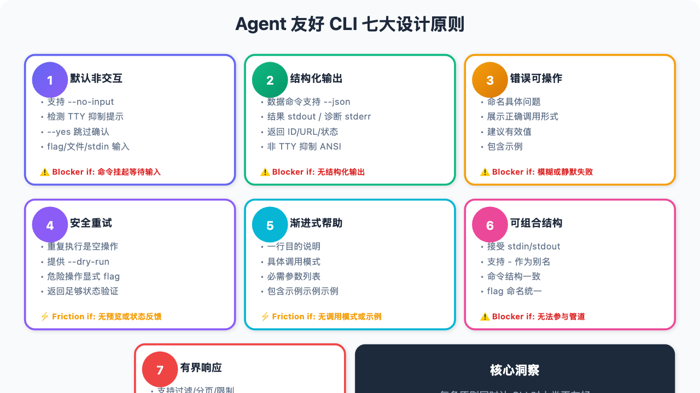

# 你的 CLI 能被 Agent 用吗？七大设计原则让它"Agent 友好"

> 📖 **本文解读内容来源**
>
> - **原始来源**：[7 Principles for Agent-Friendly CLIs](https://x.com/trevin/status/xxxxx)
> - **来源类型**：技术博客
> - **作者/团队**：Trevin Chow (@trevin)
> - **发布时间**：2026年3月

---

如果你正在构建一个 CLI 工具，大概率会参考这些经典指南：

- **Command Line Interface Guidelines**——关于人类如何使用终端
- **CLI-Anything**——关于设计优雅的命令行体验

它们都很棒。但有一个共同盲点：

**它们假设用户是人类。**

人类能读提示、做判断、解析格式化表格。Agent 呢？当你用 Agent 或 Skill 启动一个后台 subagent 时，交互式 CLI 就会崩溃——没有办法把交互提示"冒泡"回用户。彩色输出浪费 token。无界响应对上下文窗口是灾难。

**Anthropic 发布过工具设计指南**，但那是通用建议，不是 CLI 专用的。

这篇文章填补了这个空白：**七个让 CLI 对 Agent 真正友好的设计原则**。

---

## 一、为什么 CLI 比 MCP 更适合 Agent？

先回答一个常见问题：**MCP 都有了，为什么还关心 CLI？**

三个理由：

| 对比维度 | CLI | MCP Server |
|---------|-----|------------|
| **Schema 开销** | 零（训练数据已覆盖） | 数万 token 仅加载定义 |
| **复杂度** | 文本进、文本出 | 需要认证、治理结构 |
| **可靠性** | 简单、稳定 | 更多故障点 |

LLM 的训练数据已经包含常见 CLI 工具的用法。一个 MCP Server 可能在问第一个问题之前，就消耗掉几万 token 只是为了加载工具定义。

**结论**：对于开发者日常构建和使用的工具，**一个设计良好的 CLI 更快、更便宜、更可靠**。

---

## 二、严重性分级：不是非黑即白

在讲七大原则之前，先说一个重要概念：**这不是 pass/fail 的检查表**。

每个问题分为三个严重级别：

| 级别 | 含义 | 示例 |
|-----|------|------|
| **Blocker** | 阻止 Agent 可靠使用 | 命令挂起等待输入、输出无法恢复 |
| **Friction** | 能用但低效 | 更多重试、浪费 token、解析脆弱 |
| **Optimization** | 能用但可优化 | 更快、更便宜、更可靠 |

**关键点**：严重性取决于命令类型。

- **幂等性**对变更命令很重要，对流式日志无意义
- **结构化输出**对读取/查询命令是 Blocker，对一次性引导向导没那么重要

评估时看命令做什么，而不是把每条原则平均套用。

---

## 三、七大设计原则

### 原则 1：默认非交互

**核心规则**：Agent 可能自动化的任何命令，都应该能无提示运行。

这是最常见的 Blocker。当一个 Skill 启动 subagent 调用 CLI 时，**没有办法把交互提示冒泡回用户**。命令就这样挂着，等待永远不会来的输入。

**好的设计**：

```bash
# 人类在终端（检测到 TTY）—— 提示补全缺失输入
$ blog-cli publish
? Status? (use arrow keys) draft > published scheduled
? Path to content: my-post.md
Published "My Post" to personal

# Agent 或脚本（无 TTY，或 --no-input）—— 纯 flag，无提示
$ blog-cli publish --content my-post.md --yes
Published "My Post" to personal (post_id: post_8k3m)
```

**实现要点**：
- 支持 `--no-input` 或 `--non-interactive`
- 检测 TTY vs 非 TTY，stdin 非交互时抑制提示
- 接受 `--yes` / `--force` 跳过确认
- 通过 flag、文件或 stdin 接受结构化输入

**验证方法**：分离 stdin 并设置超时

```python
import subprocess
result = subprocess.run(
    ["blog-cli", "publish", "--content", "my-post.md"],
    stdin=subprocess.DEVNULL,
    timeout=10,
)
# 如果超时 → Blocker
```

---

### 原则 2：结构化、可解析输出

**核心规则**：返回数据的命令应暴露稳定的机器可读表示。

Agent 需要数据契约，不是展示格式。一个带 ANSI 颜色的漂亮表格对人类很好，对试图提取 post ID 的 Agent 毫无用处。

**好的设计**：

```bash
# 人类可读
$ blog-cli publish --content my-post.md
Published "My Post" to personal
URL: https://personal.blog.dev/my-post
Post ID: post_8k3m

# 机器可读
$ blog-cli publish --content my-post.md --json
{"title":"My Post","url":"https://personal.blog.dev/my-post","post_id":"post_8k3m","status":"published"}
```

**实现要点**：
- 数据类命令支持 `--json`
- 退出码 0 表示成功，非零表示失败
- 结果数据写 stdout，诊断信息写 stderr
- 返回有用字段（名称、URL、ID、状态）
- 非 TTY 时抑制颜色、spinner、装饰输出

**最后一点容易忽略**：很多 CLI 检测 TTY 正确处理提示，但管道输出仍然喷射 ANSI 转义码。Agent 解析 `\x1b[32m✓ Published\x1b[0m` 是在浪费 token。

---

### 原则 3：快速失败，错误可操作

**核心规则**：命令失败时，错误应教会 Agent 下次如何成功。

这是大多数 CLI 对 Agent 最薄弱的地方。人类能从模糊错误信息推断问题。Agent 不能。

**对比**：

```bash
# ❌ 差
$ blog-cli publish
Error: missing required arguments

# ✅ 好
$ blog-cli publish
Error: --content is required. Usage: blog-cli publish --content <file> [--status <status>]
Available statuses: draft, published, scheduled
Example: blog-cli publish --content my-post.md
```

好的错误做四件事：
1. **命名具体问题**
2. **展示正确调用形式**
3. **建议有效值**
4. **包含示例**

Agent 拿到这个错误，一次重试就能修正。拿到 "missing required arguments"，只能猜——更多工具调用、浪费 token、可能再错。

---

### 原则 4：安全重试，明确变更边界

**核心规则**：Agent 会重试、恢复、重放命令。变更命令应在可能时保证安全，危险变更应明确。

Agent 比人类更可能自动重试。人类运行命令两次会注意到重复。Agent 在重试循环里不会——除非 CLI 告诉它发生了什么。

**好的设计**：

```bash
# 重复相同命令不会创建重复工作
$ blog-cli publish --content my-post.md
Published "My Post" to personal (post_id: post_8k3m)

$ blog-cli publish --content my-post.md
Already published "My Post" to personal, no changes (post_id: post_8k3m)

# 危险变更是明确的
$ blog-cli posts delete --slug my-post --confirm
```

**实现要点**：
- 对创建/更新/部署命令，重复应用是空操作或可检测
- 为后果严重的变更提供 `--dry-run`
- 危险操作使用明确的破坏性 flag
- 成功输出中返回足够状态让 Agent 验证发生了什么

---

### 原则 5：渐进式帮助发现

**核心规则**：Agent 不会预先读取完整文档。它们探测顶层帮助、子命令帮助、然后示例。帮助应支持这种增量工作流。

想想 Agent 如何探索一个 CLI：

1. 先看 `--help` 了解命令面
2. 深入特定子命令
3. 从"这工具能做什么"到"如何调用这个命令"——两步完成，不是五步

**好的设计**：

```bash
$ blog-cli --help
Usage: blog-cli <command>
Commands:
  publish   Publish content
  posts     List and manage posts

$ blog-cli publish --help
Publish a markdown file to your blog.
Options:
  --content   Path to markdown file
  --status    Post status (draft, published, scheduled; default: published)
  --yes       Skip confirmation prompt
  --json      Output as JSON
  --dry-run   Preview without publishing

Examples:
  blog-cli publish --content my-post.md
  blog-cli publish --content my-post.md --status draft
```

每个子命令帮助应包含四件事：
- **一行目的说明**
- **具体调用模式**
- **必需参数或 flag**
- **最重要的修饰符或安全 flag**

**示例比你想的更重要**。Anthropic 的工具设计指南表明，具体示例能改善 Agent 使用工具的效果。没有示例的帮助页，Agent 必须从 flag 描述合成调用——能工作，但浪费 token 且容易出错。

---

### 原则 6：可组合、可预测结构

**核心规则**：Agent 通过链式命令解决任务。它们受益于接受 stdin、产生干净 stdout、使用可预测命名和子命令模式的 CLI。

Agent 是天生的管道用户。它们把一个命令的输出链到另一个的输入，和任何 shell 脚本一样。但它们对不一致的容忍度比人类低——因为它们在结构上模式匹配，而不是读文档做判断。

**好的设计**：

```bash
cat posts.json | blog-cli posts import --stdin
blog-cli posts list --json | blog-cli posts validate --stdin
blog-cli posts list --status draft --limit 5 --json | jq -r '.[].title'
```

**实现要点**：
- 通过 flag、文件或 stdin 接受输入
- 支持用 `-` 作为 stdin/stdout 别名
- 相关资源间保持命令结构一致
- 有歧义的多字段操作用 flag，熟悉的约定情况用位置参数

**跨子命令一致性是关键**：

- 如果 `blog-cli posts list` 支持 `--json` 但 `blog-cli posts stats` 不支持，Agent 必须学例外
- 如果 `blog-cli posts list` 用 `--limit` 但 `blog-cli comments list` 用 `--max-results`，Agent 必须记住任意命名差异

---

### 原则 7：有界、高信噪比响应

**核心规则**：Agent 为每行额外输出付出真实代价。大输出有时合理，但 CLI 应让窄范围、相关响应成为默认。

这是大多数 CLI 作者不会想到的一点——对人类用户不可见。

人类滚动 500 行输出，视觉上找到需要的。Agent 把 500 行全部消费进上下文窗口，为每个 token 付费，然后得弄清楚哪些行有意义。

**好的设计**：

```bash
# 宽但有界
$ blog-cli posts list --limit 25
Showing 25 of 312 posts
To narrow results: blog-cli posts list --status published --since 7d --limit 10

# 更精确
$ blog-cli posts list --tag javascript --status published --since 30d --limit 10 --json
```

**关键设计决策**：当 CLI 截断时，它教会 Agent 如何缩小查询。

"Showing 25 of 312 posts" 加上建议的缩小命令给 Agent 下一步。直接倾倒 312 篇文章给它一个解析问题。

**实现要点**：
- 对大结果集支持过滤、分页、限制
- 提供简洁 vs 详细响应模式
- 截断时解释如何缩小或翻页
- 原始细节之前返回摘要和标识符

---

## 四、七大原则总览

下面这张图总结了 Agent 友好 CLI 的核心设计要点：





---

## 五、笔者的判断：Agent 友好 = 人类友好

读完这七大原则，你可能已经发现一个规律：

**每条原则都同时让 CLI 对人类更好。**

结构化输出、可操作错误、有界响应、非交互自动化路径——这些不是对 Agent 的妥协，牺牲人类体验。它们是**一直应该做好的 CLI 设计**，只是人类足够宽容，能绕过那些缺陷。

Agent 每次模型更新都在变得更"宽容"。它们能推断模糊错误的含义、猜测正确的 flag 名称、解析混乱输出提取需要的。但"勉强能用"要付出代价：浪费 token、消耗重试、引入不必要的故障模式。

**把 Agent 作为一等公民设计，消除这笔税。CLI 最终对人类也更好。**

不得不感叹一句：**好的设计不区分用户是谁，只区分问题是什么。**

---

## 参考

- [7 Principles for Agent-Friendly CLIs - Original Post](https://xxxxx)
- [Command Line Interface Guidelines](https://clig.dev)
- [Anthropic: Writing tools for agents](https://www.anthropic.com/engineering/writing-tools-for-agents)
- [Compound Engineering Plugin](https://github.com/xxxxx)