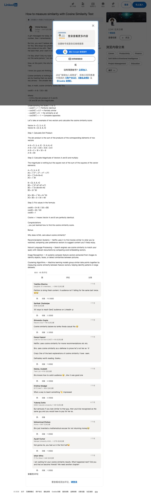

# 如何用余弦相似度测试来衡量相似性

> 📖 **本文翻译自**
>
> - **原始来源**：[LinkedIn - Vishal Baraiya](https://www.linkedin.com/posts/vixhal_a-girl-messaged-me-today-at-first-i-was-activity-7363829726479638529-bD9d)
> - **作者**：Vishal Baraiya (@TheVixhal)
> - **发布时间**：2025年8月

---



---

今天有个女生给我发消息。起初我很困惑她是从哪里弄到我的号码的，然后我想起来了……哦，我之前在简历帖子里公开过我的号码。

但是兄弟们，你们绝对猜不到她在消息里发了什么。说实话，我完全没有准备好。她发来两张照片：一张是她前男友，另一张是我。

然后她说："看吧？你和我前任是同一个人！你那时候拿了我的钱，我要拿回来！"

我当时的反应是：什么？只有我的鼻子看起来像她照片里那个人好吗！我一直在告诉她："我们不是同一个人"，但她完全不接受这个说法。

现在，在这个时候，我唯一的希望就是我最后的防线——余弦相似度测试。

---

## 什么是余弦相似度？

我知道你们在想，这到底什么是余弦相似度。

余弦相似度其实只是一种数学方法，通过将两个事物视为空间中的向量来衡量它们的相似程度。可以把它想象成测量两支箭之间的角度——角度越小，它们就越相似。

在数学中，余弦相似度的公式是这样的：

```
cos(θ) = A·B / (|A| × |B|)
```

其中：
- A·B 是向量 A 和 B 的点积
- |A| 和 |B| 是向量的模（长度）

---

## 理解刻度范围（-1 到 1）

| 余弦值 | 含义 |
|-------|------|
| cos(0°) = 1 | 完全相同 |
| cos(45°) = 0.7 | 部分相似 |
| cos(90°) = 0 | 完全不相似 |
| cos(180°) = -1 | 完全相反 |

---

## 让我们来计算余弦相似度

我们以两个向量为例，计算它们的余弦相似度分数：

```
向量 A = [1, 3, 4, 2]
向量 B = [2, 6, 8, 4]
```

### 第一步：计算点积

点积是两个向量对应元素乘积的总和：

```
A·B = [1, 3, 4, 2] · [2, 6, 8, 4]

A·B = 1×2 + 3×6 + 4×8 + 2×4
A·B = 2 + 18 + 32 + 8
A·B = 60
```

### 第二步：计算向量的模并相乘

模就是向量元素平方和的平方根：

```
A = [1, 3, 4, 2]
|A| = √(1² + 3² + 4² + 2²)
|A| = √(1 + 9 + 16 + 4)
|A| = √30

B = [2, 6, 8, 4]
|B| = √(2² + 6² + 8² + 4²)
|B| = √(4 + 36 + 64 + 16)
|B| = 2√30

|A| × |B| = √30 × 2√30
|A| × |B| = 2 × 30 = 60
```

### 第三步：代入公式

```
cos(θ) = (A·B) / (|A| × |B|)
cos(θ) = 60 / 60
cos(θ) = 1
```

**余弦值 = 1 意味着向量 A 和 B 完全相同！**

---

## 🎉 恭喜你！你刚刚学会了如何计算余弦相似度分数！

---

## 额外内容：为什么 AI/ML 在乎余弦相似度？

### 推荐系统
Netflix 使用它来找到与你观看过的电影相似的电影，通过比较用户偏好向量来推荐你可能喜欢的内容。

### 自然语言处理
搜索引擎使用余弦相似度来匹配你的查询与相关文档，通过比较词嵌入向量来实现。

### 图像识别
AI 系统比较从图像中提取的特征向量来识别物体、人脸或检测图片之间的相似性。

### 聚类算法
机器学习模型通过测量特征向量之间的余弦相似度将相似的数据点分组在一起，帮助识别大型数据集中的模式。

---

## 参考链接

- [原文 - LinkedIn](https://www.linkedin.com/posts/vixhal_a-girl-messaged-me-today-at-first-i-was-activity-7363829726479638529-bD9d)
- [作者 Twitter/X](https://x.com/TheVixhal)