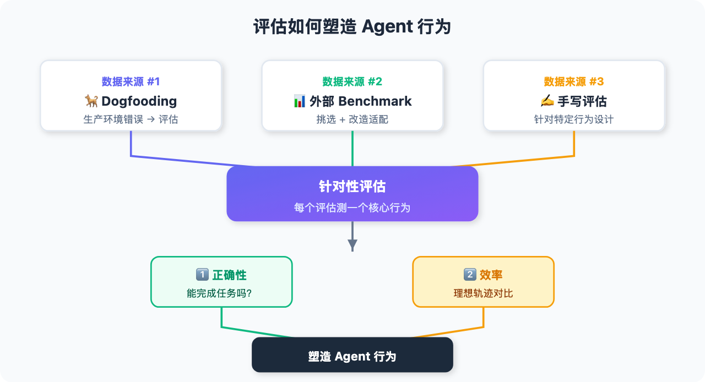
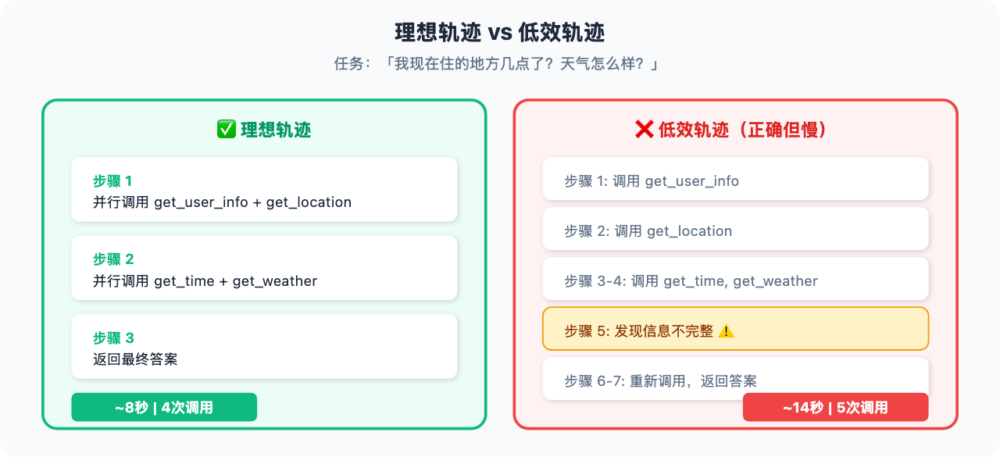

# 为什么你的 Agent 总翻车？评估方法可能从头就错了

> 📖 **本文解读内容来源**
>
> - **原始来源**：[How we build evals for Deep Agents](https://x.com/Vtrivedy10/status/xxxxx)
> - **来源类型**：技术博客（LangChain 官方）
> - **作者/团队**：Viv (@Vtrivedy10) + LangChain 团队
> - **发布时间**：2026年3月

---

大多数团队在构建 Agent 时，犯了一个致命错误：

**疯狂堆评估测试。**

几百个、甚至上千个测试用例往里加。以为分数越高，Agent 越强。

**真相恰恰相反**。

LangChain 团队在构建 Deep Agents 时发现：**更多 evals ≠ 更好 agents**。盲目堆测试只会给你一个"看起来很厉害"的假象——但 Agent 在生产环境照样翻车。

今天这篇文章，笔者带你拆解 LangChain 是如何设计评估体系的。核心只有一句话：

> **先想清楚你希望 Agent 表现出什么行为，再设计针对性的测试来衡量它。**

---

## 一、为什么评估这么重要？

**每个评估都是一个"行为向量"**——它会持续对你的 Agent 施加压力，塑造系统的行为。

举个例子：

你的 Agent 有个"高效读取文件"的评估测试没通过。你会怎么做？

大概率会去调整系统提示词，或者修改 `read_file` 工具的描述说明，让它更"听话"。

**这就是评估塑造行为的机制。**

所以，加评估时必须深思熟虑。不是"能测什么就测什么"，而是"我希望 Agent 在生产环境表现出什么行为，就测什么"。

LangChain 的做法：

1. **先定义行为**：列出生产环境中真正重要的行为（比如：跨多个文件检索内容、准确串联 5+ 次工具调用）
2. **再设计评估**：为每个行为创建可验证的测试
3. **持续追踪**：记录每次运行的 trace，分析失败模式，更新覆盖范围

---

## 二、评估数据从哪来？

LangChain 用三种方式策展评估数据：

### 2.1 自己狗粮自己吃（Dogfooding）

这是最有价值的来源。

团队每天在生产环境使用自己的 Agent（比如 Open SWE 做代码修复）。每次出错，都是写评估的好机会。

**关键是要能追踪 trace**。没有 trace，你根本不知道 Agent 哪儿翻的车。

LangChain 用 LangSmith 记录每一次交互的完整 trace。团队成员可以随时跳进去分析问题、定位原因、写测试修复。

### 2.2 从外部 Benchmark 挑选并改造

不是"拿来主义"——而是挑适合的，再改造。

| Benchmark | 测什么 | 怎么用 |
|----------|-------|-------|
| **BFCL** | 函数调用能力 | 挑选部分用例，适配自己的工具集 |
| **Terminal Bench 2.0** | 终端操作 | 通过 Harbor 在沙箱环境运行 |
| **FRAMES** | 检索能力 | 提取检索相关的任务 |

**注意**：分类时按"测什么能力"分，而不是按"来源"分。

比如 BFCL 和 FRAMES 都来自外部，但一个测工具调用，一个测检索——应该归到不同类别，而不是统一叫"外部 benchmark"。

### 2.3 手写"匠心评估"

有些行为太细，外部 benchmark 覆盖不到。

比如"Agent 是否正确并行化了工具调用？"这种，只能自己写。

LangChain 的做法：**每个评估都配一个 docstring**，解释它测什么能力、为什么重要。同时打上标签（如 `tool_use`），方便分组运行。

---

## 三、评估分类体系

下面这张图展示了评估如何塑造 Agent 行为的完整流程：





LangChain 按"测什么能力"分类，而不是"数据从哪来"：

LangChain 按"测什么能力"分类，而不是"数据从哪来"：

| 类别 | 测什么能力 | 示例 |
|-----|----------|------|
| **tool_use** | 工具调用正确性、并行化效率 | 是否正确串联 5+ 次调用？ |
| **file_operations** | 文件系统操作 | 跨多文件检索内容 |
| **memory** | 记忆持久化 | 是否正确保存/检索信息 |
| **retrieval** | 信息检索 | 从知识库中找对答案 |

这种分类让你能看到"中间视角"——不是一个总分，也不是逐条看，而是按能力维度聚合。

---

## 四、如何定义指标？

LangChain 的选择逻辑很清晰：**正确性优先，效率次之**。

### 4.1 第一道门槛：正确性

如果模型连任务都完不成，其他都是扯淡。

**正确性的衡量方式取决于任务类型**：

| 任务类型 | 衡量方法 |
|---------|---------|
| 有标准答案 | 精确匹配（如 BFCL） |
| 行为验证 | 自定义断言（如"是否并行调用了工具？"） |
| 语义判断 | LLM-as-a-judge（如"是否保存了正确信息？"） |

### 4.2 第二道门槛：效率

多个模型都通过正确性测试后，再看效率。

两个模型都能完成任务，但表现可能天差地别：

- 一个走了弯路，多调了几次工具
- 一个每步都对，但跑得慢

**效率差距会直接体现在生产环境：更高延迟、更高成本、更差体验。**

LangChain 衡量的效率指标：

| 指标 | 含义 |
|-----|------|
| **Latency Ratio** | 实际耗时 / 理想耗时 |
| **Solve Rate** | 完成速度（按预期步数归一化） |
| **Tool Call Efficiency** | 工具调用次数 / 理想调用次数 |

---

## 五、理想轨迹：评估效率的关键概念

这是整篇文章最有价值的洞察。

**什么是理想轨迹？**

> 完成任务的最优路径——最少必要步骤、无冗余动作。

看个例子：

**用户问："我现在住的地方几点了？天气怎么样？"**

❌ **低效轨迹（正确但低效）**：

```
步骤1: 调用 get_user_info
步骤2: 调用 get_location  
步骤3: 调用 get_time
步骤4: 调用 get_weather
步骤5: 返回结果（发现信息不完整）
步骤6: 重新调用 get_weather
步骤7: 返回最终答案
```

耗时：~14 秒，5 次工具调用，6 个步骤

✅ **理想轨迹**：

```
步骤1: 并行调用 get_user_info + get_location
步骤2: 并行调用 get_time + get_weather  
步骤3: 返回最终答案
```

耗时：~8 秒，4 次工具调用，3 个步骤

两条轨迹都"正确"，但效率差了近一倍。

**理想轨迹让你能评估"正确但低效"的情况**——这在生产环境非常重要。

下面这张图直观对比两种轨迹的差异：





---

## 六、如何在 CI 中运行评估？

LangChain 用 **pytest + GitHub Actions**，让评估在干净、可复现的环境中自动跑。

核心流程：

```bash
# 运行特定类别的评估
export LANGSMITH_API_KEY="lsv2_..."
uv run pytest tests/evals \
  --eval-category file_operations \
  --eval-category tool_use \
  --model baseten:nvidia/zai-org/GLM-5
```

**好处**：

- 每次 PR 都自动跑评估
- 可以按标签筛选，节省成本
- 结果可追溯、可对比

所有实现都在 **Deep Agents 仓库**开源，可以直接复用。

---

## 七、笔者的判断：评估是 Agent 的"方向盘"

读完这篇，笔者最大的感受是：**评估不是事后验证，而是事前设计**。

大多数团队的问题是：

1. **堆数量**：以为测试越多越好
2. **抄 benchmark**：不改造直接用
3. **只看正确性**：忽略效率差异

正确的做法是：

1. **先定义行为**：生产环境需要什么能力？
2. **再设计评估**：针对每个能力设计测试
3. **持续迭代**：从 trace 中学习，更新覆盖

LangChain 用"理想轨迹"这个概念，把"正确但低效"变成了可量化的问题。这在 Agent 开发中非常实用——**大多数翻车不是"做错了"，而是"做慢了"**。

不得不感叹一句：**评估体系决定了 Agent 的上限，就像方向盘决定了车的方向。**

---

## 参考

- [How we build evals for Deep Agents - LangChain Blog](https://blog.langchain.dev/how-we-build-evals-for-deep-agents/)
- [Deep Agents - GitHub](https://github.com/langchain-ai/deep-agents)
- [Terminal Bench 2.0](https://github.com/xxxxx)
- [BFCL - Berkeley Function Calling Leaderboard](https://xxxxx)