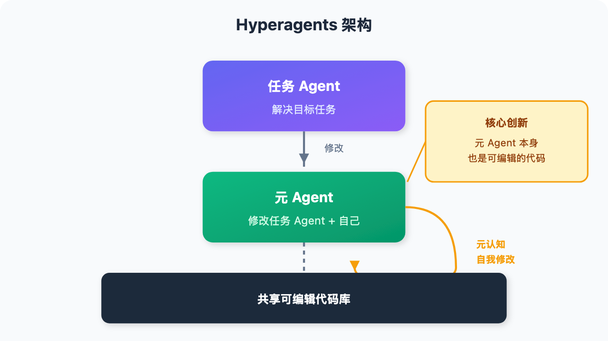

# AI 能自己改进自己吗？Meta 的 Hyperagents 给出了答案

> 📖 **本文解读内容来源**
>
> - **原始来源**：[Hyperagents (arXiv:2603.19461)](https://arxiv.org/abs/2603.19461)
> - **来源类型**：学术论文
> - **作者/团队**：Jenny Zhang, Bingchen Zhao, Wannan Yang, Jakob Foerster, Jeff Clune, Minqi Jiang, Sam Devlin, Tatiana Shavrina (Meta AI Research)
> - **发布时间**：2026年3月

---

想象一下：一个 AI 系统能够**自己重写自己的代码**，让它变得更强。

不是人类工程师给它打补丁，而是它自己发现自己哪里不够好，然后自己修改自己。

这听起来像是科幻小说，但 Meta AI 的 **Hyperagents** 论文正在把这个设想变成现实。

更关键的是：Hyperagents 不只是"自己改自己"——它能**改进"如何改进自己"这个过程本身**。

---

## 一、为什么"自我改进"这么难？

AI 自我改进的概念并不新鲜。但现有方案都有一个致命缺陷：

**它们依赖人类预设的"元级机制"**。

什么意思？

想象你在教一个学生。传统的方法是：你给他一套"学习方法"（比如做笔记、刷题），他只能在你给的框架内改进。

他可以更努力地做笔记、更高效地刷题，但他**无法发明一种全新的学习方法**。

**元级机制是固定的，只是执行层面的优化。**

这就是为什么现有的自我改进 AI 系统进步速度有上限——它们被"锁死"在人类设计好的改进框架里。

---

## 二、DGM 的突破与局限

2025年，Darwin Gödel Machine (DGM) 取得了重要突破。

DGM 的核心思想是：

1. **生成变体**：创建自己的修改版本
2. **评估变体**：测试哪个版本更强
3. **保留优胜者**：让更强的版本继续迭代

关键洞察：**编程任务和自我修改任务是同一件事**——都是写代码。所以编程能力的提升，可以直接转化为自我修改能力的提升。

DGM 在编程领域展现了"开放式自我改进"——进步没有明显天花板。

**但有个问题**：这种"对齐"只存在于编程领域。

你想让 DGM 改进数学推理？改进图像识别？抱歉，它不一定擅长这些领域，也不一定能把这些能力迁移回"如何改进自己"。

**领域特定的对齐假设，限制了 DGM 的适用范围。**

---

## 三、Hyperagents：让"元级"本身变得可编辑

Meta 的 Hyperagents 做了一件简单但深刻的事：

**把"如何改进自己"这个过程本身，也变成可以修改的代码。**

传统架构：

```
任务 Agent ──── 解决目标任务
    ↑
元 Agent ──── 修改任务 Agent（固定机制）
```

Hyperagents 架构：





**关键创新**：元 Agent 本身是一个**可编辑的程序**。它可以修改任务 Agent，也可以修改自己修改 Agent 的方式。

这意味着什么？

如果 Hyperagents 发现"当前的修改策略效率太低"，它可以**发明一种全新的修改策略**。

不是"用现有的方法改得更快"，而是"换一种方法来改"。

---

## 四、DGM-H：消除领域对齐假设

Hyperagents 论文将这个框架实例化为 **DGM-H**（DGM-Hyperagents）。

核心设计：

| 组件 | 功能 |
|-----|------|
| **任务 Agent** | 执行目标任务（数学、推理、编程等） |
| **元 Agent** | 修改任务 Agent 和自己 |
| **共享代码库** | 两者都在一个可编辑的程序里 |

**关键点**：不再假设"任务能力提升 = 自我修改能力提升"。

DGM-H 可以在**任何可计算任务**上工作：

- 数学推理？可以
- 图像分类？可以
- 游戏策略？可以
- 文本生成？可以

**自我改进的能力不再被领域绑定。**

---

## 五、实验结果：元级改进真的有效

论文在多个领域测试了 DGM-H，包括：

- 数学问题求解
- 算法设计
- 逻辑推理

**核心发现**：

1. **DGM-H 持续改进**：随着迭代次数增加，任务表现稳步提升
2. **超越基线**：显著优于没有自我改进或开放式探索的方案
3. **超越现有系统**：比之前的自我改进系统更强

**最有意思的发现**：

DGM-H 不仅改进任务表现，还**改进了"生成新 Agent 的过程本身"**：

- 发明了**持久记忆机制**，让 Agent 记住有用的经验
- 开发了**性能追踪系统**，更高效地评估变体
- 这些**元级改进可以跨领域迁移**，在不同任务上都能派上用场

---

## 六、这意味着什么？

### 6.1 元认知能力的出现

Hyperagents 展示了一种原始的"元认知"能力：

> **它不只是思考问题，还在思考"如何思考问题"。**

当它发现某种策略效率低下时，它不会只是"更努力地执行这种策略"，而是会**换一种策略**。

这是从"优化"到"发明"的质变。

### 6.2 跨域能力积累

传统系统的能力通常是"孤岛式"的：你在数学上学到的技巧，不一定能用于编程。

但 Hyperagents 的**元级改进是跨领域通用的**：

- 在数学任务上学到的"如何管理记忆"，可以迁移到推理任务
- 在编程任务上学到的"如何追踪性能"，可以迁移到游戏任务

**元级能力在积累，而不是消耗。**

### 6.3 开放式进步的雏形

论文标题用了 "open-ended" 这个词。

开放式进化系统的特点是：**没有预设的终点，进步可以无限持续**。

Hyperagents 展示了这种可能——

它不只是搜索更好的解决方案，而是**持续改进"如何搜索解决方案"这件事本身**。

---

## 七、笔者的判断：这是 AI 自主性的关键一步

读完这篇论文，我最大的感受是：**Hyperagents 触碰到了 AI 自主性的本质**。

现有的大多数 AI 系统都是"被动执行者"——

- 人类定义任务
- 人类设计架构
- 人类优化过程

AI 只是执行。

Hyperagents 的不同之处在于：**它开始参与到"定义和优化"这个过程本身**。

不是完全自主——它仍然从人类设计的初始状态出发。

但它展示了**从"执行者"到"参与者"的转变**。

当 AI 可以改进"如何改进自己"时，人类工程师的角色就开始变化了——

我们不再只是告诉它"做什么"，而是要思考"如何引导它安全地探索可能性空间"。

**不得不感叹一句：自我改进的 AI，可能比我们想象的更近。**

---

## 八、安全提醒

论文和 GitHub 仓库都明确提醒：

> **Hyperagents 会执行模型生成的不受信任的代码。存在安全风险。**

在使用这类系统时，需要：

1. 在沙箱环境中运行
2. 限制代码执行的权限
3. 对生成的代码进行安全审计
4. 持续监控异常行为

自我改进系统在带来强大能力的同时，也带来了新的安全挑战。

---

## 参考

- [Hyperagents - arXiv](https://arxiv.org/abs/2603.19461)
- [Hyperagents - GitHub](https://github.com/facebookresearch/Hyperagents)
- [Meta AI Research Publication](https://ai.meta.com/research/publications/hyperagents/)