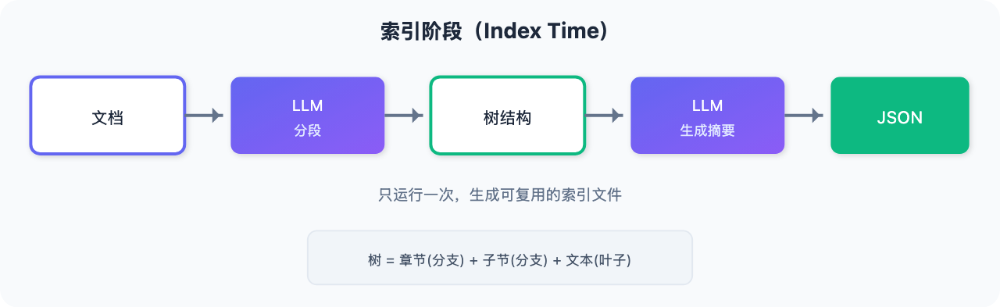
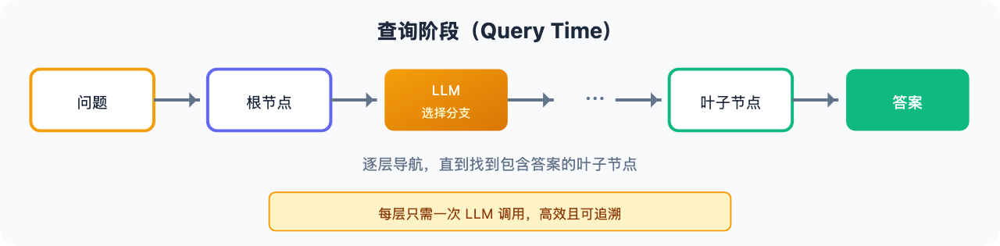

# 不用向量数据库也能做 RAG？这个思路绝了

> 📖 **本文解读内容来源**
>
> - **原始来源**：[Building Vectorless RAG System](https://x.com/TheVixhal/status/2037236399691489797)
> - **作者**：vixhaℓ (@TheVixhal)
> - **GitHub**：[vixhal-baraiya/pageindex-rag](https://github.com/vixhal-baraiya/pageindex-rag)
> - **发布时间**：2026年3月

---

大多数 RAG 系统都依赖向量数据库。你把文档切成块，算出嵌入向量，存进向量数据库，然后查询时做相似度搜索。

**但有没有想过：不用向量，也能做 RAG？**

这篇文章介绍了一个完全不同的思路：**PageIndex**——一个基于分层页面索引的"无向量"RAG 系统。不使用嵌入，不使用相似度搜索，而是让 LLM 像人类翻书一样"导航"文档。

---

## 一、核心思想：像翻书一样检索

想想你平时怎么在教科书里找信息。

**你不会从头读到尾**。你会：

1. 打开目录
2. 找到相关章节
3. 看章节里的小节
4. 直接跳到需要的那一页

**PageIndex 做的事完全一样**：

1. 把文档转成一棵"树"（目录结构）
2. 每个分支是一个章节
3. 每个叶子节点是实际文本
4. 查询时，LLM 逐层导航这棵树

**没有向量，没有相似度搜索，只有结构化导航。**

---

## 二、系统架构

PageIndex 的工作分为两个阶段：

### 索引阶段（只运行一次）





### 查询阶段（每次提问运行）





---

## 三、完整实现步骤

### 步骤 1：定义节点结构

每个文档章节变成一个 `PageNode`：

```python
@dataclass
class PageNode:
    title: str           # 章节标题
    content: str         # 原始文本（叶子节点填充）
    summary: str         # LLM 生成的摘要
    depth: int           # 深度：0=根, 1=章节, 2=子节
    children: list       # 子节点
    parent: PageNode     # 父节点
```

### 步骤 2：解析文档为树

**核心逻辑**：

1. 把整个文档发给 LLM，分割成顶层章节
2. 对于超过 300 词的长章节，再发给 LLM 分割成子节
3. 短章节直接作为叶子节点

```python
def parse_document(text: str) -> PageNode:
    root = PageNode(title="root", ...)
    
    for item in _segment(text):  # LLM 分段
        node = PageNode(title=item["title"], ...)
        
        if len(content.split()) > 300:  # 长章节
            subsections = _segment(content)  # 再分割
            for sub in subsections:
                node.children.append(PageNode(...))
        else:
            node.content = content  # 短章节作为叶子
            
        root.children.append(node)
    
    return root
```

**关键阈值**：`SUBSECTION_THRESHOLD = 300` 词

### 步骤 3：生成摘要（自底向上）

**后序遍历**：先处理子节点，再处理父节点

```python
def build_summaries(node: PageNode):
    # 先处理所有子节点
    for child in node.children:
        build_summaries(child)
    
    if node.is_leaf():
        # 叶子：总结自己的内容
        node.summary = _summarize(node.content)
    else:
        # 内部节点：总结子节点的摘要
        children_text = "\n".join(f"[{c.title}]: {c.summary}" for c in node.children)
        node.summary = _summarize(children_text)
```

**为什么后序遍历？** 保证每个子节点都有摘要后，父节点才能基于子节点摘要生成自己的摘要。

### 步骤 4：树搜索检索

**核心流程**：从根开始，逐层选择分支，直到叶子

```python
def retrieve(query: str, root: PageNode) -> str:
    node = root
    while not node.is_leaf():
        node = _pick_child(query, node)  # LLM 选择分支
    return node.content
```

**LLM 选择分支的逻辑**：

```python
def _pick_child(query: str, node: PageNode) -> PageNode:
    # 展示所有子节点的摘要
    options = "\n".join(
        f"{i+1}. [{c.title}]: {c.summary}"
        for i, c in enumerate(node.children)
    )
    
    prompt = f"""你正在导航文档树来回答问题。
    
当前章节: "{node.title}"
问题: {query}

子节点:
{options}

哪个子节点最可能包含答案？只回复数字。"""
    
    response = client.chat.completions.create(...)
    index = int(response.choices[0].message.content) - 1
    return node.children[index]
```

### 步骤 5：保存和加载索引

```python
def save(node: PageNode, path: str):
    # 递归序列化为 JSON
    
def load(path: str) -> PageNode:
    # 从 JSON 反序列化为树
```

**索引只需构建一次，之后反复使用。**

---

## 四、索引长什么样？

运行 `build_index` 后，`index.json` 大致如下：

```json
{
  "title": "root",
  "summary": "文档涵盖退货、运输选项和账户设置。",
  "children": [
    {
      "title": "退货和退款",
      "summary": "退款在收到退货后 14 天内处理。",
      "content": "我们接受 30 天内的退货...",
      "children": []
    },
    {
      "title": "运输选项",
      "summary": "涵盖国内（3-5天）和国际运输（7-14天）。",
      "children": [
        {
          "title": "国内运输",
          "summary": "标准配送通过 USPS 需 3-5 个工作日。",
          "content": "我们通过 USPS 进行国内运输...",
        },
        {
          "title": "国际运输",
          "summary": "国际订单通过 DHL 运输，7-14 天送达。",
          "content": "国际运输覆盖 50+ 个国家...",
        }
      ]
    }
  ]
}
```

**注意**：
- 短章节（"退货和退款"）作为深度 1 的叶子
- 长章节（"运输选项"）成为内部节点，有深度 2 的子节点

---

## 五、与传统向量 RAG 的对比

| 维度 | 向量 RAG | PageIndex |
|-----|---------|-----------|
| **存储** | 向量数据库 | JSON 文件 |
| **检索方式** | 相似度搜索 | 树导航 |
| **嵌入模型** | 必需 | 不需要 |
| **可解释性** | 黑盒 | 路径可追溯 |
| **更新成本** | 增删向量 | 重建树 |
| **适用场景** | 大规模文档 | 结构化文档 |

---

## 六、常见问题与解决

### 问题 1：LLM 总选错分支

**原因**：摘要太模糊

**解决**：用更强的模型生成摘要，或在提示词中要求更多细节

### 问题 2：LLM 把章节切在不合适的位置

**原因**：长文档分段时切断了语义

**解决**：
- 增加 `max_tokens`
- 或预先把文档切成 ~3000 词的块再分段

### 问题 3：叶子内容太长

**原因**：`SUBSECTION_THRESHOLD` 设置太高

**解决**：降低阈值，让更多章节被分割成子节

---

## 七、完整代码结构

```
pageindex-rag/
├── pageindex/
│   ├── __init__.py
│   ├── node.py       # PageNode 定义
│   ├── parser.py     # 文档解析
│   ├── indexer.py    # 摘要生成
│   ├── retriever.py  # 树搜索检索
│   └── storage.py    # JSON 序列化
├── main.py           # 入口
└── document.md       # 示例文档
```

---

## 八、笔者的判断：简单但有效的替代方案

PageIndex 展示了一个重要的思路：**不是所有问题都需要向量搜索**。

对于结构化文档（手册、FAQ、政策文档），"导航式检索"可能比"相似度搜索"更自然：

1. **可解释性强**：你能看到 LLM 为什么选择某个分支
2. **无需向量基础设施**：一个 JSON 文件就够了
3. **查询成本低**：不需要计算查询向量

**但局限性也存在**：

- 非结构化文档（新闻、对话记录）可能不适合
- 文档更新需要重建整个树
- 大规模文档可能需要更深的树，增加导航步数

**不得不感叹一句：有时候最简单的方案，就是最有效的方案。**

---

## 参考

- [GitHub - pageindex-rag](https://github.com/vixhal-baraiya/pageindex-rag)
- [作者 Twitter](https://x.com/TheVixhal)