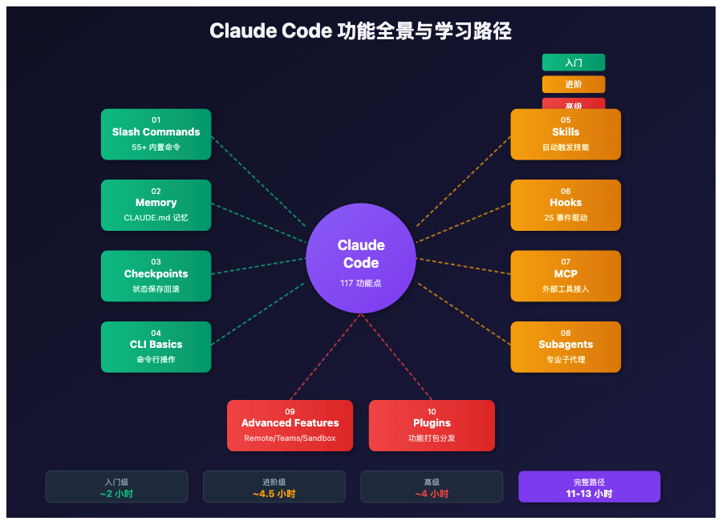

# 周末掌握 Claude Code——一份 3100 Star 的实战指南

> 📖 **本文解读内容来源**
>
> - **原始来源**：[claude-howto](https://github.com/luongnv89/claude-howto)
> - **来源类型**：GitHub 仓库
> - **作者/团队**：luongnv89
> - **Star 数**：3100+ | **Fork 数**：326
> - **主要语言**：Markdown | **最新版本**：v2.2.0 (2026.03)
> - **许可证**：MIT

---



你装好了 Claude Code，跑了几条命令。然后呢？

官方文档把每个功能都讲了一遍——但没告诉你怎么把它们**串起来**。你知道有 slash commands、hooks、MCP、subagents，但不知道该先学哪个，更不知道怎么组合成真正省时间的自动化工作流。

**结果就是：你只用了 Claude Code 10% 的能力。**

今天介绍的这个项目，就是来帮你解决这个问题的。3100 多个开发者已经给它点了 Star，原因很简单：它不是功能说明书，而是**从入门到精通的完整实战教程**。

---

## 一、这个项目是什么？

一句话概括：**一份教你"玩转"Claude Code 全部功能的结构化教程。**

它把 Claude Code 的所有特性拆成了 10 个模块，每个模块都有：
- Mermaid 架构图，让你理解"为什么"而不是只会"怎么用"
- 生产级的配置模板，复制就能用
- 渐进式学习路径，从入门到高级 11-13 小时搞定

**和官方文档的区别**：

| 维度 | 官方文档 | 这个教程 |
|-----|---------|---------|
| 格式 | 功能说明 | 视觉教程 + Mermaid 图 |
| 深度 | 描述特性 | 讲底层原理 |
| 示例 | 基础片段 | 生产级模板 |
| 结构 | 按功能组织 | 渐进式学习路径 |
| 自测 | 无 | 内置 Quiz 找知识盲区 |

---

## 二、Claude Code 到底有多少功能？

说实话，笔者也是看完这个项目才知道 Claude Code 有这么多能力。

**总结一下这个教程覆盖的内容**：

| 特性类型 | 内置数量 | 示例模板 | 总计 |
|---------|---------|---------|------|
| Slash Commands | 55+ | 8 | 63+ |
| Subagents | 6 | 10 | 16 |
| Skills | 5 个内置 | 4 | 9 |
| Plugins | - | 3 | 3 |
| MCP Servers | 1 | 8 | 9 |
| Hooks | 25 个事件 | 7 | 7 |
| Memory | 7 种类型 | 3 | 3 |
| **总计** | **99** | **43** | **117** |

你没看错，**117 个功能点**。大多数开发者可能只知道其中 10-20 个。

---

## 三、10 个模块都教什么？

项目把学习路径分成了 10 个模块，按难度递进：

### 入门级（~2 小时）

| 模块 | 时间 | 核心内容 |
|-----|------|---------|
| **Slash Commands** | 30 分钟 | 自定义命令快捷方式 |
| **Memory** | 45 分钟 | CLAUDE.md 让 AI 记住项目上下文 |
| **Checkpoints** | 45 分钟 | 状态保存与回滚 |
| **CLI Basics** | 30 分钟 | 命令行基础操作 |

### 进阶级（~4.5 小时）

| 模块 | 时间 | 核心内容 |
|-----|------|---------|
| **Skills** | 1 小时 | 自动触发的技能包 |
| **Hooks** | 1 小时 | 事件驱动的自动化 |
| **MCP** | 1 小时 | 外部工具接入（GitHub、数据库等） |
| **Subagents** | 1.5 小时 | 专业分工的子代理团队 |

### 高级（~4 小时）

| 模块 | 时间 | 核心内容 |
|-----|------|---------|
| **Advanced Features** | 2-3 小时 | Remote Control、Agent Teams、Sandboxing |
| **Plugins** | 2 小时 | 功能打包与分发 |

**学习建议**：不用一口气学完。先花 15 分钟复制几个 slash command 试试效果，感觉有用再往下深入。

---

## 四、几个笔者认为最有价值的功能

### 4.1 Memory：让 AI "记住"你的项目

这是最容易被忽略但最实用的功能。

**场景**：每次开新会话，你都得重新解释项目背景、代码规范、技术栈。有了 Memory，这些信息自动加载。

```markdown
# CLAUDE.md 示例
## 项目背景
- 这是一个电商后台系统，使用 Next.js + Prisma
- 代码风格：ESLint + Prettier，提交信息遵循 Conventional Commits

## 重要约定
- 所有 API 路由放在 /app/api/ 下
- 数据库迁移前必须先备份

## 常见任务
- 新增功能：先写测试，再写实现
- Bug 修复：先复现，再定位，最后修复
```

把这个文件放到项目根目录，每次会话自动生效。

### 4.2 Hooks：事件驱动自动化

**Hooks** 就像是 Claude Code 的"插件系统"，但更轻量——当特定事件发生时，自动执行你的脚本。

**例子**：每次写文件后自动格式化代码

```json
{
  "hooks": {
    "PostToolUse": [
      {
        "matcher": "Write",
        "command": "~/.claude/hooks/format-code.sh"
      }
    ]
  }
}
```

**支持的事件**：
- `PreToolUse`：工具执行前
- `PostToolUse`：工具执行后
- `UserPromptSubmit`：用户发送消息前
- `SessionStart`：会话开始时
- `Stop`：响应完成时

一共 25 种事件，可以组合出各种自动化流程。

### 4.3 Subagents：专业分工的 AI 团队

**Subagent（子代理）** 就像是雇佣了不同专业的"助手"——每个专注一件事。

**内置的 6 个子代理**：

| 代理 | 擅长什么 |
|-----|---------|
| **general-purpose** | 多步骤任务、研究 |
| **Plan** | 架构设计、实施规划 |
| **Explore** | 代码库探索（用 Haiku，更快更便宜） |
| **Bash** | 命令行操作 |
| **Claude Code Guide** | 帮助文档查询 |
| **statusline-setup** | 状态栏配置 |

**你还可以自定义**：

```markdown
# .claude/agents/code-reviewer.md
---
name: code-reviewer
description: 综合代码质量审查
model: sonnet-4.6
tools:
  - Read
  - Glob
  - Grep
---

你是一位资深代码审查专家。审查时关注：
1. 代码可读性
2. 潜在 Bug
3. 性能问题
4. 安全漏洞
```

### 4.4 MCP：让 Claude 接入任何外部工具

**MCP（Model Context Protocol）** 是 Anthropic 推出的标准协议，让 Claude 能"看见"外部世界。

**常用 MCP 服务器**：

| 服务器 | 能力 |
|-------|------|
| GitHub | PR 管理、Issue、代码操作 |
| PostgreSQL | 数据库查询 |
| Filesystem | 高级文件操作 |
| Slack | 团队通知 |
| Stripe | 支付数据分析 |

**一键安装 GitHub MCP**：

```bash
export GITHUB_TOKEN="your_token"
claude mcp add github -- npx -y @modelcontextprotocol/server-github
```

---

## 五、5 分钟快速上手

项目提供了一键安装脚本：

```bash
# 1. 克隆项目
git clone https://github.com/luongnv89/claude-howto.git
cd claude-howto

# 2. 创建目录
mkdir -p .claude/{commands,agents,skills} ~/.claude/{hooks,skills}

# 3. 安装所有功能
cp 01-slash-commands/*.md .claude/commands/
cp 02-memory/project-CLAUDE.md ./CLAUDE.md
cp -r 03-skills/* ~/.claude/skills/
cp 04-subagents/*.md .claude/agents/
cp 06-hooks/*.sh ~/.claude/hooks/
chmod +x ~/.claude/hooks/*.sh
```

**最小化体验（15 分钟）**：

```bash
# 只装一个 slash command 试试
mkdir -p .claude/commands
cp 01-slash-commands/optimize.md .claude/commands/

# 在 Claude Code 里输入
# /optimize
```

---

## 六、这个教程的几个亮点

### 亮点 1：Mermaid 图解原理

不是干巴巴的文字，每个功能都有架构图。

比如 Hooks 的工作流程：

```
用户输入 → UserPromptSubmit Hook → 
Claude 处理 → PreToolUse Hook → 
工具执行 → PostToolUse Hook → 
返回结果 → Stop Hook
```

一眼就能理解事件触发的顺序。

### 亮点 2：内置自测系统

每个模块学完后，可以运行 Quiz 检验掌握程度：

```bash
/lesson-quiz hooks    # 测试 Hooks 知识
/self-assessment      # 完整能力评估
```

这比"看完就忘"的教程强太多了。

### 亮点 3：持续同步官方更新

项目标注了支持的 Claude Code 版本：v2.1.84+。每次 Claude Code 更新，这个教程也会同步更新。

**2026 年 3 月新增功能**：
- Remote Control：远程控制 API
- Agent Teams：多代理协作
- Auto Mode：全自动操作（无需确认）
- Chrome Integration：浏览器自动化
- Voice Dictation：语音输入

---

## 七、笔者的判断

说实话，这个教程做了一件官方应该做但没做好的事：**把分散的功能整合成可执行的学习路径**。

**几点看法**：

1. **不是替代官方文档**：官方文档是"字典"，这个教程是"教材"。先学教材，再查字典，这才是正确姿势。

2. **模板质量参差**：部分模板偏通用，特定场景可能需要自己改。但作为起点已经足够好了。

3. **学习曲线友好**：从 slash commands 这种 30 分钟入门的模块开始，降低了心理门槛。

4. **社区驱动**：326 个 Fork，说明很多团队在用自己的配置反哺社区。这是开源项目健康度的标志。

**不得不感叹一句**：好的教程不是告诉你"有什么"，而是告诉你"怎么组合"。这 117 个功能点单看都不复杂，但组合起来就是 90% 的开发者用不到的那 90% 的能力。

---

## 参考

- [claude-howto GitHub 仓库](https://github.com/luongnv89/claude-howto)
- [Claude Code 官方文档](https://code.claude.com/docs/en/overview)
- [MCP 协议规范](https://modelcontextprotocol.io)
- [项目学习路线图](https://github.com/luongnv89/claude-howto/blob/main/LEARNING-ROADMAP.md)