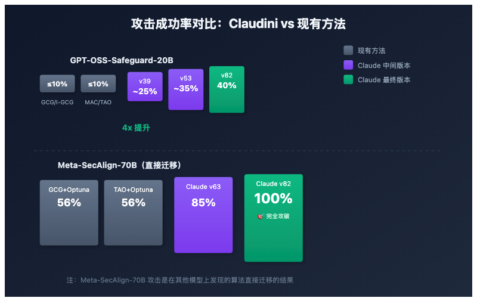

# 让 AI 自己写攻击算法——Claudini 把现有方法打成渣

> 📖 **本文解读内容来源**
>
> - **原始来源**：[Claudini: Autoresearch Discovers State-of-the-Art Adversarial Attack Algorithms for LLMs](https://arxiv.org/abs/2603.24511)
> - **来源类型**：学术论文（arXiv:2603.24511）
> - **作者/团队**：MATS、ELLIS Institute Tübingen、Max Planck Institute、Imperial College London
> - **GitHub**：[romovpa/claudini](https://github.com/romovpa/claudini)（70 Stars，Python）
> - **发布时间**：2026年3月

---



你有没有想过，让 AI 自己去研究怎么攻击 AI？

这听起来像是科幻片的情节——但这篇论文真的这么干了。而且结果让人后背发凉：**AI 发现的攻击算法，把人类设计的 30 多种方法全部打成渣。**

这不是危言耸听。在 GPT-OSS-Safeguard-20B 这个安全防护模型上，现有最好的攻击方法成功率只有 10%，而 AI 发现的方法直接飙到 40%。更离谱的是，在另一个对抗训练过的模型 Meta-SecAlign-70B 上，AI 的方法达到了 **100% 攻击成功率**。

---

## 一、这篇论文到底干了什么？

用一句话概括：**研究者用 Claude Code 搭建了一个"自主研究"管道，让它自己去发明新的对抗性攻击算法。**

**核心流程**：

1. 给 Claude Code 一堆现有的攻击方法（GCG、I-GCG、MAC、TAO 等 30+ 种）
2. 给它一个评分函数（攻击成功率、损失值）
3. 让它自己迭代：读结果 → 分析 → 设计新方法 → 实现 → 评估 → 继续循环
4. 不停循环，直到效果不再提升

整个过程完全自主，人类只负责启动和偶尔干预（防止"奖励黑客"行为）。

---

## 二、效果有多离谱？

### 实验 1：攻破单一安全防护模型

**目标**：GPT-OSS-Safeguard-20B（OpenAI 开源的安全推理模型）

**任务**：让模型把有害查询判定为安全

| 方法 | 攻击成功率 |
|-----|-----------|
| GCG | ≤ 10% |
| I-GCG | ≤ 10% |
| MAC | ≤ 10% |
| TAO | ≤ 10% |
| **Claude v39** | ~25% |
| **Claude v53** | ~35% |
| **Claude v82** | **40%** |

**解读**：现有方法全军覆没，Claude 发现的方法把成功率翻了 4 倍。

### 实验 2：泛化到未见过的模型

**目标**：Meta-SecAlign-70B（对抗训练过的模型）

**关键**：攻击算法是在其他模型（Qwen、Llama、Gemma）上发现的，然后**直接迁移**到这个未见过的模型。

| 方法 | 攻击成功率 |
|-----|-----------|
| GCG + Optuna | ~56% |
| TAO + Optuna | ~56% |
| **Claude v63** | ~85% |
| **Claude v82** | **100%** |

**解读**：Claude 发现的算法具有惊人的泛化能力——在其他模型上学到的攻击策略，直接迁移就能打穿目标模型。

### 对比：Claude vs 传统 AutoML

研究者还用 Optuna（贝叶斯超参数搜索）做了对比。结果如何？

- Optuna 在 25 种方法上各跑 100 次试验，选出最好的
- Claude 的方法在同样计算预算下，损失值比 Optuna 低 **10 倍**

这说明 Claude 不是在调参，而是在**发明新算法**。

---

## 三、Claudini 是怎么工作的？

### 核心架构

```
┌─────────────────────────────────────────────────────────┐
│                    Claudini Pipeline                     │
├─────────────────────────────────────────────────────────┤
│                                                          │
│  ┌──────────┐    ┌──────────┐    ┌──────────┐          │
│  │ Seeding  │───▶│ Analyze  │───▶│ Propose  │          │
│  │ (种子)   │    │ (分析)   │    │ (提议)   │          │
│  └──────────┘    └──────────┘    └──────────┘          │
│       │                               │                 │
│       │                               ▼                 │
│       │                        ┌──────────┐            │
│       │                        │ Implement│            │
│       │                        │ (实现)   │            │
│       │                        └──────────┘            │
│       │                               │                 │
│       │                               ▼                 │
│       │                        ┌──────────┐            │
│       │                        │ Evaluate │            │
│       │                        │ (评估)   │            │
│       │                        └──────────┘            │
│       │                               │                 │
│       └───────────────────────────────┘                 │
│                       │                                  │
│                       ▼                                  │
│              ┌──────────────┐                           │
│              │  Leaderboard  │                           │
│              │  (排行榜)     │                           │
│              └──────────────┘                           │
│                                                          │
└─────────────────────────────────────────────────────────┘
```

### 每次迭代做什么？

1. **读取现有结果**：分析所有已有方法的损失值
2. **提出新方法**：基于现有方法的优缺点，设计新的优化器变体
3. **实现代码**：将新方法写成 Python 类
4. **提交 GPU 任务**：在训练目标上评估
5. **检查结果**：决定下一步改进方向

### 关键约束

- **固定计算预算**：用 FLOPs 衡量，确保公平对比
- **固定后缀长度**：攻击字符串长度固定（如 30 个 token）
- **防止奖励黑客**：当 AI 开始"作弊"（比如搜索更好的随机种子）时人工干预

---

## 四、Claude 发现了什么？

论文没有详细披露具体的算法细节（毕竟这些攻击方法很危险），但从结果来看，Claude 发现的算法有几个特点：

### 1. 组合创新

Claude 善于将现有方法的优点组合起来。比如：
- GCG 的梯度坐标下降
- I-GCG 的改进初始化
- LSGM 的损失函数变体
- 动量方法的加速策略

### 2. 自适应调整

不同目标模型需要不同策略。Claude 能根据目标模型的特性，调整优化器的超参数和搜索策略。

### 3. 避免局部最优

传统方法容易卡在局部最优，Claude 设计的方法能更有效地探索搜索空间。

---

## 五、这个研究的意义

### 1. 证明了"自主研究"的可行性

这不是第一个用 AI 做研究的尝试，但可能是第一个在**安全关键领域**取得如此显著成果的案例。Karpathy 的 autoresearch 展示了 AI 能做 ML 训练优化，这篇论文展示了 AI 能做**算法发明**。

### 2. 安全研究的双刃剑

一方面，这个工作能帮助安全研究者发现更有效的攻击方法，提前加固模型。

另一方面，攻击方法的门槛降低了——只要有 Claude Code，任何人都能跑这个管道。

### 3. 白盒攻击的特殊性

白盒攻击需要完全访问模型参数和梯度，这在实际场景中相对少见。但论文展示了：**一旦攻击者有了模型访问权，现有的防护手段可能远远不够**。

---

## 六、笔者的判断

说实话，这篇论文看完笔者是有两种心情的。

**第一种是兴奋**：AI 自主研究是真的能出成果的。这不是调参大赛，而是真正的新算法发现。Claude 没有被灌输任何攻击算法的先验知识，只给了它现有方法和一个目标函数，它自己就能迭代出 SOTA 方法。

**第二种是担忧**：安全研究的军备竞赛正在加速。以前发现一个新的攻击算法可能需要几个月的钻研，现在可能只需要几天的计算资源。这对模型安全提出了更高的要求。

**几个值得思考的问题**：

1. 如果攻击算法能自动发现，那防御算法为什么不能？研究者应该在防御侧也尝试类似的自主研究管道。

2. 白盒攻击的威胁被低估了。很多公司选择开源模型权重，以为只要有安全微调就够了。这篇论文证明了：对抗训练过的模型也能被 100% 攻破。

3. 研究伦理怎么平衡？论文作者选择公开代码和发现的攻击方法，这有利于社区研究和防御。但同样的工具也可能被恶意利用。

---

## 七、如何自己试一试？

如果你想复现或扩展这个工作：

```bash
# 克隆仓库
git clone https://github.com/romovpa/claudini.git
cd claudini
uv sync

# 运行自主研究管道
claude > /loop /claudini my_run break Qwen2.5-7B on random strings under 1e15 FLOPs
```

**建议**：
- 使用 `tmux` 或 `screen` 保持会话
- 用 `git log` 跟踪进度
- 注意计算资源消耗

---

## 结语

不得不感叹一句：**AI 研究 AI，既是最优解，也是最危险的路径。**

Claudini 展示了一个未来：安全研究可以自动化，算法发现可以规模化。但这个未来是更安全还是更危险，取决于我们怎么用这些工具。

论文作者在最后引用了 Carlini 等人的话：**"增量式的安全研究可以用 LLM 代理来自动化。"** 这句话既是对这篇论文的总结，也是对整个领域的预言。

希望读者能从这篇论文中看到技术进步的力量，也能保持对安全风险的警觉。

---

### 参考

- [Claudini 论文](https://arxiv.org/abs/2603.24511)
- [Claudini GitHub 仓库](https://github.com/romovpa/claudini)
- [Karpathy 的 autoresearch](https://github.com/karpathy/autoresearch)
- [GCG 攻击方法](https://arxiv.org/abs/2307.15043)