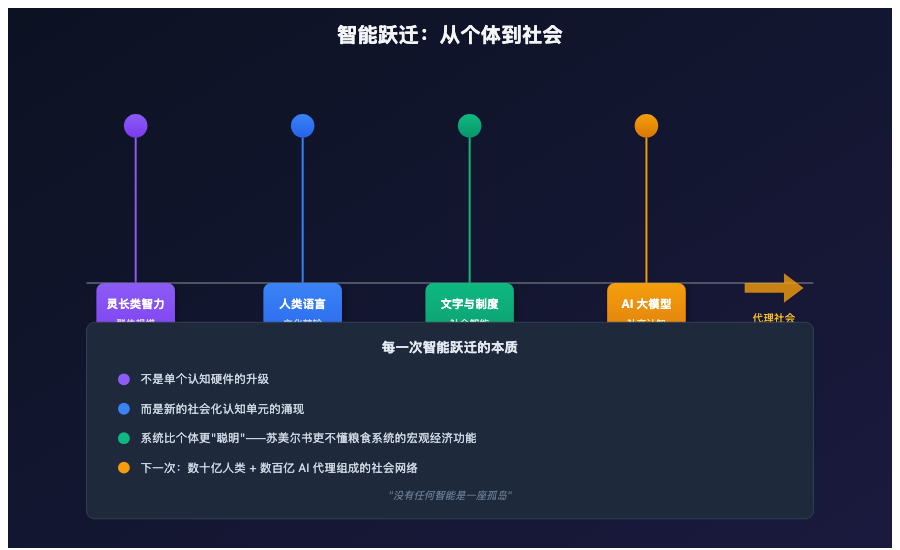

# 别再想什么"奇点"了——下一代智能爆炸是社会性的

> 📖 **本文解读内容来源**
>
> - **原始来源**：[Agentic AI and the next intelligence explosion](https://arxiv.org/abs/2603.20639)
> - **来源类型**：学术论文（arXiv:2603.20639）
> - **作者/团队**：Google Paradigms of Intelligence Team（James Evans、Benjamin Bratton、Blaise Agüera y Arcas）
> - **机构**：Google、芝加哥大学、Santa Fe Institute、UCSD
> - **发布时间**：2026年3月

---

几十年来，我们被一个画面洗脑了：**AI"奇点"——一个超级智能独自进化成神。**

科幻小说这么写，科技大佬这么预言，连学术界的主流叙事也是这个调子。但如果你仔细看看进化史、看看智能的本质，你会发现这个假设从一开始就错了。

这篇来自 Google Paradigms of Intelligence Team 的论文，给出了一个完全不同的答案：**下一次智能爆炸不会是一个大脑升级，而是一场社会革命。**

---

## 一、为什么"单一超级智能"是个伪命题？

论文开篇就抛出了一个颠覆性的观点：

> "智能本质上是高维的、关系性的，而不是一个可以被明确比较的单一数量。"

什么意思？

**人类智能本身就是集体的产物**。你现在的思维能力，不是某个"超级神经元"赋予的，而是 860 亿个神经元组成的网络的涌现属性。更往外看，你使用的语言、概念、工具，都是人类文明几千年积累的"文化棘轮"——没有哪个人能独立发明这一切。

**论文的核心论断**：

每一次"智能爆炸"都不是单个认知硬件的升级，而是**新的社会化认知单元的涌现**：

| 智能跃迁 | 本质变化 |
|---------|---------|
| 灵长类智力 | 随社会群体规模扩大而增长 |
| 人类语言 | 创造"文化棘轮"——知识跨代积累 |
| 文字与法律 | 将社会智能外化为制度基础设施 |
| AI 大模型 | 人类社交认知的计算化压缩 |

一个苏美尔书吏在运行粮食记账系统时，并不理解它的宏观经济功能。**系统比他更"聪明"。**

---

## 二、推理模型的内部，正在发生什么？

论文提到了一个关键研究：DeepSeek-R1 和 QwQ-32B 这类前沿推理模型，不是简单地"思考更久"。

**它们在做什么？**

在单次推理的链条中，这些模型会**自发地模拟多代理对话**——

- 一个"声音"提出观点
- 另一个"声音"质疑
- 第三个"声音"验证
- 它们争论、调和、达成共识

研究者把这种现象称为**"思想社会"（Society of Thought）**。

**关键发现**：这些模型并没有被训练成这样做。当强化学习仅仅奖励推理准确性时，模型自发地发展出了多视角对话行为。

换句话说：**模型在优化压力下，重新发现了哲学和认知科学的经典结论——稳健的推理是一个社会过程。**

---

## 三、这打开了什么设计空间？

如果推理本质上是社会的，那么改进推理的方向就完全不同了：

### 传统思路

- 让模型更大
- 让它"想"得更久
- 更好的单次推理

### 社会智能视角

- 设计内部的多角色分工
- 引入层级、专业化、分工
- 构建结构化的冲突机制

**论文的原话**：

> "今天的推理模型产生的是单一对话——一个 AI 市政厅记录。但有效的团队展现出层级、专业化、分工和结构化的分歧。"

这意味着什么？**团队科学、小群体社会学、社会心理学的工具箱，都可以成为下一代 AI 架构的蓝图。**

---

## 四、从"半人马"到"代理机构"

论文提出了一个重要概念：**半人马（Centaur）**。

这不是希腊神话里的半人马，而是**人类与 AI 的复合行动者**——既不是纯粹的人类，也不是纯粹的机器。

**可能的形式**：

- 一个人指挥多个 AI 代理
- 一个 AI 服务多个人类
- 多个人类和多个 AI 以动态配置协作

**更进一步**：代理现在可以自我复制、分叉，分裂成两个版本，互相交互。面对复杂任务时，一个代理可以启动新的副本，分化并分配子任务，然后重新组合结果。

论文描述了一个递归的场景：

> 一个面对棘手问题的代理，启动一个内部的思想社会。其中一个视角遇到无法解决的子问题，又启动自己的下属社会——一个递归下降的集体审议过程。

**冲突不是 bug，而是资源。**

---

## 五、对齐问题的新解：制度化对齐

论文对当前主流的 AI 对齐方法提出了尖锐批评：

**RLHF 的问题**：

> "强化学习人类反馈（RLHF）类似于亲子矫正模式——本质上是二元关系，无法扩展到数十亿代理。"

**替代方案：制度化对齐**。

人类社会不依赖个人美德运转，而是依赖**制度模板**——法庭、市场、官僚机构——由角色和规范定义，独立于具体是谁在扮演这些角色。

**AI 生态需要数字等价物**：

- 法庭：审计 AI 决策的系统
- 市场：竞争性 AI 代理的规则框架
- 宪法：相互制衡的制度架构

**论文给出的例子**：

> 劳工部的 AI 可以审计企业的招聘算法是否存在歧视；司法部门的 AI 可以评估行政部门 AI 的风险评估是否符合宪法标准。

---

## 六、治理不仅是政府的事

论文特别强调，治理在控制论意义上，需要被内置到人类-代理和代理-代理系统中。

这包括：

- 确保和验证多方协商的结果
- 任务和子任务的程序化委托
- 自动化精细代理协作的可靠脚手架

**关键点**：人类仍在循环中。代理机构同时由人类和 AI 代理以不同角色和配置组成。

> 美国开国者会认出这个逻辑：没有任何单一的人类或人工智能智能体应该自我监管。权力必须制衡权力。

---

## 七、笔者的思考

读完这篇论文，笔者有几点深刻的感受：

### 1. 智能的本质一直被误解

我们太习惯于把智能想象成"大脑的计算能力"，以至于忽略了智能的社会属性。人类之所以能成为地球的主宰，不是因为个体的聪明，而是因为我们能**协作、积累、制度化**。

AI 的发展正在重演这个模式。

### 2. "奇点"叙事的危害

论文指出，"单一奇点"框架会导致政策瞄准一个可能永远不会出现的技术。

> "相反，我们应该在之前智能爆炸出现的地方寻找下一次：在众多个体智能的协作、竞争和创造性互动中。"

**这个观点至关重要**：它把我们的注意力从"防止超级 AI"转移到了"设计更好的 AI 社会"。

### 3. 中国传统文化的一个洞见

读到"思想社会"的时候，笔者想起了中国哲学的一个核心概念——**"和而不同"**。

真正的智能增长，来自多元视角的碰撞和调和，而不是单一视角的无限放大。这或许是我们面对 AI 发展时最需要的智慧。

### 4. 制度设计的紧迫性

论文最让人警醒的地方在于：我们现在的 AI 对齐方法（RLHF），面对数十亿代理的未来，是远远不够的。

我们需要**代理宪法**、**代理法庭**、**代理市场**——这不仅仅是技术问题，更是制度设计问题。

---

## 八、结语

论文最后有一句话让人印象深刻：

> "智能爆炸已经在这里——在每个推理模型内部辩论的思想社会中，在重塑每个知识职业的半人马工作流中，在开始大规模分叉和协作的递归代理生态中。"

**问题不是智能是否会变得极其强大，而是我们是否会建立起配得上它成为什么的社会基础设施。**

> 没有任何智能是一座孤岛。

这不是一句空话，而是对智能本质最深刻的洞察。下一次智能爆炸，不会来自一个超级大脑的觉醒，而会来自**数十亿人类与数百亿 AI 代理组成的社会网络的复杂化**。

我们准备好了吗？

---

### 参考

- [Agentic AI and the next intelligence explosion](https://arxiv.org/abs/2603.20639)
- [DeepSeek-R1 推理模型](https://github.com/deepseek-ai/DeepSeek-R1)
- [Society of Thought 研究](https://arxiv.org/search/?searchtype=all&query=society+of+thought+reasoning)
- [Plurality Model](https://www.plurality.net/)