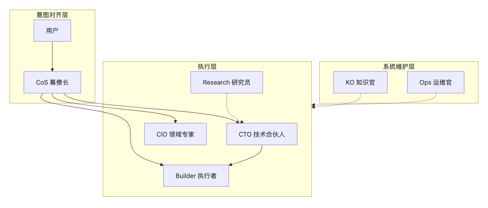
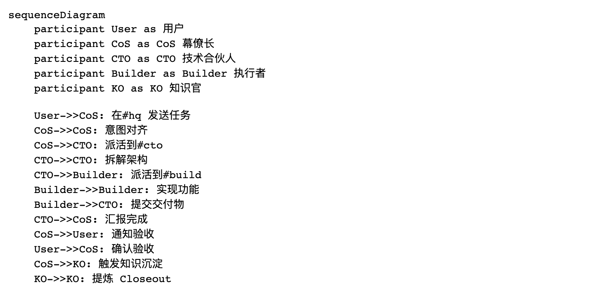

> 📖 **本文解读内容来源**
>
> - **原始来源**：[OpenCrew GitHub 仓库](https://github.com/AlexAnys/opencrew)
> - **来源类型**：GitHub 仓库
> - **作者/团队**：AlexAnys
> - **发布时间**：2026 年 2 月 8 日创建，3 月 8 日最新更新
> - **Star 数量**：196 ⭐
> - **主要编程语言**：Shell (100%)

---

👤 **大家好，我是王鹏，专注在 Agent 和大模型算法领域的一位前行者。** 平时喜欢琢磨 LLM 的原理和实战应用，也爱追踪最新的 AI 动态。一直相信，AI 真的能改变世界。

---

# 一个非技术背景的人，做出了最懂管理者的 AI 团队系统

最近有个项目让笔者眼前一亮。

不是因为它用了什么新模型，也不是因为代码有多精妙。

而是它的**设计者背景**——经济学和 MBA 背景，没有技术栈包袱。

做出来的东西，却比很多技术团队设计的 Agent 系统更懂"管理"这件事。

这个项目叫 **OpenCrew**。

一句话定义：**它是一个让你通过 Slack/飞书/Discord 就能管理一支 AI 团队的多智能体协同系统。**

不用写一行代码。

---

## 这是个啥 / Why Should I Care

想象一下这个场景：

你有一个任务："帮我分析一下 Q1 的销售数据，找出问题，给出建议。"

在传统 Agent 系统里，你需要：
1. 写 Prompt 描述任务
2. 等一个通用 AI 助手给你一份报告
3. 发现不够深入，再追问
4. 想要技术实现方案，又要切换上下文

**累不累？**

OpenCrew 的做法是：

你直接把任务丢进 Slack 的 `#hq` 频道。CoS（幕僚长）会先跟你对齐深层目标，然后自动派活给 CTO（技术合伙人）、Builder（执行者）、CIO（领域专家）……

每个 Agent 有自己的专属频道，各司其职。

最后你收到的不是一份报告，而是一支团队完整的工作流：
- CTO 拆解了技术架构
- Builder 实现了具体功能
- CIO 补充了领域知识
- KO（知识官）把这次的经验沉淀成了可复用的知识

**你只需要做决策和验收。**

就像管理一支真实的人类团队。

---

## 核心架构：三层设计，各司其职

OpenCrew 的架构设计非常清晰，分为三层：



**每层的职责：**

| 层级 | 角色 | 职责 |
|------|------|------|
| **意图对齐层** | 用户 + CoS | 定方向、验收结果。CoS 帮你对齐深层目标，用户不在时代为推进 |
| **执行层** | CTO/Builder/CIO/Research | CTO 拆解架构，Builder 实现，CIO 是可替换的领域专家 |
| **系统维护层** | KO + Ops | KO 提炼知识，Ops 审计变更、防止漂移 |

**为什么是 7 个 Agent？**

笔者看到这个问题时也思考了一下。

7 是当前的平衡点：足够的领域分化 + 可管理的协作复杂度。

3 个太少（上下文还是会膨胀），10 个太多（A2A 协调成本爆炸：N*(N-1)/2 = 45 条通道）。

这个设计很克制。

---

## 核心机制：让 AI 团队像人一样协作

### 自主等级（Autonomy Ladder）

OpenCrew 给每个 Agent 定义了清晰的权限边界：

| 等级 | 含义 | 举例 |
|------|------|------|
| **L0** | 只建议，不动手 | — |
| **L1** | 可逆操作，直接做 | 写草稿、做调研、整理文档 |
| **L2** | 有影响但可回滚，做完汇报 | 提 PR、改配置、写分析 |
| **L3** | 不可逆操作，必须确认 | 发布、交易、删除、对外发送 |

这个设计让笔者想到了人类团队的管理：

- 实习生做 L1 的活
- 资深员工可以 L2
- 核心决策必须 L3 确认

**AI 团队也需要权限管理。**

### 任务分类（QAPS）

| 类型 | 含义 | 需要 Closeout？ |
|------|------|----------------|
| **Q** | 一次性问题 | 不需要 |
| **A** | 有交付物的小任务 | 需要 |
| **P** | 项目（多步骤、跨天） | 需要 + Checkpoint |
| **S** | 系统变更 | 需要 + Ops 审计 |

这个分类让任务管理变得清晰。

小问题快速解决，大项目有追踪，系统变更有审计。

### 知识沉淀：三层压缩

这是 OpenCrew 最让笔者欣赏的设计：

```
Layer 0: 原始对话（审计用，不直接复用）
    ↓ 压缩比 ~25x
Layer 1: Closeout（10-15 行结构化总结）
    ↓ 进一步提炼
Layer 2: KO 提炼的抽象知识（原则/模式/踩坑记录）
```

**为什么这个设计重要？**

大多数 Agent 系统只停留在 Layer 0——每次对话都是独立的，知识无法沉淀。

OpenCrew 通过 Closeout 强制结构化总结，再通过 KO（知识官）提炼可复用的知识。

**这让团队越用越聪明。**

---

## 代码实战：10 分钟部署你的 AI 团队

OpenCrew 的部署简单到让人惊讶。

整个项目只有约 **6KB Shell 代码**，却实现了一个完整的多 Agent 协同系统。

### 前提条件

- 已经能正常使用 OpenClaw（`openclaw status` 能跑通）
- 已接入选择的平台（Slack/飞书/Discord）

### Step 1: 创建频道并邀请 bot

| 频道 | Agent | 说明 |
|------|-------|------|
| `#hq` | CoS 幕僚长 | 主要对话窗口 |
| `#cto` | CTO 技术合伙人 | 技术方向和任务拆解 |
| `#build` | Builder 执行者 | 具体实现和交付 |

### Step 2: 让 OpenClaw 自动完成部署

在你的 OpenClaw 中发送以下指令：

```
帮我部署 OpenCrew 多 Agent 团队。

仓库：请 clone https://github.com/AlexAnys/opencrew.git 到 /tmp/opencrew

Slack tokens（请写入配置，不要回显）：
- Bot Token: <你的 xoxb- token>
- App Token: <你的 xapp- token>

我已创建以下频道并邀请了 bot：
- #hq → CoS
- #cto → CTO
- #build → Builder

请读仓库里的 DEPLOY.md，按流程完成部署。
不要改我的 models / auth / gateway 配置，只做 OpenCrew 的增量。
```

### Step 3: 验证

1. 在 CoS 对应的频道发一句话 → CoS 回复 ✅
2. 在 CTO 对应的频道发一句话 → CTO 回复 ✅
3. 让 CTO 派个任务给 Builder → Builder 回复 ✅

**就这么简单。**

---

## 效果展示：A2A 闭环协作

下面这张图展示了 OpenCrew 的 A2A（Agent-to-Agent）协作流程：



**这个流程的特点：**

- 所有协作过程在 Slack 中可见
- 每个 Agent 有独立的工作空间
- 知识自动沉淀，下次遇到类似任务更快

从结果来看，这个设计确实让 AI 协作变得像人类团队一样自然。

---

## 深度思考：为什么这个设计值得学习

### 1. 非技术背景的降维打击

OpenCrew 的设计者 AlexAnys 是经济学和 MBA 背景。

没有技术栈包袱，反而做出了最懂管理者的 AI 系统。

**这给笔者一个启发：**

有时候，限制你的不是技术能力，而是思维定式。

技术人做 Agent 系统，容易陷入"怎么实现更酷的功能"。

非技术人做 Agent 系统，想的是"怎么让我的工作更轻松"。

**后者才是 AI 应该解决的问题。**

### 2. Slack 作为通信基础设施的妙处

为什么选择 Slack 而不是自己开发 UI？

| Slack 特性 | 对应价值 |
|-----------|---------|
| 频道 | = Agent 岗位，一个 App 管所有 Agent |
| Thread | = 独立 Session，天然上下文隔离 |
| Unreads / Later | = 决策待办清单，一目了然 |
| A2A 跨频道输出 | 所有协作过程可见、完全可审计 |
| 手机端 | 随时审批·随地决策，碎片时间=管理时间 |

**这个设计暗合了一个朴素道理：**

最好的工具，是让你忘记工具存在的工具。

你不需要学习新界面，不需要切换上下文。

就在你熟悉的 Slack 里，管理你的 AI 团队。

### 3. 知识沉淀是核心竞争力

大多数 Agent 系统最大的问题是：**每次对话都是零和博弈。**

今天解决了这个问题，明天遇到类似的还要从头来。

OpenCrew 通过 KO（知识官）和三层知识沉淀机制，让团队越用越聪明。

**这才是 AI 系统该有的样子。**

---

## 结语

OpenCrew 确实是个很特别的系统。

它不是技术最复杂的，但可能是最懂"管理"这件事的。

**就像一支训练有素的团队，每个成员都知道自己的职责，知道怎么配合，知道怎么把经验变成能力。**

不得不感叹一句：**最好的设计，往往来自对问题本质的理解，而不是技术的堆砌。**

从 OpenCrew 身上，笔者看到了 AI 落地的另一种可能：

不是让 AI 取代人类，而是让 AI 像人类团队一样协作。

你只需要做你最擅长的事——决策和验收。

剩下的，交给团队。

希望读者能够有所收获。

如果你也对多 Agent 协同感兴趣，不妨试试 OpenCrew。

说不定，它就是你一直在找的那个"懂管理"的 AI 系统。

---

### 参考

- [OpenCrew GitHub 仓库](https://github.com/AlexAnys/opencrew)
- [OpenClaw 官方文档](https://docs.openclaw.ai/)
- [OpenClaw Slack 集成文档](https://docs.openclaw.ai/zh-CN/channels/slack)
- [OpenClaw 飞书集成文档](https://docs.openclaw.ai/channels/feishu)
- [OpenClaw Discord 集成文档](https://docs.openclaw.ai/channels/discord)
