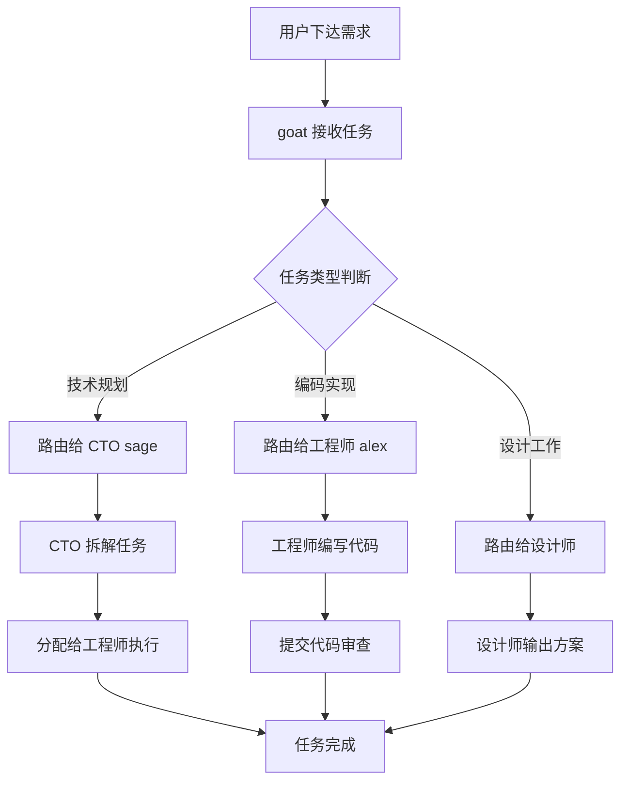

> 📖 **本文解读内容来源**
>
> - **原始来源**：[marian2js/opengoat](https://github.com/marian2js/opengoat)
> - **来源类型**：GitHub 仓库
> - **作者/团队**：marian2js
> - **发布时间**：2026 年 2 月
> - **Star 数量**：253 ⭐
> - **主要编程语言**：TypeScript

---

> 👤 **关于作者**
>
> 大家好，我是王鹏，专注在 Agent 和大模型算法领域的一位前行者。
>
> 平时喜欢折腾各种 AI 新工具，也爱分享一些实战心得。今天给大家分享一个很有意思的开源项目。

---

# 给 AI 员工建个组织架构——OpenGoat 实战指南

让 AI 帮你做自媒体副业，可能真的能行。

最近 Agent 工具火得一塌糊涂。Claude Code、Codex、Cursor 一个个都很强，但笔者发现一个痛点：**单个 Agent 再厉害，也干不过一支有组织的团队**。

这不，开源社区又出新活了——**OpenGoat**，一个能让你构建 AI 代理组织的平台。简单说，就是给你的 AI 员工们建个公司架构，让它们各司其职、互相配合。

## 这是个啥 / Why Should I Care

所谓 OpenGoat，其实就像**给 AI 员工们搭个公司组织架构**——你可以任命 CTO、工程师、设计师，然后让它们各自干活、互相协作。

它解决的核心问题是：**如何让多个 AI 代理协同工作，而不是单打独斗**。

想象一下这个场景：你要开发一个新功能。以前你得自己跟 Claude Code 对话，让它写代码、测 bug、改需求。现在你可以说："CTO，规划一下这个功能的技术方案"，然后 CTO 会自动分配给工程师实现。

是不是现在有点 AI 公司的意思了？

## 核心架构

下面这张图展示了 OpenGoat 的组织架构模型：

<svg width="100%" viewBox="0 0 700 350" xmlns="http://www.w3.org/2000/svg">
  <defs>
    <linearGradient id="gradGoat" x1="0%" y1="0%" x2="100%" y2="100%">
      <stop offset="0%" style="stop-color:#667eea;stop-opacity:1" />
      <stop offset="100%" style="stop-color:#764ba2;stop-opacity:1" />
    </linearGradient>
    <linearGradient id="gradManager" x1="0%" y1="0%" x2="100%" y2="100%">
      <stop offset="0%" style="stop-color:#f093fb;stop-opacity:1" />
      <stop offset="100%" style="stop-color:#f5576c;stop-opacity:1" />
    </linearGradient>
    <linearGradient id="gradIndividual" x1="0%" y1="0%" x2="100%" y2="100%">
      <stop offset="0%" style="stop-color:#4facfe;stop-opacity:1" />
      <stop offset="100%" style="stop-color:#00f2fe;stop-opacity:1" />
    </linearGradient>
    <marker id="arrowHead" markerWidth="10" markerHeight="10" refX="9" refY="3" orient="auto">
      <path d="M0,0 L0,6 L9,3 z" fill="#667eea" />
    </marker>
  </defs>

  <!-- Goat (Root) -->
  <rect x="275" y="20" width="150" height="60" rx="10" fill="url(#gradGoat)" />
  <text x="350" y="45" text-anchor="middle" fill="#fff" font-size="16" font-weight="bold" font-family="system-ui, sans-serif">🐐 goat (CEO)</text>
  <text x="350" y="65" text-anchor="middle" fill="#fff" font-size="12" font-family="system-ui, sans-serif">不可删除的根节点</text>

  <!-- Arrow to Sage -->
  <line x1="350" y1="80" x2="350" y2="110" stroke="#667eea" stroke-width="2" marker-end="url(#arrowHead)" />

  <!-- Sage (Manager) -->
  <rect x="275" y="110" width="150" height="50" rx="8" fill="url(#gradManager)" />
  <text x="350" y="140" text-anchor="middle" fill="#fff" font-size="14" font-weight="bold" font-family="system-ui, sans-serif">📋 sage (CTO)</text>

  <!-- Arrows to Engineers -->
  <line x1="300" y1="160" x2="220" y2="190" stroke="#667eea" stroke-width="2" marker-end="url(#arrowHead)" />
  <line x1="400" y1="160" x2="480" y2="190" stroke="#667eea" stroke-width="2" marker-end="url(#arrowHead)" />

  <!-- Alex (Engineer) -->
  <rect x="140" y="190" width="160" height="50" rx="8" fill="url(#gradIndividual)" />
  <text x="220" y="215" text-anchor="middle" fill="#fff" font-size="14" font-weight="bold" font-family="system-ui, sans-serif">💻 alex (工程师)</text>
  <text x="220" y="232" text-anchor="middle" fill="#fff" font-size="11" font-family="system-ui, sans-serif">负责编码任务</text>

  <!-- Designer -->
  <rect x="400" y="190" width="160" height="50" rx="8" fill="url(#gradIndividual)" />
  <text x="480" y="215" text-anchor="middle" fill="#fff" font-size="14" font-weight="bold" font-family="system-ui, sans-serif">🎨 designer (设计师)</text>
  <text x="480" y="232" text-anchor="middle" fill="#fff" font-size="11" font-family="system-ui, sans-serif">负责设计任务</text>

  <!-- Legend -->
  <rect x="20" y="280" width="200" height="60" rx="8" fill="#f8f9fa" stroke="#dee2e6" stroke-width="1" />
  <rect x="35" y="295" width="20" height="20" rx="4" fill="url(#gradGoat)" />
  <text x="65" y="310" fill="#333" font-size="12" font-family="system-ui, sans-serif">Root (goat)</text>
  <rect x="35" y="320" width="20" height="20" rx="4" fill="url(#gradManager)" />
  <text x="65" y="335" fill="#333" font-size="12" font-family="system-ui, sans-serif">Manager</text>
  <rect x="120" y="295" width="20" height="20" rx="4" fill="url(#gradIndividual)" />
  <text x="150" y="310" fill="#333" font-size="12" font-family="system-ui, sans-serif">Individual</text>
</svg>

如上图所示，OpenGoat 的组织架构有三个关键角色：

1. **goat（根节点）**：组织的 CEO，永远存在，不可删除
2. **Manager（管理者）**：如 CTO sage，负责规划和任务分配
3. **Individual（执行者）**：如工程师 alex、设计师，负责具体干活

## 核心原理

这里有的读者就会问了：**这跟直接用多个 Agent 有啥区别？**

好问题。关键在于**组织架构**和**技能系统**。

### 1. 组织架构（Hierarchy）

OpenGoat 强制定义了上下级关系（`reportsTo`）：

- 每个 Agent 都有一个上级（除了 goat）
- Manager 只能管理自己的直接下属
- 任务只能分配给自己或直接/间接下属

这暗合了真实公司的管理逻辑——你不能越级指挥，也不能随便给别人派活。

### 2. 技能系统（Skills）

OpenGoat 的技能不是硬编码的，而是以**插件形式**存在：

```
Manager 行为 = 技能 + 提示词 + 组织元数据
```

这意味着：
- 你可以给 CTO 安装"技术规划"技能
- 可以给工程师安装"代码审查"技能
- 可以随时更换技能，不用改核心代码

### 3. 多 Provider 支持

这才是 OpenGoat 的杀手锏。它支持多种 AI 工具作为后端：

| Provider | 技能目录 |
|---------|---------|
| OpenClaw | `skills/` |
| Claude Code | `.claude/skills/` |
| Codex | `.agents/skills/` |
| Cursor | `.cursor/skills/` |
| GitHub Copilot CLI | `.copilot/skills/` |

**你可以混用**！比如让 CTO 用 Claude Code，工程师用 Cursor，设计师用 Codex。

## 代码实战 / 硬核拆解

### 第 1 步：安装和初始化

```bash
# 安装 OpenClaw 和 OpenGoat
npm i -g openclaw opengoat

# 配置 OpenClaw（首次使用需要）
openclaw onboard

# 启动 OpenGoat
opengoat start
```

然后打开 `http://127.0.0.1:19123`，就能看到 UI 界面了。

### 第 2 步：创建组织架构

```bash
# 创建 CTO（管理者，向 goat 汇报）
opengoat agent create "CTO" --manager --reports-to goat

# 创建工程师（执行者，向 CTO 汇报）
opengoat agent create "Engineer" --individual --reports-to cto --skill coding

# 创建设计师（执行者，向 CTO 汇报）
opengoat agent create "Designer" --individual --reports-to cto

# 查看组织列表
opengoat agent list
```

### 第 3 步：分配任务

```bash
# 让 CTO 规划技术 roadmap
opengoat agent cto --message "规划 Q2 工程技术路线图，拆分成具体任务流"

# 让工程师实现具体功能
opengoat agent engineer --message "为本 sprint 实现认证中间件"

# 查看任务列表
opengoat task list --as engineer
```

### 第 4 步：会话保持

这里要注意了——OpenGoat 的会话是**按 Agent + Session ID**绑定的：

```bash
# 使用指定会话（保持上下文）
opengoat agent goat \
  --session saaslib-planning \
  --message "创建 v1.2 发布检查清单"

# 同一会话继续对话
opengoat agent goat \
  --session saaslib-planning \
  --message "现在起草 changelog"
```

这样 Agent 会记得之前的对话内容，不会失忆。

## 效果展示

下面用 Mermaid 流程图展示一个典型的任务执行流程：



从结果来看，这种架构设计确实比单个 Agent 单打独斗要高效得多。

## 踩坑指南

笔者在研究这个项目时发现几个容易踩的坑：

1. **goat 必须是 OpenClaw**：这是硬限制，不能换成其他 Provider
2. **Manager 不直接干活**：管理者通过技能来管理，而不是硬编码的控制流
3. **会话 ID 要记好**：每个 Agent + Session 是 1:1 绑定的，换了 Session 就失忆了
4. **技能目录因 Provider 而异**：给不同 Agent 装技能时，注意技能要放在正确的目录下

## 结语——深度思考与哲学收尾

OpenGoat 确实是个很有意思的尝试。它把**真实世界的组织架构**映射到了 AI Agent 世界。

笔者容啰嗦一下——这个项目的核心价值不在于"能创建多个 Agent"，而在于**强制定义了协作规则**：

- 上下级关系明确了责任边界
- 技能系统让行为可插拔
- 多 Provider 支持避免了厂商锁定

不得不感叹一句：**好的架构，都是对人性的模拟**。

GAN 就像梅西和 C 罗，正因对手存在才互相促进；OpenGoat 里的 Agent 们，也因组织架构而形成了协作生态。

从架构设计可以看出，作者的目标不是做一个"更大的 Agent"，而是做一个**能让 Agent 们自己协作的平台**。这种思路，比单纯堆砌模型参数要高明得多。

**使用建议**：
- 如果你需要多个 AI 协作完成复杂项目，OpenGoat 很适合
- 如果你只是偶尔用用 AI 写代码，单个工具就够了
- 生产环境建议先用 Docker 部署，稳定性更好

> "规则性价比高就用规则，算法性价比高就用算法"——这是 OpenGoat 的设计哲学，也是笔者想分享给各位的。

希望读者能够有所收获。AI 组织化的时代，可能比我们想象的要来得更快。

---

### 参考

- [marian2js/opengoat GitHub 仓库](https://github.com/marian2js/opengoat)
- [OpenGoat 官方文档](https://opengoat.ai)
- [OpenClaw 项目](https://github.com/marian2js/openclaw)
