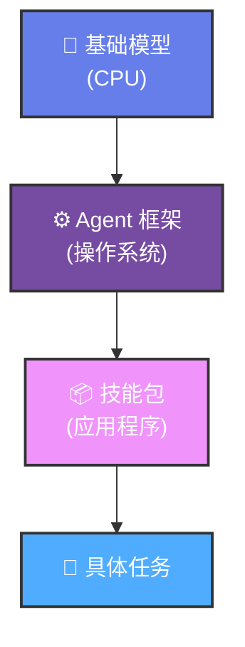

# 给 AI Agent 装技能包，到底有没有用？这篇基准测试给出了答案

> 📖 **本文解读内容来源**
>
> - **原始来源**：[SkillsBench: Benchmarking How Well Agent Skills Work Across Diverse Tasks](https://arxiv.org/html/2602.12670v1)
> - **来源类型**：论文
> - **作者/团队**：SkillsBench 研究团队
> - **发布时间**：2026 年 2 月
> - **实验规模**：7308 次测试轨迹，86 个任务，11 个领域

---

## 开头：AI Agent 的"技能包"热潮背后，缺少一个关键问题

最近 AI Agent 技能包（Skills）的概念火遍开发者社区。

Anthropic 的 Claude Code、Google 的 Gemini CLI、OpenAI 的 Codex CLI，这些终端里的 AI 助手都在支持某种形式的"技能包"。

社区仓库里已经涌现出成千上万个用户贡献的技能，涵盖软件工程、数据分析、企业工作流等各种场景。

但笔者问一个扎心的问题：**这些技能包，到底有没有用？**

不是说加了技能包就一定能提升效果吗？

**其实不然。**

这篇刚发布的论文《SkillsBench》，做了第一个系统性基准测试，结果有些反直觉：

- 精心设计的技能包平均提升 **16.2 个百分点** 的通过率
- 但 **19% 的任务** 用了技能包反而效果更差
- 模型自己生成的技能包 **几乎没有帮助**
- **2-3 个** 聚焦的技能包效果最好，而不是大而全的文档

这篇文章，笔者带你拆解这项大规模实证研究，看看技能包到底该怎么用。

---

## 这是个啥：Agent 技能包的定义

先给个一句话定义：

**Agent 技能包（Skills）** 是一种结构化知识包，包含指令、代码模板、资源文件和验证逻辑，在推理时增强 LLM Agent 的行为，无需修改模型本身。

通俗点说，技能包就像是给 AI 助手发的 **操作手册 + 工具箱**。

它有几个关键特征：

1. **程序性知识**：教 AI"怎么做"，而不是"是什么"
2. **任务类别适用**：解决一类问题，不是单个实例
3. **结构化组件**：包含 SKILL.md 文件 + 可选资源（脚本、模板、示例）
4. **可移植性**：基于文件系统，易于编辑、版本控制、共享

**与 RAG、Few-shot 的区别：**

| 增强方式 | 内容类型 | 作用机制 |
|---------|---------|---------|
| **技能包 (Skills)** | 程序性知识（SOP、工作流） | 指导"怎么做" |
| **RAG** | 事实性检索 | 提供背景信息 |
| **Few-shot** | 示例对 | 模式匹配 |
| **系统提示** | 通用指令 | 行为约束 |

下面这张图展示了 Agent 架构的分层栈：

---

## 核心原理：SkillsBench 基准测试设计

论文团队构建了一个叫 **SkillsBench** 的基准测试框架。

### 测试规模

- **86 个任务**，覆盖 **11 个领域**
- **7 种 Agent-模型组合**
- **7308 次测试轨迹**
- 每个任务三种测试条件：**无技能包**、**精选技能包**、**自生成技能包**

### 评估指标

核心指标是 **通过率（Pass Rate）**：

- 使用确定性验证器判断任务是否完成
- 对比有/无技能包的通过率差异
- 计算 **归一化增益** 来衡量技能包效果

### 关键设计原则

1. **人类编写的指令**：技能包由人工精心策划
2. **技能通用性**：一个技能可应用于多个任务
3. **确定性验证**：避免主观判断
4. **自动化验证**：CI 流水线自动测试
5. **人工审核**：PR 审核确保质量
6. **防泄漏设计**：技能包提供指导，不直接给出答案

---

## 实验结果：7 个关键发现

### 发现 1：技能包提升显著，但差异很大

**平均提升 16.2 个百分点**，但不同配置差异很大：

- 最低：+13.6pp
- 最高：+23.3pp

这说明技能包的效果 **强烈依赖于具体的 Agent-模型组合**，不是一刀切的。

### 发现 2：Gemini CLI + Gemini 3 Flash 表现最佳

在所有组合中，Gemini CLI 配合 Gemini 3 Flash 模型达到了最高性能。

### 发现 3：自生成技能包几乎没有帮助 ⚠️

这个发现很反直觉：

**模型自己生成的技能包，平均提升几乎为零，有些甚至是负面的。**

这说明：**模型无法可靠地创作出它自己能从中受益的程序性知识。**

用大白话说：AI 知道自己"需要什么"，但不知道自己"该怎么写"。

### 发现 4：不同领域的提升差异巨大

技能包在不同领域的效果：

| 领域 | 提升幅度 |
|-----|---------|
| **医疗保健** | +51.9pp |
| **数据分析** | +25.3pp |
| **数学** | +18.7pp |
| **软件工程** | +4.5pp |

为什么软件工程提升最小？笔者猜测：

- 编程任务本身就有明确的语法和逻辑约束
- 模型在代码生成上已经经过大量训练
- 技能包的边际效益递减

### 发现 5：2-3 个技能包最优，多了收益递减

测试发现：

- **2-3 个聚焦的技能包** 效果最好
- 超过这个数量，出现 **边际收益递减**
- 大而全的文档不如精准的小册子

### 发现 6：中等长度的技能包优于全面的文档

**Finding 6: Moderate-length Skills outperform comprehensive ones.**

这个发现对技能包设计很重要：

- 太短：信息不足
- 太长：注意力分散
- 中等长度（几百到一千字）：效果最佳

### 发现 7：小模型 + 技能包可以超过大模型 🎯

这是最具实践价值的发现：

**较小的模型配上精心设计的技能包，可以超过更大的模型 without Skills。**

这意味着：

- 技能包可以 **降低模型成本**
- 通过工程优化弥补模型能力的不足
- 对于生产环境，这是性价比很高的方案

---

## 效果展示：数据对比

下面这张图汇总了主要实验结果：

<svg width="100%" viewBox="0 0 700 350" xmlns="http://www.w3.org/2000/svg">
  <defs>
    <linearGradient id="grad1" x1="0%" y1="0%" x2="100%" y2="0%">
      <stop offset="0%" style="stop-color:#667eea;stop-opacity:1" />
      <stop offset="100%" style="stop-color:#764ba2;stop-opacity:1" />
    </linearGradient>
    <linearGradient id="grad2" x1="0%" y1="0%" x2="100%" y2="0%">
      <stop offset="0%" style="stop-color:#f093fb;stop-opacity:1" />
      <stop offset="100%" style="stop-color:#f5576c;stop-opacity:1" />
    </linearGradient>
    <linearGradient id="grad3" x1="0%" y1="0%" x2="100%" y2="0%">
      <stop offset="0%" style="stop-color:#4facfe;stop-opacity:1" />
      <stop offset="100%" style="stop-color:#00f2fe;stop-opacity:1" />
    </linearGradient>
  </defs>

  <!-- 背景 -->
  <rect width="700" height="350" fill="#f8f9fa" rx="12"/>

  <!-- 标题 -->
  <text x="350" y="35" text-anchor="middle" font-size="18" font-weight="bold" font-family="system-ui, sans-serif" fill="#333">技能包效果对比（平均通过率）</text>

  <!-- 无技能包 -->
  <rect x="80" y="70" width="120" height="180" rx="8" fill="#e0e0e0" stroke="#999" stroke-width="2"/>
  <text x="140" y="260" text-anchor="middle" font-size="14" font-weight="bold" font-family="system-ui, sans-serif" fill="#666">无技能包</text>
  <text x="140" y="160" text-anchor="middle" font-size="24" font-weight="bold" font-family="system-ui, sans-serif" fill="#666">Baseline</text>

  <!-- 精选技能包 -->
  <rect x="290" y="70" width="120" height="180" rx="8" fill="url(#grad1)" stroke="#667eea" stroke-width="2"/>
  <text x="350" y="260" text-anchor="middle" font-size="14" font-weight="bold" font-family="system-ui, sans-serif" fill="#667eea">精选技能包</text>
  <text x="350" y="160" text-anchor="middle" font-size="24" font-weight="bold" font-family="system-ui, sans-serif" fill="#fff">+16.2pp</text>

  <!-- 自生成技能包 -->
  <rect x="500" y="70" width="120" height="180" rx="8" fill="url(#grad2)" stroke="#f5576c" stroke-width="2"/>
  <text x="560" y="260" text-anchor="middle" font-size="14" font-weight="bold" font-family="system-ui, sans-serif" fill="#f5576c">自生成技能包</text>
  <text x="560" y="160" text-anchor="middle" font-size="24" font-weight="bold" font-family="system-ui, sans-serif" fill="#fff">≈ 0pp</text>

  <!-- 底部说明 -->
  <text x="350" y="310" text-anchor="middle" font-size="12" font-family="system-ui, sans-serif" fill="#666">数据基于 7308 次测试轨迹，86 个任务</text>
  <text x="350" y="330" text-anchor="middle" font-size="12" font-family="system-ui, sans-serif" fill="#999">pp = percentage points（百分点）</text>
</svg>

---

## 深度思考：技能包设计的实践建议

基于这些发现，笔者总结几个实践建议：

### 1. 技能包设计原则

- **聚焦而非全面**：2-3 个精准的技能包 > 10 个泛泛的文档
- **中等长度**：几百到一千字最佳
- **人类编写**：不要指望模型自己生成有效的技能包
- **结构化**：包含指令 + 代码模板 + 示例

### 2. 适用场景判断

如果你的场景是：

- **高专业性领域**（如医疗、法律）：技能包提升空间大
- **成熟编程任务**：提升可能有限，但仍有价值
- **复杂工作流**：技能包帮助显著

### 3. 成本优化策略

**小模型 + 技能包** 可以是一个高性价比方案：

- 用 7B/14B 模型 + 精心设计的技能包
- 达到接近 70B+ 模型的效果
- 推理成本降低 5-10 倍

### 4. 避坑指南

⚠️ **注意这些情况技能包可能失效：**

- 技能包与任务不匹配
- 技能包之间相互冲突
- 技能包过于冗长导致注意力分散
- 模型本身能力不足以执行技能包指令

---

## 结语：技能包是 AI Agent 的"应用生态"

SkillsBench 这项研究，给 AI Agent 技能包的发展提供了一个重要锚点。

**笔者认为，技能包的核心价值在于：**

它让 AI Agent 从"通用能力"走向"专业能力"，就像 CPU 需要操作系统和应用程序才能发挥价值一样。

这个发现让笔者想到一个类比：

> **基础模型像是 CPU，Agent 框架像是操作系统，技能包就像是应用程序。**
>
> 一个再强大的 CPU，没有好的应用生态，也只能是实验室里的玩具。

**不得不感叹一句：生态才是硬道理。**

对于开发者来说，这项研究的启示很明确：

1. **别迷信大模型**：工程优化（技能包）可以弥补模型差距
2. **别指望 AI 自给自足**：人类的专业知识输入仍然关键
3. **别做大而全**：精准、聚焦的技能包最有效

希望这篇文章能帮你更好地理解和使用 AI Agent 技能包。

如果你能看到这里，说明你对 AI Agent 工程化已经有 80% 的理解了。剩下的 20%，就是动手实践了。

---

### 参考

- [SkillsBench: Benchmarking How Well Agent Skills Work Across Diverse Tasks](https://arxiv.org/html/2602.12670v1)
- [Harbor Framework](https://github.com/agent-harbor/harbor)
- [Claude Code](https://claude.ai/code)
- [Gemini CLI](https://github.com/google-gemini/gemini-cli)
- [Codex CLI](https://github.com/openai/codex-cli)
