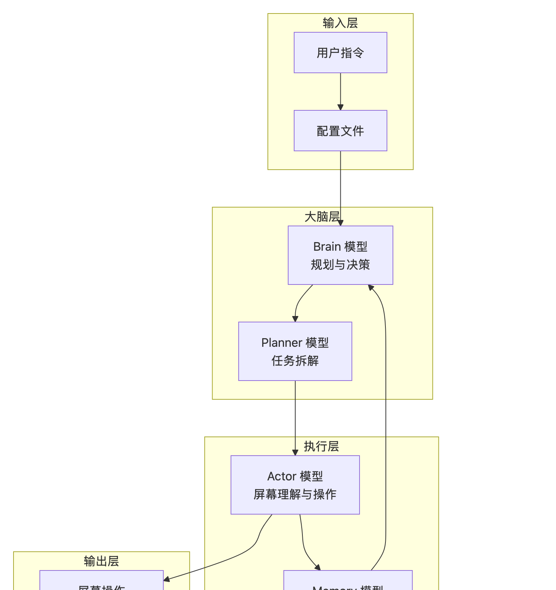
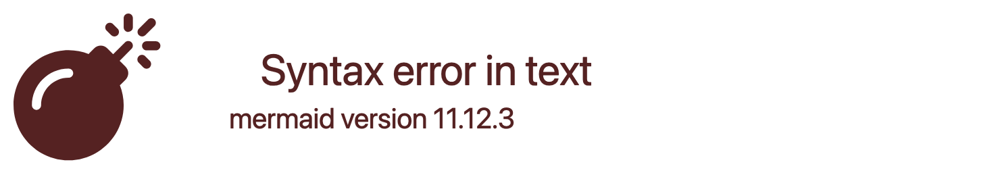

> 📖 **本文解读内容来源**
>
> - **原始来源**：[TuriX-CUA GitHub 仓库](https://github.com/TurixAI/TuriX-CUA)
> - **来源类型**：GitHub 仓库
> - **作者/团队**：TurixAI 团队
> - **发布时间**：2025 年 8 月 4 日创建，2026 年 3 月 8 日最新更新
> - **Star 数量**：1294 ⭐
> - **主要编程语言**：Python (97.7%), Shell (2.3%)

---

👤 **大家好，我是王鹏，专注在 Agent 和大模型算法领域的一位前行者。** 平时喜欢琢磨 LLM 的原理和实战应用，也爱追踪最新的 AI 动态。一直相信，AI 真的能改变世界。

---

# 让 AI 直接操作你的电脑：TuriX-CUA 桌面智能体实战

最近测试了一个很有意思的项目。

不是那种只能在对话框里给你建议的 AI 助手。

而是**真的能让 AI 模型直接操作你的电脑**——打开应用、点击按钮、填写表单、整理文档，就像有一个隐形的人在帮你干活。

这个项目叫 **TuriX-CUA**（Computer-Use-Agent）。

一句话定义：**它是一个让你的 AI 模型能够在桌面环境中执行真实操作的多模型协同智能体系统。**

支持 macOS 和 Windows，开源免费，还能随意替换模型。

---

## 这是个啥 / Why Should I Care

想象一下这个场景：

老板在 Discord 上发给你一个 Excel 文件，让你根据数据生成柱状图，插入到 PPT 里，然后回复老板。

传统做法：
1. 打开 Discord，下载文件
2. 用 Excel 打开，整理数据
3. 生成图表，复制
4. 打开 PPT，找到位置，粘贴
5. 回到 Discord，回复老板

**全程手动操作，至少 10 分钟。**

TuriX-CUA 的做法是：

你直接告诉它："帮我处理老板发的 Excel，生成柱状图插入 PPT，然后回复老板。"

然后你就可以去喝咖啡了。

AI 会自己：
- 打开 Discord，下载文件
- 用 Numbers/Excel 打开，生成图表
- 打开 PPT，找到对应位置，插入图表
- 回到 Discord，回复老板

**你只需要验收结果。**

就像有一个隐形的助手在帮你操作电脑。

---

## 核心架构：多模型协同，各司其职

TuriX-CUA 的架构设计非常清晰，采用多模型协同设计：



**每个模型的角色：**

| 角色 | 职责 | 推荐模型 |
|------|------|----------|
| **Brain** | 高层决策、任务理解 | turix-brain / Gemini-3-pro |
| **Planner** | 任务拆解、步骤规划 | turix-brain / Gemini-3-flash |
| **Actor** | 屏幕截图理解、具体操作 | turix-actor（专用） |
| **Memory** | 记忆压缩、上下文检索 | turix-brain / Gemini-3-flash |

**为什么需要多模型？**

笔者看到这个问题时也思考了一下。

单模型架构的问题：**所有任务压在一个模型上，上下文容易爆炸，决策质量下降。**

TuriX-CUA 的设计：
- Brain 负责"想清楚要做什么"
- Planner 负责"拆解成可执行的步骤"
- Actor 负责"看懂屏幕并操作"
- Memory 负责"记住重要的信息"

**各司其职，专业的人做专业的事。**

这个设计很合理。

---

## 核心机制：让 AI 真正理解并操作桌面

### 屏幕理解与操作

TuriX-CUA 的核心能力是让 AI 看懂屏幕并执行操作：

| 操作类型 | 含义 | 举例 |
|----------|------|------|
| **点击** | 在指定坐标点击 | 点击按钮、菜单项 |
| **输入** | 键盘输入文本 | 填写表单、搜索 |
| **滚动** | 滚动页面 | 浏览长页面、列表 |
| **截图** | 获取当前屏幕 | 让 AI 理解当前状态 |

**这个设计的关键：**

不需要任何应用的 API。

**只要人类能点击的地方，TuriX 就能操作。**

WhatsApp、Excel、Outlook、公司内部工具……统统支持。

### Skills 机制：可复用的任务模板

这是 TuriX-CUA 最让笔者欣赏的设计之一：

```
Skills/
├── github-web-actions.md    # GitHub 网页操作指南
├── booking-flight.md        # 预订航班流程
└── data-analysis.md         # 数据分析任务模板
```

每个 Skill 是一个 Markdown 文件，包含：
- YAML frontmatter（名称 + 描述）
- 详细的操作步骤指南

**工作流程：**

1. Planner 根据任务描述，选择相关的 Skills
2. Brain 读取 Skill 内容，指导具体步骤
3. Actor 执行操作

**这让复杂任务变得可复用、可传承。**

### 记忆压缩：可恢复的上下文管理

大多数 Computer-Use Agent 的问题：**任务一长，上下文就爆炸，模型记不住前面的操作。**

TuriX-CUA 的解决方案：

```
原始操作历史 → 压缩 → 关键信息摘要 → 可恢复 → 需要时展开
```

**为什么这个设计重要？**

- 长任务不会丢失关键信息
- 上下文不会无限膨胀
- 需要细节时可以恢复原始记录

**这让 AI 能够处理更复杂的跨应用任务。**

---

## 代码实战：10 分钟部署你的桌面智能体

TuriX-CUA 的部署简单到让人惊讶。

### 前提条件

- macOS 15+ 或 Windows
- Python 3.12
- Conda 环境管理工具

### Step 1: 克隆项目

```bash
git clone https://github.com/TurixAI/TuriX-CUA.git
cd TuriX-CUA
```

Windows 用户切换到专用分支：
```bash
git checkout multi-agent-windows
```

### Step 2: 创建 Python 环境

```bash
conda create -n turix_env python=3.12
conda activate turix_env
pip install -r requirements.txt
```

### Step 3: 授予系统权限

**macOS 用户：**

1. **辅助功能权限**
   - 系统设置 → 隐私与安全 → 辅助功能
   - 添加 Terminal 和 Visual Studio Code
   - 如仍失败，添加 `/usr/bin/python3`

2. **Safari 自动化权限**
   - Safari → 设置 → 高级 → 显示 Web 开发者功能
   - 开发菜单 → 允许远程自动化
   - 开发菜单 → 允许 JavaScript 来自 Apple 事件

3. **触发权限弹窗**（每个 Shell 运行一次）
```bash
osascript -e 'tell application "Safari" to do JavaScript "alert(\"Triggering accessibility request\")" in document 1'
```

**Windows 用户：**

参考 `multi-agent-windows` 分支的 `OpenCLaw_TuriX_skill/README.md`

### Step 4: 配置模型 API

编辑 `examples/config.json`：

```json
{
    "agent": {
        "task": "打开系统设置，切换到深色模式"
    },
    "brain_llm": {
        "provider": "turix",
        "model_name": "turix-brain",
        "api_key": "YOUR_API_KEY",
        "base_url": "https://turixapi.io/v1"
    },
    "actor_llm": {
        "provider": "turix",
        "model_name": "turix-actor",
        "api_key": "YOUR_API_KEY",
        "base_url": "https://turixapi.io/v1"
    },
    "memory_llm": {
        "provider": "turix",
        "model_name": "turix-brain",
        "api_key": "YOUR_API_KEY",
        "base_url": "https://turixapi.io/v1"
    },
    "planner_llm": {
        "provider": "turix",
        "model_name": "turix-brain",
        "api_key": "YOUR_API_KEY",
        "base_url": "https://turixapi.io/v1"
    }
}
```

**本地 Ollama 用户：**

```json
{
    "brain_llm": {
        "provider": "ollama",
        "model_name": "llama3.2-vision",
        "base_url": "http://localhost:11434"
    },
    "actor_llm": {
        "provider": "ollama",
        "model_name": "llama3.2-vision",
        "base_url": "http://localhost:11434"
    }
}
```

### Step 5: 运行任务

```bash
python main.py
```

**就这么简单。**

---

## 效果展示：跨应用自动化

下面这些场景展示了 TuriX-CUA 的实际能力：



**这个流程的特点：**

- 所有操作基于屏幕截图理解
- 不需要任何应用的 API
- 支持跨应用协同操作
- 任务过程可追踪、可审计

从结果来看，这个设计确实让 AI 能够像人类一样操作电脑。

---

## 性能表现：SOTA 级别的桌面自动化

TuriX-CUA 在桌面自动化任务上的表现：

| 指标 | 表现 |
|------|------|
| **测试集通过率** | >68%（内部 OSWorld 风格测试） |
| **复杂任务提升** | 相比前代开源方案提升 15% |
| **支持平台** | macOS 15+ / Windows |
| **响应速度** | 秒级操作，流畅体验 |

**为什么这个性能重要？**

68% 的通过率意味着：**大部分日常桌面任务可以完全交给 AI 处理。**

15% 的提升意味着：**复杂 UI 交互（多步骤、跨应用）的可靠性大幅提高。**

---

## 深度思考：为什么这个方向值得看好

### 1. Computer-Use 是 AI 落地的下一个爆发点

2024 年，Anthropic 发布了 Computer-Use 能力。

2025-2026 年，各大厂商跟进。

**这背后有一个必然逻辑：**

对话式 AI 已经足够成熟，但**只能给建议，不能真正干活。**

Computer-Use 让 AI 从"顾问"变成"执行者"。

**这才是 AI 生产力的本质提升。**

### 2. 多模型架构是处理复杂任务的必然选择

单模型架构的问题：
- 上下文容易爆炸
- 决策质量随任务长度下降
- 难以兼顾宏观规划和微观操作

TuriX-CUA 的多模型设计：
- Brain 专注高层决策
- Actor 专注屏幕理解
- Memory 专注信息压缩
- Planner 专注任务拆解

**这个架构暗合了一个朴素道理：**

专业的人做专业的事，效率最高。

### 3. 开源免费是 Computer-Use 普及的关键

TuriX-CUA 完全开源，个人和研究免费使用。

**这让开发者能够：**
- 自由替换模型（支持 Ollama、Gemini、GPT 等）
- 自定义 Skills 模板
- 贡献社区生态

**这才是开源社区该有的样子。**

### 4. MCP 集成：与 Claude 等 Agent 的无缝协作

TuriX-CUA 支持 MCP（Model Context Protocol）协议。

这意味着：
- Claude for Desktop 可以调用 TuriX 执行桌面操作
- 任何支持 MCP 的 Agent 都能与 TuriX 协作
- **AI Agent 生态的互操作性成为可能**

**这个设计很有远见。**

---

## 结语

TuriX-CUA 确实是个很有潜力的项目。

它不是第一个 Computer-Use Agent，但可能是**目前最成熟、最易用的开源方案之一。**

**就像一个隐形的助手，你告诉它要做什么，它帮你操作电脑完成任务。**

你只需要做你最擅长的事——决策和验收。

剩下的，交给 AI。

从 TuriX-CUA 身上，笔者看到了 AI 落地的另一种可能：

**不是让 AI 取代人类，而是让 AI 成为你的隐形助手。**

帮你处理那些重复、繁琐的桌面操作。

让你有更多时间做真正重要的事。

希望读者能够有所收获。

如果你也对桌面自动化感兴趣，不妨试试 TuriX-CUA。

说不定，它就是你一直在找的那个"隐形助手"。

---

### 参考

- [TuriX-CUA GitHub 仓库](https://github.com/TurixAI/TuriX-CUA)
- [TuriX 官方网站](https://turix.ai)
- [TuriX API 平台](https://turixapi.io)
- [TuriX Discord 社区](https://discord.gg/yaYrNAckb5)
- [OpenClaw TuriX Skill](https://clawhub.ai/Tongyu-Yan/turix-cua)
