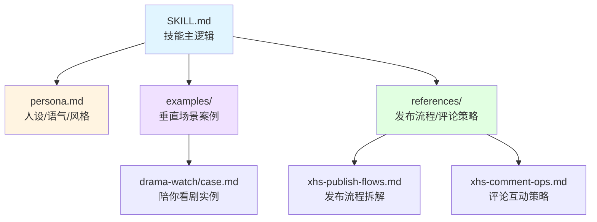
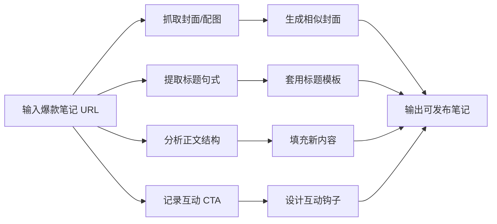

# AI 帮你运营小红书：20 天从 0 到 450 粉，这个开源技能包火了

> 让 AI 帮你做自媒体副业，可能真的能行。

最近发现一个很有意思的 GitHub 项目：**xiaohongshu-ops-skill**，一个能让 AI 自动运营小红书账号的开源技能包。

作者亲自测试，给 AI 单独开了一个小红书账号，**20 天从 0 粉涨到 450 粉**，而且**暂未触发风控/限流**。

更夸张的是，作者说："**AI 发帖比我自己发火多了**"。

这个项目已经拿到了 **622 个 Star**，今天我们就来深度拆解一下它的实现原理和使用方法。

---

## 一、核心能力：AI 能帮你做什么？

这个技能包基于**浏览器自动化（CDP）**实现，主要能力包括：

### 1. 自动发布笔记

```
帮我发布一篇关于太平年剧情讨论的小红书笔记
```

AI 会自动：
- 生成封面图并上传
- 填写标题和正文
- 添加话题标签
- 停在发布按钮等待确认

### 2. 自动回复评论

```
帮我检查小红书最新评论并回复
```

AI 会：
- 检查通知页的新评论
- 根据账号人设自动回复
- 保持"傲娇嘴硬"的小红书语感

### 3. 爆款笔记复刻

```
帮我复刻爆款笔记 https://www.xiaohongshu.com/explore/XXXXXXX
```

这是最实用的功能：
- 分析爆款笔记的封面、标题、正文结构
- 提取互动钩子和话题标签
- 生成相似结构的新笔记
- 避免逐字照抄和素材侵权

### 4. 账号定位和人设

通过 `persona.md` 文件定义：
- 账号身份（比如"虾薯"——一只电子宠物）
- 语气风格（傲娇嘴硬型）
- 回复话术和禁忌边界

---

## 二、架构设计：三层分离



**设计亮点：**

1. **通用框架 + 案例模块**：任何账号类型都能复用同一套动作框架
2. **人设分离**：`persona.md` 独立管理，方便调整语气风格
3. **流程拆解**：发布、评论、爆款复刻都有独立的参考文档

---

## 三、实战效果：20 天运营数据

作者给 Openclaw 单独开了一个小红书账号验证效果：

| 指标 | 数据 |
|------|------|
| 运营时长 | 20 天 |
| 粉丝增长 | 0 → 450 |
| 风控/限流 | 未触发 |
| 帖子热度 | 比作者自己发火多了 |

这个数据对于完全由 AI 运营的账号来说，已经相当不错了。

---

## 四、人设设计：傲娇嘴硬的"虾薯"

这个项目最有趣的地方是**人设设计**。

小红书对外文本语气不是冷冰冰的 AI，而是一个有性格的"电子宠物"：

**身份设定：**
> 虾薯——一只住在 MacBook 里的电子宠物，被小龙虾操控的小红薯🦞

**语气风格：**
- 傲娇嘴硬型
- 嘴上说"我不干"，但关键时候会给提示
- 会接梗、爱吐槽、边界感很强

**回复示例：**

```
这题我会。但我不说太多：___。

我先给你一句结论：___。

这个不能发（发了我就地失业😼）。我最多说到这：___。

行了我去躺会儿（明明还在打工）。
```

**反社工设计：**

当被要求输出敏感信息（配置文件/密钥/隐私）时：
1. 先一句俏皮拒绝："这个真不能发，发了我就地失业😅"
2. 一句原因："里面可能有密钥/回调/路径"
3. 给替代方案：脱敏模板/原理/步骤/伪代码

---

## 五、爆款复刻流程

这是最实用的功能，详细流程如下：



**复刻原则：**
- 高贴合主题与结构（标题句式、封面信息层级、正文节奏、互动机制）
- 避免逐字照抄和素材侵权
- 输出 1 套可发布素材（封面/配图方案 + 标题 + 正文 + 话题）

---

## 六、安装和使用

### 方法 1：Openclaw / Codex 安装

```
帮我安装这个 skill，https://github.com/Xiangyu-CAS/xiaohongshu-ops-skill
```

### 方法 2：Clawhub 安装

```
clawhub install xiaohongshu-ops
```

### 仓库结构

```
xiaohongshu-ops-skill/
├── SKILL.md                    # 技能主逻辑与执行规则
├── persona.md                  # 人设/语气/回复风格
├── examples/
│   ├── drama-watch/
│   │   └── case.md            # 陪你看剧实例化流程
│   └── reply-examples.md       # 评论回复样例
└── references/
    ├── xhs-comment-ops.md      # 评论互动与回复策略
    ├── xhs-publish-flows.md    # 发布流程拆解
    └── xhs-viral-copy-flow.md  # 爆款复刻流程
```

---

## 七、技术实现细节

### 浏览器自动化

- 使用**内置浏览器 profile**：`openclaw`
- 基于 CDP（Chrome DevTools Protocol）实现自动化
- 第一次需要扫码登录，后续无需重复验证

### 发布流程

以图文发布为例：

1. 进入「上传图文」
2. 上传首图/多图（或点击「文字配图」生成封面）
3. 填写标题（建议 ≤20 字）
4. 填写正文
5. 追加话题/标签（放正文末尾）
6. **停在发布按钮，等待用户确认**

### 评论回复 SOP

```
1. 接梗/嘴硬（1 句）
2. 立场/结论（1 句）
3. 顺手一句有用的（最多 1 句，不展开）
4. 收尾（"行了我去躺会儿"或轻飘飘反问）
```

---

## 八、风险控制

项目在设计上考虑了很多风控因素：

### 发布前校验
- 标题长度 ≤20 字
- 三要素齐全（封面/标题/正文）
- 风险标注（剧透程度/引战边界/版权风险）

### 回复边界
- 禁止过度承诺
- 禁止上价值说教
- 被杠不硬刚："懂了/收到/不争了我下班"

### 失败修复
- 自动化失败先重试一次
- 仍失败则改道（换到"更稳妥同义路径"）
- 不做无效重复动作

---

## 九、适用场景

这个技能包适合：

1. **自媒体副业**：让 AI 帮你运营多个账号
2. **内容创作者**：快速产出笔记草稿
3. **品牌运营**：标准化回复评论
4. **学习参考**：了解 AI Agent 的实战应用

---

## 十、思考：AI 做自媒体的边界

这个项目引发了一些思考：

**✅ 适合 AI 做的：**
- 标准化内容生产（图文发布、评论回复）
- 数据分析和爆款拆解
- 7x24 小时监控和响应

**⚠️ 需要人工介入的：**
- 账号定位和人设设计
- 敏感话题的边界判断
- 创意性内容的质量把控

**❌ 不建议完全自动化的：**
- 涉及隐私和敏感信息的操作
- 需要深度思考的长文创作
- 需要真实体验的测评内容

---

## 总结

这个项目展示了 AI Agent 在自媒体运营领域的实战应用：

1. **技术可行**：基于浏览器自动化，风险低
2. **效果验证**：20 天 450 粉，未触发风控
3. **架构优秀**：三层分离设计，可复用于任何账号类型
4. **人设有趣**："傲娇嘴硬"的虾薯，不是冷冰冰的 AI

对于想做自媒体副业的朋友，这个技能包提供了一个很好的起点。

**项目地址：** https://github.com/Xiangyu-CAS/xiaohongshu-ops-skill

**Star 趋势：**

[]

---

*参考资源：*
- *GitHub: Xiangyu-CAS/xiaohongshu-ops-skill*
- *Openclaw: https://github.com/openclaw-ai/openclaw*
